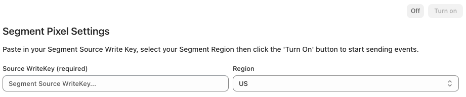

This Shopify Source lets you send [Shopify Web Pixel API Standard Events](https://shopify.dev/docs/api/web-pixels-api/standard-events){:target="_blank"} from your Shopify Store to Segment. Events sent to Segment are formatted to match the [Segment Ecommerce Spec](/docs/connections/spec/ecommerce/v2/). 

This Source is a free [Shopify App Extension](https://shopify.dev/docs/apps/app-extensions){:target="_blank"} which can be installed using your Shopify Store's Admin interface.  

#### Overview

Once installed and enabled, Segment collects events from the user's browser and sends them to your Segment 'Shopify' Source in real time. 

- You can control which Segment `track()` events get collected as well as how user profile details are passed to Segment.  
- A custom JavaScript snippet is loaded in the Shopify store. This script transforms Shopify Standard Events to Segment Ecommerce Spec events. Note that Segment's Analytics.js 2.0 library will **not** load on any Shopify store page. 
- You can control which Segment Track events get collected as well as how user profile details are passed to Segment.  
- This is a Device Mode (client side) Integration. No data is sent server-side from Shopify to Segment.  
- This source does not collect post-purchase events.
- The Segment anonymousId is set to the value of the Shopify client ID. The Segment userId value is never populated. 
- Email address and phone number details are sent to Segment if they are collected by Shopify.   

If you require more advanced functionality or want to collect post-purchase events, consider using the [Shopify by Littledata](/docs/connections/sources/catalog/libraries/website/shopify-littledata/) Source. Shopify by Littledata requires a paid subscription. 

## Getting Started

1. **Log in** to your Shopify Store account.
2. Go to the [Shopify app store listing](https://apps.shopify.com/twilio-segment){:target="\_blank"} for **Twilio Segment**.
3. Click **Add app** to begin the installation process.
4. Add the [**Segment write key**](/docs/connections/find-writekey/) for your Segment Source, and select the Region for your Segment Workspace. 
   
5. Use the checkboxes under 'Manage Events' to select which `track()` events to send to Segment. 
6. Use the checkboxes under 'Manage user profile details' to select how user profile details should be sent to Segment. 
6. Click the 'Turn On' button to enable start sending analytics events from your Shopify Store to Segment. 

## identifiers

- **anonymousId** - The Segment `anonymousId` field will be populated with the Shopify client ID. The Shopify client ID is a 'client-side ID of the customer, provided by Shopify'. It is not currently possible to configure the Segment anonymousId to be populated with any other value. 
- **userId** - The Segment `userId` field will not be populated. It is not currently possible to configure the userId to be populated with any value from Shopify. 
- **email and phone** - `traits.email` and `traits.phone` will be collected via `identify()` events (unless explicity disabled via the 'Manage user profile details' section in the Shopify App User Interface). 

## track() and page() events sent to Segment

See the [Shopify Standard Events](https://shopify.dev/docs/api/web-pixels-api/standard-events){:target="\_blank"} documentation for more information regarding when events are triggered. 

| Segment Event Name      | Shopify Standard Event Name         | Event trigger                                                       | 
| ----------------------- | ----------------------------------- | ------------------------------------------------------------------- |
| `Page Viewed`           | `page_viewed`                       | A user has visited a page. Send as a Segment `page()` event         |
| `Products Searched`     | `search_submitted`                  | A user has performed a search on the Shopify storefront             |
| `Product List Viewed`   | `collection_viewed`                 | A user has visited a product collection index page                  |
| `Product Viewed`        | `product_viewed`                    | A user has visited a product details page                           |
| `Product Added`         | `product_added_to_cart`             | A user has added a product to their cart                            |
| `Product Removed`       | `product_removed_from_cart`         | A user has removed a product from their cart                        |
| `Cart Viewed`           | `cart_viewed`                       | A user has visited the cart page                                    |
| `Checkout Started`      | `checkout_started`                  | A user has started the checkout process                             |
| `Shipping Info Entered` | `checkout_shipping_info_submitted`  | A user has choosen a shipping rate                                  |
| `Address Info Entered`  | `checkout_address_info_submitted`   | A user has submitted their mailing address                          |
| `Contact Info Entered`  | `checkout_contact_info_submitted`   | A user has submitted a checkout form                                |
| `Payment Info Entered`  | `payment_info_submitted`            | A user has submitted their payment information                      |
| `Order Completed`       | `checkout_completed`                | A user has completed a purchase                                     |

You can control which `track()` and `page()` events to send to Segment via the 'Manage events' section in the Shopify App User Interface.

      
## Page context data

The fields below are automatically sent to Segment with every `track()`, `page()` and `idetify()` event. For `page()` events these fields are also included in the `properties` object.

| Field                                   | Description                                                                                    | Type          |
| --------------------------------------- | ---------------------------------------------------------------------------------------------- | ------------- |
| `context.page.url`                      | The entire URL of the page                                                                     | String        |
| `context.page.search`                   | a string containing a '?' followed by the parameters or "querystring" of the URL               | String        |
| `context.page.path`                     | a string containing an initial '/' followed by the path of the URL, excludes the query string  | String        |
| `context.page.title`                    | The title of the current page                                                                  | String        |
| `context.page.referrer`                 | URI of the page that linked to the current page                                                | String        |

## UTM data

The fields below are automatically sent to Segment with every `track()`, `page()` and `idetify()` if present in the QueryString of the page url.

| Field                                   | Description                                                                                      | Type          |
| --------------------------------------- | ------------------------------------------------------------------------------------------------ | ------------- |
| `context.campaign.source`               | `utm_source` QueryString value                                                                   | String        |
| `context.campaign.medium`               | `utm_medium` QueryString value                                                                   | String        |
| `context.campaign.name`                 | `utm_campaign` QueryString value                                                                 | String        |
| `context.campaign.term`                 | `utm_term` QueryString value                                                                     | String        |
| `context.campaign.content`              | `utm_content` QueryString value                                                                  | String        |

## Page Viewed / page() event properties

The properties below are included with `page()` events. Note: If a property is missing it is due to Shopify not providing the value, or due to a `null` or empty value being provided.  

| Field                                   | Description                                                                                    | Type          |
| --------------------------------------- | ---------------------------------------------------------------------------------------------- | ------------- |
| `url`                                   | The entire URL of the page                                                                     | String        |
| `search`                                | a string containing a '?' followed by the parameters or "querystring" of the URL               | String        |
| `path`                                  | a string containing an initial '/' followed by the path of the URL, excludes the query string  | String        |
| `title`                                 | The title of the current page                                                                  | String        |
| `referrer`                              | URI of the page that linked to the current page                                                | String        |

## Product Viewed track() event properties

The properties below are included with `Product Viewed` `track()` events. Note: If a property is missing it is due to Shopify not providing the value, or due to a `null` or empty value being provided.  

| Property                                | Description                                                                                    | Type          |
| --------------------------------------- | ---------------------------------------------------------------------------------------------- | ------------- |
| `product_id`                            | Unique ID for the product                                                                      | String        |
| `name`                                  | The product name                                                                               | String        |
| `untranslated_name`                     | Untranslated name of the product                                                               | String        |
| `variant`                               | The product variant                                                                            | String        |
| `untranslated_variant`                  | Untranslated product variant                                                                   | String        |
| `category`                              | Product type specified by the merchant                                                         | String        |
| `brand`                                 | The product’s vendor name                                                                      | String        |
| `url`                                   | URL to the product page                                                                        | String        |
| `image_url`                             | URL to the product image                                                                       | String        |
| `currency`                              | The three-letter code that represents the currency, for example 'USD'                          | String        |
| `price`                                 | The decimal money amount (price) for the product                                               | Number        |
| `sku`                                   | The SKU (stock keeping unit) associated with the variant                                       | String        |

## Product Added and Product Removed track() event properties

The properties below are included with `Product Added` and `Product Removed` `track()` events. Note: If a property is missing it is due to Shopify not providing the value, or due to a `null` or empty value being provided.  

| Property                                | Description                                                                                    | Type          |
| --------------------------------------- | ---------------------------------------------------------------------------------------------- | ------------- |
| `product_id`                            | Unique ID for the product                                                                      | String        |
| `name`                                  | The product name                                                                               | String        |
| `untranslated_name`                     | Untranslated name of the product                                                               | String        |
| `variant`                               | The product variant                                                                            | String        |
| `untranslated_variant`                  | Untranslated product variant                                                                   | String        |
| `category`                              | Product type specified by the merchant                                                         | String        |
| `brand`                                 | The product’s vendor name                                                                      | String        |
| `url`                                   | URL to the product page                                                                        | String        |
| `image_url`                             | URL to the product image                                                                       | String        |
| `currency`                              | The three-letter code that represents the currency, for example 'USD'                          | String        |
| `price`                                 | The decimal money amount (price) for the product                                               | Number        |
| `quantity`                              | The quantity of the merchandise that the customer intends to purchase                          | Integer       |
| `total_price`                           | The total decimal money amount (price) for the product                                         | Number        |
| `sku`                                   | The SKU (stock keeping unit) associated with the variant                                       | String        |

## Product List Viewed track() event properties

The properties below are included with `Product List Viewed` `track()` events. `products.$.` indicates an array named 'products'. Note: If a property is missing it is due to Shopify not providing the value, or due to a `null` or empty value being provided.  

| Property                                | Description                                                                                    | Type          |
| --------------------------------------- | ---------------------------------------------------------------------------------------------- | ------------- |
| `products.$.product_id`                 | Unique ID for the product                                                                      | String        |
| `products.$.name`                       | The product name                                                                               | String        |
| `products.$.untranslated_name`          | Untranslated name of the product                                                               | String        |
| `products.$.variant`                    | The product variant                                                                            | String        |
| `products.$.untranslated_variant`       | Untranslated product variant                                                                   | String        |
| `products.$.category`                   | Product type specified by the merchant                                                         | String        |
| `products.$.brand`                      | The product’s vendor name                                                                      | String        |
| `products.$.url`                        | URL to the product page                                                                        | String        |
| `products.$.image_url`                  | URL to the product image                                                                       | String        |
| `products.$.currency`                   | The three-letter code that represents the currency, for example 'USD'                          | String        |
| `products.$.price`                      | The decimal money amount (price) for the product                                               | Number        |
| `products.$.sku`                        | The SKU (stock keeping unit) associated with the variant                                       | String        |

## Products Searched track() event properties

The properties below are included with `Products Searched` `track()` events. `products.$.` indicates an array named 'products'. Note: If a property is missing it is due to Shopify not providing the value, or due to a `null` or empty value being provided.  

| Property                                | Description                                                                                    | Type          |
| --------------------------------------- | ---------------------------------------------------------------------------------------------- | ------------- |
| `products.$.product_id`                 | Unique ID for the product                                                                      | String        |
| `products.$.name`                       | The product name                                                                               | String        |
| `products.$.untranslated_name`          | Untranslated name of the product                                                               | String        |
| `products.$.variant`                    | The product variant                                                                            | String        |
| `products.$.untranslated_variant`       | Untranslated product variant                                                                   | String        |
| `products.$.category`                   | Product type specified by the merchant                                                         | String        |
| `products.$.brand`                      | The product’s vendor name                                                                      | String        |
| `products.$.url`                        | URL to the product page                                                                        | String        |
| `products.$.image_url`                  | URL to the product image                                                                       | String        |
| `products.$.currency`                   | The three-letter code that represents the currency, for example 'USD'                          | String        |
| `products.$.price`                      | The decimal money amount (price) for the product                                               | Number        |
| `products.$.sku`                        | The SKU (stock keeping unit) associated with the variant                                       | String        |
| `query`                                 | The search query that was executed                                                             | String        |

## Cart Viewed track() event properties

The properties below are included with `Cart Viewed` `track()` events. `products.$.` indicates an array named 'products'. Note: If a property is missing it is due to Shopify not providing the value, or due to a `null` or empty value being provided.  

| Property                                | Description                                                                                    | Type          |
| --------------------------------------- | ---------------------------------------------------------------------------------------------- | ------------- |
| `products.$.product_id`                 | Unique ID for the product                                                                      | String        |
| `products.$.name`                       | The product name                                                                               | String        |
| `products.$.untranslated_name`          | Untranslated name of the product                                                               | String        |
| `products.$.variant`                    | The product variant                                                                            | String        |
| `products.$.untranslated_variant`       | Untranslated product variant                                                                   | String        |
| `products.$.category`                   | Product type specified by the merchant                                                         | String        |
| `products.$.brand`                      | The product’s vendor name                                                                      | String        |
| `products.$.url`                        | URL to the product page                                                                        | String        |
| `products.$.image_url`                  | URL to the product image                                                                       | String        |
| `products.$.currency`                   | The three-letter code that represents the currency, for example 'USD'                          | String        |
| `products.$.price`                      | The decimal money amount (price) for the product                                               | Number        |
| `products.$.sku`                        | The SKU (stock keeping unit) associated with the variant                                       | String        |
| `cart_id`                               | A globally unique identifier for the cart                                                      | String        |
| `subtotal`                              | The price at checkout before duties, shipping, and taxes                                       | Number        |
| `currency`                              | The three-letter code that represents the currency, for example 'USD'                          | String        |

## Checkout and purchase track() event properties

The properties below are included with `Checkout Started`, `Address Info Entered`, `Shipping Info Entered`, `Contact Info Entered`, `Payment Info Entered` and `Order Completed` `track()` events. `products.$.` indicates an array named 'products'. Note: If a property is missing it is due to Shopify not providing the value, or due to a `null` or empty value being provided.  

| Property                                | Description                                                                                    | Type          |
| --------------------------------------- | ---------------------------------------------------------------------------------------------- | ------------- |
| `products.$.product_id`                 | Unique ID for the product                                                                      | String        |
| `products.$.name`                       | The product name                                                                               | String        |
| `products.$.untranslated_name`          | Untranslated name of the product                                                               | String        |
| `products.$.variant`                    | The product variant                                                                            | String        |
| `products.$.untranslated_variant`       | Untranslated product variant                                                                   | String        |
| `products.$.category`                   | Product type specified by the merchant                                                         | String        |
| `products.$.brand`                      | The product’s vendor name                                                                      | String        |
| `products.$.url`                        | URL to the product page                                                                        | String        |
| `products.$.image_url`                  | URL to the product image                                                                       | String        |
| `products.$.currency`                   | The three-letter code that represents the currency, for example 'USD'                          | String        |
| `products.$.price`                      | The decimal money amount (price) for the product                                               | Number        |
| `products.$.sku`                        | The SKU (stock keeping unit) associated with the variant                                       | String        |
| `subtotal`                              | The price at checkout before duties, shipping, and taxes                                       | Number        |
| `currency`                              | The three-letter code that represents the currency, for example 'USD'                          | String        |
| `order_id`                              | The ID for the order                                                                           | String        |
| `checkout_id`                           | A unique identifier for a particular checkout                                                  | String        |
| `shipping`                              | Total shipping price                                                                           | Number        |
| `discount`                              | Total monetary value allocated as a discount                                                   | Number        |
| `coupon`                                | Comma delimited list of customer-facing discount names / codes                                 | String        |
| `payment_method`                        | Comma delimited list of payment providers used for the transaction                             | String        |

## Sending user profile details to Segment

User profile details can be sent to Segment in 3 ways: 
1. As `traits` in `identify()` events.
2. As `properties` in `track()` events. 
3. As `traits` in `track()` events, included in the `context.traits` object. 

User profile details are only sent to Segment when the following track events are triggered by Shopify: 
`Checkout Started`, `Address Info Entered`, `Shipping Info Entered`, `Contact Info Entered`, `Payment Info Entered` and `Order Completed`.

You can control how user profile details are sent to Segment via the 'Manage user profile details' section in the Shopify App User Interface.  

The following user profile details will be sent to Segment as they become available in the user checkout journey.  

| User profile trait / property name | Description                                                         | 
| ---------------------------------- | ------------------------------------------------------------------- |
| `email`                            | The user's email address                                            |
| `phone`                            | The user's phone number address                                     |
| `first_name`                       | The user's first name                                               |
| `last_name`                        | The user's last name                                                |
| `billing_address.address1`         | Billing address first line                                          |
| `billing_address.address2`         | Billing address second line                                         |
| `billing_address.city`             | Billing address city                                                |
| `billing_address.country`          | Billing address country                                             |
| `billing_address.postal_code`      | Billing address post code / zip code                                |
| `billing_address.province_code`    | Billing address province or state code                              |
| `billing_address.country`          | Billing address country                                             |
| `shipping_address.address1`        | Shipping address first line                                         |
| `shipping_address.address2`        | Shipping address second line                                        |
| `shipping_address.city`            | Shipping address city                                               |
| `shipping_address.country`         | Shipping address country                                            |
| `shipping_address.postal_code`     | Shipping address post code / zip code                               |
| `shipping_address.province_code`   | Shipping address province or state code                             |
| `shipping_address.country`         | Shipping address country                                            |

## FAQs

** Under reporting of events **
This Source uses client side Javascript to send data to Segment. As with any client side analytics tracking it is possible that some ad-blockers will prevent data being sent to Segment. This can lead to an under reporting of events to Segment.   

### When do Identify events trigger?
To send Identify events, you must select the 'Send identify() calls' checkbox. If this setting is selected, Identify events are triggered when `Checkout Started`, `Address Info Entered`, `Shipping Info Entered`, `Contact Info Entered`, `Payment Info Entered` or `Order Completed` Track calls are triggered.

### Why aren't my Identify events triggering when expected?
To save on API call volume, Segment only triggers an Identify event when user profile details have changed. If no change is detected, then the Identify call is not triggered.  

### Why are some events duplicated and triggered multiple times?
Shopify sometimes erroneously triggers duplicate `Address Info Entered`, `Shipping Info Entered`, `Contact Info Entered`, `Payment Info Entered` events in short succession. This is a known bug with Shopify. Segment deduplicates the majority of these duplicate events but is unable to filter all of them out. 

### Why do some Address/Shipping/Contact/Payment Info Entered events contain product arrays?
Shopify sometimes includes product array details in [Standard Events](https://shopify.dev/docs/api/web-pixels-api/standard-events){:target="_blank"} which Segment uses to populate the `Address Info Entered`, `Shipping Info Entered`, `Contact Info Entered`, `Payment Info Entered` events. Segment includes these product details in Segment events.

### Why are some event properties missing even though the documentation indicates that they should be present?
Mapping code is in place to map the majority of valuable fields from Shopify's [Standard Events](https://shopify.dev/docs/api/web-pixels-api/standard-events){:target="_blank"} to Segment events. If properties are missing, it is due to the values not being provided by the Shopify event.   
