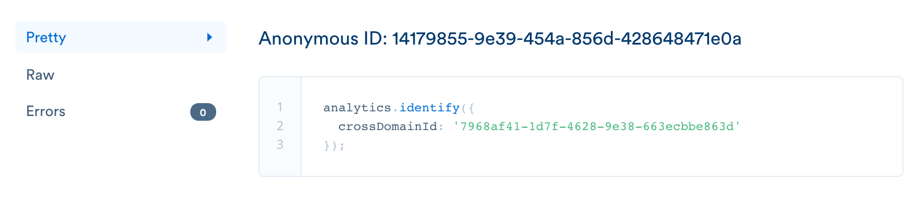
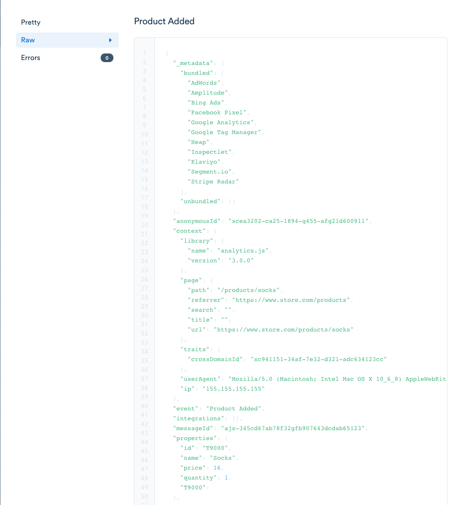
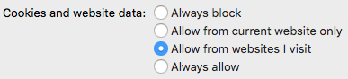
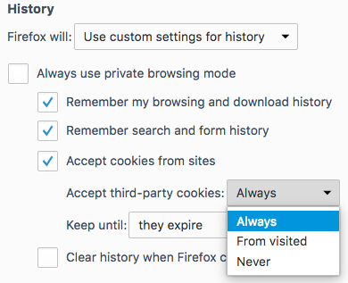

> warning ""
> **Note**: Cross-domain analytics is no longer being offered as a product for new customers. If you have any questions, contact [Segment support](https://www.segment.com/help/contact).

Cross-Domain Analytics allows businesses to measure customer activity across their digital properties, without exposing user data to third parties. For example, if you have multiple brands, content properties, or marketing mini-sites, you likely want to learn how cross-domain browsing impacts your revenue.

What you can do with Cross-Domain Analytics
- **Marketing Attribution.** Businesses can understand how user actions on their multiple editorial or promotional micro-sites lead to conversions. Then, they can optimize their sites to drive the customer behavior they want.
- **Content Coordination.** Publishers can measure how readers browse content across their domains, and decide whether to replicate content across brands or specialize on separate topics.
- **Post-Acquisition Strategy.** Companies will be able to measure how users on a newly acquired domain overlap with their existing properties, leading to an effective segmentation and brand strategy.

## What Segment's Cross-Domain Analytics solution is not

Segment's Cross-Domain Analytics service is not a third-party data service. We do not aggregate data between our customers or share that data with third-parties. Cross-Domain Analytics only works on domains in your workspace and which you own.

Other options on the market use third-party cookies to match user records. Our Cross-Domain Analytics solution uses second-party cookies instead.

Second-party cookies are more respectful of customer privacy. As opposed to third-party cookies, second-party cookies only allow data to be shared between domains that the customer has entered into the URL bar. Many browsers and privacy plug-ins (including Safari by default) now make second-party cookies default, and block third-party cookies because they are so often used to share user data between different companies.
Like the rest of our customer data infrastructure, Cross-Domain Analytics lets customers get more value out of their own data while keeping that data private. Unlike third-party data aggregators, Cross-Domain Analytics cannot be used to track customers across separate companies.

Browsers like Safari have moved to block third party cookies by default, and instead only allow second party cookies. By relying on second party cookies, Segment's Cross-Domain Analytics respects consumer privacy and works on all the major internet browsers' default settings.

## Technical setup
Setting up Cross-Domain Analytics requires you to create subdomains and CNAME records. It also involves implementation work on Segment's end. [Let us know](https://www.segment.com/help/contact) if you're interested in Cross-Domain Analytics and we can help you get set up.

### Step 1: Set up subdomains and CNAMEs
You will first need to set up a subdomain for each domain that you want to collect cross-domain data from. Each subdomain will redirect to Segment's Cross-Domain ID service to check if an ID already exists for this visitor. For example, you can set up the subdomains `xid.example1.com` and `xid.example2.com`, and modify the CNAME records to point to Segment's Cross Domain ID service at `{your-cross-domain-id-service}.xid.segment.com`.

Setting up a CNAME record will depend on your provider. Refer to specific provider instructions below or [let us know](https://www.segment.com/help/contact) if you need help.

- [Cloudflare](https://support.cloudflare.com/hc/en-us/articles/360020348832-How-do-I-do-CNAME-setup-)
- [NameCheap](https://www.namecheap.com/support/knowledgebase/article.aspx/9646/10/how-can-i-set-up-a-cname-record-for-my-domain)
- [GoDaddy](https://ca.godaddy.com/help/add-a-cname-record-19236)
- [Google](https://support.google.com/a/answer/47283?hl=en)

The CNAME records for the above example will look like:

|TYPE | NAME  | DOMAIN |   VALUE|
|-----|-------|--------|--------|
|CNAME| xid   |example1.com|{your-cross-domain-id-service}.xid.segment.com|
|CNAME| xid   |example2.com|{your-cross-domain-id-service}.xid.segment.com|

*Note: Contact our implementation team for the exact address of your Cross-Domain ID service.*

### Step 2: Let us know you'd like to activate Cross-Domain Analytics
Once you're ready with your subdomains, [send us your](https://www.segment.com/help/contact) subdomain URLs (such as xid.example1.com) and their corresponding source slugs. You can find the source slug as part of your Segment source url, for example, `segment.com/{workspace_slug}/sources/{source_slug}`.

Segment will verify that your subdomains have CNAME records set up correctly. This will also validate to us that you own the domain and lets our certificate provider issue us your xid subdomain certificate. You will receive an estimate of when this work will be completed.

### Step 3: Verify your Cross-Domain Analytics setup

After validation, we will enable Cross-Domain Analytics on your Segment workspace and enabled sources. Once we give you the go ahead, you'll see two things happen when a user visits a domain from the same browser:

1. In the debugger, you'll see `Identify` calls with a Cross-Domain ID in the payload.

1. Subsequent events from that user will have a Cross-Domain ID context trait.

## Frequently Asked Questions

### How does Segment ensure security of cookies?
If you set a cookie on `.mysite.com` , sites like `marketing.mysite.com` , or in this case, `xid.mysite.com` , can read that cookie. However, if you set a cookie on `mysite.com` , only `mysite.com` can read the cookie. Therefore, we will set the cross-domain cookie to `.mysite.com` and won't be able to read any cookies you set on `mysite.com` .

If you do set other cookies on `.mysite.com` , our Cross-Domain Analytics service will technically be able to read those cookies. This is part of the browser behavior. But we will never store non-cross-domain cookies anywhere, including in logs or internal databases. There will be no record of those cookies and neither the Segment staff nor any other party will be able to go back and read that data now or at a later date.

### What makes Segment's solution better than other ones on the market or ones I could build in-house?
Most other solutions to Cross-Domain Analytics are versions of third-party cookies. Let's use the example where a customer has visited example2.com and example1.com but not segment.com. If a customer goes to example2.com and receives a example2.com cookie, that's a first-party cookie because the user is receiving a cookie from the site they're currently on.

Alternatively, if the customer goes to example2.com and receives a cookie from example1.com, it's a second-party cookie because the user has been to example1.com previously.
Finally, if the customer goes to example2.com and receives a cookie from segment.com, it's a third-party cookie because the user has never been to segment.com.

Third-party cookie solutions take three forms. The first is an internal build. The second is a solution built by a SaaS provider (for example, Adobe Marketing Cloud Visitor ID). Here, the user will receive a third-party cookie from Adobe but Adobe agrees not to share these cookie identifiers across Adobe's customers. Finally, there are cookie networks (mostly ad networks) where the user receives a third-party cookie from the ad network and the ad network shares that identifier between all their customers, including sites that the user has never visited.
Internal solutions and SaaS solutions like Adobe have some of the same privacy benefits as Segment's solution.

However, there are many benefits to using Segment's solution. During our customer research we talked to a few companies that built their own 3rd party cookie system and found two drawbacks:

- The first is the amount of internal cost to build and maintain this solution. One company we spoke to built a version of Cross-Domain Analytics but couldn't secure the internal resources to maintain it.
- The second are problems with third party cookies in general. Safari does not allow third party cookies by default. This policy is especially detrimental to mobile web traffic. Users can also choose to disable third party cookies in other browsers such as Firefox and ad blockers will also disable the cookies.

Other solutions on the market, like ad networks or Adobe Marketing Cloud Visitor ID also face the same challenges with blocked third-party cookies. There's a specific privacy concern to ad networks in that the user has no way of knowing how these cookies are being shared.

Google Analytics also provides a cross-domain feature but it only unifies user data across your domains if that user clicks on a link from one domain to the other. Segment's Cross-Domain Analytics works whether the user goes from one domain to the other directly or in entirely different sessions.

Google Analytics shares the user's client ID across domains by appending it to the query parameter of the link URL. When the user uses that link to navigate to the second domain, the second domain reads the ID out of the URL.

### How many domains can I setup?
We can set up cross domain analytics on upto 100 domains per customer. If you need to support more domains, contact us.

### Will our event delivery be affected?
To improve performance, we retrieve the cross domain identifier asynchronously. To avoid blocking events from being sent until this is available, we continue to send events without a cross domain identifier while we fetch it.

### How long can it take to retrieve the cross domain identifier?
The time it takes to resolve the cross domain identifier can depend on a few factors, such as:
* How many domains have been set up for your project (the higher the number of domains, the longer it will take).
* How many other domains the user has visited previously (the higher the number of domains the user has visited previously, the quicker it will be retrieved).
* Network speed, which itself is dependendent on factors such as how far the user is from the cross domain analytics server, or what type of network the user is on (the slower the network is, the slower the cross domain identifier will be to resolve).

### On what percentage of browsers will your solution work? How does that compare to third-party cookie services?
Whether our solution will work for a particular user is up to that user and their browser. Let's look at the three most common browsers:

#### Chrome
By default, Chrome does not block any cookies. Chrome does give the user two other options, "Block 3rd party cookies and site data" and "Block sites from setting any data." Chrome does not have a setting that allows 2nd party cookies while blocking 3rd party cookies.

| Cookie Setting                        | Cross-Domain Analytics | Third-Party Cookie Solutions |
| ------------------------------------- | --------------------- | ---------------------------- |
| Default - Allow local data to be set  | Works                 | Works                        |
| Block 3rd party cookies and site data | Does not work         | Does not work                |
| Block sites from setting any data     | Does not work         | Does not work                |

#### Safari
Safari distinguishes between cookies from sites that a user has previously visited (second-party cookies) and cookies from sites which a user has not been to (third-party cookies).

By default, Safari blocks third-party cookies.

#### Firefox
Firefox is similar to Safari and distinguishes between cookies from sites that a user has previously visited (second-party cookies) and cookies from sites which a user has not been to (third-party cookies).

By default, Firefox allows third-party cookies.

| Cookie Setting - Safari Desktop and Mobile | Cookie Setting - Firefox                 | Cross-Domain Analytics | Third-Party Cookie Solutions |
| ------------------------------------------ | ---------------------------------------- | ---------------------- | ---------------------------- |
| Always Allow                               | Default - Remember History               | Works                  | Works                        |
| Default - Allow from websites I visit      | Accept third-party cookies: from visited | Works                  | Does not work                |
| Allow from current website only            | Accept third party cookies: never        | Does not work          | Does not work                |
| Always Block                               | [Uncheck] Accept cookies from sites      | Does not work          | Does not work                |

### Estimated User Percentages
We did a quick calculation to estimate what percentage of users allow Cross-Domain Analytics and what percentage allow third-party cookies. We looked up publicly available browser market share statistics and added in the following assumptions:

1. Browsers generally don't share data on how many of their customers change their settings, so we assumed 10% of users do so.
2. Of those 10%, all of them update their settings to be more restrictive.
3. `Other` browsers have similar settings to Chrome

|                                                                    | Chrome | Safari | Firefox | Other | Total |
| ------------------------------------------------------------------ | ------ | ------ | ------- | ----- | ----- |
| Market Share                                                       | 51.06% | 14.02% | 6.72%   | 28.2% | 100%  |
| Percent of browsers with settings that allow Cross-Domain Analytics | 90%    | 90%    | 90%     | 90%   | 90%   |
| Percent of browsers with settings that allow third-party cookies   | 90%    | 0%     | 90%     | 90%   | 77%   |
