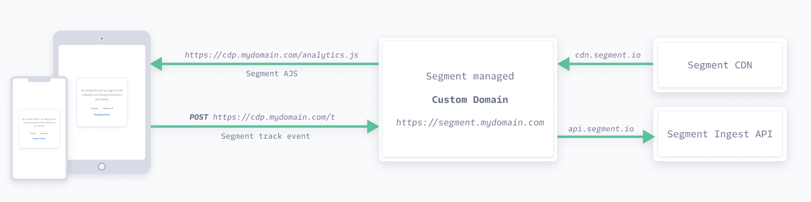

Custom Domain is a fully-managed service that enables you to configure a first-party subdomain over HTTPS.  You can then track event requests through your own domain (for example, `cdp.mydomain.com`), instead of the default (`segment.com`). Tracking events through your own domain allows for more secure and complete first-party data collection by reclaiming first-party data lost to browser controls. With a more complete view of your customer behaviors, you can build more robust profiles for greater attribution and ROAS.  

> info "Custom Domain is only available to Business Tier customers"
> Customers not on the Business Tier but who have interest in Custom Domain should [contact Segment's sales team](https://segment.com/demo/){:target="_blank”} for assistance with upgrading to a Business Tier plan. Segment also offers an alternative DNS record service, [Custom Proxy](/docs/connections/sources/catalog/libraries/website/javascript/custom-proxy/).

> success ""
> Segment recommends configuring Custom Domain alongside [Consent Management](/docs/privacy/consent-management/) to ensure you are respectful of your end users' consent preferences.



## How DNS subdomain delegation works
DNS subdomain delegation is a process where the control of a specific subdomain is assigned to another DNS server, allowing that server to manage the DNS records for the subdomain. This delegation is useful for distributing the management of DNS records and enables specialized handling of subdomain traffic.

## How CNAME records work
When a user tries to access the alias domain, the DNS resolver looks up the CNAME record, finds the canonical name, and resolves it to the IP address of the target. For example, you could alias your subdomain to point to the Segment domain. If a user accesses your site, they are redirected to the Segment domain, but their browser's address bar still shows the alias domain.

CNAME records provide flexibility and centralized management, making it easier to handle domain redirections and subdomain configurations. 

Implementing a Custom Domain using CNAME delegation requires you to add a CNAME and record for two domains that Segment generates on your behalf: one for the Segment CDN and a second for the Tracking API. You must add a CNAME and DNS record for both domains. 

## Supported sources

Custom Domain supports the following sources: 
- [Analytics.js](/docs/connections/sources/catalog/libraries/website/javascript/)
- [Clojure](/docs/connections/sources/catalog/libraries/server/clojure/)
- [Go](/docs/connections/sources/catalog/libraries/server/go/)
- [Java](/docs/connections/sources/catalog/libraries/server/java/)
- [Node.js](/docs/connections/sources/catalog/libraries/server/node/)
- [PHP](/docs/connections/sources/catalog/libraries/server/php/)
- [Python](/docs/connections/sources/catalog/libraries/server/python/)
- [Ruby](/docs/connections/sources/catalog/libraries/server/ruby/)
- [.NET](/docs/connections/sources/catalog/libraries/server/net/)
- [Pixel API](/docs/connections/sources/catalog/libraries/server/pixel-tracking-api/)

## Getting started

> info ""
> Custom Domain configuration won't disrupt your event tracking. Default Segment domains will continue to function alongside your custom domains once the setup is complete.

To configure Custom Domain:
1. Select the subdomain you'd like Segment to use for event request tracking (for example, `cdp.domain.com`).
2. Sign into the Segment app, select your user avatar, and click **Contact Support**. 
3. Create a support request with the following fields: 
  - **Topic**: Select **Custom Domain**.
  - **Subject**: Enter a subject line for your support request.
  - **Domain Name**: Enter the subdomain that Segment should use for event request tracking.
  - **Additional Domain Name**: (*Optional*) If applicable, you can add an additional subdomain. You can have multiple domains within the same workspace; however, each source can only be associated with one domain. A single domain can be associated with multiple sources.
  - **Source names**: Select the sources you would like to use for Custom Domain. Segment recommends starting with a stage or dev source. For initial setup, an [Analytics.js](/docs/connections/sources/catalog/libraries/website/javascript/) source is required. For a list of all sources that support Custom Domain, see [Supported sources](#supported-sources).
  - **Is the domain name enabled for Content Policy**: Select either Yes or No. You are not required to create a Content Policy prior to requesting Custom Domain. If you've enabled a Content Security Policy (CSP), you must add the new subdomains provided by Segment to your CSP once you've enabled the Custom Domain feature. This ensures that the CSP does not block the subdomains when you load Segment.
  - **Description**: Enter an optional description for your service request. If you are requesting Custom Domain for multiple workspaces, enter any additional workspace slugs and source names into this field. 

4. Segment provides you with a list of nameservers you should add to your DNS. Once you receive the nameservers from Segment, update your DNS. 
5. After you've updated your DNS, Segment verifies that you've made all required updates and then provides you with two custom domains, one for the Tracking API and a second for your CDN.
6. Once Custom Domain is enabled for your workspace, the Segment app generates a new JavaScript source code snippet for your Analytics.js sources. Copy and paste this snippet into the header of your website. You can also use the subdomain provided for the Tracking API as the new endpoint for your server library sources.

## FAQ

### Can I set up multiple Custom Domains?
Segment recommends creating a different subdomain (for example, `mysubdomain.mydomain.com`) for each source. You cannot connect multiple custom domains to the same source.

### What sources can I use with Custom Domain?
For initial setup, Segment requires an [Analytics.js](/docs/connections/sources/catalog/libraries/website/javascript/) source. Custom Domain was largely developed to support JavaScript sources. It helps with comprehensive collection of first-party data from your website when accessed over any platform (desktop, mobile, and more). You can use the subdomain for all other non-JavaScript sources as well, for consistency, but it will have no impact on data collection for those sources.  

### How can I configure non-JavaScript sources to use Custom Domain?

For non-Analytics.js sources, you’ll need to update your implementation to use the subdomain as an endpoint when using the Tracking API. For example:

- **Server Sources**: When sending data from server-side implementations, use the `host` configuration parameter to send data to your subdomain instead of the default Segment domain.
- **Mobile Sources**: When sending data from mobile implementations, use the `apiHost` configuration parameter to send data to your subdomain instead of the default Segment domain.
- **Pixel API Sources**: When sending data from Pixel implementations, modify the endpoint from Segment's default domain (`https://api.segment.io/v1/pixel/track`) to your custom domain (`https://api.mysubdomain.mydomain.com/v1/pixel/track`).

### Is there a benefit in migrating server-side sources over to client-side with Custom Domain?
Server-side tracking is generally more reliable than client-side tracking. For example, when tracking data client-side, you might lose data when users might block all cookies or use tools that interfere with network requests leaving the browser.

For business-critical events, Segment recommends server-side data tracking. This approach means that your data is less susceptible to disruptions from client-side variables, which can result in more accurate and reliable tracking.

### Is this a fully-managed solution? What servers or infrastructure do I need to set up on my side for this proxy? 
Yes, Custom Domain is a fully-managed solution. However, you must set up the following infrastructure on your end: 
- Delegate a DNS subdomain to Segment 
- Add the name servers Segment provides to your DNS

First, decide on your subdomain and then delegate it to Segment. Segment then asks you to add a DNS NS record to your DNS with specific values to complete the DNS delegation. From there on, Segment fully manages the infrastructure for serving Analytics.js and ingesting events data through the subdomain.

### Can I change my Segment subdomain after the initial setup?
Segment doesn't recommend that you change the subdomain after the initial setup. If you change the subdomain, Segment must revoke the older certificates for your subdomain and you are required to redo the entire onboarding process, as several underlying components, like certificates, would need to be recreated and reassociated. 

### Who is responsible for managing the SSL certificate for the Custom Domain?
Segment hosts and manages SSL Certificate on the Custom Domain. At this time, Segment does not support importing a certificate you may already have, as Segment must request a SSL certificate on your behalf using AWS Certificate Manager (ACM) when initially setting up your Custom Domain. 

Segment also uses ACM to manage and renew certificates.

### Can you rename `window.analytics` with Custom Domain?
Yes, Custom Domain allows Segment to rename `window.analytics` to a unique name to avoid being blocked by some ad blocking software. 

Customers who have access to the Custom Domain feature can rename analytics to `<workspaceid>/<sourceid>.js` by choosing an Alias for Analytics.js within the source settings that are available after the workspace is enabled for Custom Domain. 

### What happens to the Analytics.js cookies already set on the user's browser prior to a Custom Domain implementation?
Analytics.js cookies are not lost in the transition to Custom Domain. When users revisit your website, the previous Analytics.js cookies continue to be fetched and added to events, if available.

### Can I use the same subdomain across multiple workspaces?
No, each workspace requires its own unique subdomain (for example, `mysubdomain.mydomain.com`).
