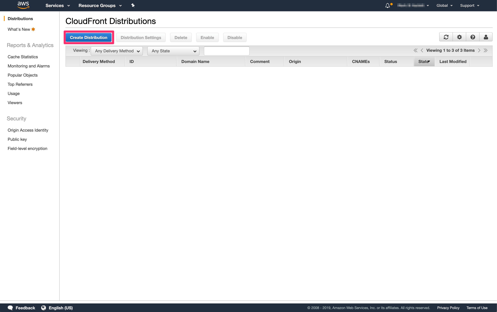
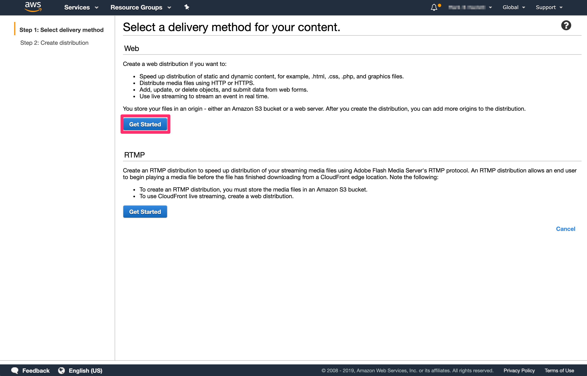
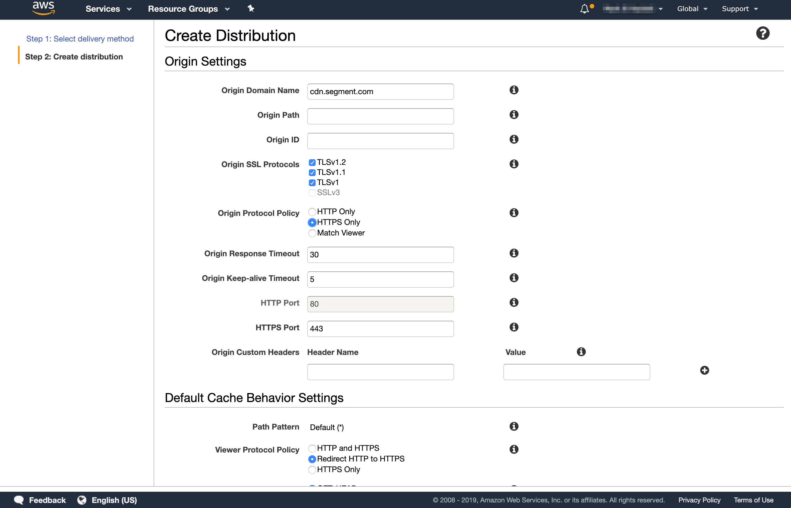

Custom Domains allow you to proxy Analytics.js and proxy all tracking event requests through your domain.

## Getting Started

In order to get started using custom domains, you will need:

1. Access to your site DNS settings
2. A CDN you're using to serve assets from
3. Access to the CDN settings

This guide will go through how to set up a custom domain in Cloudfront. The same principles can be applied to virtually any modern CDN that supports proxying.

You will need to set up two key pieces, regardless of the CDN provider you're using:
1. Proxy to Segment CDN (cdn.segment.com)
2. Proxy to Segment tracking API (api.segment.io)

## Setup

Follow the directions listed for Cloudfront or use your own CDN setup. Once you have completed those steps and have verified that your proxy is working for both cdn.segment.com and api.segment.io, email us with the following template email:

```text
Hi,

This is {person} from {company}. I would like to request a proxy be added for the following source(s) to point to the corresponding proxy url:

* Source {link to source in Segment} with source ID {source id} should point to {api host}
* Source {link to source in Segment} with source ID {source id} should point to {api host}
```

Double check the source link, the Source ID and the api host to ensure they are correct. A member of our Success team will respond and set up the proxy for you.

## Cloudfront

### CDN Proxy

You will need to first login to AWS and navigate to CloudFront.



Click "Create Distribution"

Here, you will need to select a delivery method for your content. Select the "Get Started" button in the "Web" section.



Now we'll need to configure our distribution settings. Under origin settings, you will need to update the following values:



<table>
  <tr>
    <td>**Field**</td>
    <td>**Value**</td>
    <td>**Description**</td>
  </tr>
  <tr>
   <td>Origin Domain Name</td>
   <td>cdn.segment.com</td>
   <td>The domain name you would like the proxy to be served to</td>
  </tr>
  <tr>
   <td>Origin ID (optional)</td>
   <td>The Segment CDN</td>
   <td>A Description of the origin. This can be anything you would like that describes the origin domain name.</td>
  </tr>
  <tr>
   <td>Origin Protocol Policy</td>
   <td>Set to `HTTPS Only`</td>
   <td></td>
  </tr>
  <tr>
   <td>Alternate Domain Names (CNAMEs)</td>
   <td>yourdomain.com</td>
   <td>Add the domain you are proxying to segment here. If you don't do this you will get an error.</td>
  </tr>
</table>

Next, you'll want to configure the Default Cache Behavior Settings.

<table>
  <tr>
    <td>**Field**</td>
    <td>**Value**</td>
    <td>**Description**</td>
  </tr>
  <tr>
   <td>Viewer Protocol Policy</td>
   <td>Redirect HTTP to HTTPS</td>
   <td>Ensure that all traffic goes through HTTPS</td>
  </tr>
  <tr>
   <td>Allowed HTTP Methods</td>
   <td>GET, HEAD, OPTIONS, PUT, POST, PATCH, DELETE</td>
   <td>Select which HTTP methods are allowed to be proxied.</td>
  </tr>
  <tr>
   <td>Forward Cookies</td>
   <td>All</td>
   <td>Ensure that cookies are forwarded on.</td>
  </tr>
  <tr>
   <td>Query String Forwarding and Caching</td>
   <td>Forward all, cache based on all</td>
   <td>Ensure that all query string values are forwarded and properly cached.</td>
  </tr>
</table>

Click "Create Distribution" at the bottom of the page. This distribution will show as "In Progress" until the distribution is deployed.

We'll need the "Domain Name" for the next step so keep this browser window open.

**Add CNAME Record to DNS**
Next, we'll need to add a CNAME record to your DNS settings. Go to your domain registrar and add a new record to your DNS of type "CNAME".

<table>
  <tr>
    <td>**Field**</td>
    <td>**Value**</td>
  </tr>
  <tr>
    <td>Name</td>
    <td>{subdomain_name}.yourdomain.com</td>
  </tr>
  <tr>
    <td>Value</td>
    <td>Cloudfront Distribution Domain Name</td>
  </tr>
</table>

Save your record. Depending on the TTL you have set, it may take some time to take effect. Try curling your domain to ensure it's proxying correctly.

### Tracking API Proxy

Next, we're going to set up a proxy for the tracking API so that all calls will be proxied through your domain. We're going to set up a Cloudfront distribution that's very similar to the previous step with a few minor changes:

<table>
  <tr>
    <td>**Field**</td>
    <td>**Value**</td>
    <td>**Description**</td>
  </tr>
  <tr>
   <td>Origin Domain Name</td>
   <td>api.segment.io</td>
   <td>The domain name you would like the proxy to be served to</td>
  </tr>
</table>

**Add CNAME Record to DNS**
Next, we'll need to add a CNAME record to your DNS settings. Go to your domain registrar and add a new record to your DNS of type "CNAME". This time we'll be using the Cloudfront distribution for the tracking API proxy.

<table>
  <tr>
    <td>**Field**</td>
    <td>**Value**</td>
  </tr>
  <tr>
    <td>Name</td>
    <td>{subdomain_name}.yourdomain.com</td>
  </tr>
  <tr>
    <td>Value</td>
    <td>Tracking API Cloudfront Distribution Domain Name</td>
  </tr>
</table>

Save your record. Depending on the TTL you have set, it may take some time to take effect. Try curling your domain to ensure it's proxying correctly.
