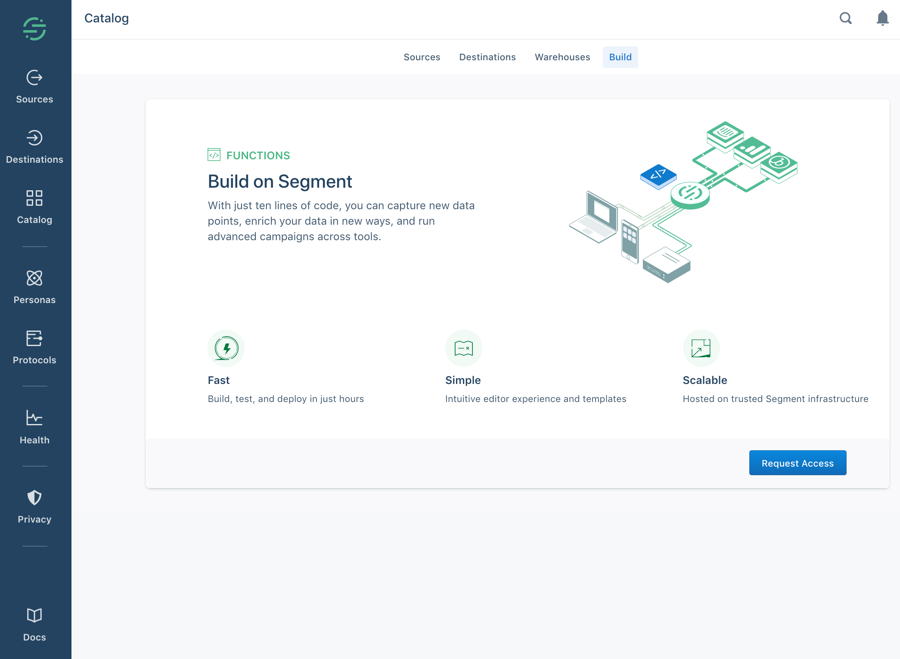
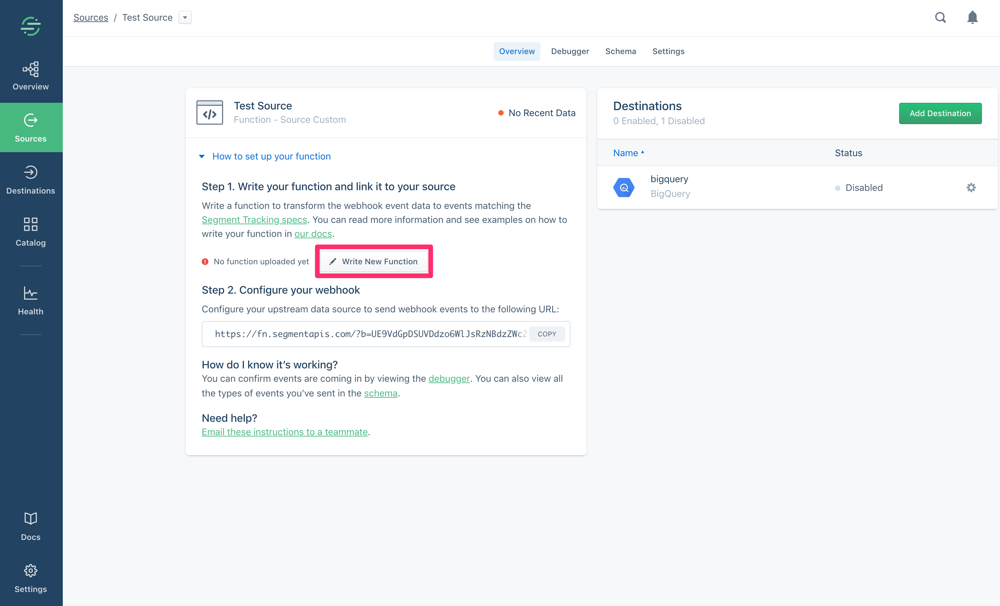
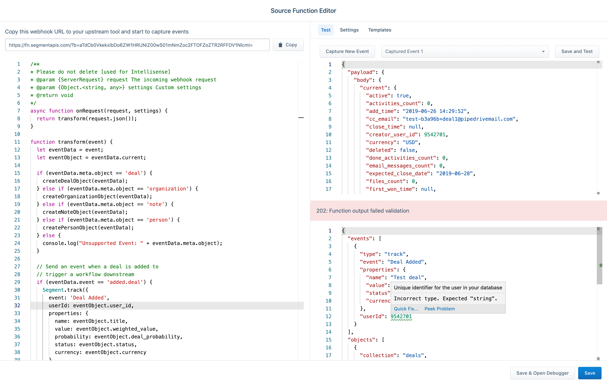

Functions are currently in developer preview. If you are interested in joining the developer preview, navigate to the Build page in your catalog [here](https://app.segment.com/goto-my-workspace/build/catalog). The use is governed by [(1) Segment First Access](https://segment.com/legal/first-access-beta-preview/) and Beta Terms and Conditions and [(2) Segment Acceptable Use Policy](https://segment.com/legal/acceptable-use-policy/).

Custom Sources allow you to gather data from thousands of Cloud Applications without having to worry about setting up or maintaining any infrastructure. Custom Sources are small pieces of code that you upload to a Segment Source to translate webhook or POST events into events or objects that match the [Segment Spec](https://segment.com/docs/connections/spec/).

Here are some example uses cases we've heard from customers that you can use Source Functions to implement in your organization:

- **Create a long-term-value (LTV) computed trait using Zuora subscription data**: A customer connected Zuora webhooks to a webhook source and sent that data into Personas where they created a computed trait to calculate the LTV for the customer in real-time.
- **Start an onboarding campaign when a customer is marked "Closed Won" in Pipedrive**: Another customer set up an automated onboarding email campaign in Iterable that triggered when the sales lead closed in Pipedrive.
- **Combine mobile subscription revenue with web revenues**: A major media company connected mobile and web revenue data for the first time, which allowed them to analyze it together in Amplitude.

Here is an example of what a Source Function could be used to do with a webhook from Drift.


## Quick Links

* [Getting Started](/docs/connections/sources/custom/#getting-started)
* [Debugging and Troubleshooting](/docs/connections/sources/custom/#debugging-and-troubleshooting)
* [FAQ](/docs/connections/sources/custom/#faq)

## Getting Started

### Requesting Access

To request access to Functions, navigate to the Build page of the catalog [here](https://app.segment.com/goto-my-workspace/build/catalog).



### Creating your custom source
Navigate to the Build page in the Catalog [here](https://app.segment.com/goto-my-workspace/build/catalog) and click on "Create Source".


### Copy your webhook URL to the upstream source or tool

Back on the Source Overview page, copy the source function URL and paste it into your upstream webhook settings. Once you've added the event, then trigger an event in that source. You should now see events appearing in the debugger.

### Write your source
Next step is to write the source to transform the webhook payload so that it can send events or objects downstream.

**Building your function**

From the source overview page, click **Write New Function** to open the web editor.



A new tab containing the development environment opens. The editor first appears with a template that you can use to get started. There are three key areas to help you get started: Editor, Testing Environment and Deploy.


**Accessing the payload** <br />
You can access the payload from the `request` variable like this:

```js
async function onRequest(request, settings) {
  const requestBody = request.json()
  const requestHeader = request.headers.get('Content-Type')
  const requestParam = request.url.searchParams.get("timestamp")
}
```

Note that your handler function is `async`.

The first `request` argument contains everything about the incoming webhook request. You access the request body through a `json()` or `text()` helper function, the request headers with the [Headers](https://developer.mozilla.org/en-US/docs/Web/API/Headers) interface, and the request URL and query parameters with the [URL](https://developer.mozilla.org/en-US/docs/Web/API/URL) interface.

**Templates**

To help you get started, we've written some templates that are accesible within the app. These templates are available under the "templates" tab inside of the Function editor.

You can view the full list of templates available [here](https://github.com/segmentio/functions-library/tree/master/sources).

### Testing your Function

**Using the webhook catcher**

You can test out your function using the webhook catcher. The webhook catcher allows you to "catch" the sample set of data from your upstream tool using the webhook URL. You can then use this to test your function to ensure it's performing how you would expect.

**Press Capture Events**<br />


Once you press the "Capture Events" button, we will listen to your webhook URL for 5 minutes. During this time, you should trigger an event from the upstream source. If there are already events going through your webhook URL, then it will grab the first event it can. These events will persist for you until you overwrite them.

_Note_: You can have up to 10 captured events to test with. If you capture more than 10, then it will start to override your events starting with the oldest.

**Save and Test**<br/>
Press the "Save and Test" button above the payload editor and you will execute your Function with the given payload.


**Accessing settings**

You can access custom settings values through the following:

```js
async function onRequest(request, settings) {
  const apiURL, apiKey = { settings }

  // or directly
  settings.apiKey
}
```

You access all the setting values by a key on the `settings` object.

A common pattern is to configure settings for an API url and secret API key, so you can use the same code with different settings for different workspaces.

**Sending messages**

You can send messages to the Segment API through the following:

```js
async function onRequest(request, settings) {
  Segment.identify({
    userId: '1234',
    traits: {
      traitName: 'Example Trait'
    }
  })

  Segment.track({
    event: 'Event Name',
    userId: '1234',
    properties: {
      propertyName: 'Example Property'
    }
  })

  Segment.group({
    userId: '1234',
    groupId: '1234',
    traits: {
      traitName: 'Example Trait'
    }
  })

  Segment.set({
    collection: 'collection_name_plural',
    id: 'object_id_string',
    properties: {
      propertyName: 'Example Property'
    }
  })
}
```

The `Segment` module has `Segment.identify()`, `Segment.track()`, `Segment.group()`, `Segment.set()`, `Segment.page()`, `Segment.screen()` and `Segment.alias()` helper functions. These fill in defaults and validate the data you provide. You can call these functions anywhere in your function.

Behind the scenes, the `Segment` module appends messages to an array and will send messages to the Segment [Tracking](https://segment.com/docs/connections/sources/catalog/libraries/server/http/) and [Object](https://segment.com/docs/connections/sources/catalog/libraries/server/object-api/) API provided your function returns without error.

**Events**

Events are used to trigger real-time workflows in downstream streaming destinations. These events are compatible with both streaming destinations and warehouses. Events should match the following return format from the function:

<table class="api-table">
  <tr>
    <td>Property Key</td>
    <td>Values</td>
    <td>Description</td>
  </tr>
  <tr>
    <td>event</td>
    <td>String</td>
    <td>The name of the event you want to fire. This is only valid for `Segment.track()`.</td>
  </tr>
  <tr>
    <td>userId</td>
    <td>String</td>
    <td>The user ID you want to associate the event with. If the type of the call is group then use the groupId.</td>
  </tr>
  <tr>
    <td>groupId</td>
    <td>String</td>
    <td>The Account or Group ID of the user. This is only valid for `Segment.group()`.</td>
  </tr>
  <tr>
    <td>properties</td>
    <td>Objects</td>
    <td>A list of key/value pairs that are sent as properties to the event. This is only valid for `Segment.track()`, `Segment.page()` and `Segment.()screen`.</td>
  </tr>
  <tr>
    <td>traits</td>
    <td>Objects</td>
    <td>A list of key/value pairs that are sent as traits to the event. This is only valid for `Segment.identify()` and `Segment.group()`.</td>
  </tr>
</table>

For more details on the events that are supported, see the [HTTP](https://segment.com/docs/connections/sources/catalog/libraries/server/http/) and [Object](https://segment.com/docs/connections/sources/catalog/libraries/server/object-api/) API documentation.

**Objects**

Objects are pieces of data that you can ETL (extract, transform, load) to your warehouse. Objects are not compatible with streaming destinations. For more details about what is supported with objects, review the [Objects API documentation](/docs/connections/sources/catalog/libraries/server/object-api/).

<table class="api-table">
  <tr>
    <td>Property Key</td>
    <td>Values</td>
    <td>Description</td>
  </tr>
  <tr>
    <td>collection</td>
    <td>String</td>
    <td>The collection translates to the name of the table in your warehouse. Examples: `products`, `rooms`, `leads`. Naming should be lower case and plural. </td>
  </tr>
  <tr>
    <td>id</td>
    <td>String</td>
    <td>The unique object ID. Any future objects with the same Object ID are upserted, de-duped and merged.</td>
  </tr>
  <tr>
    <td>properties</td>
    <td>Object</td>
    <td>A list of key/value pairs that are sent as properties of the object. These translate to columns downstream in your warehouse.</td>
  </tr>
</table>

**Dependencies**

The following dependencies are pre-installed in the function environment:

- atob v2.1.2
- aws-sdk v2.488.0
- btoa v1.2.1
- form-data v2.4.0
- lodash v4.17.15
- node-fetch v2.6.0
- oauth v0.9.15
- xml v1.0.1

Additional dependences are not currently supported using the web based IDE, but we're looking to add them in the near future. Until then [contact us](https://segment.com/help/contact/) to request additional dependencies.

### Deploy your source

Click **Save and Deploy** to deploy your function. This deploys your function and overrides any currently deployed function for that source. You can refresh the source overview, and when you see "Function uploaded", you know that the function has been deployed successfully.

## Debugging and Troubleshooting

To debug your function in the web IDE, you can use the built in testing environment on the right hand side of the development centre. When an error occurs in the payload, you can see the error in the output view:



**Accessing Header data**

You can access header data via the `request.headers` property and the [Headers](https://developer.mozilla.org/en-US/docs/Web/API/Headers) interface. For example:"

```js
async function onRequest(request, settings) {
  const requestHeader = request.headers.get('Content-Type')
}
```

**Manually triggering a function**

Manually send a payload to source function with curl:

```bash
curl -X POST \
  'https://fn.segmentapis.com/?b=your-key-here' \
  -H 'Content-Type: application/json' \
  -d '{"key": "value"}'
```

Alternatively the key can be in an HTTP header

```bash
curl -X POST \
  'https://fn.segmentapis.com/' \
  -H 'X-Segment-Source-Function-Token: your-key-here' \
  -H 'Content-Type: application/json' \
  -d '{"key": "value"}'
```

## Settings and Secrets
Settings allow you to paramaterize your function so that you can use it across multiple source functions which may have different configuration.


*Encrypted Settings* <br />
Choosing the encrypted option will mean your settings will be encrypted end to end. This setting should be used for any API keys or sensitive information.

To access a settings in your code, simply use the dot notation on the settings object:

```js
async function onRequest(request, settings) {
  let settingValue = settings.settingKey;
}
```

Settings can be very useful to help build a function that can be re-used without having to modify any code in the Function itself. For example, customers can use settings to:
* Build a function that can be rolled out without code changes to various Shopify stores
* Source payment data from a payment process and have a setting to denote the region for that function

🚧 Coming Soon: Network Access in Source Functions will allow you to send network calls to Segment and external APIs within the function.

**⚠️ Note:** Do not use your function to log sensitive data such as personally-identifying information (PII), authentication tokens, HTTP headers, and similar data. Segment stores these logs, and they may be available to workspace members in the Segment dashboard. Be especially careful about sending sensitive data when making external network requests to services that you do not control.

## Accessing Logs

The command line client allows you to access runtime logs of your Functions. These can be useful in seeing errors and help you debug your functions on an ongoing basis.

**Download the CLI Client**<br />
```
curl https://raw.githubusercontent.com/segmentio/functions-cli-bin/master/install.sh | sh
```

**Authenticate and upload your Function**

First create an access token by following these directions: https://segment.com/docs/config-api/authentication/#create-an-access-token. Then, create a file in your home directory:  `~/.source-fn-config.json`

```
{
   "token": "<token created in the workspace>",
   "user": "<Email of token user>",
   "workspace": "<workspace name>"
}
```

**Accessing Logs**
When you have real events flowing through the function and you're still not seeing the events in the debugger appear, you can see logs from your source function locally to debug and understand what's going on. Use the following command to get the last 100 lines of output from the function:

```
source-functions-cli logs --source <source slug>
```

The source slug is the name of the source as it appears in the URL.

## FAQ

**What is the retry policy for a webhook payload?**

The webhook payload retries up to 5 times with an exponential backoff for the function in the event that there is a failure with the function. After 5 attempts, the message is dropped.

**What is the maxium payload size for the incoming webhook?**

The maxium payload size for an incoming webhook payload is 2MB.

**What is the timeout for a function to execute?**

The lambda execution limit is to 1 second.

**What does "ReferenceError: exports is not defined" mean?**

You are using a deprecated style of writing functions. See the "Migrating Function Code (Legacy)" section.

## Legacy Source Functions

Functions created before Sept. 11, 2019 were written with a different JavaScript interface than documented above, and were optionally managed with an experiment API and CLI tool.

These interfaces are now deprecated, so we recommend re-creating and managing your functions with the latest interfaces.

However we still support these legacy functions.

**Accessing the webhook payload (Legacy)**

You can access the body, headers and query parameters of the function through the following:

```js
exports.processEvents = async (event) => {
  event.payload.body;
  event.payload.headers;
  event.payload.queryParameters;
```

**Returning messages (Legacy)**

```js
{
  events: [{
    type: 'identify',
    userId: '1234',
    traits: {}
  },
  {
    type: 'track',
    event: 'Event Name',
    userId: '1234',
    properties: {}
  },
  {
    type: 'group',
    userId: '1234',
    groupId: '1234',
    traits: {}
  }],
  objects: [{
    collection: 'rooms',
    id: "String of Object ID",
    properties: {}
  }]
}
```

**Migrating Function Code (Legacy)**

First change the function defintion to `async function onRequest(request, settings) {}`, instead of `exports.processEvents = async (event) => {}`.

Next:

* access the request body as `const requestBody = request.json()`, instead of `event.payload.body`
* access the request headers as `request.headers.get(HEADERNAME)`, instead of `event.payload.headers[HEADERNAME]`
* access the request query parameters as `request.url.searchParams.get(PARAMNAME)` instead of `event.payload.queryParameters[PARAMNAME]`

Finally send data with calls to `Segment.track()`, `Segment.identify()`, `Segment.group()` and `Segment.set()` instead of returning an object with `events` and `objects` arrays.
