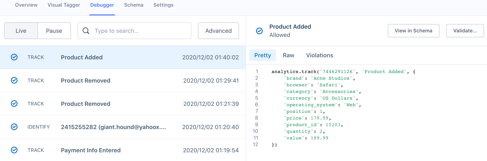
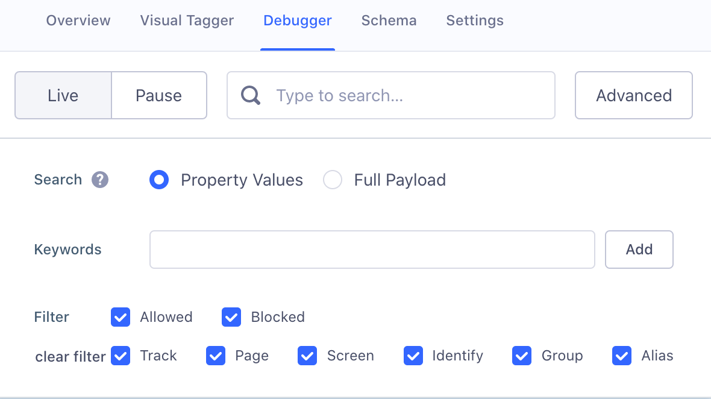

The Source Debugger is a real-time tool that helps you confirm that API calls made from your website, mobile app, or servers arrive to your Segment Source, so you can troubleshoot your Segment set up even quicker. With the Debugger, you can check that calls are sent in the expected format without having to wait for any data processing.

The Debugger is separate from your workspace's data pipeline and is not an exhaustive view of all the events ever sent to your Segment workspace. The Debugger only shows a sample of the events that the Source receives in real time, with a cap of 500 events. The Debugger is a great way to test specific parts of your implementation to validate that events are being fired successfully and arriving to your Source.

To see a more complete view of all your events, Segment recommends that you set up a [warehouse](/docs/connections/storage/warehouses/) or an [S3 destination](/docs/connections/destinations/catalog/aws-s3/).

The Debugger shows a live stream of sampled events arriving into the Source, but you can also pause the stream from displaying new events by toggling "Live" to "Pause". Events continue to arrive to your Source while you Pause the stream.

You can search in the Debugger to find a specific payload using any information you know is available in the event's raw payload. You can also use advanced search options to limit the results to a specific event.

Two views are available when viewing a payload:

* The **Pretty view** is an approximate recreation of the API call you made that was sent to Segment. The format shown depends on the library used at the source.
* The **Raw view** is the complete JSON object Segment received from the calls you sent. These calls include all the details about what is being tracked: timestamps, properties, traits, ids, and [contextual information Segment automatically collects](/docs/connections/spec/common/#context-fields-automatically-collected) the moment the data is sent.
