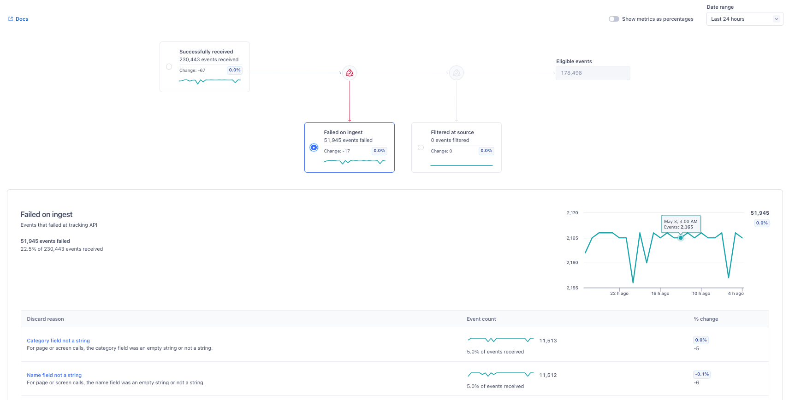

## What is a source?

A source is a website, server library, mobile SDK, or cloud application which can send data into Segment. It’s where your data originates. Add a source to collect data to understand who your customers are and how they’re using your product. Create a source for each website or app you want to track. While it's not required that you have a single source for each server, site, or app, you should create a source for each unique source of data.

Each source you create has a write key, which is used to send data to that source. For example, to load [`analytics.js`, the Segment JavaScript library](https://segment.com/docs/connections/sources/catalog/libraries/website/javascript/) on your page, the snippet on the [Quickstart Guide](https://segment.com/docs/connections/sources/catalog/libraries/website/javascript/quickstart/) includes:


```js
analytics.identify('user_123', {
  email: 'jane.kim@example.com',
  name: 'Jane Kim'
  });
```




```js
analytics.identify('user_123', {
  email: 'jane.kim@example.com',
  name: 'Jane Kim'
  },
);
```



```html
<div id="example"></div>
```



```css
#example { color: red; }
```




> info "If you don't see the source you're looking for in the catalog"
> If a tool isn't listed as a supported source in Segment's [catalog](https://segment.com/catalog/){:target="_blank"}, it's not possible to incorporate the integration out-of-the-box within a Segment workspace. As an alternative, you can use the [HTTP API](/docs/connections/sources/catalog/libraries/server/http-api/) source to collect data from the tool's API. You can also use [Functions](/docs/connections/functions/) to send or receive data from other tools.

## Types of sources

Segment has three types of sources: 
* [Event streams](#event-streams-sources)
* [Cloud app sources](#cloud-app-sources)
* [Reverse ETL](#reverse-etl-sources) 


<!-- ## Types of sources

Segment has five types of sources:
* [Web](#website-libraries)
* [Mobile](#mobile)
* [Server](#server)
* [Cloud App](#cloud-apps)
  * [Object Cloud](#object-cloud-sources)
  * [Event Cloud](#event-cloud-sources)
* User-created [Source Functions](/docs/connections/sources/source-functions/)


Web, Mobile, and Server sources send first-party data from your digital properties. Cloud-app sources send data about your users from your connected web apps such as [Zendesk](/docs/connections/sources/catalog/cloud-apps/zendesk/),  [Stripe](/docs/connections/sources/catalog/cloud-apps/stripe/), and [Braze](/docs/connections/sources/catalog/cloud-apps/braze/). -->


## Event streams sources 
Event streams sources collect data from your website or app to monitor user actions. These sources include [website libraries](#website-libraries), [mobile](#mobile) and [server sources](#server). 

### Source Overview

The Source Overview page for an event stream source shows you: 
* A [pipeline view](#pipeline-view) of all events Segment receives from your source, 
* Events that failed on ingest, 
* Events that are filtered at the source level, 
* "Eligible events", which are the events that will flow into your destinations. 
If you select one of the steps in the pipeline view, you can see a line chart that reflects the fluctuations in volume alongside a [breakdown table](#breakdown-table) that has more details about the events impacted by the selected step.

#### Pipeline view

The pipeline view shows each of the four steps Segment encounters when processing data from your source: 

- **Events successfully received**: All events that Segment received from your source.
- **Failed on ingest**: Events that failed at the Tracking API level. For more information about errors that might cause events to fail on ingest, see Delivery Overview's [Troubleshooting](/docs/connections/delivery-overview/#troubleshooting) documentation.
- **Filtered at source**: Events that were filtered out by source schema controls, Tracking Plans, or a common JSON schema.
- **Eligible events**: Eligible events are the events that flow downstream to your Segment destinations. This value is read-only, but you can see the events that flow downstream to a particular destination using [Delivery Overview](/docs/connections/delivery-overview).

> success ""
> You can use the time picker located on the Source Overview page to specify a time period (last 10 minutes, 1 hour, 24 hours, 7 days, 2 weeks, or a custom date range over the last two weeks) for which you’d like to see data. Segment sets the time picker to show data for the last 24 hours by default. 



#### Breakdown table

The breakdown table displays these 3 tabs:
* **Event type**: The Segment Spec event type (for example, Track call vs. Identify call). _This tab also contains a "% change" metric, which displays how the event counts differ from the last comparable time range, represented as a percentage._
* **Event name**: The event name, provided by you or the source.
* **App version**: The app or release version, provided by you or the source. 

Each of these tabs displays an event count, which is the total number of events that Segment received in a particular step. 

> info ""
> The Unnamed or batched events under the **Event Name** tab is a collection of all identify and page/screen calls in the source.

### Website libraries

[Analytics.js](/docs/connections/sources/catalog/libraries/website/javascript/), the JavaScript library, is the most powerful way to track customer data from your website. If you're just starting out, Segment recommends it over server-side libraries as the simplest installation for any website.



### Mobile

Segment's Mobile SDKs are the best way to simplify your iOS, Android, and Xamarin app tracking. Try them over server-side sources as the default installation for any mobile app.

- [AMP](/docs/connections/sources/catalog/libraries/mobile/amp)
- [Android (Kotlin)](/docs/connections/sources/catalog/libraries/mobile/kotlin-android/)
- [React Native](/docs/connections/sources/catalog/libraries/mobile/react-native)
- [iOS (Swift)](/docs/connections/sources/catalog/libraries/mobile/swift/)
- [Xamarin](/docs/connections/sources/catalog/libraries/server/csharp)
- [Unity](/docs/connections/sources/catalog/libraries/server/csharp/)

> info "Analytics-Flutter library"
>  The Analytics-Flutter library is currently only available in pilot phase and is governed by Segment's [First Access and Beta Preview Terms](https://www.twilio.com/en-us/legal/tos){:target="_blank"}. If you'd like to try out this library, access the [Analytics-Flutter GitHub repository](https://github.com/segmentio/analytics_flutter){:target="_blank"}. 

### Server

Segment's server-side sources let you send analytics data directly from your servers. Segment recommends tracking from your servers when device-mode tracking (tracking on the client) doesn't work. Check out the [guide on server-side tracking](/docs/guides/how-to-guides/collect-on-client-or-server/) if you're not sure whether it makes sense for your use case.

{: .columns }
- [Clojure](/docs/connections/sources/catalog/libraries/server/clojure/)
- [Go](/docs/connections/sources/catalog/libraries/server/go/)
- [Java](/docs/connections/sources/catalog/libraries/server/java/)
- [Node.js](/docs/connections/sources/catalog/libraries/server/node/)
- [PHP](/docs/connections/sources/catalog/libraries/server/php/)
- [Python](/docs/connections/sources/catalog/libraries/server/python/)
- [Ruby](/docs/connections/sources/catalog/libraries/server/ruby/)
- [.NET](/docs/connections/sources/catalog/libraries/server/csharp/)

> info "Cloud-mode tracking"
> Server-side data management is when tag sends data to the Segment servers, which then passes that data to the destination system.


## Cloud app sources

Cloud app sources empower you to pull together data from all of your different third-party tools into a Segment warehouse or to your other enabled integrated tools. They send data about your users from your connected web apps. There are 2 types of Cloud Apps: [Object cloud sources](#object-cloud-sources) and [Event cloud sources](#event-cloud-sources).




### Object Cloud Sources

These Cloud App Sources can export data from its third party tool and import it directly into your Segment warehouse. Make sure you have a Segment warehouse enabled before you enable any of the following sources:

{: .columns }
  
{{source-type-list | markdownify}}


### Event Cloud Sources

These Cloud App Sources can not only export data into your Segment warehouse, but they can **also** federate the exported data into your other enabled Segment integrations:

{: .columns }
  
{{source-type-list | markdownify}}

### HTTP

If Segment doesn't have a library for your environment, you can send your data directly to the [HTTP Tracking API](/docs/connections/sources/catalog/libraries/server/http/). All of Segment's other sources and platforms use the HTTP API to work their magic behind the scenes.


### Pixel

Segment's [Pixel Tracking API](/docs/connections/sources/catalog/libraries/server/pixel-tracking-api/) lets you track events from environments where you can't execute code, like tracking email opens.

| Event name           | Description                                                                                                           |
| -------------------- | --------------------------------------------------------------------------------------------------------------------- |
| Email Delivered      | The message has been successfully delivered to the receiving server.                                                   |
| Email Opened         | The recipient has opened the HTML message. You need to enable Open Tracking for getting this type of event.           |
| Email Link Clicked   | The recipient clicked on a link within the message. You need to enable Click Tracking for getting this type of event. |
| Email Bounced        | The receiving server could not or would not accept message.                                                           |
| Email Marked as Spam | The recipient marked the message as spam.                                                                                 |
| Unsubscribe          | The recipient clicked on the message's subscription management link.                                                      |

## Reverse ETL sources
Reverse ETL sources are data warehouses that enable you to use [Reverse ETL](/docs/connections/reverse-etl) to send data from your warehouse source to your destinations. 

Reverse ETL supports these sources: 
* [BigQuery](/docs/connections/reverse-etl/reverse-etl-source-setup-guides/bigquery-setup/)
* [Databricks](/docs/connections/reverse-etl/reverse-etl-source-setup-guides/databricks-setup/)
* [Postgres](/docs/connections/reverse-etl/reverse-etl-source-setup-guides/postgres-setup/)
* [Redshift](/docs/connections/reverse-etl/reverse-etl-source-setup-guides/redshift-setup/)
* [Snowflake](/docs/connections/reverse-etl/reverse-etl-source-setup-guides/snowflake-setup/)

Segment is actively working on adding more sources. If you'd like to request Segment to add a particular source, please note it on the [feedback form](https://airtable.com/shriQgvkRpBCDN955){:target="_blank"}.

## Create a source
To create a source:
1. Navigate to **Connections** and click **Add Source**.
2. Click the Source you’d like to add. **Note**: More than 80% of workspaces start by adding their JavaScript website.
3. Click **Add Source**.
4. Enter a name for your source as well as any information on the setup page.
5. Click **Add Source**.

Once you've created a source, the source is automatically activated and can immediately receive events. You can review your new events in that source's [Debugger](/docs/connections/sources/debugger/) tab.


> warning "Sources not connected to an enabled destination are disabled after 14 days"
> If your source is not connected to any destinations or is only connected to disabled destinations, Segment automatically disables this source after 14 days, even if the source is receiving events. Disabled sources will no longer receive data. 
> You can view when Segment disables your destination in your workspace's [Audit Trail](https://app.segment.com/goto-my-workspace/audit-trail) as `Event : Source Disabled` with `Actor : Segment`.
> Workspace members receive an email notification before Segment disables your source so that your team has time to take action.
> If you would like to prevent this behavior in your workspace, fill out [this Airtable form](https://airtable.com/appADTobzkv0FYLbi/shr7V9LFDZh31cYWW).

 Segment suggests that you create one source for each type of data you want to collect. For example, you might have one source for all of your website tracking and a different source for any mobile tracking. Creating one source per data type provides the following benefits:
 - Debugger ease of use - mixing libraries or sources on a single API key means you’re heavily reliant on filtering to actually test events
 - Flexibility sending data to different projects - if you want to have different warehouse schemas, analytics projects, having multiple sources creates this separation
 - More control - as your account grows with the number of destinations you enable, having separate sources allows you to have more control
 - A source type can't be changed after it is created. You must create a new source if you would like to use a different source type.

## Library tiers

Segment defined 3 tiers for libraries: Flagship, Maintenance, and Community. These tiers indicate the level of support, enhancements, and maintenance each library receives from Segment. 

The criteria for assigning a library to a tier include its overall usage by customers and the availability of newer versions. Here's how Segment defines each tier:

- **Flagship** libraries offer the most up-to-date functionality on Segment’s most popular platforms. Segment actively maintains Flagship libraries, which benefit from new feature releases and ongoing development and support.
- **Maintenance** libraries send data as intended but receive no new feature support and only critical maintenance updates from Segment. When possible, Segment recommends using a Flagship version of these libraries.
- **Community** libraries are neither managed nor updated by Segment. These libraries are available on GitHub under the MIT License for the open-source community to fork or contribute.

If a library falls into one of these tiers, you'll see the tier label at the beginning of the library's page.
