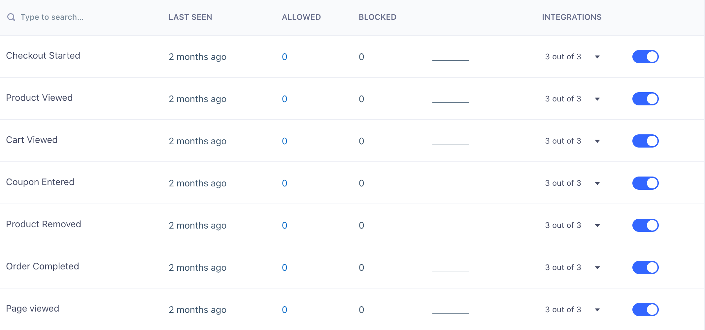
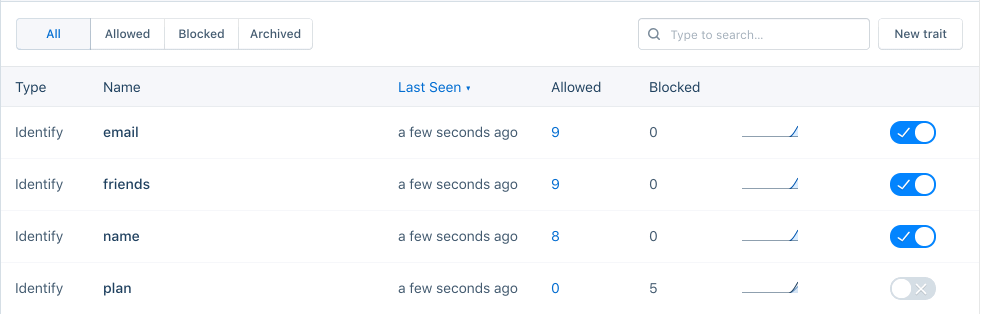
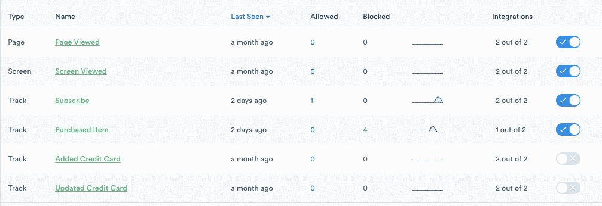



Segment Business Tier customers can use Schema Controls to manage which events are allowed to pass through Segment and on to Destinations. These filters are a first-line defense to help you protect the integrity of your data, and the decisions made with it.

Blocking events within the source schema will exclude them from API and MTU calculations. These events are discarded before they reach the pipeline that Segment uses for MTU calculations. 

## Schema view

The Schema tab shows the schema of events, properties, and traits for each source that Segment receives over a specific timeframe. It also shows when the events were last seen, how many events were allowed vs. blocked, and the downstream destinations those events are connected to.

You can view events by Segment call type in the Source Schema with the **Track**, **Identify**, and **Group** tabs. 
The Schema tracks: 
- Track event details by _event_ name 
- Identify and Group event details by _trait_ name 

Click the arrow to the left of the event name to view additional event properties for Page or Track events. Since the Schema tracks Identify traits, you will need to make sure you are passing traits into your Identify call in order to view event data in your schema. 

The Schema shows "Page Viewed" for all Page calls under the **Track** tab. 

The Source Schema UI changes slightly depending on whether you have a [Protocols Tracking Plan](https://segment.com/docs/protocols/tracking-plan/create/){:target='_blank’} connected to the source. If you have a Tracking Plan connected to your source, the UI displays a **Planned** column that will indicate if the event is planned or unplanned. This allows you to quickly identify unplanned events and take action to align your schema with your Tracking Plan. If there is no Tracking Plan connected to the source, the UI will display a toggle next to each event where, if you're a Business Tier customer, you can simply block or allow that event at the source level.  

## Event filters

If you no longer want to track a specific event, you can either remove it from your code or, if you're on the Business plan and don't have a Tracking Plan connected, you can block track calls from the Segment UI. To do so, click on the Schema tab in a Source and toggle the event to enable or block an event.




> info ""
> For sources with a connected Tracking Plan, use Protocols to block unplanned events.


Once you block an event, Segment stops forwarding it to all of your Cloud and Device-mode Destinations, including your warehouses. You can remove the events from your code at your leisure. In addition to blocking track calls, Business plan customers can block all Page and Screen calls, as well as Identify traits and Group properties.

When an event is blocked, the name of the event or property is added to your Schema page with a counter to show how many events have been blocked. By default, data from blocked events and properties is not recoverable. You can always re-enable the event to continue sending it to downstream Destinations. 

In most cases, blocking an event immediately stops that event from sending to Destinations. In rare cases, it can take **up to six hours** to fully block an event from delivering to all Destinations.


## Identify and Group Trait Filters

If you no longer want to capture specific traits within `.identify()` and `.group()` calls, you can either remove those traits from your code, or if you're on the Business plan, you can block specific traits right from the Segment UI. To do so, click on the Schema tab in a Source and navigate to the Identify or Group events where you can block specific traits.




> warning ""
> Blocked traits are not omitted from calls to device-mode Destinations.

## Schema Integration Filters

All customers can filter specific events from being sent to specific Destinations (except for warehouses) by updating their tracking code. Here is an example showing how to send a single message only to Intercom and Google Analytics:

```js
analytics.identify('user_123', {
  email: 'jane.kim@example.com',
  name: 'Jane Kim'
}, {
  integrations: {
    'All': false,
    'Intercom': true,
    'Google Analytics': true
  }
});
```

Destination flags are case sensitive and match the [Destination's name in the docs](/docs/connections/destinations/) (for example, "AdLearn Open Platform", "awe.sm", "MailChimp", and so on).

Segment Business tier customers can block track calls from delivering to specific Destinations in the Segment UI. Visit a Source Schema page and click on the **Integrations** column to view specific schema integration filters. Toggle the filter to block or enable an event to a Destination.




