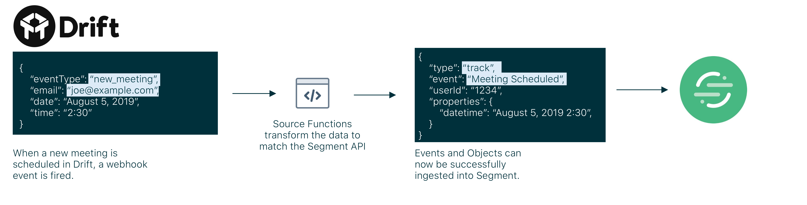

> note ""
> **NOTE:** Functions are currently in developer preview. If you are interested in joining the developer preview, navigate to the Build page in your catalog [here](https://app.segment.com/goto-my-workspace/build/catalog). The use is governed by [(1) Segment First Access](https://segment.com/docs/legal/first-access-beta-preview/) and Beta Terms and Conditions and [(2) Segment Acceptable Use Policy](https://segment.com/docs/legal/acceptable-use-policy/).

Source Functions allow you to gather data from thousands of 3rd-party applications without having to worry about setting up or maintaining any infrastructure. Source Functions are small pieces of code that you create, edit and deploy in Segment to receive any webhooks and generate Segment events or objects that match the [Segment Spec](https://segment.com/docs/connections/spec/).

Here are some example uses cases we've heard from customers that you can use Source Functions to implement in your organization:

- **Create a long-term-value (LTV) computed trait using Zuora subscription data**: A customer connected Zuora webhooks to a webhook source and sent that data into Personas where they created a computed trait to calculate the LTV for the customer in real-time.
- **Start an onboarding campaign when a customer is marked "Closed Won" in Pipedrive**: Another customer set up an automated onboarding email campaign in Iterable that triggered when the sales lead closed in Pipedrive.
- **Combine mobile subscription revenue with web revenues**: A major media company connected mobile and web revenue data for the first time, which allowed them to analyze it together in Amplitude.

Here is an example of what a Source Function could be used to do with a webhook from Drift.



## Getting Started

### Creating your Source Function

To create a Source Function:
1. Go to [Functions tab](https://app.segment.com/goto-my-workspace/functions/catalog) in the Segment Catalog within your workspace.
2. Click the `New Function` button.
3. Select `Source Function` and click the `Build` button.


### Writing your Function

After you click `Build` button, you will be redirected to the code editor. Here, you can take full control of your source logic to transform a webhook payload into events or objects to be sent downstream. Segment provides templates that make it simple to ingest data from your upstream webhook and offer example code to help you get started.


You can access the payload from the `request` variable like this:

```js
async function onRequest(request, settings) {
  const requestBody = request.json()
  const requestHeader = request.headers.get('Content-Type')
  const requestParam = request.url.searchParams.get("timestamp")
}
```

Note that your handler function is `async`.

The first `request` argument contains everything about the incoming webhook request. You access the request body through a `json()` or `text()` helper function, the request headers with the [Headers](https://developer.mozilla.org/en-US/docs/Web/API/Headers) interface, and the request URL and query parameters with the [URL](https://developer.mozilla.org/en-US/docs/Web/API/URL) interface.

#### Sending Messages

You can send messages to the Segment API through the following:

```js
async function onRequest(request, settings) {
  Segment.identify({
    userId: '1234',
    traits: {
      traitName: 'Example Trait'
    }
  })

  Segment.track({
    event: 'Event Name',
    userId: '1234',
    properties: {
      propertyName: 'Example Property'
    }
  })

  Segment.group({
    userId: '1234',
    groupId: '1234',
    traits: {
      traitName: 'Example Trait'
    }
  })

  Segment.set({
    collection: 'collection_name_plural',
    id: 'object_id_string',
    properties: {
      propertyName: 'Example Property'
    }
  })
}
```

The `Segment` module has `Segment.identify()`, `Segment.track()`, `Segment.group()`, `Segment.set()`, `Segment.page()`, `Segment.screen()` and `Segment.alias()` helper functions. These fill in defaults and validate the data you provide. You can call these functions anywhere in your function.

Behind the scenes, the `Segment` module appends messages to an array and will send messages to the Segment [Tracking](https://segment.com/docs/connections/sources/catalog/libraries/server/http/) and [Object](https://segment.com/docs/connections/sources/catalog/libraries/server/object-api/) API provided your function returns without error.

You can access header data via the `request.headers` property and the [Headers](https://developer.mozilla.org/en-US/docs/Web/API/Headers) interface. For example:"

```js
async function onRequest(request, settings) {
  const requestHeader = request.headers.get('Content-Type')
}
```

##### Events

Events are used to trigger real-time workflows in downstream streaming destinations. These events are compatible with both streaming destinations and warehouses. Events should match the following return format from the function:

<table class="api-table">
  <tr>
    <td>Property Key</td>
    <td>Values</td>
    <td>Description</td>
  </tr>
  <tr>
    <td>event</td>
    <td>String</td>
    <td>The name of the event you want to fire. This is only valid for `Segment.track()`.</td>
  </tr>
  <tr>
    <td>userId</td>
    <td>String</td>
    <td>The user ID you want to associate the event with. If the type of the call is group then use the groupId.</td>
  </tr>
  <tr>
    <td>groupId</td>
    <td>String</td>
    <td>The Account or Group ID of the user. This is only valid for `Segment.group()`.</td>
  </tr>
  <tr>
    <td>properties</td>
    <td>Objects</td>
    <td>A list of key/value pairs that are sent as properties to the event. This is only valid for `Segment.track()`, `Segment.page()` and `Segment.()screen`.</td>
  </tr>
  <tr>
    <td>traits</td>
    <td>Objects</td>
    <td>A list of key/value pairs that are sent as traits to the event. This is only valid for `Segment.identify()` and `Segment.group()`.</td>
  </tr>
</table>

For more details on the events that are supported, see the [HTTP](https://segment.com/docs/connections/sources/catalog/libraries/server/http/) and [Object](https://segment.com/docs/connections/sources/catalog/libraries/server/object-api/) API documentation.

##### Objects

Objects are pieces of data that you can ETL (extract, transform, load) to your warehouse. Objects are not compatible with streaming destinations. For more details about what is supported with objects, review the [Objects API documentation](/docs/connections/sources/catalog/libraries/server/object-api/).

<table class="api-table">
  <tr>
    <td>Property Key</td>
    <td>Values</td>
    <td>Description</td>
  </tr>
  <tr>
    <td>collection</td>
    <td>String</td>
    <td>The collection translates to the name of the table in your warehouse. Examples: `products`, `rooms`, `leads`. Naming should be lower case and plural. </td>
  </tr>
  <tr>
    <td>id</td>
    <td>String</td>
    <td>The unique object ID. Any future objects with the same Object ID are upserted, de-duped and merged.</td>
  </tr>
  <tr>
    <td>properties</td>
    <td>Object</td>
    <td>A list of key/value pairs that are sent as properties of the object. These translate to columns downstream in your warehouse.</td>
  </tr>
</table>

### Built-in Dependencies

The following dependencies are pre-installed in the function environment:

- atob v2.1.2
- aws-sdk v2.488.0
- btoa v1.2.1
- form-data v2.4.0
- lodash v4.17.15
- node-fetch v2.6.0
- oauth v0.9.15
- xml v1.0.1

Additional dependences are not currently supported using the web based IDE, but we're looking to add them in the near future. Until then [contact us](https://segment.com/help/contact/) to request additional dependencies.

### Settings and Secrets

Settings allow you to pass different variables to your function. A common pattern is to configure settings for an API url and secret API key, so you can use the same code with different settings for different workspaces.

For example, if we include an `settingKey` string setting you will be able to access this in your code using dot notation on the settings object as follows:

```js
async function onRequest(request, settings) {
  let settingValue = settings.settingKey;
}
```

You can include multiple setting types including string, boolean, array and text maps to support your use case. As needed, you also have the ability to mark a particular setting as required and/or encrypted. 

Settings can be very useful to help build a function that can be re-used without having to modify any code in the Function itself. For example, customers can use settings to:
* Build a function that can be rolled out without code changes to various Shopify stores
* Source payment data from a payment process and have a setting to denote the region for that function


## Logging & Testing

### Logging

The command line client allows you to access runtime logs of your Functions. These can be useful in seeing errors and help you debug your functions on an ongoing basis.

**Download the CLI Client**<br />
```
curl https://raw.githubusercontent.com/segmentio/functions-cli-bin/master/install.sh | sh
```

**Authenticate and upload your Function**

First create an access token by following these directions: https://segment.com/docs/config-api/authentication/#create-an-access-token. Then, create a file in your home directory:  `~/.source-fn-config.json`

```
{
   "token": "<token created in the workspace>",
   "user": "<Email of token user>",
   "workspace": "<workspace name>"
}
```

**Accessing Logs**
When you have real events flowing through the function and you're still not seeing the events in the debugger appear, you can see logs from your source function locally to debug and understand what's going on. Use the following command to get the last 100 lines of output from the function:

```
source-functions-cli logs --source <source slug>
```

The source slug is the name of the source as it appears in the URL.

### Testing

Test your code directly from the Functions Editor with two options: 

#### Webhook Catcher

Start by copying the webhook URL from the sidebar or "Auto-fill via webhook" dialog to your upstream tool or service to receive payloads with which you can use to test your function code.

We begin automatically listening to your webhook URL for any JSON events (ie. `Content-Type: application/json`) which are triggered. 

Click `Run` to test the event against your function code.

#### Manual Input

Alternatively, you can manually include your own JSON payload with relevant headers before hitting the `Run` button. In this view, you also have the option to switch back to the webhook catcher by clicking on `Auto-fill via Webhook`.

## Creation & Deployment

Once you've completed writing your Source Function, you can create your function by clicking the `Configure` button on the bottom right of the editor. This brings you to a screen to name your function and optionally add additional details that will be displayed in your workspace. Hit `Create Function` and your Source Function will be ready to be used within your workspace.

If you're editing an existing function, you will have the option to `Save` changes without impacting your deployed function. Alternatively, you can choose to `Save & Deploy` to push changes to your existing function.

## Management

### Permissions

The permissions required to create and manage a Source Function are separate from those required to enable it on a source.

Currently, you must be a **Workspace Owner** in order to create, edit or delete a function.

Once the Source Function has been created, you can enable it as you would a normal source. You need to be a `Workspace Owner` or `Source Admin`.

### Editing & Deleting

If you are a **Workspace Owner**, you can manage your Source Function under the [Functions tab](https://app.segment.com/goto-my-workspace/functions/catalog). Click on the function you wish to manage and the sidesheet menu will allow you to connect, edit or delete your function.


## Legacy Functionality

### Legacy Source Functions

Source Functions created before September 11, 2019 were written with a different JavaScript interface than documented above, and were optionally managed with an experiment API and CLI tool.

These interfaces are now deprecated, so we recommend re-creating and managing your functions with the latest interfaces.

However we still support these legacy functions.

**Accessing the webhook payload (Legacy)**

You can access the body, headers and query parameters of the function through the following:

```js
exports.processEvents = async (event) => {
  event.payload.body;
  event.payload.headers;
  event.payload.queryParameters;
```

**Returning messages (Legacy)**

```js
{
  events: [{
    type: 'identify',
    userId: '1234',
    traits: {}
  },
  {
    type: 'track',
    event: 'Event Name',
    userId: '1234',
    properties: {}
  },
  {
    type: 'group',
    userId: '1234',
    groupId: '1234',
    traits: {}
  }],
  objects: [{
    collection: 'rooms',
    id: "String of Object ID",
    properties: {}
  }]
}
```

**Migrating Function Code (Legacy)**

First change the function defintion to `async function onRequest(request, settings) {}`, instead of `exports.processEvents = async (event) => {}`.

Next:

* access the request body as `const requestBody = request.json()`, instead of `event.payload.body`
* access the request headers as `request.headers.get(HEADERNAME)`, instead of `event.payload.headers[HEADERNAME]`
* access the request query parameters as `request.url.searchParams.get(PARAMNAME)` instead of `event.payload.queryParameters[PARAMNAME]`

Finally send data with calls to `Segment.track()`, `Segment.identify()`, `Segment.group()` and `Segment.set()` instead of returning an object with `events` and `objects` arrays.

### Legacy Source Function Model 

Source Functions created before January 28, 2020 were created as one-off _instances_. This means that you create it once and it can be used within your workspace a single time. Any changes you make to the code of this Source Function will automatically update for this single instance. 

This behavior has now been deprecated and all existing Source Functions have been moved to the new model. This means that when you create a Source Function, you're creating a _class_ which can be deployed once, and _instances_ of this class can be configured in your workspace multiple times. The _class_ is parameterized by the function settings.

> note ""
> **NOTE:** Updates made to your Source Function code, will not automatically be deployed to configured _instances_ within your workspace. We are working to make this experience more seamless but currently, you will need to delete the configured _instance_ and re-configured in your workspace to have those updates included.

## FAQs

**What is the retry policy for a webhook payload?**

The webhook payload retries up to 5 times with an exponential backoff for the function in the event that there is a failure with the function. After 5 attempts, the message is dropped.

**What is the maxium payload size for the incoming webhook?**

The maxium payload size for an incoming webhook payload is 2MB.

**What is the timeout for a function to execute?**

The lambda execution limit is 1 second.

**What does "ReferenceError: exports is not defined" mean?**

You are using a deprecated style of writing functions. See the "Migrating Function Code (Legacy)" section.
