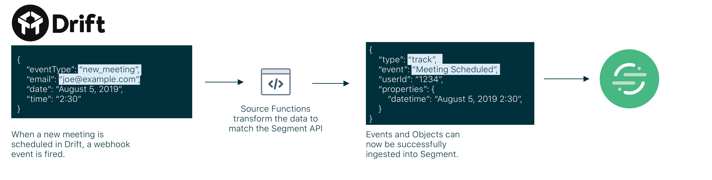
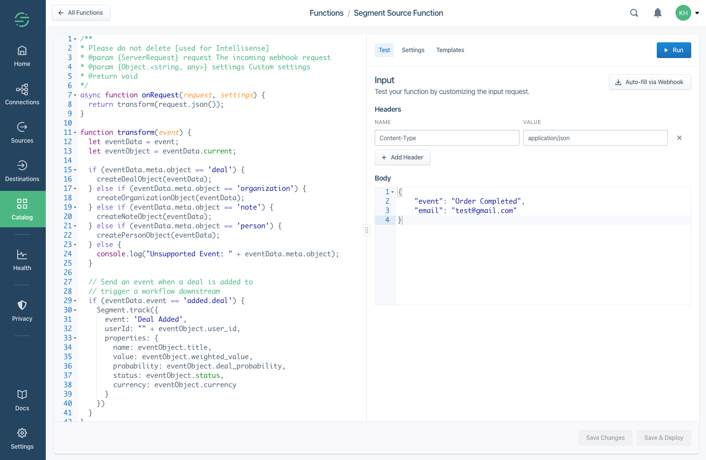
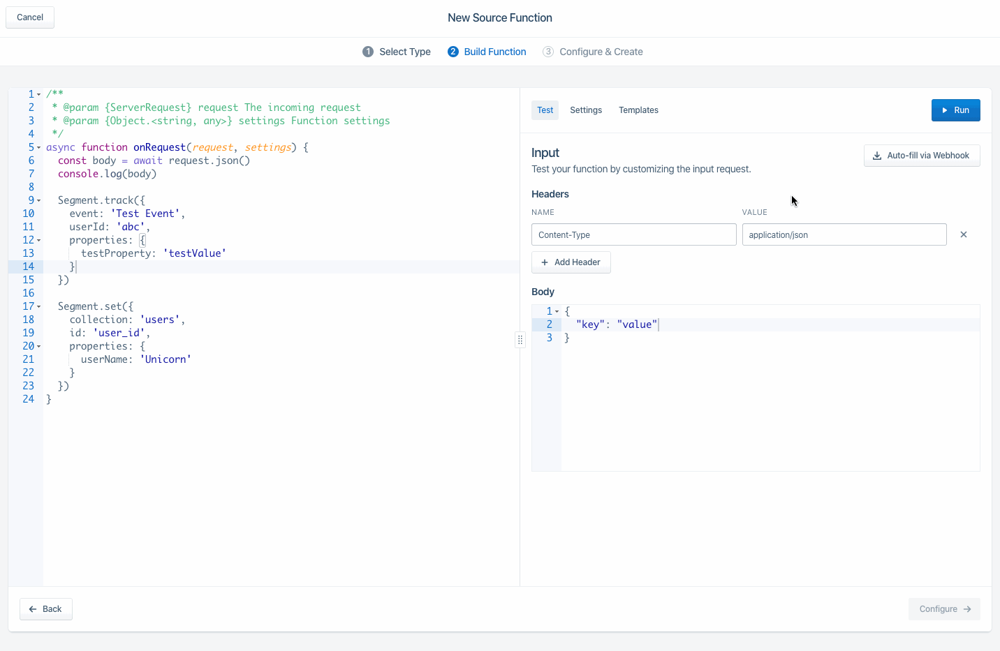
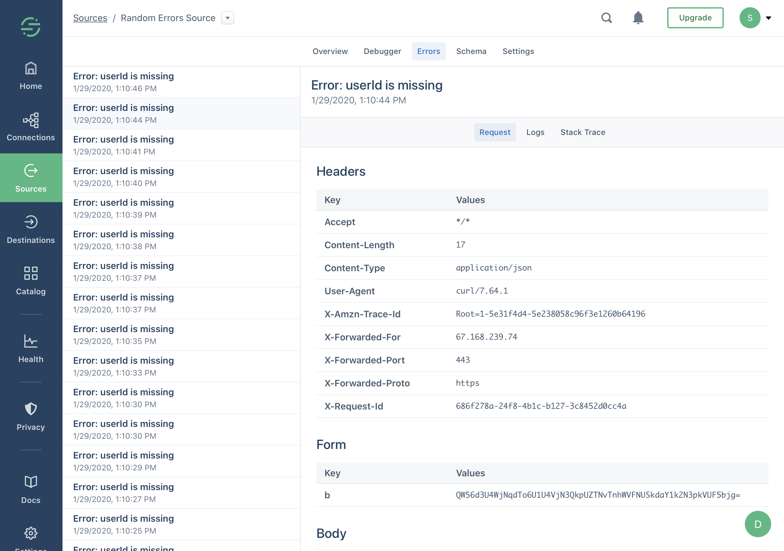
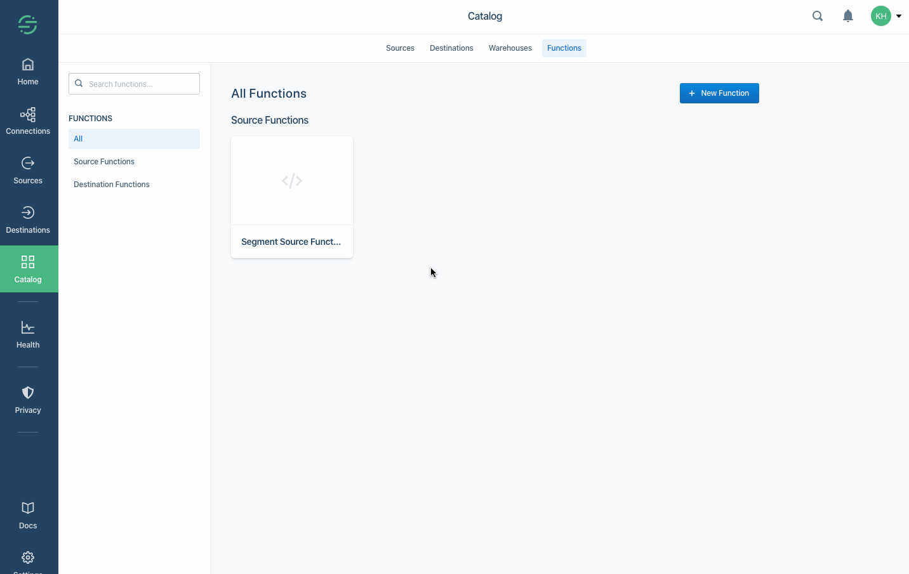

> note ""
> **Note:** Functions are currently in Public Preview. If you are interested in joining the Public Preview, go to the Build page in your catalog [here](https://app.segment.com/goto-my-workspace/build/catalog). The use is governed by [(1) Segment First Access](https://segment.com/legal/first-access-beta-preview/) and Beta Terms and Conditions and [(2) Segment Acceptable Use Policy](https://segment.com/legal/acceptable-use-policy/).

Source Functions allow you to gather data from any third-party applications without worrying about setting up or maintaining any infrastructure. Source Functions are small pieces of JavaScript code that you create, edit, and deploy in Segment to receive webhooks and generate Segment events or objects using the [Segment Spec](/docs/connections/spec/).

Here are some ways that Segment customers are using Source Functions:

- **Create a long-term-value (LTV) computed trait using Zuora subscription data**: A customer connected Zuora webhooks to a webhook source and sent that data into Personas, where they created a computed trait to calculate the LTV for the customer in real-time.
- **Start an on-boarding campaign when a customer is marked "Closed Won" in Pipedrive**: Another customer set up an automated on-boarding email campaign in Iterable that triggered when the sales lead closed in Pipedrive.
- **Combine mobile subscription revenue with web revenues**: A major media company connected mobile and web revenue data for the first time, which allowed them to analyze it together in Amplitude.

Here is an example of how a Source Function could be used to handle a webhook from Drift.



## Getting Started

### Creating your Source Function

To create a Source Function:

1. From your Segment Workspace, to go the Catalog and click the [Functions tab](https://app.segment.com/goto-my-workspace/functions/catalog).
2. Click **New Function**.
3. Select **Source Function** and click **Build**.

### Writing your Function

When you click **Build** button, a JavaScript code editor opens so you can configure your source logic to transform a webhook payload into events or objects to be sent downstream. Segment provides templates that make it simple to ingest data from your upstream webhook and offer example code to help you get started.



You can access the payload from the `request` variable like this:

```js
async function onRequest(request, settings) {
  const requestBody = request.json()
  const requestHeader = request.headers.get('Content-Type')
  const requestParam = request.url.searchParams.get("timestamp")

  // ...
}
```

Note that your handler function must be `async`.

The first `request` argument contains the incoming webhook request including headers and body. You access the request body through a `json()` or `text()` helper function, the request headers with the [Headers](https://developer.mozilla.org/en-US/docs/Web/API/Headers) interface, and the request URL and query parameters with the [URL](https://developer.mozilla.org/en-US/docs/Web/API/URL) interface.

#### Sending Messages

You can send messages to the Segment API using the `Segment` object:

```js
async function onRequest(request, settings) {
  Segment.identify({
    userId: '1234',
    traits: {
      traitName: 'Example Trait'
    }
  })

  Segment.track({
    event: 'Event Name',
    userId: '1234',
    properties: {
      propertyName: 'Example Property'
    }
  })

  Segment.group({
    userId: '1234',
    groupId: '1234',
    traits: {
      traitName: 'Example Trait'
    }
  })

  Segment.set({
    collection: 'collection_name_plural',
    id: 'object_id_string',
    properties: {
      propertyName: 'Example Property'
    }
  })
}
```

The `Segment` module has `Segment.identify()`, `Segment.track()`, `Segment.group()`, `Segment.set()`, `Segment.page()`, `Segment.screen()` and `Segment.alias()` functions. These fill in defaults and validate the data you provide. You can call these functions anywhere in your function.

Behind the scenes, the `Segment` module appends messages to an array and sends messages to the Segment [Tracking API](/docs/connections/sources/catalog/libraries/server/http/) and [Object API](/docs/connections/sources/catalog/libraries/server/object-api/), as long as your function returns without error.

##### Events

Events are used to trigger real-time workflows in downstream streaming destinations. These events are compatible with both streaming destinations and warehouses. Use the following return format for events from the function:

<table class="api-table">
  <tr>
    <td>Key</td>
    <td>Value Type</td>
    <td>Description</td>
  </tr>
  <tr>
    <td>event</td>
    <td>String</td>
    <td>The name of the event you want to fire. This is only valid for `Segment.track()`.</td>
  </tr>
  <tr>
    <td>userId</td>
    <td>String</td>
    <td>The user ID you want to associate the event with. If the type of the call is group then use the groupId.</td>
  </tr>
  <tr>
    <td>groupId</td>
    <td>String</td>
    <td>The Account or Group ID of the user. This is only valid for `Segment.group()`.</td>
  </tr>
  <tr>
    <td>properties</td>
    <td>Objects</td>
    <td>A list of key/value pairs that are sent as properties to the event. This is only valid for `Segment.track()`, `Segment.page()` and `Segment.()screen`.</td>
  </tr>
  <tr>
    <td>traits</td>
    <td>Objects</td>
    <td>A list of key/value pairs that are sent as traits to the event. This is only valid for `Segment.identify()` and `Segment.group()`.</td>
  </tr>
</table>

For more details on the events that are supported, see the [HTTP](/docs/connections/sources/catalog/libraries/server/http/) and [Object](/docs/connections/sources/catalog/libraries/server/object-api/) API documentation.

##### Objects

Objects are pieces of data that you can ETL (extract, transform, load) to your warehouse. Objects are not compatible with streaming destinations. For more details about what is supported with objects, review the [Objects API documentation](/docs/connections/sources/catalog/libraries/server/object-api/).

<table class="api-table">
  <tr>
    <td>Key</td>
    <td>Value Type</td>
    <td>Description</td>
  </tr>
  <tr>
    <td>collection</td>
    <td>String</td>
    <td>The collection translates to the name of the table in your warehouse. Examples: `products`, `rooms`, `leads`. Naming should be lower case and plural. </td>
  </tr>
  <tr>
    <td>id</td>
    <td>String</td>
    <td>The unique object ID. Any future objects with the same Object ID are upserted, de-duped and merged.</td>
  </tr>
  <tr>
    <td>properties</td>
    <td>Object</td>
    <td>A list of key/value pairs that are sent as properties of the object. These translate to columns downstream in your warehouse.</td>
  </tr>
</table>

### Runtime and Dependencies

Source Functions are run using Node.js 10.x. The following dependencies are pre-installed in the function environment:

- atob v2.1.2
- aws-sdk v2.488.0
- btoa v1.2.1
- form-data v2.4.0
- lodash v4.17.15
- node-fetch v2.6.0
- oauth v0.9.15
- xml v1.0.1

Additional dependences are not currently supported using the web based IDE, but we're looking to add them in the near future. Until then [contact us](https://segment.com/help/contact/) to request additional dependencies.

### Settings and Secrets

Settings allow you to pass configurable variables to your function. A common pattern is to configure settings for an API URL endpoint and secret API key, so that you can use the same code with different settings for different workspaces.

For example, if we include an `settingKey` string setting you will be able to access this in your code using dot notation on the settings object as follows:

```js
function onRequest(request, settings) {
  let settingValue = settings.settingKey;
}
```

You can include multiple setting types including strings, booleans, string arrays and string objects to support your use case. You can also mark a particular setting as being required and/or sensitive (encrypted), if needed.

Settings can help you build a function that can be reused without having to modify any code in the Function itself. For example, customers can use settings to:

- Build a function that can be rolled out without code changes to various Shopify stores
- Source payment data from a payment process and have a setting to denote the region for that function


## Testing Your Function

You can test your code directly from the Functions Editor in two ways:

#### Webhook Catcher

Start by copying the webhook URL from the sidebar or "Auto-fill using webhook" dialog to your upstream tool or service. This allows you to receive payloads which you can use to test your function code.



Segment automatically listens to your webhook URL for any JSON events (for example `Content-Type: application/json`) which are triggered.

Click **Run** to test the event against your function code.

#### Manual Input

You can also manually include your own JSON payload with relevant headers before you click **Run**. In this view, you also have the option to switch back to the webhook catcher by clicking **Auto-fill using Webhook**.

## Creation & Deployment

Once you finish writing your Source Function code, save the code and create the Function by clicking **Configure**. On the screen that appears, give the function a name, and optionally add useful details (these are displayed in your workspace). Click **Create Function** to finish and make your Destination Function available in your workspace.

If you're editing an existing function, you can **Save** changes without changing the behavior of your deployed function. Alternatively, you can also choose to **Save & Deploy** to push changes to an existing function.

## Logs and Errors

Your function may encounter errors that you missed during manual testing or you may intentionally throw your own errors in your code if, for example, the incoming request is missing required fields. If your function throws an error, execution is halted immediately and Segment captures the incoming request, any console logs you may have printed, as well as the error itself. Segment then displays the captured error information in the "Errors" tab of your Source in the Segment dashboard. You can use this tab to find and fix unexpected errors.



You can throw [an Error or custom Error](https://developer.mozilla.org/en-US/docs/Web/JavaScript/Reference/Global_Objects/Error) and you can also add additional helpful context in logs using the [`console` API](https://developer.mozilla.org/en-US/docs/Web/API/console). For example:

```js
async function onRequest(request, settings) {
  const requestBody = request.json()
  const userId = requestBody.userId

  console.log("userId:", userId)

  if (typeof userId != 'string' || userId.length < 8) {
    throw new Error("input user ID is invalid")
  }

  console.log("valid userId:", userId)

  // ...
}
```

> warning ""
> **Warning:** Do not log sensitive data, such as personally-identifying information (PII), authentication tokens, or other secrets. You should especially avoid logging entire request/response payloads. We only retain the 100 most recent errors and logs for up to 30 days but the "Errors" tab may be visible to other workspace members if they have the necessary permissions.

## Management

### Permissions

The permissions required to create and manage a Source Function are separate from those required to enable it on a source.

Currently, you must be a **Workspace Owner** in order to create, edit or delete a function.

Once the Source Function has been created, you can enable it as you would a normal source. You need to be a `Workspace Owner` or `Source Admin` to enable a Source Function.

### Editing & Deleting

If you are a **Workspace Owner**, you can manage your Source Function from the [Functions tab](https://app.segment.com/goto-my-workspace/functions/catalog). Click the function tile and the panel that appears will allow you to connect, edit or delete your function.



### Connecting

As with [editing and deleting](/docs/connections/sources/source-functions/#editing--deleting), you must be a **Workspace Owner** in order to connect an instance of your function within your workspace. From the [Functions tab](https://app.segment.com/goto-my-workspace/functions/catalog), click on "Connect Source" and follow the flow to name and set it up in you workspace.

Next, you will see a webhook URL either under the "Overview" tab or under the "Settings" tab within "Endpoint". Copy and paste this URL into your upstream tool or service in order to receive data in this source.

## Legacy Functionality

### Legacy Source Functions

Source Functions created before September 11, 2019 were written with a different JavaScript interface than documented above, and were optionally managed with an experiment API and CLI tool.

These interfaces are now deprecated, so we recommend re-creating and managing your functions with the latest interfaces.

We still support these legacy functions but will be deprecating this support and removing your legacy function from your workspace on April 1, 2020. If you didn't receive an email about this change, [contact us](https://segment.com/help/contact/).

**Accessing the webhook payload (Legacy)**

You can access the body, headers and query parameters of the function through the following:

```js
exports.processEvents = async (event) => {
  event.payload.body;
  event.payload.headers;
  event.payload.queryParameters;
}
```

**Returning messages (Legacy)**

```js
{
  events: [{
    type: 'identify',
    userId: '1234',
    traits: {}
  },
  {
    type: 'track',
    event: 'Event Name',
    userId: '1234',
    properties: {}
  },
  {
    type: 'group',
    userId: '1234',
    groupId: '1234',
    traits: {}
  }],
  objects: [{
    collection: 'rooms',
    id: "String of Object ID",
    properties: {}
  }]
}
```

**Migrating Function Code (Legacy)**

First change the function definition to `async function onRequest(request, settings) {}`, instead of `exports.processEvents = async (event) => {}`.

Next:

- Access the request body as `const requestBody = request.json()`, instead of `event.payload.body`
- access the request headers as `request.headers.get(HEADERNAME)`, instead of `event.payload.headers[HEADERNAME]`
- access the request query parameters as `request.url.searchParams.get(PARAMNAME)` instead of `event.payload.queryParameters[PARAMNAME]`

Finally send data with calls to `Segment.track()`, `Segment.identify()`, `Segment.group()` and `Segment.set()` instead of returning an object with `events` and `objects` arrays.

### Legacy Source Function Model

Source Functions created before January 28, 2020 were created as one-off _instances_. This means that you create it once and it can be used within your workspace a single time. Any changes you make to the code of this Source Function automatically update for this single instance.

This behavior has now been deprecated and all existing Source Functions have been moved to the new model. This means that when you create a Source Function, you're creating a _class_ which can be deployed once, and _instances_ of this class can be configured in your workspace multiple times. The _class_ is parameterized by the function settings.

## FAQs

**What is the retry policy for a webhook payload?**

The webhook payload retries up to 5 times with an exponential backoff for the function in the event of a failure with the function. After 5 attempts, the message is dropped.

**What is the maximum payload size for the incoming webhook?**

The maximum payload size for an incoming webhook payload is 2MB.

**What is the timeout for a function to execute?**

The execution time limit is 1 second.

**What does "ReferenceError: exports is not defined" mean?**

You are using a deprecated style of writing functions. See the "Migrating Function Code (Legacy)" section.
