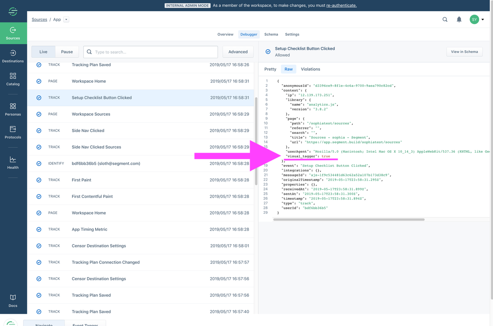
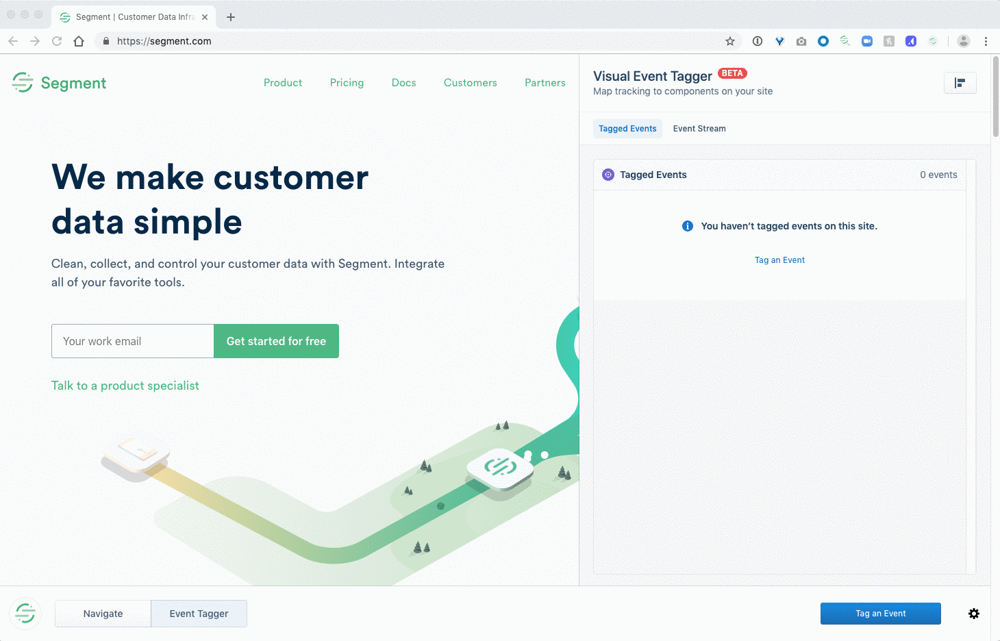
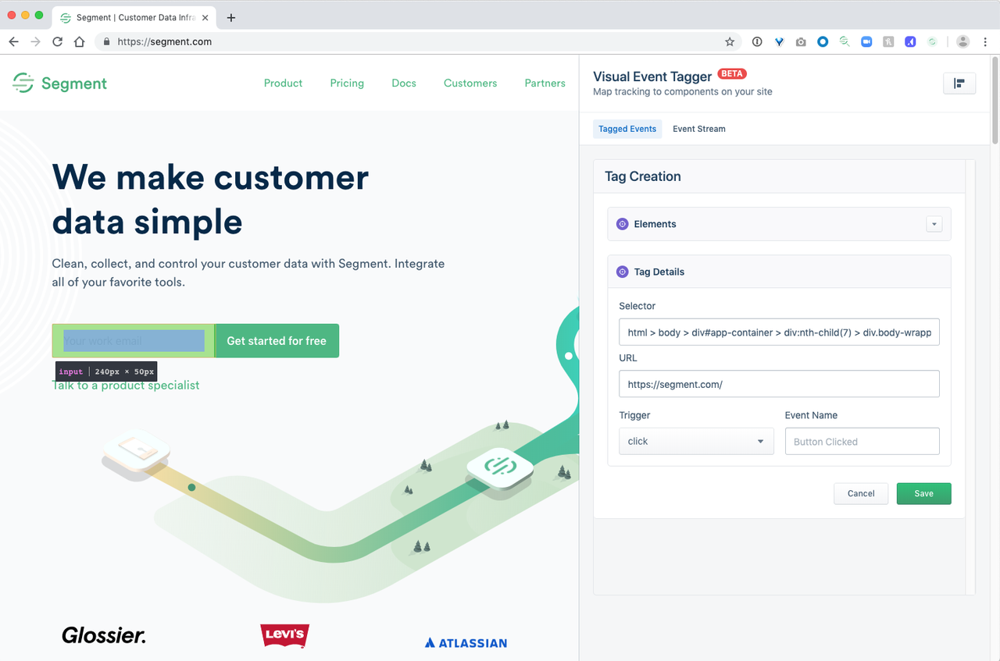
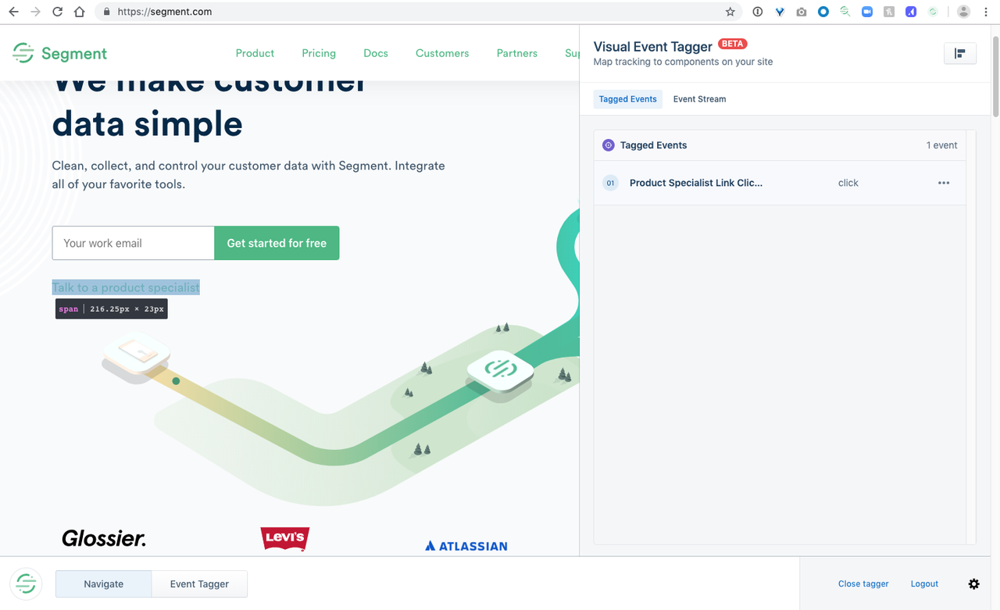

Visual Tagger is currently in **public preview**. Use is governed by [(1) Segment First Access](https://segment.com/docs/legal/first-access-beta-preview/) and Beta Terms and Conditions and [(2) Segment Acceptable Use Policy](https://segment.com/docs/legal/acceptable-use-policy/). If you are interested in using Visual Tagger or if you are currently using Visual Tagger and have feedback for us, please email beta@segment.com.

## What is Visual Tagger?

Visual Tagger is a tool that helps you easily collect data about what your customers are doing on your websites without having to write any code. Specifically, it helps you implement `track` events simply by pointing and clicking on parts of your website.

With Visual Tagger, you can:
- Create **`track` events** to start collecting data on actions that your users take, such as button or link clicks and form submissions. Events that you create using Visual Tagger work exactly the same way as `track` events that you may have implemented in code. You'll be able to send them to any of the integrations in Segment's Catalog.
- Collect rich, contextual information in the form of **properties** to help you understand more about the specific action that the user took.
- **Test your events** to make sure that they are working as expected before you publish them live.

## Setting Up Visual Tagger

### Important Notes For Usage
- If you use the same name for multiple events (whether in code or using Visual Tagger), duplicate events will not get created downstream. Those multiple events will get joined into the same event.
- We currently do not have the ability to alert you if any events that you have created using Visual Tagger begin to fail. 
- Using Visual Tagger won't slow down your website or impact performance in any perceptible way, as long as you add less than 100 events via Visual Tagger.
- If your website uses dynamically generated CSS selectors, Visual Tagger is currently not compatible for use on your website. Reach out to beta@segment.com and let us know if this is the case for you.
- If your website has any iframed components (for example, if you embed Typeforms into your site), Visual Tagger cannot create events for that iframed content. We recommend that you install Segment on the iframed-in site and use Visual Tagger directly on that site.

### Setup Requirements
Here's what you need before you use Visual Tagger:
1. A Segment account and Workspace. You'll need to have either Workspace Owner or Source Admin-level permissions in order to create events using Visual Tagger.
2. A website. Visual Tagger currently works best with simple marketing websites, like landing pages or content sites. There is no support for mobile apps at this time. You will, however, be able to tag the mobile version of your websites using Visual Tagger.
3. A Javascript (Website) Source in Segment. Once you have created your Javascript Source, you'll need to install the analytics.js snippet on your website in order for Visual Tagger to work. If you're having trouble with this step, follow the [Analytics.js Quickstart Guide](/docs/connections/sources/catalog/libraries/website/javascript).
4. Chrome browser. Visual Tagger is only supported for Chrome browser at this time.

### Getting Started
Once you have met the above requirements, you're ready to get started.
1. Go to your Segment Workspace and navigate to the Website Source that you want to use Visual Tagger with. You should see a link to Visual Tagger in the subnavigation of your Source.
2. Click on the Visual Tagger link. You'll see an introductory page where you can learn about Visual Tagger and watch a short video with a brief overview of Visual Tagger.
3. Once you proceed, you will be prompted to do three things: 
   - Consent to the [(1) Segment First Access and Beta Terms and Conditions](https://segment.com/docs/legal/first-access-beta-preview/) and [(2) Segment Acceptable Use Policy](https://segment.com/docs/legal/acceptable-use-policy/). Allow usage of Fullstory on Visual Tagger (To help improve this product, Segment uses Fullstory to record your screen as a video while you are using this product. For Visual Tagger, you will load your website in an iframe in the Segment app, which means that the content of your website will also get recorded. We never share this data outside of Segment.). 
   - Install a Chrome Extension.
   - Enable the Visual Tagger integration.

You are now ready to tag events on your website!

## Creating Events Using Visual Tagger
The Visual Tagger has two main views: the **Event Editor** (iframe) and the **Visual Tagger Home**.

### Step 1: Start Building Your Event
To create events, start in the **Event Editor**, where you will see an iframe where you can load the website that you would like to tag. *Please note that in order to tag events, the website must have the Segment analytics.js snippet already implemented*. 
[image]

You can create three types of events:
1. **Button or Link Clicked**. Selecting this option will allow you to click on any `button` and `link` elements on your page so that you can create an event for whenever a user on your website clicks that button or link. Please note that, depending on how your website is built, some elements that look like buttons might not actually be CSS button elements. In this case, select option 3 (Any Clicked).
2. **Form Submit**. Selecting this option will highlight any `form` elements on your page so that you can select it. As soon as you select it, all of the form fields will get added to your event automatically as **properties**.
3. **Any Clicked**. Selecting this option will allow you to click on any element on your page. This will allow you to create an event for whenever a user on your website clicks on that element. 
[image]

Mousing over your website will highlight elements that can be selected to create an event for. Clicking on a highlighted element will start the process for creating the event. Please note that your events will not be saved unless you publish them.

### Step 2: Add Details To Your Event
Once you click on an element on your website, you'll see a window where you can add details to your event.
1. **Event Name**. Edit the event name to be simple yet descriptive. We recommend following an Object (`Blog Post`) + Action (`Clicked`) format for naming your events. We recommend that you use Proper Case for event names (capitalize the first letter of each word). We recommend that you use snake_case for property names (all lowercase, with spaces between words represented as an underscore “_”). For a guide on event naming best practices, check out our Docs [here](https://segment.com/docs/protocols/data-quality/#formalize-your-naming-and-collection-standards).
2. Properties. Add properties to your event so that you can get more contextual information about the action that the user took. Properties are especially helpful for analyzing your events later.

Advanced:
- You also have the option of manually editing the CSS selector by clicking on the `</>` button.
- If you didn't select the right element, you can reselect by clicking on the finger button. 

### Step 3: Test Your Event(s)

### Step 4: Publish Your Event(s)

### Step 5: Try Out Your Event To Confirm That It Works
Now that you have published your event and waited for ~10 minutes, it's time to make sure that it will fire as expected and that you see your data landing in your Segment Debugger. 

In one window, open up your website where you created the event. In another window (side by side), open the **Segment Debugger** for your Source. The Debugger is a tool provided by Segment that is a livestream of all of the data coming into Segment for that Source. Please note that the Debugger is automatically paused after ~1 minute of idle time, so be sure to refresh the page if you leave it idle for an extended period of time.

On your website, pretend that you are an end-user and try to trigger the event that you created in Visual Tagger, and watch the Debugger to confirm that the event has fired when you take that action. All events created using Visual Tagger automatically get a context property that says `"visual_tagger" : true` so that you can easily distinguish between events that you have implemented using Visual Tagger versus events that you implemented using code.
  

### Step 6: Manage Your Events Or Connect Destinations To Use Your Data

## Other Tips & Features
- 

### Tag Events Using Visual Tagger

4. Click **Tag an Event** and mouse over parts of the site. The mouse highlights components that you can add an event tag to.
5. Click a component to open the **Tag Creation** panel, where you can adjust the event tag's configuration.
   For each event, there are the following configuration options:
   - _Selector_: The CSS selector that the event will be added to. If you are unsure whether or not the right selector has been chosen (or you need to go up a level in the elements tree to a parent element), click on the "Elements" dropdown where you can explore the tree.
   - _URL_: The page that the event should be fired from
   - _Trigger_: What user action should trigger the event. Currently, we support:
     - `click` - when a user clicks on an element
     - `focus` - when a user's mouse enters a form field
     - `blur` - when a user exits a form field that was focused on
     - `submit` - when a user submits a form
   - _Event Name_ What the event should be named. We recommend that you follow the Segment Spec for standard naming conventions.
     
     
6. When you're satisfied with the event details, click **Save** to create the event.
   User interactions with your site start sending events into Segment as soon as you save the event. To test that events are working, refresh the page.
7. Verify that events are appearing as expected by interacting with the element you tagged, and checking the Debugger in your Segment Workspace for the expected event call.
   Events added to your site using the Visual Tagger have a `context` property in the event payload that says `"visual_tagger" : true`. You can use this in the Keywords field to filter the Debugger contents to only show Visual Tagger events.

All events that you create in Visual Tagger appear in the **Tagged Events** panel. Mouse over any existing events to highlight the element that the tag is associated with.
  
  

## Tagging Tips

- You can edit and delete tags as needed by clicking the (…) link at the end of each event row.
- If the tagging panel covers an element that you want to tag, click the button in the upper right to move the panel to the other side.
- You can deactivate the Visual Tagger extension or log out by clicking the gear icon in the lower right corner.

## FAQs

### Does the Visual Tagger impact my site or app's performance?

The Visual Tagger integration has very minimal negative impact to your site's performance, because it installs a single event handler that makes an asynchronous call to Segment when a tag's event is invoked. The integration makes an initial request that takes the same amount of time required to load Analytics.js, and it is cached for subsequent requests.

However, adding a large number of tags to your site could potentially impact your site's performance. To guard against this we limit the number of tags you can add using Visual Tagger to 99 while the Visual Tagger is in alpha.

### How many events can I create with Visual Tagger?

Currently, you can create up to 99 events with the Visual Tagger.

### Are events applicable to specific URLs? Or are we able to match on URL patterns?

Currently, Visual Tagger only supports direct string matching on URLs. More flexibility, including matching on URL patterns, is on our roadmap.

### Does the Chrome extension work with dynamically generated elements or Single Page Applications?

Yes. The Chrome DOM is queried on runtime, so you can track dynamically generated elements like modals (for example) using the Visual Tagger.

### Once the Visual Tagger supports properties, can I grab info from the data layer that's not visually on the page?

In the short term, only information that is visually present on the page will be available for use in the Visual Tagger. We're considering implementing a data layer as part of our roadmap.

### How can I tell which events were created using the Visual Tagger, versus those which were implemented using code?

Events that were added using the Visual Tagger (as opposed to in code) have a `context` property in the event payload that says `"visual_tagger": true`.
Events _not_ implemented using the Visual Tagger do not have this property.

### If I have MFA or SSO enabled on my Segment account, can I login and use Visual Tagger?

Visual Tagger does **not** support accounts that have MFA or SSO enabled to login into the extension. We are planning to add MFA support before the General Availability launch.

### When will the Visual Tagger be Generally Availabile, have standard support and fully stable releases?

General Availability launch is planned for Fall of 2019.

## Alpha Product Terms & Conditions

Segment cannot make commitments around warranties, support, service levels, etc. and will not be liable for any loss of use, lost or inaccurate data or failure of security mechanisms in connection with your use of this or other alpha products, until we release the feature to general availability.

In particular, this means that events instrumented via Visual Tagger may be less reliable and prone to breakage than standard Segment track events instrumented via code.
