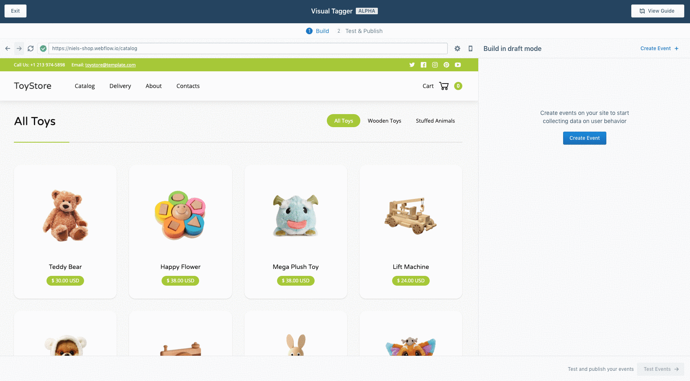
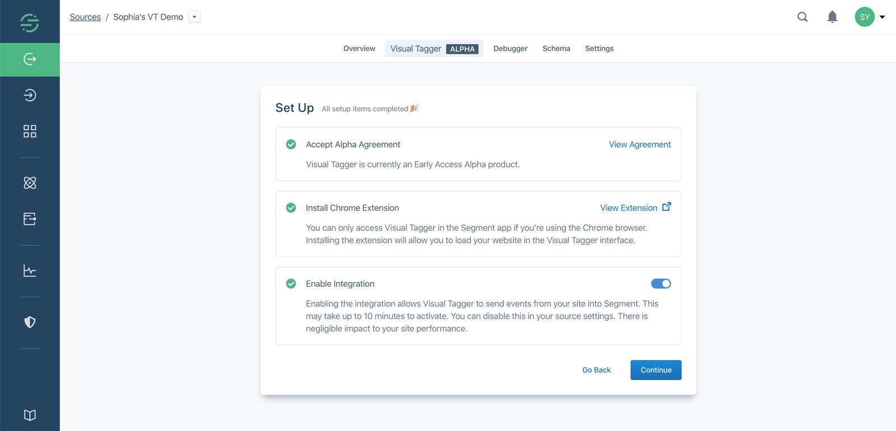
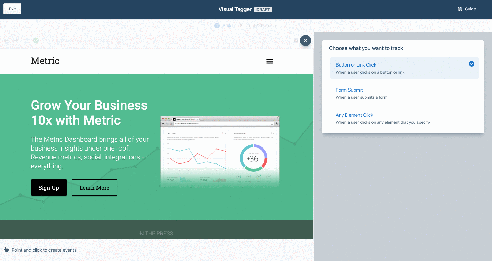
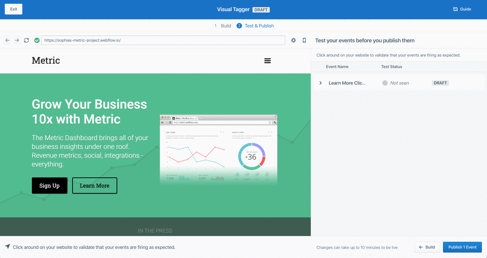

Visual Tagger is currently in **public preview**. Use is governed by [(1) Segment First Access](https://segment.com/docs/legal/first-access-beta-preview/) and Beta Terms and Conditions and [(2) Segment Acceptable Use Policy](https://segment.com/docs/legal/acceptable-use-policy/). If you are interested in using Visual Tagger or if you are currently using Visual Tagger and have feedback for us, please email beta@segment.com.

## What is Visual Tagger?

Visual Tagger is a tool that helps you easily collect data about what your customers are doing on your websites without having to write any code. Specifically, it helps you implement `track` events simply by pointing and clicking on parts of your website.

  

**With Visual Tagger, you can:**
- Create **`track` events** to start collecting data on actions that your users take, such as button or link clicks and form submissions. Events that you create using Visual Tagger work exactly the same way as `track` events that you may have implemented in code. You'll be able to send them to any of the integrations in Segment's Catalog.
- Collect rich, contextual information in the form of **properties** to help you understand more about the specific action that the user took.
- **Test your events** to make sure that they are working as expected before you publish them live.

## Setting Up Visual Tagger

### Setup Requirements

Here's what you need before you can use Visual Tagger:
1. **A Segment account and Workspace**. You'll need to have either Workspace Owner or Source Admin-level permissions in order to create events using Visual Tagger.
2. **A website**. Visual Tagger currently works best with simple marketing websites, like landing pages or content sites. There is no support for mobile apps at this time. You will, however, be able to tag the mobile version of your websites using Visual Tagger.
3. **A [Javascript (Website) Source](docs/connections/sources/catalog/libraries/website/javascript/) in Segment**. Once you have created your Javascript Source, you'll need to install the analytics.js snippet on your website in order for Visual Tagger to work. If you're having trouble with this step, follow the [Analytics.js Quickstart Guide](/docs/connections/sources/catalog/libraries/website/javascript).
4. **Chrome browser**. Visual Tagger is only supported for Chrome browser at this time.

### Getting Started

Once you have met the Setup Requirements, you're ready to get started:
1. Go to your Segment Workspace and navigate to a Website Source.
2. Click on the Visual Tagger link. You'll see an introductory page where you can learn about Visual Tagger and watch a short video with an overview of Visual Tagger.
3. Once you proceed, you will be prompted to do three things: 
   - Consent to the [(1) Segment First Access and Beta Terms and Conditions](https://segment.com/docs/legal/first-access-beta-preview/) and [(2) Segment Acceptable Use Policy](https://segment.com/docs/legal/acceptable-use-policy/) and allow usage of Fullstory on Visual Tagger (To help improve this product, Segment uses Fullstory to record your screen as a video while you are using this product. For Visual Tagger, you will load your website in an iframe in the Segment app, which means that the content of your website will also get recorded. We never share this data outside of Segment.). 
   - Install the Segment Visual Tagger Chrome Extension.
   - Enable the Visual Tagger integration.
   
  
  
You are now ready to tag events on your website!

## Creating Events Using Visual Tagger

The Visual Tagger has two main views: the **Event Editor** (iframe) and the **Visual Tagger Home**.

### Step 1: Start Drafting Your Event

To create events, start in the **Event Editor**, where you will see an iframe where you can load the website that you would like to tag. *Please note that in order to tag events, the website must have the Segment analytics.js snippet already implemented*. 

  

You can create three types of events:
1. **Button or Link Clicked**. Selecting this option will allow you to click on any `button` and `link` elements on your page so that you can create an event for whenever a user on your website clicks that button or link. Please note that, depending on how your website is built, some elements that look like buttons might not actually be CSS button elements. In this case, select option 3 (Any Clicked).
2. **Form Submit**. Selecting this option will highlight any `form` elements on your page so that you can select it. As soon as you select it, all of the form fields will get added to your event automatically as **properties**.
3. **Any Clicked**. Selecting this option will allow you to click on any element on your page. This will allow you to create an event for whenever a user on your website clicks on that element. 

  

Mousing over your website will highlight elements that can be selected to create an event for. Clicking on a highlighted element will start the process for creating the event. Please note that your events will not be saved unless you publish them.

### Step 2: Add Details To Your Event

Once you click on an element on your website, you'll see a window where you can add details to your event.
1. **Event Name**. Edit the event name to be simple yet descriptive. We recommend following an Object (`Blog Post`) + Action (`Clicked`) format for naming your events. We recommend that you use Proper Case for event names (capitalize the first letter of each word). We recommend that you use snake_case for property names (all lowercase, with spaces between words represented as an underscore “_”). For a guide on event naming best practices, check out our Docs [here](https://segment.com/docs/protocols/data-quality/#formalize-your-naming-and-collection-standards).
2. **Properties**. Add properties to your event so that you can get more contextual information about the action that the user took. Properties are optional, but they are especially helpful for analyzing your events later. Please note that some properties get collected by default. Visit our [Docs] (https://segment.com/docs/connections/spec/common/) for full details.
3. **Advanced**. You also have the option of manually editing the CSS selector by clicking on the `</>` button. If you didn't select the right element, you can reselect the element from the page by clicking on the finger button.

You can create multiple events in one go before moving on to the next step.

  

#### Additional Information On Properties

When you use Visual Tagger, you can create **static properties** by entering the value that the property should have. When a property is static, its value will always be the same whenever someone takes that action because you have hardcoded what the value of the property should be.

You can also create **dynamic properties** by selecting a piece of text from your webpage that you want as the value for that property. When a property is dynamic, its value will be different depending on what your user clicked. 

For example, if you run an e-commerce webshop and want to create an event every time someone clicks on a product on your search results page, you would create a `Product Clicked` event.
- In order to specify where the event was fired from, you would want to add a property called `location` to the event. You would hardcode the value of that property to be "Search Results Page". This is an example of a static property.
- In order to indicate which product that a user clicked, you would add a property called `product_name` to the event. You would use the Visual Tagger's "select from page" feature to mouse over your webpage and select the piece of text that says the product name. Depending on what your users click, the value of the `product_name` property would be different.

### Step 3: Test Your Event(s)

After you have completed event details, you can then test your event to confirm that it will work as expected before you publish it live. 

You can test your events by clicking around on your website, taking the actions that would trigger the event. 

- If your event gets fired, then a green checkmark will show up as the Test Status. 
- If your event gets fired but any of the properties that you created for your event are not seen, then the Test Status will display what the issues are.
- If your event does not get fired, then the Test Status will stay grey. 

  

If you’re having trouble validating your events, check out our Troubleshooting tips.

### Step 4: Publish Your Event(s)

Once you are ready, you can publish your events. Events can take up to 10 minutes to be live on your website. Once events are live on your website, when end-users visit your website and interact with the elements that you created events for, events will start flowing into Segment and will show up in your Debugger.

### Step 5: Try Out Your Event To Confirm That It Works

Now that you have published your event and waited for ~10 minutes, it's time to make sure that it will fire as expected and that you see your data landing in your Segment Debugger. 

In one window, open up your website where you created the event. In another window (side by side), open the **Segment Debugger** for your Source. The Debugger is a tool provided by Segment that is a livestream of all of the data coming into Segment for that Source. Please note that the Debugger is automatically paused after ~1 minute of idle time, so be sure to refresh the page if you leave it idle for an extended period of time.

On your website, pretend that you are an end-user and try to trigger the event that you created in Visual Tagger, and watch the Debugger to confirm that the event has fired when you take that action. All events created using Visual Tagger automatically get a context property that says `"visual_tagger" : true` so that you can easily distinguish between events that you have implemented using Visual Tagger versus events that you implemented using code.

  

### Step 6: Manage Your Events

Once you publish your events, you’ll see them in the **All Published Events** table, located on the **Visual Tagger Home** view. From here, you can create new events and edit or delete existing ones.

  

## Troubleshooting Your Events

If your events are not working as expected, try the following steps to troubleshoot the issue.

- If you use the same name for multiple events (whether in code or using Visual Tagger), duplicate events will not get created downstream. Those multiple events will get joined into the same event.
- We currently do not have the ability to alert you if any events that you have created using Visual Tagger begin to fail. 
- Using Visual Tagger won't slow down your website or impact performance in any perceptible way, as long as you add less than 100 events via Visual Tagger.
- If your website uses dynamically generated CSS selectors, Visual Tagger is currently not compatible for use on your website. Reach out to beta@segment.com and let us know if this is the case for you.
- If your website has any iframed components (for example, if you embed Typeforms into your site), Visual Tagger cannot create events for that iframed content. We recommend that you install Segment on the iframed-in site and use Visual Tagger directly on that site.

## FAQs

//### How does Visual Tagger work?
//TODO

### Does the Visual Tagger impact my site or app's performance?

The Visual Tagger integration has negligible impact to your site's performance, because it installs a single event handler that makes an asynchronous call to Segment when a tag's event is invoked.

However, adding a large number of tags to your site could potentially impact your site's performance. To guard against this we limit the number of tags you can add using Visual Tagger to a maximum of 99.

//### Are events applicable to specific URLs? Or are we able to match on URL patterns?

//Currently, Visual Tagger only supports direct string matching on URLs. More flexibility, including matching on URL patterns, is on our roadmap.

### Does the Visual Tagger work with dynamically generated elements or Single Page Applications?

Yes. You can track dynamically generated elements like modals (for example) using the Visual Tagger.

### Does Visual Tagger have a data layer so that I can make use of data that's not visually on the page?

Currently,  only information that is visually present on the page will be available for use in the Visual Tagger.

### How can I tell which events were created using the Visual Tagger, versus those which were implemented using code?

Events that were added using the Visual Tagger (as opposed to in code) have a `context` property in the event payload that says `"visual_tagger": true`. Events _not_ implemented using the Visual Tagger do not have this property.

### The old version of Visual Tagger didn't have support for MFA or SSO. What about the new version?

Because the new version of Visual Tagger is available in the Segment app, Workspaces that have MFA or SSO enabled are able to access it.

### When will the Visual Tagger be Generally Availabile?

General Availability launch is planned for Spring of 2020.
