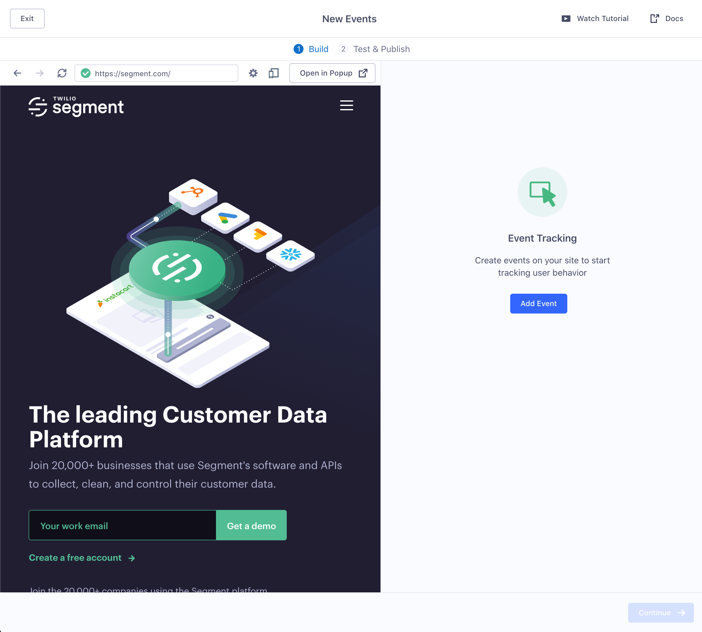
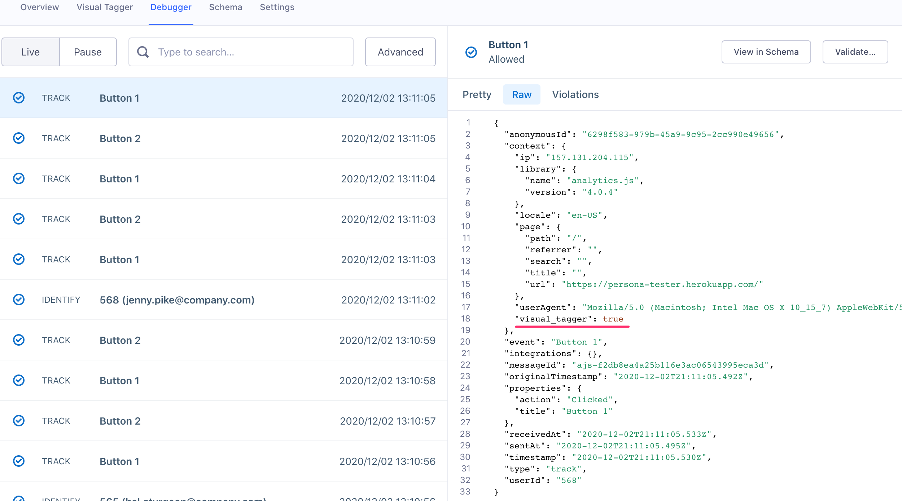
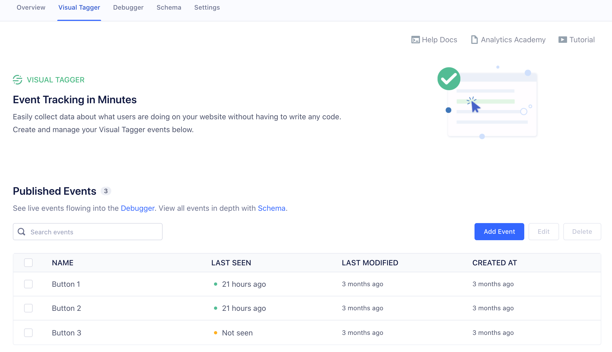

> warning "Visual Tagger entering maintenance mode"
> Visual Tagger is entering maintenance mode on **April 5th, 2021**.
>
> You can continue to use Visual Tagger with sources on which it's already enabled. However, the feature will no longer be available to new Segment customers and existing customers will not be able to add new Visual Tagger sources.
>
> Segment is committed to enabling customers to collect and deliver high quality customer data to the tools they need to run their businesses. As a CSS-based event tracking method, Visual Tagger has limitations that can prevent detailed data from being consistently collected. For code-based collection best practices, see the [Segment Spec](/docs/connections/spec).
>
> Going forward, support for the feature will include:
> - Free, Team, and Startup customers will receive support with issues that impact multiple customers, but will not receive CSS-selector related troubleshooting
> - Business customers will continue to receive full support
>
>
> The following best practices can make your website more compatible with the feature and eliminate common issues:
> - Assign unique IDs to all elements you intend to tag with Visual Tagger
> - Adhere to HTML standards, such as forms inclosed in a `<form>` tag, and submitted with an `<input type="submit">` button.

Visual Tagger is a tool that enables you to collect data about what your customers are doing on your websites without having to write any code. Specifically, it helps you implement `track` events by pointing and clicking on parts of your website.

**With Visual Tagger, you can:**
- Create **`track` events** to start collecting data on actions that your users take, such as button or link clicks and form submissions. Events that you create using Visual Tagger work the same way as `track` events that you may have implemented in code. You'll be able to send them to any of the integrations in Segment's Catalog.
- Collect rich, contextual information in the form of **properties** to help you understand more about the specific action that the user took.
- **Test your events** to make sure that they are working as expected before you publish them live.

The Visual Tagger has two main views: the **Visual Tagger Home** and the **Event Editor**, which shows your website in an iframe.

> note ""
> **Note**: The website you're tagging must include the Segment analytics.js snippet before you can use the Visual Tagger.

## Setting up Visual Tagger

### Before you begin

Get the following things set up before you use Visual Tagger:

1. **A Segment account and Workspace**. You'll need to have either Workspace Owner or Source Admin-level permissions to create events using Visual Tagger.
2. **A website**. Visual Tagger works best with simple marketing websites, like landing pages or content sites. Visual Tagger does not support mobile apps , but you can tag the mobile-web version of your websites.
   > **Note**: Your website must use HTTPS.

3. **A [JavaScript (Website) Source](/docs/connections/sources/catalog/libraries/website/javascript/) in Segment**.
   Once you create a JavaScript Source, you must add the analytics.js snippet to the website for Visual Tagger to work.
   If you're having trouble with this step, follow the [Analytics.js Quickstart Guide](/docs/connections/sources/catalog/libraries/website/javascript/quickstart/).
4. **Chrome browser**. Visual Tagger supports the Chrome browser.

## Enable Visual Tagger

Once you have all the prerequisites set up, you're ready to get started:

1. Go to your Segment Workspace and navigate to your Website Source.
2. Click the **Visual Tagger** tab to go to the Visual Tagger main page.
   You'll see an introduction, where you can learn about Visual Tagger and watch a short overview video.
3. If this is your first time on this page, click **Get Started**.
   Segment checks that you have the Visual Tagger Chrome extension installed and the correct source type. If either of these items is missing, follow the instructions to install the extension, and enable the Visual Tagger. Click **Continue**.
4. Visual Tagger asks for the website type it can recommend events to track. You can also choose `Other` and describe your website, to help Segment prioritize which event types to add next.
5. The next screen shows **Recommended Events**, and you can choose which are relevant to your site. (You can also track any events beyond the recommended!)
6. The UI then loads a page with your website in an internal frame with the option to launch in a popup. Click one of the event type names to select it and begin configuring. For more information about event types and names. see [Step 1](#step-1-choose-the-event-type-and-select-an-element) below.

As you click each event, you're prompted to select the part of the website that should trigger the event, and describe the properties that event should have.

You are now ready to tag events on your website!

> success ""
> **Tip**: If you ever need to get back to this screen, you can navigate to the JavaScript website source again, click the **Visual tagger** tab, then click **Add Event**.

## Step 1: Choose the event type and select an element

To create events, start in the **Event Editor** on the **Build** screen. This page shows an iframe with your website.

You can either choose one of the Recommended Events, or you can click **Add Event** and create a new one. Recommended Events work the same way, except Segment defines the Event Name, and each event comes with a set of default properties.

When you click **Add Event**, three types of events are available:

- **Button or Link Click**. Select any `button` and `link` elements on the page to create events that fire when a user clicks that button or link. Depending on the construction of your website, some elements that look like buttons might not actually be CSS "button" elements - use the "Any Element Click" event instead for these elements.

- **Form Submit**. Select this option to highlight any `form` elements on the page so you can select them. When you choose Form Submit, Segment adds all form fields to your event automatically as **properties**.

- **Any Element Click**. Selecting this option will allow you to click on any element on your page. This will allow you to create an event for whenever a user on your website clicks on that element.

Once you choose an event type, mouse over your website in the iframe to highlight elements that you can select to create an event, and click one to start the process.

If the element on the page has siblings, you can tag them all at the same time, or tag just the one specific element you clicked.

When you choose a Recommended Event, it works much in the same way, but the Event Name is pre-set and each event comes with a set of default properties.

> info ""
> The events you create are not saved until you publish them.

<!-- TODO missing image
-->

## Step 2: Add details to the event

When you click on an element on your website, a window appears where you can enter the details for the event.

1. **Event Name**. Edit the event name to be simple yet descriptive.
   Segment recommends that you use an "Object Action" format (for example, `Blog Post Clicked`, and use Title Case (capitalize the first letter of each word ) when naming events.

2. **Properties**. Add properties to the event to add contextual information about the action that the user took. Properties are optional, but they are very helpful when you analyze events data later.
   - Use `snake_case` for property names (all lowercase, with spaces between words represented as an underscore “_”). For a guide on event naming best practices, check out the Docs [here](/docs/protocols/tracking-plan/best-practices/#formalize-your-naming-and-collection-standards).
   - Check the [list of properties that are collected by default](/docs/connections/spec/common/) before you add a property.

3. **Advanced**. You can also click the `</>` button to manually edit the CSS selector. If you didn't select the right element, you can choose the element on the page again by clicking on the finger button.

Once you're satisfied with the event name and properties, click **Add**.

> success ""
> **Tip**! You can create more than one event before you move on to the next step.

### More information on properties

When you use Visual Tagger, you can create **static properties** by entering the value that the property should have. When a property is static its value is hardcoded, and is always the same regardless of any actions from the user.

You can also create **dynamic properties** by selecting a piece of text from the website that you want as the value for that property. When a property is dynamic, its value is different depending on what the user clicked.

For example, if you run an e-commerce web shop and want to create an event that fires every time a user clicks on a product on your search results page, you would create a `Product Clicked` event.

- To specify where the event was fired from, you would add a property called `location` to the event. You would hardcode the value of that property as "Search Results Page". This is an example of a static property.

- To show which product the user clicked, you can add a property called `product_name` to the event. You can use the Visual Tagger "select from page" feature to select the text on the iframe-version of your website that gives the product name. The value of the `product_name` property would then be different, depending on what users click.

### More information on forms

When you tag a form you can track both that the user _submitted_ the form, and also update traits about the user.

This is useful if the form collects information about the user (such as Name, Email, Country). (This wouldn't be useful on a Search or Add To Cart form.)

This is an illustration of how traits and events might appear for a user in a Destination or Personas.

If you enable the Identify Users feature, you can specify which traits to update in the same way as properties for the event.

### More information on URLs

By default, events created using the Visual Tagger only fire on the same URL as the one where you tagged the event. This prevents unexpected events if the same CSS selector exists on other pages of your site.

If you have similar pages with different URLs such as `/products/1` and `/products/2` and you want to same event to fire on both, you can change the **URL Page Targeting** to match `/products` instead of `/products/1` or any page on the entire website.

## Step 3: Test the event(s)

Once you finish filling out the event details, click **Continue** to go to the Test and Publish screen. On this screen you can test your event to confirm that it works as expected before you publish it.

Test your events by clicking around on your website in the iframe, and doing things on the iframe-version of your site that should trigger the event.

- When the event fires, a green icon appears in the Test Status column.
- If the event fires, but does not contain any properties you created, the Test Status lists the errors.
- If the event does not fire, the Test Status remains grey.

If something doesn't look right, click **Back** to return to the Build screen and edit your tags.

If you're having trouble validating your events, see [Troubleshooting Tips](#troubleshooting-your-events).

## Step 4: Publish the event(s)

When you've finished setting up and testing your events, click **Publish**.

Events can take up to 10 minutes appear on your website. Once they are live, events begin sending to Segment when people visit your website and interact with the elements that you created events for. The data from these events appears in the Website Source's Debugger.

## Step 5: Test the event to confirm that it works

After you publish your event and wait for ~10 minutes, do a last test to make sure your tags are working expected and that you see your data landing in your Segment Debugger.

In one window, open up your website where you created the event. In another window (side by side), open the **Segment Debugger** for your JavaScript Source. The Debugger is a Segment tool that shows a live stream of the data coming from that Source.

> info ""
> **Good to know**: The Debugger automatically pauses after ~1 minute of idle time. Refresh the page if you leave and come back to it, and don't see new data.

On your website, pretend that you are an end-user and try to trigger the event that you created in Visual Tagger. Watch the Debugger in the other window to confirm that the event fired when you took that action.

All events created using Visual Tagger automatically get a context property that says `"visual_tagger" : true` so that you can distinguish between events that you implemented using Visual Tagger and events that you implemented using code.

## Managing and editing Visual Tagger events

Once you publish your events, they appear on the **Visual Tagger Home** view in the **All Published Events** table. From here, you can create click **Add Event** to create new events, and edit or delete existing ones.

## Troubleshooting your events

If your events are not working as expected, try the following steps to troubleshoot the issue.

- Ensure that you toggle Visual Tagger integration on. You find it in the Settings for your Source.

- Ensure that your website has analytics.js installed and running. You can confirm this by visiting your website and watching the Segment Debugger. A `page` call should flow into your Debugger whenever someone visits a page on your website if you have implemented analytics.js. Note that if you have an ad blocker enabled when you visit your website, data will not get fired into Segment when you interact with your website.

- Confirm that the CSS selector has not changed in any way since you created the event in the Visual Tagger (for example, a button could change locations or be removed entirely). Because Visual Tagger relies on the CSS selector to tie events to user actions, if the CSS selector changes, the event stops sending. If this happens, edit the event in Visual Tagger and update the CSS selector. Segment does not have a way to alert you when events you created using Visual Tagger begin to fail.

- Because Visual Tagger relies on stable CSS selectors to fire events, it is not compatible with websites that have CSS selectors that are dynamically generated on every page load.

- If your website has any components in iframes (for example, if you embed Typeforms into your site), Visual Tagger cannot create events for those components. Segment recommends that you install analytics.js on the iframed-in site and use Visual Tagger directly on that site.

- If you use the same name for multiple events (whether in code or using Visual Tagger), duplicate events are *not* created downstream. Instead, Segment merges those events into one event.

If your events still don't work as expected, contact [Segment Customer Support](https://segment.com/help/contact/) for help.

## FAQs

### Are there situations where Visual Tagger will not work?

Yes! Visual Tagger relies on CSS selectors, which involves "class names" such as "hero" or "footer". Some web technologies automatically generate these names and change them on a regular basis, which makes the Visual Tagger events stop firing.

Squarespace uses this technique, and you can examine the HTML of your site to see if the "class names" are randomized letters/numbers.

Visual Tagger also does not support embedded elements, such as a YouTube video player or a Hubspot form.

### What do I do if my website does not behave correctly inside the VT iframe?

When you load your website in the Visual tagger iframe, you might see unexpected or incorrect behavior. This is because browsers load websites differently inside an `iframe` than in a regular browser window.
For example, Google Chrome blocks certain types of cookies when a page is loaded inside an iframe, and this can cause problems with authentication or other functions.

Click the **Open in Popup** button (above the top right corner of the iframed website) if you experience unexpected behavior when you load your website in the VT iframe, including issues with the login or authentication, or errors with form submissions. This opens the website in a new browser window (outside of an iframe) which is connected to the Visual Tagger.

> success ""
> **Tip!**: You might want to change the width of both the Visual tagger window and your website window so you can view them side by side for easier tagging.

### How can I make my website ideal for Visual Tagger?

The most stable way for Visual tagger to identify elements is if each one has a unique ID that persists even if the page is reorganized.

### When should I use Visual Tagger instead of a coded instrumentation?

Visual Tagger is a great way to get started with tracking, but over time you might need to augment with coded instrumentation.

These are ideal use cases for Visual Tagger:
- Understanding how users are engaging with your public website. Beyond page tracking, you can learn which CTA's are most popular, collect information from forms, learn when users engage with interactive content like a carousel.

- Similarly for campaign landing pages, that needs to go live with short turnaround, and require tracking forms, CTA, and other interactive content

- Understanding your ecommerce funnel, how users browse and filter products, add them to cart before checking out and completing an order

- Learn more about how users use your product or service, after logging in. Track key semantic events in your product such as Project Created (project management app), Account Upgraded, Listing Favorited (apartment rental site) etc to learn about adoption, engagement, and retention

These are examples of when to augment with coded instrumentation:

#### Depth of instrumentation

- After understanding the basic ecommerce funnel, you might want to go deeper and understand the value of orders, or value of products abandoned in the cart. This requires careful formatting of the price, for each product in the cart, which is not supported by Visual Tagger.
- Similarly if you want to use Google Analytics Ecommerce functionality, some events must have the `order_id` sent as a property which is not supported by Visual Tagger yet.
- Associating events with the logged in user requires that you instrument an identify call in code.

#### Frequency of change

If your website or application changes frequently, you will need to keep track of each change and update Visual Tagger events accordingly. In that situation, it can be beneficial for the engineering team to have the event tracking in code and update at the same time as changing how a feature work.

### Will using Visual Tagger impact my site or app's performance?

The Visual Tagger integration has negligible impact to your site's performance, because it installs a single event handler that makes an asynchronous call to Segment when a tag's event is invoked.

However, adding a large number of tags to your site could potentially impact your site's performance. To guard against this we limit the number of tags you can add using Visual Tagger to a maximum of 50.

### Does Visual Tagger work with dynamically generated elements or Single Page Applications?

Yes. You can track dynamically generated elements like modals (for example) using the Visual Tagger.

### Why does my form submit event not work?

Visual Tagger binds its event listeners to the `document` object. Forms using `stopPropagation` and `stopImmediatePropagation` methods prevent the event from bubbling up, causing Visual Tagger to not execute the handlers for emitting track/identify calls. Remove any `stopPropagation` and `stopImmediatePropagation` method calls from your form handler to allow Visual Tagger to process the event.

### Does Visual Tagger have a data layer so that I can make use of data that's not rendered on the page?

Currently, only information that is visually present on the page is available for use in the Visual Tagger.

### How can I tell which events were created using Visual Tagger versus which were implemented using code?

Events that were added using the Visual Tagger (as opposed to in code) have a `context` property in the event payload that says `"visual_tagger": true`. Events _not_ implemented using the Visual Tagger do not have this property.

### The old version of Visual Tagger didn't have support for MFA or SSO. What about the new version?

Because the new version of Visual Tagger is available in the Segment app, Workspaces that have MFA or SSO enabled are able to access it.
