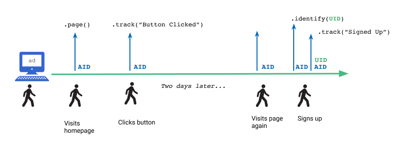
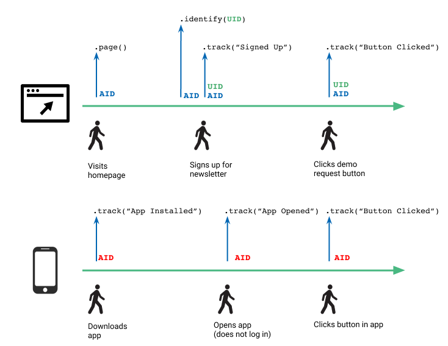

Tracking sign ups correctly is a key step in your marketing funnels. The process of shifting from an anonymous visitor to an identified user requires some special tracking. 


## AnonymousId generation

The Segment libraries generate an `anonymousId` for each user, even before you Identify them.

An `anonymousId` is a randomly generated 36 character string automatically assigned to a user on their first visit to your website or mobile application. You can use the `anonymousId` to link events performed by the user as they navigate around your website. When you track the `anonymousId` , you can attribute activities over multiple days to the same user by collecting all of the activities with that ID. If a user chooses to register for your site, or log in to your app,  you can Identify them, and still include their anonymousId in the event payload along with the new userId.

Only the Segment mobile and website libraries automatically generate an `anonymousId`. If you use Segment’s Server libraries, you must generate an anonymousId manually. It can be any pseudo-unique identifier, for example you might use a `sessionId` from a backend server.

## Identifying users

Segment’s Identify method lets you link a user to their actions and record traits about them. It includes a unique User ID, and records any traits you know about them, such as their email address, name, and so on.

Segment recommends that you use a unique user identifier that won’t change for your `userId`, for example a database ID from your organization’s internal systems. (See below)

When you call [Identify](/docs/connections/spec/identify) using Analytics.js, Segment saves the `userId` to the browser cookie, and writes all the user traits in local storage. If you’re using one of the Segment mobile libraries, the `userId` and and traits are stored in the device’s memory. This makes it possible to append the user’s data to all subsequent [Page calls](/docs/connections/sources/catalog/libraries/website/javascript#page) or [Track calls](/docs/connections/sources/catalog/libraries/website/javascript#track) for the user, so you can properly attribute those actions.

If a user returns to your site after the cookie expires, Analytics.js looks for an old ID in the user’s `localStorage`, and if one is found, sets it as the user’s ID again in a new cookie. If the user clears their cookies *and* `localStorage`, all of the IDs are removed. The user gets a completely new `anonymousId` when they next visit the page.


## Best options for userIds

User IDs are a more permanent and robust identifier, and because these IDs are consistent across a customer’s lifetime, `identify` calls should include a User ID as often as possible.

A User ID should be a static, unique identifier that you recognize a user by in your own systems. Ideally, this could be a database ID. For example, if you’re using MongoDB it might look something like `507f191e810c19729de860ea`. These can also be [UUID](https://en.wikipedia.org/wiki/Universally_unique_identifier)s that you generate somewhere in your application. You can also use identifiers that you get from other tools, such as Shopify or Braze, however this approach can lead to extra complexity in your systems.

Segment does **not** recommend using simple email addresses or usernames as as a User ID, as these can change over time. Segment recommends that you use static IDs instead of simple email addresses or usernames, because database IDs *never* change. When you use a database ID, you can still recognize the user in your analytics tools, even if they change their email address. And even better, you can link your analytics data with your own internal database.

Instead of using an email address or a username as a User ID, send them in the analytics payload as [traits](/docs/connections/spec/identify#traits).

## When to call Identify

You should make an Identify call in the following instances:

- when you create a user (and so it is assigned a userId)
- when a user changes information in their profile
- when a user logs in
- An a 4th optional scenario of calling identify() upon loading any pages that are accessible by a logged in user

## Merging Identified and Anonymous user profiles

The illustration below shows a “timeline” for a user’s interactions with a website, including when sample API call as it relates to identification and anonymousID vs userID.


When the user first visits a page, Analytics.js automatically assigns the user an `anonymousID` and saves it to local storage. As the user interacts with the site, for example clicking around to different pages, Analytics.js includes this anonymousID and some contextual informations on each *.page()* and *.track()* call. The contextual information might be the user’s IP address, browser, and more. (full list [here](/docs/connections/spec/common#context-fields-automatically-collected)).

When a user signs up to create an account on the website, the Identify(UID) and Track(“Signed Up”) events fire, in that order. You pull the UID unique to the user from your systems, and send it to the Segment library so you can label that user’s later events with their ID. The later Track call (“Signed Up”) contains both the UID *and* anonymousID (which is automatically collected) of the user, and any other information you capture about the user -  such as their first name, last name, and email address.

The example below shows an Identify call including user traits.

```js
analytics.identify("97980cfea0067", {
  name: "Peter Gibbons", //user trait
  email: "peter@example.com", //user trait
  plan: "premium" //user trait
});
```

For a Track call, information about this event is stored either in the `context` field or in the event [properties](/docs/connections/spec/track#properties). The example below shows a Track call including properties that tell you about the user.

```js
analytics.track("Signed Up", {
  userId: "97980cfea0067", //event property
  name: "Peter Gibbons", //event property
  email: "peter@example.com", //event property
  plan: "premium" //event property
});
```

Additionally, Analytics.js adds a `message_id` and [four timestamps](/docs/connections/spec/common#timestamp-overview) to the call.

Now, as the user interacts with your site and different buttons or links that you track using Segment, their UID and anonymousID are sent with each API call.

### UserID merge examples

Let’s go through some more scenarios of when an AID is assigned and how it can potentially be merged with a UID.

#### Scenario #1 - Multi-day, single device
If a user clicks on an ad and is direct to a webpage, they are assigned an AID. While this user is anonymous they navigate to different pages and click around on the website. Say they come back two days later from the same device, sign up, and are assigned a UID.





(Caveat: This is assuming that the user has not cleared their localStorage, where the original anonymousId is stored. In this case, the user would be assigned a new AID and a UID, upon their registration to the website, and the old anonymous activity would not be attached to their profile.)

#### Scenario #2 - Multi-day, multi-device, single login

Say the user accesses both the browser and mobile applications. In both cases, they are assigned an anonymousId. These will be different ids. Because in this scenario, the user signs up on the web application and does not log in on the mobile application, Segment will only be able to tie anonymous activity from the web to this particular user. Until the user logs in on mobile, their anonymous activity will remain anonymous.





#### Scenario #3 - Multi-day, multi-device, multiple logins
Similar to the prior scenario, the user has not only accessed your website and mobile application but also logged in on both. Segment will be able to tie the anonymous activity on web and mobile to this user.


## User profiles in warehouses

Your warehouse is schematized for each source you have hooked up to Segment. User information is primarily stored in two tables in your source schemas - the `identifies` and `users` table.

The `identifies` table contains all of your identify events and is timestamped. Every time you make an Identify call, this table is populated with the userId, anonymousId, any updated or added user traits, as well as the timestamp of when the call was made. Your `identifies` table is where you can do all sorts of querying about your users and their traits.

The `users` table is a table with unique identify method calls. It is a roll up of the `identifies` table and is the single source of truth of a user’s most up-to-date traits.

It is important to note that both of these tables only contain information about a user *once they have been identified.* You can still find information about an anonymous user on the pages/screens and tracks tables, as well as the individual track events tables.

## AnonymousId expiration

The anonymous ID is set with a one year expiration. The following are the potential ways an anonymous ID can be reset or overwritten:

- If any call is invoked before you’ve set anonymousId, Segment will set it first automatically.
- If you fetch the anonymousId with analytics.user().anonymousId() (before an anonymousId is set) Segment won’t return null but instead an anonymousId will be set.
- If a user is using multiple devices (they may have different anonymousIds across different devices).
- Calling reset during a user’s browser session resets the id, including anonymousId.
- If a user manually clears their cookies and local storage.
- analytics.identify() is called with a userId that differs from the currently cached userId.
- Re-generating a new anonymousId and passing it from the server-side to the browser.


## Billing, MTUs and identifying users

### How does identifying users affect my billing?

For most billing plans at Segment, MTUs (Monthly Tracked Users) are deduplicated at the end of the month.

### How MTUs are calculated
There are only two things considered when Segment calculates MTUs for billing purposes: [`anonymousID`](/docs/connections/spec/identify#anonymous-id) and [`userID`](/docs/connections/spec/identify#user-id). MTUs (Monthly Tracked Users) are the sum of all of all of the unique userIDs, and all of the unique anonymousIDs that have not been associated with a userID in a calendar month.

### Example in practice

If a user visits your site from multiple devices, they may have multiple anonymousIDs. If you fire an identify() call that associates that user to a userID during the user journey (for example, when they log in), we will deduplicate in your billing so the user is only counted as 1 MTU.

However, there may be scenarios where a user comes into your site with a new anonymousID and never gets identified with a static userID. In this scenario, we will not be able to associate that anonymousID with a known userID that month, and that will be a separate MTU.


<!-- TODO cull
### Example

Let's look at Rdio as an example. When a new visitor goes to their site that visitor is anonymous. As soon as the visitor logs in and connects their Facebook account, Rdio knows who they are and creates a user record.

As part of that new user record the person is assigned a userId. Let's say the new userId is `12345`. Rdio will then need to fire the following calls on the welcome page:

```js
analytics.identify('12345',{  name:'Jake Peterson', email:'jake.peterson@example.com'});
analytics.track('Account Created',{  authentication:'Facebook'})
```

[Identify](https://segment.com/docs/connections/sources/catalog/libraries/server/http/#identify) signals that the user of this browser is user `12345`. And also sets name and email as traits of user `12345`.

[Track](/docs/connections/spec/track) records an event that says `12345` registered for an account using Facebook.

### Advanced

#### Sending user traits from your server

There are some advantages to sending details about your users directly from your server once the become a registered user. Server-side [identify](/docs/connections/spec/identify) calls are invisible to the end user, making it a more secure transaction. Making calls from your server also isolates your tracking away from the wild world of web browsers, which means your tracking becomes much more reliable.

If you want to send user data that is sensitive and which you don't want to expose to the client, then you can make an `identify` call server-side with all the traits.

Let's take the Rdio example from above. If they're going to send traits from their server the client-side sequence on the welcome screen would become:

```js
analytics.identify('12345');
analytics.track('Account Created', { authentication:'Facebook'})
```

So far the user is only identified by their userId. Later, all the user's traits can be filled in using Python (or any of our other server-side [sources](https://segment.com/docs/connections/sources/catalog/libraries/server)).

```js
analytics.identify('12345',{
  'email':'jake.peterson@example.com',
  'name':'Jake Peterson',
  'friends':372,'city':'San Francisco',
  'state':'CA',
  'gender':'Male',
  'age':25,
  'plan':'Free'
})
```

#### Aliasing server-side

If you plan on tracking anonymous visitors from the browser and only calling [identify](/docs/connections/spec/identify)from your servers you'll need to call [alias](/docs/connections/spec/alias) for Kissmetrics and Mixpanel. That call links client-side anonymous visitors with server-side identified users. This isn't recommended, but if you must go down this road, read the [Kissmetrics](/docs/connections/destinations/catalog/kissmetrics/#aliasing-new-users-server-side)and[Mixpanel](/docs/connections/destinations/catalog/mixpanel/#alias-using-cloud-mode) specific [alias](/docs/connections/spec/alias) docs.

### Common questions

There are a few things that might cause your numbers to be off.

#### Missing signups

The most common problem people run into when tracking new user signups client-side is that only a portion of their new users are showing up in reports.

Usually this is caused by the page redirecting or reloading before the tracking calls get the chance to leave the page. That's why we recommend making those calls when the welcome page loads after the new user registers rather than trying to squeeze in the tracking calls on the signup page itself.

#### Anonymous history is lost

This is usually only an issue in [Mixpanel](/docs/connections/destinations/catalog/mixpanel#alias), since it's the only destination that requires a call to [alias](/docs/connections/spec/alias) in the browser to link anonymous browsing history to a new identified user.

Remember that [alias](/docs/connections/spec/alias) must be called before [identify](/docs/connections/spec/identify) is called for that user. Even if you're calling [identify](/docs/connections/spec/identify) server-side, it can't happen before the client-side [alias](/docs/connections/spec/alias).
-->
