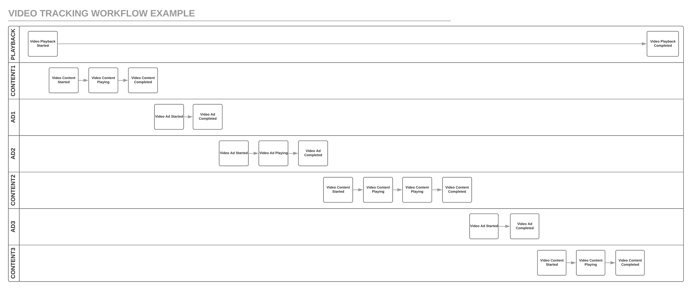

Segment's video spec helps you define how a customer is engaging with your video and ad content. The below documentation covers the naming syntax and conventions for how you should send events when tracking video analytics.

*Note:* not all destinations support video tracking and you should always check with the individual destination documentation to confirm.

## Getting Started

Before you start implementing the Segment video spec, you should understand the overall structure and classification of events. The video spec will be organized into **three** distinct event categories:

- [Playback](#playback)
- [Content](#content)
- [Ads](#ads)

## Playback

You can think of playback events being related to the actual _playback_ of the video content. This means that these events are meant to track information about the video player (ie. pause, resume, play). Thus, you can think of playback events to be at the session level. For example, when a customer presses play on your video, you would start by sending a [Video Playback Started](#video-playback-started) event with a unique `session_id`. In particular, this event should fire after the last user action required for playback to begin.

Then, for the duration of that user's session with that specific video player, all
subsequent events generated from this session/playback should be tied with the same aforementioned `session_id`. So if you had a web page that had two video players, you would have two separate sessions and `session_id`s while contrastingly if you only had one video player on the page but the playback played two video contents in a row, you would only have one session but two contents tied to it.

### Playback Event Object

All playback events share the same event properties that describe information about the current state of the player. Below is a full list of the supported properties of this object.

```js
{
  session_id:       String
  content_asset_id | content_asset_ids:  String | Array<string>
  content_pod_id   | content_pod_ids:    String | Array<string>
  ad_asset_id:      String | Array<string>
  ad_pod_id:        String | Array<string>
  ad_type:          Enum {'pre-roll', 'mid-roll', 'post-roll'}
  position:         Integer
  total_length:     Integer
  bitrate:          Integer
  framerate:        Float
  video_player:     String
  sound:            Integer
  full_screen:      Boolean
  ad_enabled:       Boolean
  quality:          String
  method:           String
  livestream:       Boolean
}
```

#### Session Id: `String`

The unique ID of the overall session used to tie all events generated from a specific playback. This value should be same across all playback, content, and ad events if they are from the same playback session

#### Content Asset Id |  Content Asset Ids: `String | Array[string]`

The Content Asset Id(s) of the video/videos playing or about to be played in the video player. **For [Video Playback Started](#video-playback-started) events only**, you should send the plural form with an Array of unique asset IDs. For all other playback events, you should send the singular form with the ID of the current content asset playing at the time of the event.

#### Content Pod Id |  Content Pod Ids: `String | Array[string]`

The Content Pod Id(s) of the video/videos playing or about to be played in the video player. **For [Video Playback Started](#video-playback-started) events only**, you should send the plural form with an Array of unique pod IDs. For all other playback events, you should send the singular form with the ID of the current content pod playing at the time of the event.

#### Ad Asset ID: `String | Array[string]`

The Ad Asset Id(s) of the ad/ads playing or about to be played in the video player. **For [Video Playback Started](#video-playback-started) events only**, you should send an Array of unique ad asset IDs. For all other playback events, you should send a string with the ID of the current ad asset playing at the time of the event.

#### Ad Pod ID: `String | Array[string]`

The Ad Pod Id(s) of the ad/ads playing or about to be played in the video player. **For [Video Playback Started](#video-playback-started) events only**, you should send an Array of unique ad pod IDs. For all other playback events, you should send a string with the ID of the current ad pod playing at the time of the event.

#### Ad Type: `Enum {'pre-roll' | 'mid-roll' | 'post-roll'}`

The type of ad playing at the time of the event. Values can include 'pre-roll', 'mid-roll', and 'post-roll'.

#### Position: `Integer`

The current index position **in seconds** of the playhead, including the duration of any ads seen (if available). If the playback is a livestream, check the documentation for relevant destinations for details on how to correctly pass the playhead position.

#### Seek Position: `Integer`

The index position **in seconds** of the playhead where the user is seeking to. Only needed on Video Playback Seek Started events, since on Video Playback Seek Completed, the `seek_position` should be the `position`.

#### Total Length: `Integer`

The total duration of the playback in seconds. This should include the duration of all your content and ad included in this playback session. For livestream playback, send `null`.

#### Bitrate: `Integer`
The current `kbps`.

#### Framerate: `Float`
The average `fps`.

#### Video Player: `String`
The name of the video player (for example `youtube`, `vimeo`).

#### Sound `Integer`
The sound level of the playback represented in a 0 to 100 scale where 0 is muted and 100 is full volume.

#### Full Screen: `Boolean`
`true` if playback is currently in full screen mode and `false` otherwise.

#### Ad Enabled: `Boolean`
`false` if the user has adblock or any other ad blockers, `true` otherwise if they can view your video ads.

#### Quality: `String`
The quality of the video, ie. 'highres', 'hd1080', '480p'.

#### Method: `String`
**For Video Playback Interrupted events only**, you can send this property denoting how the playback was interrupted (ie. 'browser redirect', 'device lock', 'call').

#### Livestream: `Boolean`
If the playback will be a livetream, send `true`, otherwise `false`.

### Playback Events
Below is the full list of Video Playback Events.

#### Video Playback Started
When a user presses Play; after the last user action required for playback to begin (eg, after user login/authentication).
 api-example '{
    "action": "track",
    "event": "Video Playback Started",
    "userId": "userId",
    "properties": {
      "session_id": "12345",
      "content_asset_ids": ["0129370"],
      "content_pod_ids": ["segA", "segB"],
      "ad_asset_id": ["ad123", "ad097"],
      "ad_pod_id": ["adSegA", "adSegB"],
      "ad_type": ["mid-roll", "post-roll"],
      "position": 0,
      "total_length": 392,
      "bitrate": 100,
      "framerate": 29.00,
      "video_player": "youtube",
      "sound": 88,
      "full_screen": false,
      "ad_enabled": true,
      "quality": "hd1080",
      "livestream": false
    }
}'}}} 

```js
{
    "action": "track",
    "event": "Video Playback Started",
    "userId": "userId",
    "properties": {
      "session_id": "12345",
      "content_asset_ids": ["0129370"],
      "content_pod_ids": ["segA", "segB"],
      "ad_asset_id": ["ad123", "ad097"],
      "ad_pod_id": ["adSegA", "adSegB"],
      "ad_type": ["mid-roll", "post-roll"],
      "position": 0,
      "total_length": 392,
      "bitrate": 100,
      "framerate": 29.00,
      "video_player": "youtube",
      "sound": 88,
      "full_screen": false,
      "ad_enabled": true,
      "quality": "hd1080",
      "livestream": false
    }
}
```

#### Video Playback Paused
When a user presses Pause.
 api-example '{
    "action": "track",
    "event": "Video Playback Paused",
    "userId": "userId",
    "properties": {
      "session_id": "12345",
      "content_asset_id": "0129370",
      "content_pod_id": "segA",
      "position": 278,
      "total_length": 392,
      "bitrate": 100,
      "framerate": 29.00,
      "video_player": "youtube",
      "sound": 55,
      "full_screen": false,
      "ad_enabled": false,
      "quality": "hd1080",
      "livestream": false
    }
}'}}} 

```js
{
    "action": "track",
    "event": "Video Playback Paused",
    "userId": "userId",
    "properties": {
      "session_id": "12345",
      "content_asset_id": "0129370",
      "content_pod_id": "segA",
      "position": 278,
      "total_length": 392,
      "bitrate": 100,
      "framerate": 29.00,
      "video_player": "youtube",
      "sound": 55,
      "full_screen": false,
      "ad_enabled": false,
      "quality": "hd1080",
      "livestream": false
    }
}
```

#### Video Playback Interrupted
When the playback stops unintentionally (ie. network loss, browser close/redirect, app crash). With this event you can pass `method` as a property to denote the cause of the interruption.

 api-example '{
    "action": "track",
    "event": "Video Playback Interrupted",
    "userId": "userId",
    "properties": {
      "session_id": "12345",
      "content_asset_id": "0129370",
      "content_pod_id": "segA",
      "position": 278,
      "total_length": 392,
      "bitrate": 100,
      "framerate": 29.00,
      "video_player": "youtube",
      "sound": 55,
      "full_screen": false,
      "ad_enabled": false,
      "quality": "hd1080",
      "livestream": false,
      "method": "network loss"
    }
}'}}} 

```js
{
    "action": "track",
    "event": "Video Playback Interrupted",
    "userId": "userId",
    "properties": {
      "session_id": "12345",
      "content_asset_id": "0129370",
      "content_pod_id": "segA",
      "position": 278,
      "total_length": 392,
      "bitrate": 100,
      "framerate": 29.00,
      "video_player": "youtube",
      "sound": 55,
      "full_screen": false,
      "ad_enabled": false,
      "quality": "hd1080",
      "livestream": false,
      "method": "network loss"
    }
}
```

#### Video Playback Buffer Started
When playback starts buffering content or an ad.
 api-example '{
    "action": "track",
    "event": "Video Playback Buffer Started",
    "userId": "userId",
    "properties": {
      "session_id": "12345",
      "content_asset_id": "0129370",
      "content_pod_id": "segA",
      "position": 278,
      "total_length": 392,
      "bitrate": 100,
      "framerate": 29.00,
      "video_player": "youtube",
      "sound": 55,
      "full_screen": false,
      "ad_enabled": false,
      "quality": "hd1080",
      "livestream": false
    }
}'}}} 

```js
{
    "action": "track",
    "event": "Video Playback Buffer Started",
    "userId": "userId",
    "properties": {
      "session_id": "12345",
      "content_asset_id": "0129370",
      "content_pod_id": "segA",
      "position": 278,
      "total_length": 392,
      "bitrate": 100,
      "framerate": 29.00,
      "video_player": "youtube",
      "sound": 55,
      "full_screen": false,
      "ad_enabled": false,
      "quality": "hd1080",
      "livestream": false
    }
}
```

#### Video Playback Buffer Completed
When playback finishes buffering content or an ad.
 api-example '{
    "action": "track",
    "event": "Video Playback Buffer Completed",
    "userId": "userId",
    "properties": {
      "session_id": "12345",
      "content_asset_id": "0129370",
      "content_pod_id": "segA",
      "position": 278,
      "total_length": 392,
      "bitrate": 100,
      "framerate": 29.00,
      "video_player": "youtube",
      "sound": 55,
      "full_screen": false,
      "ad_enabled": false,
      "quality": "hd1080",
      "livestream": false
    }
}'}}} 

```js
{
    "action": "track",
    "event": "Video Playback Buffer Completed",
    "userId": "userId",
    "properties": {
      "session_id": "12345",
      "content_asset_id": "0129370",
      "content_pod_id": "segA",
      "position": 278,
      "total_length": 392,
      "bitrate": 100,
      "framerate": 29.00,
      "video_player": "youtube",
      "sound": 55,
      "full_screen": false,
      "ad_enabled": false,
      "quality": "hd1080",
      "livestream": false
    }
}
```

#### Video Playback Seek Started
When a user manually seeks a certain position of the content or ad in the playback. Pass in the `seek_position` to denote where the user is seeking to, and pass in the `position` property to denote where the user is seeking from.
 api-example '{
    "action": "track",
    "event": "Video Playback Seek Started",
    "userId": "userId",
    "properties": {
      "session_id": "12345",
      "content_asset_id": "0129370",
      "content_pod_id": "segA",
      "position": 278,
      "seek_position": 320,
      "total_length": 392,
      "bitrate": 100,
      "framerate": 29.00,
      "video_player": "youtube",
      "sound": 55,
      "full_screen": false,
      "ad_enabled": false,
      "quality": "hd1080",
      "livestream": false
    }
}'}}} 

```js
{
    "action": "track",
    "event": "Video Playback Seek Started",
    "userId": "userId",
    "properties": {
      "session_id": "12345",
      "content_asset_id": "0129370",
      "content_pod_id": "segA",
      "position": 278,
      "seek_position": 320,
      "total_length": 392,
      "bitrate": 100,
      "framerate": 29.00,
      "video_player": "youtube",
      "sound": 55,
      "full_screen": false,
      "ad_enabled": false,
      "quality": "hd1080",
      "livestream": false
    }
}
```

#### Video Playback Seek Completed
After a user manually seeks to a certain position of the content or ad in the playback. Pass in the `position` property to denote where the user desires to begin the playback from.
 api-example '{
    "action": "track",
    "event": "Video Playback Seek Completed",
    "userId": "userId",
    "properties": {
      "session_id": "12345",
      "content_asset_id": "0129370",
      "content_pod_id": "segA",
      "position": 320,
      "total_length": 392,
      "bitrate": 100,
      "framerate": 29.00,
      "video_player": "youtube",
      "sound": 55,
      "full_screen": false,
      "ad_enabled": false,
      "quality": "hd1080",
      "livestream": false
    }
}'}}} 

```js
{
    "action": "track",
    "event": "Video Playback Seek Completed",
    "userId": "userId",
    "properties": {
      "session_id": "12345",
      "content_asset_id": "0129370",
      "content_pod_id": "segA",
      "position": 320,
      "total_length": 392,
      "bitrate": 100,
      "framerate": 29.00,
      "video_player": "youtube",
      "sound": 55,
      "full_screen": false,
      "ad_enabled": false,
      "quality": "hd1080",
      "livestream": false
    }
}
```

#### Video Playback Resumed
When playback is resumed, by the user, after being paused.
 api-example '{
    "action": "track",
    "event": "Video Playback Resumed",
    "userId": "userId",
    "properties": {
      "session_id": "12345",
      "content_asset_id": "0129370",
      "content_pod_id": "segA",
      "position": 278,
      "total_length": 392,
      "bitrate": 100,
      "framerate": 29.00,
      "video_player": "youtube",
      "sound": 55,
      "full_screen": false,
      "ad_enabled": false,
      "quality": "hd1080",
      "livestream": false
    }
}'}}} 

```js
{
    "action": "track",
    "event": "Video Playback Resumed",
    "userId": "userId",
    "properties": {
      "session_id": "12345",
      "content_asset_id": "0129370",
      "content_pod_id": "segA",
      "position": 278,
      "total_length": 392,
      "bitrate": 100,
      "framerate": 29.00,
      "video_player": "youtube",
      "sound": 55,
      "full_screen": false,
      "ad_enabled": false,
      "quality": "hd1080",
      "livestream": false
    }
}
```

#### Video Playback Completed
When playback is complete and only when the session is finished.
 api-example '{
    "action": "track",
    "event": "Video Playback Completed",
    "userId": "userId",
    "properties": {
      "session_id": "12345",
      "content_asset_id": "0129370",
      "content_pod_id": "segA",
      "position": 392,
      "total_length": 392,
      "bitrate": 100,
      "framerate": 29.00,
      "video_player": "youtube",
      "sound": 55,
      "full_screen": false,
      "ad_enabled": false,
      "quality": "hd1080",
      "livestream": false
    }
}'}}} 

```js
{
    "action": "track",
    "event": "Video Playback Completed",
    "userId": "userId",
    "properties": {
      "session_id": "12345",
      "content_asset_id": "0129370",
      "content_pod_id": "segA",
      "position": 392,
      "total_length": 392,
      "bitrate": 100,
      "framerate": 29.00,
      "video_player": "youtube",
      "sound": 55,
      "full_screen": false,
      "ad_enabled": false,
      "quality": "hd1080",
      "livestream": false
    }
}
```

#### Video Playback Exited
When user navigates away from a playback/stream.
 api-example '{
    "action": "track",
    "event": "Video Playback Exited",
    "userId": "userId",
    "properties": {
      "session_id": "12345",
      "content_asset_id": "0129370",
      "content_pod_id": "segA",
      "position": 392,
      "total_length": 392,
      "bitrate": 100,
      "framerate": 29.00,
      "video_player": "youtube",
      "sound": 55,
      "full_screen": false,
      "ad_enabled": false,
      "quality": "hd1080",
      "livestream": false
    }
}'}}} 

```js
{
    "action": "track",
    "event": "Video Playback Exited",
    "userId": "userId",
    "properties": {
      "session_id": "12345",
      "content_asset_id": "0129370",
      "content_pod_id": "segA",
      "position": 392,
      "total_length": 392,
      "bitrate": 100,
      "framerate": 29.00,
      "video_player": "youtube",
      "sound": 55,
      "full_screen": false,
      "ad_enabled": false,
      "quality": "hd1080",
      "livestream": false
    }
}
```

---

## Content

Underneath the playback level, we now have the **pod** level. A pod can be seen as a "group" or "segment" of either the content or advertisement.

Consider, for example, a playback session that might have some content and one mid-roll advertisement. This would mean that you would have two _content_ pods (since the mid-roll ad split the content playback into two sections) while you might have one ad pod for the mid-roll ad. In this instance, you'd start and complete the first pod of content; you'd start and complete the ad; you'd start and complete the second pod of content. All of this would happen within one playback start.

### Content Event Object
All content events share the same event properties that describe information about the current video content the user is interacting with. Below is a full list of the supported properties of this object.

```js
{
  session_id:   String
  asset_id:     String
  pod_id:       String
  title:        String
  description:  String
  keywords:     Array[string]
  season:       String
  episode:      String
  genre:        String
  program:      String
  publisher:    String
  position:     Integer
  total_length: Integer
  channel:      String
  full_episode: Boolean
  livestream:   Boolean
  airdate:      ISO 8601 Date String
  position:     Integer
  total_length: Integer
  bitrate:      Integer
  framerate:    Float
}
```

#### Session Id: `String`
The unique ID of the overall session used to tie all events generated from a specific playback. This value should be same across all playback, content, and ad events if they are from the same playback session.

#### Asset Id: `String`
The unique ID of the content asset.

#### Pod Id: `String`
The unique ID of the content pod.

#### Title: `String`
The title of the video content.

#### Description: `String`
Short description of the video content.

#### Keywords: `Array[string]`
An array of arbitrary keywords or tags that describe or categorize the video content.

#### Season: `String`
The season number if applicable.

#### Episode: `String`
The episode number if applicable.

#### Genre: `String`
The genre of the content, ie. 'comedy', 'action'.

#### Program: `String`
The name of the program, show, etc. of the content if applicable.

#### Publisher: `String`
The content creator, author, producer, or publisher.

#### Channel: `String`
The channel in which the video content is playing, ie. 'espn', 'my blog'.

#### Full Episode: `Boolean`
`true` if content is a full episode and `false` otherwise.

#### Airdate: `ISO 8601 Date String`
An [ISO 8601 Date String](https://en.wikipedia.org/wiki/ISO_8601) representing the original air date or published date.

#### Position: `Integer`
The current index position **in seconds** of the playhead into the content/asset. This position must exclude the duration of any ads played.

If the playback is a livestream, check the documentation for relevant destinations for details on how to correctly pass the playhead position.

#### Total Length: `Integer`
The total duration of the content/asset in seconds. This should exclude the duration of any ads included in the playback of this asset. For livestream playback, send `null`.

#### Bitrate: `Integer`
The current `kbps`.

#### Framerate: `Float`
The average `fps`.

### Content Events
Below is the full list of Video Content Events.

#### Video Content Started
When a video content segment starts playing within a playback.
 api-example '{
    "action": "track",
    "event": "Video Content Started",
    "userId": "userId",
    "properties": {
      "session_id": "12345",
      "asset_id": "0129370",
      "pod_id": "segA",
      "program": "Planet Earth",
      "title": "Seasonal Forests",
      "description": "David Attenborough reveals the greatest woodlands on earth.",
      "season": "1",
      "position": 0,
      "total_length": 3600,
      "genre": "Documentary",
      "publisher": "BBC",
      "full_episode": true,
      "keywords": ["nature", "forests", "earth"]
    }
}'}}} 

```js
{
    "action": "track",
    "event": "Video Content Started",
    "userId": "userId",
    "properties": {
      "session_id": "12345",
      "asset_id": "0129370",
      "pod_id": "segA",
      "program": "Planet Earth",
      "title": "Seasonal Forests",
      "description": "David Attenborough reveals the greatest woodlands on earth.",
      "season": "1",
      "position": 0,
      "total_length": 3600,
      "genre": "Documentary",
      "publisher": "BBC",
      "full_episode": true,
      "keywords": ["nature", "forests", "earth"]
    }
}
```

#### Video Content Playing
Heartbeats that you can fire every n seconds to track how far into the content the user is currently viewing as indicated by the `position`.
 api-example '{
    "action": "track",
    "event": "Video Content Playing",
    "userId": "userId",
    "properties": {
      "session_id": "12345",
      "asset_id": "0129370",
      "pod_id": "segA",
      "program": "Planet Earth",
      "title": "Seasonal Forests",
      "description": "David Attenborough reveals the greatest woodlands on earth.",
      "season": "1",
      "position": 10,
      "total_length": 3600,
      "genre": "Documentary",
      "publisher": "BBC",
      "full_episode": true,
      "keywords": ["nature", "forests", "earth"]
    }
}'}}} 

```js
{
    "action": "track",
    "event": "Video Content Playing",
    "userId": "userId",
    "properties": {
      "session_id": "12345",
      "asset_id": "0129370",
      "pod_id": "segA",
      "program": "Planet Earth",
      "title": "Seasonal Forests",
      "description": "David Attenborough reveals the greatest woodlands on earth.",
      "season": "1",
      "position": 10,
      "total_length": 3600,
      "genre": "Documentary",
      "publisher": "BBC",
      "full_episode": true,
      "keywords": ["nature", "forests", "earth"]
    }
}
```

#### Video Content Completed
When a video content segment completes playing within a playback. That is, `position` and `total_length` are equal.
 api-example '{
    "action": "track",
    "event": "Video Content Completed",
    "userId": "userId",
    "properties": {
      "session_id": "12345",
      "asset_id": "0129370",
      "pod_id": "segA",
      "program": "Planet Earth",
      "title": "Seasonal Forests",
      "description": "David Attenborough reveals the greatest woodlands on earth.",
      "season": "1",
      "position": 3600,
      "total_length": 3600,
      "genre": "Documentary",
      "publisher": "BBC",
      "full_episode": true,
      "keywords": ["nature", "forests", "earth"]
    }
}'}}} 

```js
{
    "action": "track",
    "event": "Video Content Completed",
    "userId": "userId",
    "properties": {
      "session_id": "12345",
      "asset_id": "0129370",
      "pod_id": "segA",
      "program": "Planet Earth",
      "title": "Seasonal Forests",
      "description": "David Attenborough reveals the greatest woodlands on earth.",
      "season": "1",
      "position": 3600,
      "total_length": 3600,
      "genre": "Documentary",
      "publisher": "BBC",
      "full_episode": true,
      "keywords": ["nature", "forests", "earth"]
    }
}
```


## Ads

Just like Content events, Ad Events also live underneath the playback level and at the pod level. A given ad pod can have multiple ad assets (or just one) and a playback session might have multiple ad pods. For example, if your video playback has two pre-roll, one mid-roll, and one post-roll ads, you would have three ad pods:

- ad pod 1: plays the two pre-roll ads
- ad pod 2: plays the one mid-roll ad
- ad pod 3: plays the one post-roll ad

### Ad Event Object
All ad events share the same event properties that describe information about the current ad content the user is interacting with. Below is a full list of the supported properties of this object.

```js
  session_id:   String
  asset_id:     String
  pod_id:       String
  pod_position: Integer
  pod_length:   Integer
  type:         Enum {'pre-roll', 'mid-roll', 'post-roll'}
  title:        String,
  publisher:    String,
  position:     Integer,
  total_length: Integer,
  load_type:    Enum {'linear' | 'dynamic'}
  content:      Object[ContentEventObject]
  quartile:     Integer
```

#### <a name="ad-event-object-session-id"></a> Session Id: `String`
The unique ID of the overall session used to tie all events generated from a specific playback. This value should be same across all playback, content, and ad events if they are from the same playback session.

#### Asset Id: `String`
The unique ID of the ad asset.

#### Pod Id: `String`
The unique ID of the ad pod.

#### Pod Position: `Integer`
The position of the ad asset relative to other assets in the same pod.

#### Pod Length: `Integer`
The number of ad assets the current ad pod contains.

#### Title: `String`
The title of the video ad.

#### Type: `Enum {'pre-roll' | 'mid-roll' | 'post-roll'}`
The ad type. You can send either 'pre-roll', 'mid-roll', or 'post-roll

#### Publisher: `String`
The ad creator, author, producer, or publisher.

#### Load Type: `Enum {'linear' | 'dynamic'}`
`dynamic` if ads are loaded dynamically and `linear` if ads are same for all users.

#### Position: `Integer`
The current index position in seconds of the playhead with respect to the length of the ad.

#### Total Length: `Integer`
The total duration of the current ad asset in seconds.

#### Content: `Object[ContentEventObject]`
For video destinations that require content metadata to be sent with ad events, you can send all the content metadata nested under this property (ie. `content.asset_id`, `content.title`) as a Content Event Object.

#### Quartile: `Integer`
For Video Ad Playing events, this property can be set to indicate when a specific ad quartile has been reached (1,2, or 3). If you are using a Segment client-side library to track your video events you do not need to send this property as our libraries will automatically track quartiles.

**Note:** Since some video destinations require sending Content metadata along with Ad metadata, you may need to send your content properties also in all your ad events under `properties.content` depending on the video destination you are using.

### Ad Events

#### Video Ad Started

 api-example '{
    "action": "track",
    "event": "Video Ad Started",
    "userId": "userId",
    "properties": {
      "session_id": "12345",
      "asset_id": "0129370",
      "pod_id": "segA",
      "type": "pre-roll",
      "title": "The New New Thing!",
      "position": 0,
      "total_length": 30,
      "publisher": "Apple",
      "load_type": "dynamic"
    }
}'}}} 

```js
{
    "action": "track",
    "event": "Video Ad Started",
    "userId": "userId",
    "properties": {
      "session_id": "12345",
      "asset_id": "0129370",
      "pod_id": "segA",
      "type": "pre-roll",
      "title": "The New New Thing!",
      "position": 0,
      "total_length": 30,
      "publisher": "Apple",
      "load_type": "dynamic"
    }
}
```

#### Video Ad Playing

 api-example '{
    "action": "track",
    "event": "Video Ad Playing",
    "userId": "userId",
    "properties": {
      "session_id": "12345",
      "asset_id": "0129370",
      "pod_id": "segA",
      "type": "pre-roll",
      "title": "The New New Thing!",
      "position": 5,
      "total_length": 30,
      "publisher": "Apple",
      "load_type": "dynamic"
    }
}'}}} 

```js
{
    "action": "track",
    "event": "Video Ad Playing",
    "userId": "userId",
    "properties": {
      "session_id": "12345",
      "asset_id": "0129370",
      "pod_id": "segA",
      "type": "pre-roll",
      "title": "The New New Thing!",
      "position": 5,
      "total_length": 30,
      "publisher": "Apple",
      "load_type": "dynamic"
    }
}
```

#### Video Ad Completed

 api-example '{
    "action": "track",
    "event": "Video Ad Completed",
    "userId": "userId",
    "properties": {
      "session_id": "12345",
      "asset_id": "0129370",
      "pod_id": "segA",
      "type": "pre-roll",
      "title": "The New New Thing!",
      "position": 30,
      "total_length": 30,
      "publisher": "Apple",
      "load_type": "dynamic"
    }
}'}}} 

```js
{
  "action": "track",
  "event": "Video Ad Completed",
  "userId": "userId",
  "properties": {
    "session_id": "12345",
    "asset_id": "0129370",
    "pod_id": "segA",
    "type": "pre-roll",
    "title": "The New New Thing!",
    "position": 30,
    "total_length": 30,
    "publisher": "Apple",
    "load_type": "dynamic"
  }
}
```

## Resuming Playback

When you fire a [Video Playback Resumed](#video-playback-resumed) event, you *should* immediately call a Segment heartbeat event ([Video Content Playing](#video-content-playing) or [Video Ad Playing](#video-ad-playing) depending on what the playback resumed to). This should effectively mean that you are also resuming your 10 second heartbeats (since they should've been paused after sending Video Playback Paused event).

## Video Quality Event

It's important to analyze the performance of your video content. To keep track of quality changes, you can track a `Video Quality Updated` event when there is a change in video quality with the following properties:

<table>
 <tr>
   <td>`bitrate`</td>
 </tr>
 <tr>
  <td>`framerate`</td>
 </tr>
 <tr>
   <td>`startupTime`</td>
 </tr>
 <tr>
   <td>`droppedFrames`</td>
 </tr>
</table>

## Example Event Lifecycle

Below is an example of how one might implement the video spec:

1) User presses play on a video:

```js
analytics.track('Video Playback Started', {
  session_id: '12345',
  content_asset_ids: ['0129370'],
  content_pod_ids: ['segA', 'segB'],
  ad_asset_ids: [ 'ad123', 'ad097' ],
  ad_pod_ids: ['adSegA', 'adSegB'],
  ad_types: ['mid-roll', 'post-roll'],
  position: 0,
  total_length: 392,
  bitrate: 100,
  video_player: 'youtube',
  sound: 88,
  full_screen: false,
  ad_enabled: false,
  quality: 'hd1080'
});
```

2) Playback starts to play content:

```js
analytics.track('Video Content Started', {
  session_id: '12345',
  asset_id: '0129370',
  pod_id: 'segA',
  title: 'Interview with Tony Robbins',
  description: 'short description',
  keywords: ['entrepreneurship', 'motivation'],
  season: '2',
  episode: '177',
  genre: 'entrepreneurship',
  program: 'Tim Ferris Show',
  publisher: 'Tim Ferris',
  position: 0,
  total_length: 360,
  channel: 'espn',
  full_episode: true,
  livestream: false,
  airdate: '1991-08-13'
});
```

3) User views content for 20 seconds and we have 10 second heartbeats:

```js
analytics.track('Video Content Playing', {
  session_id: '12345',
  asset_id: '0129370',
  pod_id: 'segA',
  title: 'Interview with Tony Robbins',
  description: 'short description',
  keywords: ['entrepreneurship', 'motivation'],
  season: '2',
  episode: '177',
  genre: 'entrepreneurship',
  program: 'Tim Ferris Show',
  publisher: 'Tim Ferris',
  position: 10,
  total_length: 360,
  channel: 'espn',
  full_episode: true,
  livestream: false,
  airdate: '1991-08-13'
});
```

```js
analytics.track('Video Content Playing', {
  session_id: '12345',
  asset_id: '0129370',
  pod_id: 'segA',
  title: 'Interview with Tony Robbins',
  description: 'short description',
  keywords: ['entrepreneurship', 'motivation'],
  season: '2',
  episode: '177',
  genre: 'entrepreneurship',
  program: 'Tim Ferris Show',
  publisher: 'Tim Ferris',
  position: 20,
  total_length: 360,
  channel: 'espn',
  full_episode: true,
  livestream: false,
  airdate: '1991-08-13'
});
```

4) Playback is paused & resumed:

```js
analytics.track('Video Playback Paused', {
  session_id: '12345',
  content_asset_id: '0129370',
  content_pod_id: 'segA',
  ad_asset_id: null,
  ad_pod_id: null,
  ad_type: null,
  position: 21,
  total_length: 392,
  video_player: 'youtube',
  sound: 88,
  bitrate: 100,
  full_screen: false,
  ad_enabled: false,
  quality: 'hd1080'
});
```

```js
analytics.track('Video Playback Resumed', {
  session_id: '12345',
  content_asset_id: '0129370',
  content_pod_id: 'segA',
  ad_asset_id: null,
  ad_pod_id: null,
  ad_type: null,
  position: 21,
  total_length: 392,
  sound: 88,
  bitrate: 100,
  full_screen: false,
  video_player: 'youtube',
  ad_enabled: false,
  quality: 'hd1080'
});
```

5) Mid-roll ad starts playing:

```js
analytics.track('Video Ad Started', {
  session_id: '12345',
  asset_id: 'ad123',
  pod_id: 'adSegA',
  type: 'mid-roll',
  title: 'Segment Connection Modes',
  publisher: 'Segment',
  position: 0,
  total_length: 21,
  load_type: 'dynamic'
});
```

6) User watches the full 21 second ad and we have 10 second heartbeats:

```js
analytics.track('Video Ad Playing', {
  session_id: '12345',
  asset_id: 'ad123',
  pod_id: 'adSegA',
  type: 'pre-roll',
  title: 'Segment Connection Modes',
  publisher: 'Segment',
  position: 10,
  total_length: 21,
  load_type: 'dynamic'
});
```

```js
analytics.track('Video Ad Playing', {
  session_id: '12345',
  asset_id: 'ad123',
  pod_id: 'adSegA',
  type: 'pre-roll',
  title: 'Segment Connection Modes',
  publisher: 'Segment',
  position: 20,
  total_length: 21,
  load_type: 'dynamic'
});
```

```js
analytics.track('Video Ad Completed', {
  session_id: '12345',
  asset_id: 'ad123',
  pod_id: 'adSegA',
  type: 'pre-roll',
  title: 'Segment Connection Modes',
  publisher: 'Segment',
  position: 21,
  total_length: 21,
  load_type: 'dynamic'
});
```

7) Content resumes, user finishes the full content:

```js
analytics.track('Video Content Playing', {
  session_id: '12345',
  asset_id: '0129370',
  pod_id: 'segB',
  title: 'Interview with Tony Robbins',
  description: 'short description',
  keywords: ['entrepreneurship', 'motivation'],
  season: '2',
  episode: '177',
  genre: 'entrepreneurship',
  program: 'Tim Ferris Show',
  publisher: 'Tim Ferris',
  position: 31,
  total_length: 360,
  channel: 'espn',
  full_episode: true,
  livestream: false,
  airdate: '1991-08-13'
});
```

(`Video Content Playing` _hearbeats every 10 seconds_)

```js
analytics.track('Video Content Completed', {
  session_id: '12345',
  asset_id: '0129370',
  pod_id: 'segB',
  title: 'Interview with Tony Robbins',
  description: 'short description',
  keywords: ['entrepreneurship', 'motivation'],
  season: '2',
  episode: '177',
  genre: 'entrepreneurship',
  program: 'Tim Ferris Show',
  publisher: 'Tim Ferris',
  position: 360,
  total_length: 360,
  channel: 'espn',
  full_episode: true,
  livestream: false,
  airdate: '1991-08-13'
});
```

8) 11 second post-roll ad plays after content finishes:

```js
analytics.track('Video Ad Started', {
  session_id: '12345',
  asset_id: 'ad097',
  pod_id: 'adSegB',
  type: 'post-roll',
  title: 'Segment Cross Domain IDs',
  publisher: 'Segment',
  position: 0,
  total_length: 11,
  load_type: 'dynamic'
});
```

```js
analytics.track('Video Ad Playing', {
  session_id: '12345',
  asset_id: 'ad097',
  pod_id: 'adSegB',
  type: 'post-roll',
  title: 'Segment Cross Domain IDs',
  publisher: 'Segment',
  position: 10,
  total_length: 11,
  load_type: 'dynamic'
});
```

```js
analytics.track('Video Ad Completed', {
  session_id: '12345',
  asset_id: 'ad097',
  pod_id: 'adSegB',
  type: 'post-roll',
  title: 'Segment Cross Domain IDs',
  publisher: 'Segment',
  position: 11,
  total_length: 11,
  load_type: 'dynamic'
});
```

9) Playback finishes:

```js
analytics.track('Video Playback Completed', {
  session_id: '12345',
  content_asset_id: null,
  content_pod_id: null,
  ad_asset_id: 'ad907',
  ad_pod_id: 'adSegB',
  ad_type: null,
  position: 392,
  total_length: 392,
  sound: 88,
  bitrate: 100,
  full_screen: false,
  video_player: 'youtube',
  ad_enabled: false,
  quality: 'hd1080'
});
```

Below is a graphical view of how a playback that has 3 mid-roll ads interspersed within the content:
  
<!-- svg by Aimee using lucidchart-->
