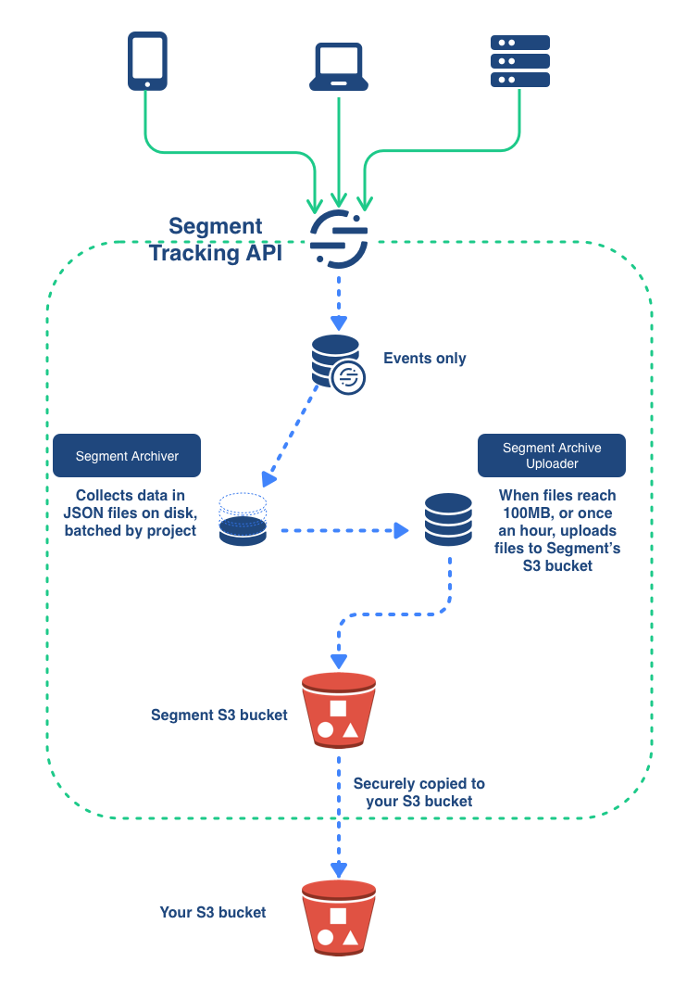

## Differences between the Amazon S3 destination and the AWS S3 destination

The AWS S3 destination provides a more secure method of connecting to your S3 buckets. It uses AWS's own IAM Roles to define access to the specified buckets. For more information about IAM Roles, see Amazon's [IAM role](https://docs.aws.amazon.com/IAM/latest/UserGuide/id_roles.html){:target="_blank"} documentation.

Functionally, the two destinations (Amazon S3 and AWS S3 with IAM Role Support) copy data in a similar manner.

## Getting Started

The AWS S3 destination puts the raw logs of the data Segment receives into your S3 bucket, encrypted, no matter what region the bucket is in.

> info ""
> Segment copies data into your bucket every hour around the :40 minute mark. You may see multiple files over a period of time depending on the amount of data Segment copies.

Keep in mind that AWS S3 works differently than most other destinations. Using a destinations selector like the [integrations object](/docs/connections/spec/common/#integrations) does not affect events with AWS S3.

The diagram below illustrates how the S3 destination works.

The Segment Tracking API processes data from your sources, and collects the Events in batches. When these batches reach a 100 MB, or once per hour, a Segment initiates a process which uploads them to a secure Segment S3 bucket, from which they are securely copied to your own S3 bucket.



## Create a new destination

Complete either [Create an IAM role in the AWS console](#create-an-iam-role-in-the-aws-console), [Create an IAM role using the AWS CLI](#create-an-iam-role-using-the-aws-cli), or [Create IAM roles using Terraform](#create-iam-roles-using-terraform) to set up the AWS S3 Destination with IAM Role Support.

All three setup methods provide a base level of permissions to Segment. If you want stricter permissions or other custom configurations, you can customize these setup instructions manually.

### Create an IAM role in the AWS console

To complete this section, you need access to your AWS dashboard.

1. Create a new S3 bucket in your preferred region. For more information, see Amazon's documentation, [Create your first S3 bucket](https://docs.aws.amazon.com/AmazonS3/latest/userguide/creating-bucket.html){:target="_blank"}. 
2. Create a new IAM role for Segment to assume. For more information, see Amazon's documentation, [Creating a role to delegate permissions to an IAM user](https://docs.aws.amazon.com/IAM/latest/UserGuide/id_roles_create_for-user.html){:target="_blank"}.
    1. Select the **AWS account** type from the list of trusted entities. 
    2. When prompted to enter an Account ID, enter `595280932656`. (You cannot enter an ARN in this step. In step 4, you can update the `Principal` to a specific role after you create an IAM role.)
    3. Click the **Require External ID** checkbox.
    4. Enter your Segment Workspace ID in the **External ID** field.
3. Attach the following policy to the IAM role created in step 2. Replace `<YOUR_BUCKET_NAME>` with the name of the S3 bucket you created in step 1.    
    ```json 
    {
        "Version": "2012-10-17",
        "Statement": [
            {
            "Sid": "PutObjectsInBucket",
            "Effect": "Allow",
            "Action": [
                "s3:PutObject",
                "s3:PutObjectAcl"
            ],
            "Resource": "arn:aws:s3:::<YOUR_BUCKET_NAME>/segment-logs/*"
            }
      ]
    }   
    ```
    If you're using KMS encryption on your S3 bucket, add the following policy to the IAM role:
    ```json
    {
      "Version": "2012-10-17",
      "Statement": [
          {
              "Sid": "AllowKMS",
              "Effect": "Allow",
              "Action": [
                  "kms:GenerateDataKey",
                  "kms:Decrypt"
              ],
              "Resource": "<YOUR_KEY_ARN>"
          }
        ]
    }
    ```
If you have server-side encryption enabled, see the [required configuration](#encryption).
 
4. Update `Principal` in the role's trust relationship document to `arn:aws:iam::595280932656:role/segment-s3-integration-production-access`. Replace `<YOUR_WORKSPACE_ID>` with your Segment Workspace ID.
``` json
    {
      "Version": "2012-10-17",
      "Statement": [
        {
          "Sid": "",
          "Effect": "Allow",
          "Principal": {
            "AWS": "arn:aws:iam::595280932656:role/segment-s3-integration-production-access"
          },
          "Action": "sts:AssumeRole",
          "Condition": {
            "StringEquals": {
              "sts:ExternalId": "<YOUR_WORKSPACE_ID>"
            }
          }
        }
      ]
    }
```

### Create an IAM role using the AWS CLI

To create an IAM role with external ID and with S3 permissions using the AWS CLI, follow the steps below. 

#### Prerequisites
To create an S3 IAM role, you must first install and configure the AWS CLI on your local machine and create an S3 bucket. Refer to Amazon's documentation, [Getting started with the AWS CLI](https://docs.aws.amazon.com/cli/latest/userguide/cli-chap-getting-started.html){:target="_blank"} for more information. 

#### Procedure
1. Copy the following code snippet and save it as a file on your local machine titled `trust-relationship-policy.json`. Replace `<YOUR_WORKSPACE_ID>` with your Segment workspace ID. 

    ```json
    {
      "Version": "2012-10-17",
      "Statement": [
        {
          "Sid": "",
          "Effect": "Allow",
          "Principal": {
            "AWS": "arn:aws:iam::595280932656:role/segment-s3-integration-production-access"
          },
          "Action": "sts:AssumeRole",
          "Condition": {
            "StringEquals": {
              "sts:ExternalId": "<YOUR_WORKSPACE_ID>"
            }
          }
        }
      ]
    }
    ```

2. Navigate to the folder containing `trust-relationship-policy.json` and run the following command to create your IAM role and attach the trust relationship document, replacing `<YOUR_ROLE_NAME>` with the name you want to give the IAM role:

    ``` python
    aws iam create-role --role-name <YOUR_ROLE_NAME> --assume-role-policy-document file://trust-relationship-policy.json --description "IAM role for Segment to assume (AWS S3 destination)"
    ```

3. To verify that the IAM role is created, log into the AWS console and open the IAM Management Console. Under the Trust Relationship tab, there should be a key-value pair: a `sts:ExternalID` key with a value of `your Segment workspace ID`.

4. Copy the following IAM policy, replacing `<YOUR_BUCKET_NAME>` with the name of your S3 bucket, and save it as a file on your local machine titled `iam-policy.json`.

    ```json
    {
      "Version": "2012-10-17",
      "Statement": [
        {
          "Sid": "PutObjectsInBucket",
          "Effect": "Allow",
          "Action": [
            "s3:PutObject",
            "s3:PutObjectAcl"
          ],
          "Resource": "arn:aws:s3:::<YOUR_BUCKET_NAME>/segment-logs/*"
        }
      ]
    }
    ```

5. Navigate to the folder containing `iam-policy.json`, and run the following command to create the IAM policy:

    ``` python
    aws iam create-policy --policy-name segment-s3-putobject --policy-document file://iam-policy.json --description "Allow Segment to PutObject into S3 destination bucket"
    ```

6. A successful output has the following format. Take note of the `Arn`, as you'll need it in the next step.

    ``` json
    {
        "Policy": {
            "PolicyName": "segment-s3-putobject",
            "PolicyId": "AABC1DE2F34GG567H",
            "Arn": "arn:aws:iam::012345678912:policy/segment-s3-putobject",
            "Path": "/",
            "DefaultVersionId": "v1",
            "AttachmentCount": 0,
            "PermissionsBoundaryUsageCount": 0,
            "IsAttachable": true,
            "CreateDate": "2021-11-11T01:21:00+00:00",
            "UpdateDate": "2021-11-11T01:21:00+00:00"
        }
    }

    ```

7. Run the following command to attach the IAM policy to the IAM role, replacing `<YOUR_ROLE_NAME>` with the name of your role and `<ARN_FROM_STEP_6_OUTPUT>` with the Arn output from the last step:

    ``` python
    aws iam attach-role-policy --role-name <YOUR_ROLE_NAME> --policy-arn <ARN_FROM_STEP_6_OUTPUT>
    ```

> info ""
> To verify that the IAM role is created, navigate to the AWS console and open the IAM Management Console. On the Permissions tab, verify that there is a `segment-s3-putobject` Permissions policy.

### Create IAM roles using Terraform

You can run the provided Terraform module from your command line to create the IAM roles required for this destination. This script requires access to Terraform versions v0.12+.

> warning "Support for the AWS S3 Terraform module"
> If you’re familiar with Terraform, you can modify the module to meet your organization’s needs: however, Segment guarantees support only for the template as provided.

To set up the required IAM roles for this destination, run the following Terraform module from your command line:

```hcl
# Creates the IAM role used by Segment.
# https://www.terraform.io/docs/providers/aws/r/iam_role.html
resource "aws_iam_role" "segment_aws_s3_iam_role" {
  name               = "SegmentAWSS3Role"
  description        = "IAM Role used by Segment"
  assume_role_policy = data.aws_iam_policy_document.segment_aws_s3_assume_role_policy_document.json
}

# Trust relationship policy attached to the IAM role.
# https://www.terraform.io/docs/providers/aws/d/iam_policy_document.html
data "aws_iam_policy_document" "segment_aws_s3_assume_role_policy_document" {
  version = "2012-10-17"
  # Allows Segment to assume a role.
  statement {
    actions = [
      "sts:AssumeRole"
    ]
    principals {
      type        = "AWS"
      identifiers = ["arn:aws:iam::595280932656:role/segment-s3-integration-production-access", ]
    }
    effect = "Allow"
    condition {
      test     = "StringEquals"
      variable = "sts:ExternalId"
      values   = ["<YOUR_WORKSPACE_ID>", ]
    }
  }
}

# https://www.terraform.io/docs/providers/aws/d/caller_identity.html
data "aws_caller_identity" "current" {}
# https://www.terraform.io/docs/providers/aws/d/region.html
data "aws_region" "current" {}
resource "aws_iam_policy" "segment_aws_s3_policy" {
  name        = "SegmentAWSS3Policy"
  description = "Gives access to resources in your S3 bucket"
  policy      = data.aws_iam_policy_document.segment_aws_s3_policy_document.json
}

data "aws_iam_policy_document" "segment_aws_s3_policy_document" {
  version = "2012-10-17"
  # Allows Segment to write to your S3 bucket.
  statement {
    sid = "PutObjectsInBucket"
    actions = [
      "s3:PutObject",
      "s3:PutObjectAcl",
    ]
    resources = [
      "arn:aws:s3:::<YOUR_BUCKET_NAME>/segment-logs/*",
    ]
    effect = "Allow"
  }
}

resource "aws_iam_role_policy_attachment" "segment_aws_s3_role_policy_attachment" {
  role       = aws_iam_role.segment_aws_s3_iam_role.name
  policy_arn = aws_iam_policy.segment_aws_s3_policy.arn
}

# Include the following sections if you’re using KMS encryption on your S3 bucket
resource "aws_iam_policy" "segment_aws_s3_kms_policy" {
  name        = "SegmentAWSS3KMSPolicy"
  path        = "/"
  description = "Gives access to your KMS key"
  policy      = data.aws_iam_policy_document.segment_aws_s3_kms_policy_document.json
}

data "aws_iam_policy_document" "segment_aws_s3_kms_policy_document" {
  version = "2012-10-17"
  statement {
    sid = "AllowKMS"
    actions = [
      "kms:GenerateDataKey",
      "kms:Decrypt",
    ]
    # ARN of your KMS key.
    resources = [
      "<YOUR_KEY_ARN>",
    ]
    effect = "Allow"
  }
}

resource "aws_iam_role_policy_attachment" "segment_aws_s3_role_kms_policy_attachment" {
  role       = aws_iam_role.segment_aws_s3_iam_role.name
  policy_arn = aws_iam_policy.segment_aws_s3_kms_policy.arn
}
```

### Add the AWS S3 with IAM Role Support Destination

To finish configuration, enable the AWS S3 Destination with IAM Role Support destination in your workspace.

1. Add the **AWS S3** destination from the Storage Destinations tab of the catalog. This document is about the **AWS S3** destination. For information about the **Amazon S3** destination, which does not include IAM Role support, see the documentation [here](/docs/connections/storage/catalog/amazon-s3/).
    
2. Select the data source you'll connect to the destination.
3. Provide a unique name for the destination.
4. Complete the destination settings:
   1. Enter the name of the region in which the bucket you created above resides.
   2. Enter the name of the bucket you created above. Be sure to enter the bucket's **name** and not URI.
   3. Enter the ARN of the IAM role you created above. The ARN should follow the format `arn:aws:iam::ACCOUNT_ID:role/ROLE_NAME.`
5. Enable the destination.
6. Verify Segment data is stored in the S3 bucket by navigating to the `<your_S3_bucket>/segment-logs` in the AWS console. The bucket will take roughly 1 hour to begin receiving data.

> info ""
> Did you know you can create destinations with the Config API? For more information, see [Create Destination](https://reference.segmentapis.com/#51d965d3-4a67-4542-ae2c-eb1fdddc3df6){:target="_blank"}.

## Migrate existing destinations

You can migrate your existing Amazon S3 destinations to the new AWS S3 destination either [manually](#manually-migrate-an-existing-destination) in the Segment app, or by using Segment's [Public API](#migrate-an-existing-destination-using-the-public-api). 

### Manually migrate an existing destination

> warning "Avoid overwriting data"
> Sending data to the same S3 location from both the existing Amazon S3 destination, and the AWS S3 with IAM Role Support destination will overwrite data in that location. To avoid this, follow the steps below.

To migrate an existing Amazon S3 destination to the AWS S3 with IAM Role Support Destination:

1. Configure the IAM role and IAM policy permissions as described in steps 2 - 4 [above](#create-an-iam-role-in-the-aws-console).
2. Add the **AWS S3** destination and add the AWS Region and IAM role ARN. For the bucket name, enter `<YOUR_BUCKET_NAME>/segment-logs/test`. Enable the destination, and verify data is received at `<YOUR_BUCKET_NAME>/segment-logs/test/segment-logs`. If the folder receives data, continue to the next step. If you don't see log entries, check the trust relationship document and IAM policy attached to the role.
3. Update the bucket name in the new destination to `<YOUR_BUCKET_NAME>`.
4. After 1 hour, disable the original Amazon S3 destination.
5. Verify that the `<YOUR_BUCKET_NAME>/segment-logs` receives data.
6. Remove the test folder created in step 2 from the bucket.

> error " "
> You must migrate to the new S3 destination before you disable your legacy destination to ensure Segment continues to deliver data to your S3 bucket. 

### Migration steps for scenarios with multiple sources per environment

In cases where you have multiple sources per environment, for example staging sources pointing to a staging bucket, and production sources going to a production bucket, you need two IAM roles, one for staging, and one for production. 

For example:

- stage_source_1 → stage_bucket
- stage_source_2 → stage_bucket
- stage_source_N → stage_bucket
- prod_source_1 → prod_bucket
- prod_source_2 → prod_bucket
- prod_source_N → prod_bucket

For each source in the scenario, complete the steps described in [Migrate an existing destination](#migrate-an-existing-destination), and ensure that you have separate IAM Roles and Permissions set for staging and production use.

### Migrate an existing destination using the Public API
This procedure uses Segment's Public API to migrate an existing Amazon S3 destination to the new AWS S3 destination. For more information about the Public API, see the [Public API documentation](https://api.segmentapis.com/docs/guides/#introduction){:target="_blank"}.

> warning "Avoid overwriting data"
> Sending data to the same S3 location from both the existing Amazon S3 destination and the AWS S3 destinations will overwrite data in your instance of S3. To avoid this, disable your Amazon S3 destination after you create your AWS S3 destination.

To migrate to the AWS S3 destination using the Public API:

#### Step 1 - Verify your configuration

1. Open the Segment app, select the Connections tab and then select Catalog.
2. From the Catalog, select the Storage Destinations tab and select the **AWS S3** destination. 
3. On the AWS S3 destination page, click the **Configure AWS S3** button. 
4. Configure your AWS S3 destination. When asked for the bucket name, enter `<YOUR_BUCKET_NAME>/segment-logs/test`. 
5. Enable the destination, and verify data is received at `<YOUR_BUCKET_NAME>/segment-logs/test/segment-logs`. <br/>**Note:** If the folder receives data, continue to the next step. If you don't see log entries, check the trust relationship document and IAM policy attached to your IAM role.


#### Step 2 - Migrate an existing destination using the Public API

1. Identify the source IDs for your old Amazon S3 destination(s). You can use the Public API to return information about a list of your Amazon S3 destinations or an individual destination. <br/>
To return a list of all of your Amazon S3 destinations, use the [`list destinations`](https://api.segmentapis.com/docs/connections/destinations/#list-destinations) call and filter the results using metadata id `54f418c3db31d978f14aa925` or slug `amazon-s3`: <br/>
```shell
curl -vvv --location --request GET https://api.segmentapis.com/destinations?pagination.count=1 \
--header 'Content-Type: application/json' \
  --header 'Authorization: Bearer ...' \
  --data-raw '
```
To return the information for an individual Amazon S3 destination, use the [`get destination`](https://api.segmentapis.com/docs/connections/destinations/#get-destination) call, using the destination ID for your individual Amazon S3 destination (**Note:** The destination ID for your Amazon S3 source is visible in the Segment app, on the destination's settings page.) <br/>
```shell
curl -vvv --location --request GET https://api.segmentapis.com/destinations/$DESTINATION_ID \
--header 'Content-Type: application/json' \
  --header 'Authorization: Bearer ...' \
  --data-raw '
```
2. Create your new AWS S3 destination using the [`create destination`](https://api.segmentapis.com/docs/connections/destinations/#create-destination) Public API call. The `sourceId`, `metadataId`, and `settings` parameters are required. An example of the parameters is below: <br/>
```json
{
 "sourceId": "$SOURCE_ID",
 "metadataId": "60be92c8dabdd561bf6c9130",
 "name": "AWS S3",
 "settings": {
  "region": "$BUCKET_REGION",
  "s3Bucket": "$YOUR_BUCKET_NAME",
  "iamRoleArn": "$IAM_ROLE_ARN"
 }
```
<br/>**Optional:** You can create a destination that's not enabled automatically upon creation by setting `enabled` to `false` when creating the new AWS S3 destination:
<br/>
```shell
curl -vvv --location --request PATCH https://api.segmentapis.com/destinations/$DESTINATION_ID \
--header 'Content-Type: application/json' \
  --header 'Authorization: Bearer ...' \
  --data-raw '
{
        "destinationId": "$DESTINATION_ID",
        "enabled": false
}
' | jq
```
<br/>

3. Disable the Amazon S3 destinations using the following command, replacing `$DESTINATION_ID` with the ID of your Amazon S3 destination you found in a previous step: 

```shell
curl -vvv --location --request PATCH https://api.segmentapis.com/destinations/$DESTINATION_ID \
--header 'Content-Type: application/json' \
  --header 'Authorization: Bearer ...' \
  --data-raw '
{
        "destinationId": "$DESTINATION_ID",
        "enabled": false
}
' | jq
``` 

> error " "
> You must migrate to the new S3 destination before you disable your legacy destination to ensure Segment continues to deliver data to your S3 bucket.

## Test your migrated source
You can validate that you configured your migrated source correctly on the AWS S3 destination page in the Segment app. 

> note "Source editing permissions required"
> In-app source validation is restricted to users with source editing permissions (for example, users with Workspace Owner, Source Admin, or Workspace Admin roles). For more information about roles in the Segment app, see the [Roles documentation](/docs/segment-app/iam/roles/). 

To verify that you migrated your source correctly: 
1. Open the Segment app and select the AWS S3 destination. 
2. On the Settings page, verify that your Region, Bucket Name, and IAM Role ARN are all correct. 
3. Click **Validate.**
4. A code indicating if the validation was successful or failed appears. To troubleshoot failed validation codes, see the [Troubleshooting](#troubleshooting) section. 

> info "dummy-object.txt"
> In order to test your bucket, Segment uploads a text file, `dummy-object.txt`, to the segment-logs folder in your S3 bucket. After you've completed the validation process, feel free to delete this file.

### Troubleshooting

The following table outlines some of the error codes the validation tool may display and possible reasons for the error. For assistance with correcting any of these error codes, contact [Segment support](mailto:friends@segment.com).

| Error message | Likely cause of the error |
| ------------- | ------------------------- |
| Unknown Error. Please try again. If the problem persists, please contact [Segment support](mailto:friends@segment.com). | Fail to assume intermediate role |
| Access Denied. Please configure External ID in the AWS IAM Console. [Learn more](#create-an-iam-role-in-the-aws-console). | Successfully assumed customer's role, role doesn't have external ID |
| Unknown Error. Please follow [instructions](#create-an-iam-role-in-the-aws-console) to set up the AWS S3 destination. If the problem persists, please contact [Segment support](mailto:friends@segment.com). | Fail to assume customer’s role without external ID and returned an error code that is not error 403 |
| Access Denied. Please configure External ID in the AWS IAM Console. [Learn more](#create-an-iam-role-in-the-aws-console). | Fail to assume customer’s role without external ID and returned error 403 |
| Access Denied. Please add PutObject permissions to the IAM role in the AWS IAM Console. [Learn more](#create-an-iam-role-in-the-aws-console). | Fail to upload the dummy object to customer's S3 bucket and an error code that is not error 403. |
| Unknown Error. Please follow [instructions](#create-an-iam-role-in-the-aws-console) to set up the AWS S3 destination. If the problem persists, please contact [Segment support](mailto:friends@segment.com). | Fail to upload the dummy object to customer's S3 bucket and an error code that is not error 403. |


## Data format

Segment stores logs as gzipped, newline-separated JSON containing the full call information. For a list of supported properties, see the [Segment Spec](/docs/connections/spec/) documentation.

Segment groups logs by day, and names them using the following format:

    s3://{bucket}/segment-logs/{source-id}/{received-day}/filename.gz

The received-day refers to the UTC date Unix timestamp, that the API receives the file, which makes it easy to find all calls received within a certain timeframe.

## Encryption

Configure encryption at the bucket-level from within the AWS console. For more information, see Amazon's documentation [Protecting data using encryption](https://docs.aws.amazon.com/AmazonS3/latest/userguide/UsingEncryption.html){:target="_blank"}.

## Custom Path Prefix

To use a custom key prefix for the files in your bucket, append the path to the bucket name in the Segment S3 destination configuration UI. For example, a bucket string `mytestbucket/path/prefix` would result in data copying to `/path/prefix/segment-logs/{source-id}/{received-day}/`.

### How can I download the data from my bucket?

Amazon provides several methods to download data from an S3 bucket. For more information, see [Downloading an object](https://docs.aws.amazon.com/AmazonS3/latest/userguide/download-objects.html){:target="_blank"}.


## Personas

> warning ""
> As mentioned above, the AWS S3 destination works differently than other destinations in Segment. As a result, Segment sends **all** data from a Personas source to S3 during the sync process, not only the connected audiences and traits.

You can send computed traits and audiences generated using [Segment Personas](/docs/personas) to this destination as a **user property**. 

For user-property destinations, Segment sends an [identify](/docs/connections/spec/identify/) call to the destination for each user added and removed. The property name is the snake_cased version of the audience name, with a true/false value to indicate membership. For example, when a user first completes an order in the last 30 days, Personas sends an Identify call with the property `order_completed_last_30days: true`. When the user no longer satisfies this condition (for example, it's been more than 30 days since their last order), Personas sets that value to `false`.

When you first create an audience, Personas sends an Identify call for every user in that audience. Later audience syncs send updates for users whose membership has changed since the last sync.


