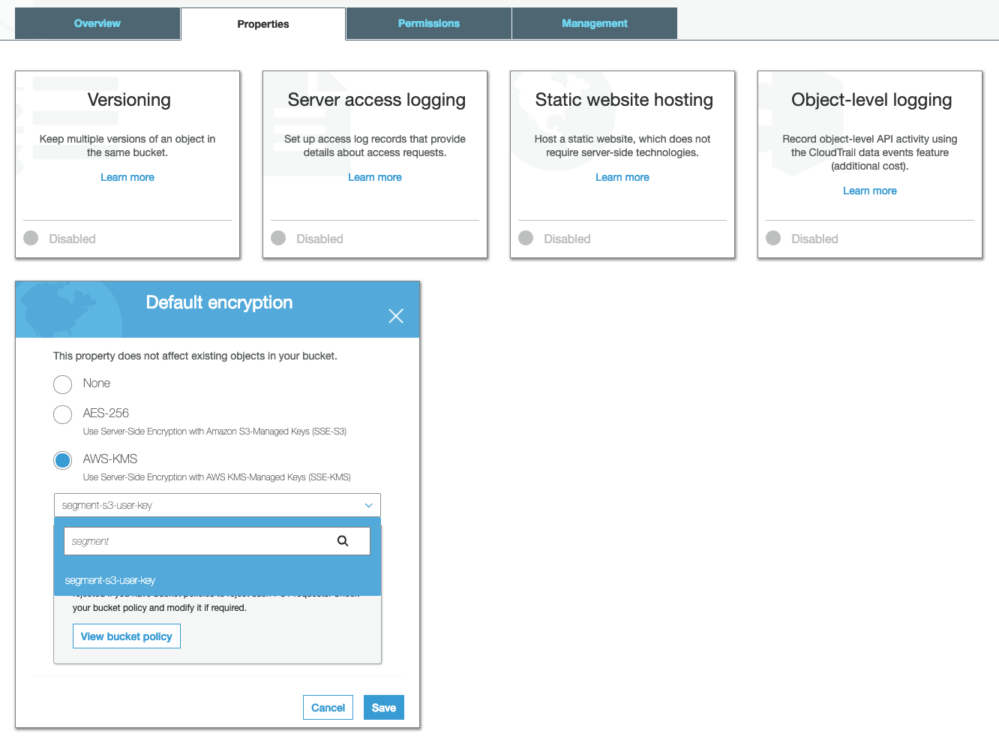



## Getting Started

The Amazon S3 destination puts the raw logs of the data Segment receives into your S3 bucket, encrypted, no matter what region the bucket is in.

> info ""
> Segment copies data into your bucket every hour around the :40 minute mark. You may see multiple files over a period of time depending on the amount of data Segment copies.

Keep in mind that Amazon S3 works in a different way from most other destinations. Using a destinations selector like the [integrations object](/docs/connections/spec/common/#integrations) does not affect events with Amazon S3.

The diagram below illustrates how the S3 destination works.

The Segment Tracking API processes data from your sources, and collects the Events in batches. When these batches reach a 100 MB, or once per hour, a Segment initiates a process which uploads them to a secure Segment S3 bucket, from which they are securely copied to your own S3 bucket.


## Create a new destination

Complete the following steps to configure the AWS S3 Destination with IAM Role Support.

### Create an IAM role in AWS

To complete this section, you need access to your AWS dashboard.

1. Create a new S3 bucket in your preferred region. For more information, see Amazon's documentation, [Create your first S3 bucket](https://docs.aws.amazon.com/AmazonS3/latest/userguide/creating-bucket.html){:target="_blank"}. Add the following policy to the bucket to allow Segment to copy files into it:
    ```json
    {
        "Version": "2008-10-17",
        "Id": "Policy1425281770533",
        "Statement": [
            {
                "Sid": "AllowSegmentUser",
                "Effect": "Allow",
                "Principal": {
                    "AWS": "arn:aws:iam::107630771604:user/s3-copy"
                },
                "Action": "s3:PutObject",
                "Resource": "arn:aws:s3:::<YOUR_BUCKET_NAME>/segment-logs/*"
            }
        ]
    }
    ```
    This adds the ability to `s3:PutObject` for the Segment s3-copy user for your bucket.
2. Create a new IAM role for Segment to assume. For more information, see Amazon's documentation, [Creating a role to delegate permissions to an IAM user](https://docs.aws.amazon.com/IAM/latest/UserGuide/id_roles_create_for-user.html){:target="_blank"}.
3. Attach the following trust relationship document. Be sure to add your Workspace ID to the `sts:ExternalId` field. 
    ```json
    {
       "Version": "2012-10-17",
       "Statement": [
         {
           "Sid": "",
           "Effect": "Allow",
           "Principal": {
             "AWS": "arn:aws:iam::595280932656:role/segment-s3-integration-production-access"
           },
           "Action": "sts:AssumeRole",
           "Condition": {
             "StringEquals": {
               "sts:ExternalId": "<YOUR_WORKSPACE_ID>"
             }
           }
         }
       ]
     }
    ```
4. Create and attach the following IAM policy to the role created in step 3 above. Replace `<YOUR_BUCKET_NAME>` with the name of the bucket you created in step 1 above.
    ```json
    {
    "Version": "2012-10-17",
    "Statement": [
        {
        "Sid": "PutObjectsInBucket",
        "Effect": "Allow",
        "Action": [
            "s3:PutObject",
            "s3:PutObjectAcl"
        ],
        "Resource": "arn:aws:s3:::<YOUR_BUCKET_NAME>/segment-logs/*"
        }
    ]
    }
    ```
    If you're using KMS encryption on your S3 bucket, add the following policy to the IAM role:
    ```json
    {
    "Version": "2012-10-17",
    "Statement": [
        {
            "Sid": "AllowKMS",
            "Effect": "Allow",
            "Action": [
            "kms:GenerateDataKey",
            "kms:Decrypt"
            ],
            "Resource": "YOUR_KEY_ARN"
        }
    ]
    }
    ```

If you have server-side encryption enabled, see the [required configuration](#encryption).


### Add the AWS S3 with IAM Role Support Destination

To finish configuration, enable the AWS S3 Destination with IAM Role Support destination in your workspace.

1. Add the destination from the Data Storage catalog.
2. Select the data source you'll connect to the destination.
3. Provide a unique name for the destination.
4. Complete the destination settings:
   1. Enter the name of the region in which the bucket you created above resides.
   2. Enter the name of the bucket you created above. Be sure to enter the bucket's **name** and not URI.
   3. Enter the ARN of the IAM role you created above. The ARN should follow the format `arn:aws:iam::ACCOUNT_ID:role/ROLE_NAME.`
5. Enable the destination.
6. Verify Segment data is stored in the S3 bucket by navigating to the `<your_S3_bucket>/segment-logs` in the AWS console. The bucket will take roughly 1 hour to begin receiving data.

## Migrate an existing destination
To migrate an existing Amazon S3 destination to the AWS S3 with IAM Role Support Destination:

1. Configure the IAM role and IAM policy permissions as described in steps 3 and 4 [above](#create-an-iam-role-in-aws).
2. Add the AWS S3 with IAM Role Support Destination and add the AWS Region and IAM role ARN. For the bucket name, enter `<YOUR_BUCKET_NAME>/segment-logs/test`. Enable the destination, and verify data is received at `<YOUR_BUCKET_NAME>/segment-logs/test/segment-logs`. If the folder receives data, continue to the next step. If you don't see log entries, check the trust relationship document and IAM policy attached to the role.
3. Update the bucket name in the new destination to `<YOUR_BUCKET_NAME>`.
4. After 1 hour, disable the original Amazon S3 destination to avoid data duplication.
5. Verify that the `<YOUR_BUCKET_NAME>/segment-logs` receives data.
6. Remove the test folder created in step 2 from the bucket.


### Migration steps for users with multiple sources per environment

In cases where users have multiple sources per environment, for example staging sources pointing to a staging bucket, and production sources going to a production bucket, they need two IAM roles, one for staging, and one for production. 


For example:

- stage_source_1 → stage_bucket
- stage_source_2 → stage_bucket
- stage_source_N → stage_bucket
- prod_source_1 → prod_bucket
- prod_source_2 → prod_bucket
- prod_source_N → prod_bucket

In this scenario, for `stage_source_1`:
1. 


## Data format

Segment stores logs as gzipped, newline-separated JSON containing the full call information. For a list of supported properties, see the [Segment Spec](/docs/connections/spec/) documentation.

Segment groups logs by day, and names them using the following format:

    s3://{bucket}/segment-logs/{source-id}/{received-day}/filename.gz

The received-day refers to the UTC date unix timestamp, that the API receives the file, which makes it easy to find all calls received within a certain timeframe.

## Encryption

This section contains information for enabling encryption on your S3 bucket.

### Server-Side Encryption with Amazon S3-Managed Keys (SSE-S3)

Segment supports optional, S3-managed Server-Side Encryption, which you can disable or enable from the Destination Configuration UI. By default, the destination now automatically enables encryption, and Segment recommends that you continue to encrypt.
If you've had the S3 destination enabled since before October 2017, you might need to enable encryption manually on your bucket.

While most client libraries transparently decrypt the file when fetching it, you should make sure that any applications that are consume data in the S3 bucket are ready to decrypt the data before you enable this feature. When you're ready, you can enable encryption from the setting in the destination configuration UI.

### Server-Side Encryption with AWS KMS-Managed Keys (SSE-KMS)
Segment can also write to S3 buckets with Default Encryption set to AWS-KMS. This ensures that objects written to your bucket are encrypted using customer managed keys created in your AWS Key Management Service (KMS).
Follow the steps below to enable encryption using AWS KMS Managed Keys:

#### Create a new customer-managed key and grant the Segment user permissions to generate new keys
The Segment user must have the permission to `GenerateDataKey` from your AWS Key Management Service. Here is a sample policy document that grants the Segment user the necessary permissions.

```json
{
    "Version": "2012-10-17",
    "Id": "key-consolepolicy-3",
    "Statement": [
        {
            "Sid": "Allow Segment S3 user to generate key",
            "Effect": "Allow",
            "Principal": {
                "AWS": "arn:aws:iam::107630771604:user/s3-copy"
            },
            "Action": "kms:GenerateDataKey",
            "Resource": "*"
        }
    ]
}
```


#### Update S3 bucket default encryption property
The target S3 bucket should have the "Default encryption" property enabled and set to `AWS-KMS`. Choose the customer-managed key generated in the above step for encryption.



#### Disable ServerSideEncryption in Segment S3 Destination settings
Disable the Server Side Encryption setting in the Segment destination configuration. This allows you to enable bucket-level encryption, so Amazon can encrypt objects using KMS managed keys.


### Enforcing encryption
To further secure your bucket by ensuring that all files upload with the encryption flag present, you can add to the bucket policy to strictly enforce that all uploads trigger encryption.

Segment recommends doing this as a best practice. The following policy strictly enforces upload encryption with Amazon S3-Managed keys.

```json
{
    "Version": "2008-10-17",
    "Id": "Policy1425281770533",
    "Statement": [
        {
            "Sid": "AllowSegmentUser",
            "Effect": "Allow",
            "Principal": {
                "AWS": "arn:aws:iam::107630771604:user/s3-copy"
            },
            "Action": "s3:PutObject",
            "Resource": "arn:aws:s3:::YOUR_BUCKET_NAME/segment-logs/*"
        },
        {
            "Sid": "DenyIncorrectEncryptionHeader",
            "Effect": "Deny",
            "Principal": "*",
            "Action": "s3:PutObject",
            "Resource": "arn:aws:s3:::YOUR_BUCKET_NAME/*",
            "Condition": {
                "StringNotEquals": {
                    "s3:x-amz-server-side-encryption": "AES256"
                }
            }
        },
        {
            "Sid": "DenyUnEncryptedObjectUploads",
            "Effect": "Deny",
            "Principal": "*",
            "Action": "s3:PutObject",
            "Resource": "arn:aws:s3:::YOUR_BUCKET_NAME/*",
            "Condition": {
                "Null": {
                    "s3:x-amz-server-side-encryption": "true"
                }
            }
        }
    ]
}
```

## Region

Segment infers the region of your bucket when data is copied to it, so you don' need to specify a bucket region in your configuration. If you're using VPC Endpoints for your S3 bucket, make sure you configure the endpoint in the same region as your bucket. You can find more information on this in the AWS S3 docs [here](http://docs.aws.amazon.com/AmazonVPC/latest/UserGuide/vpc-endpoints-s3.html).

## Custom Path Prefix

To use a custom key prefix for the files in your bucket, append the path to the bucket name in the Segment S3 destination configuration UI. For example, a bucket string `mytestbucket/path/prefix` would result in data copying to `/path/prefix/segment-logs/{source-id}/{received-day}/`.

### How can I download the data from my bucket?

Segment recommends using the [AWS CLI](http://aws.amazon.com/cli/) and writing a short script to download specific days, one at a time. The AWS CLI is faster than [s3cmd](http://s3tools.org/s3cmd) because it downloads files in parallel.

> info ""
> S3 transparently decompresses the files for most clients. To access the raw gzipped data you can programmatically download the file using [the AWS SDK](http://docs.aws.amazon.com/AWSJavaScriptSDK/latest/AWS/S3.html) and setting `ResponseContentEncoding: none`. This functionality isn't available in the AWS CLI). You can also manually remove the metadata on the file (`Content-Type: text/plain` and `Content-Encoding: gzip`) through the AWS interface, which allows you to download the file as gzipped.

To configure the AWS CLI, see Amazon's documentation [here](http://docs.aws.amazon.com/cli/latest/userguide/installing.html). For linux systems, run the following command:


```bash
$ sudo apt-get install awscli
```

Then configure AWS CLI with your Access Key ID and Secret Access Key. You can create or find these keys in your [Amazon IAM user management console](https://console.aws.amazon.com/iam/home#users). Then run the following command which will prompt you for the access keys:

```bash
$ aws configure
```

To see a list of the most recent log folders:

```bash
$ aws s3 ls s3://{bucket}/segment-logs/{source-id}/ | tail -10
```

To download the files for a specific day:

```bash
$ aws s3 sync s3://{bucket}/segment-logs/{source-id}/{received-day} .
```

Or to download *all* files for a source:

```bash
$ aws s3 sync s3://{bucket}/segment-logs/{source-id} .
```

To put the files in a specific folder replace the `.` at the end ("current directory") with the desired directory like `~/Downloads/logs`.


## Personas

> warning ""
> As mentioned above, the Amazon S3 destination works differently than other destinations in Segment. As a result, Segment sends **all** data from a Personas source to S3 during the sync process, not only the connected audiences and traits.

You can send computed traits and audiences generated using [Segment Personas](/docs/personas) to this destination as a **user property**. 

For user-property destinations, Segment sends an [identify](/docs/connections/spec/identify/) call to the destination for each user added and removed. The property name is the snake_cased version of the audience name, with a true/false value to indicate membership. For example, when a user first completes an order in the last 30 days, Personas sends an Identify call with the property `order_completed_last_30days: true`. When the user no longer satisfies this condition (for example, it's been more than 30 days since their last order), Personas sets that value to `false`.

When you first create an audience, Personas sends an Identify call for every user in that audience. Later audience syncs send updates for users whose membership has changed since the last sync.

