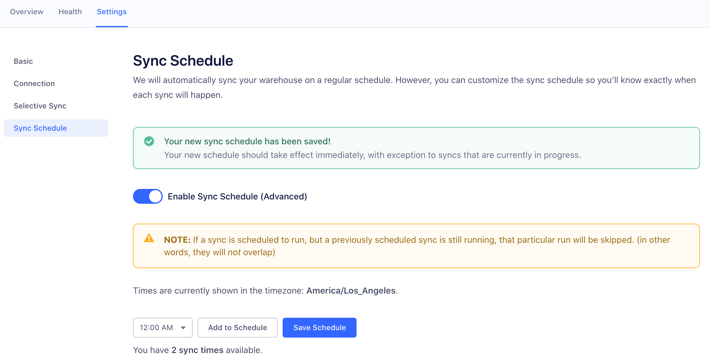

Segment's [BigQuery](https://cloud.google.com/bigquery/) connector makes it easy
to load web, mobile, and third-party source data like Salesforce, Zendesk, and
Google AdWords into a BigQuery data warehouse.  This guide will explain how to
set up BigQuery and start loading data into it.

The Segment warehouse connector runs a periodic ETL (Extract - Transform - Load)
process to pull raw events and objects and load them into your BigQuery cluster.

Using BigQuery through Segment means you'll get a fully managed data pipeline
loaded into one of the most powerful and cost-effective data warehouses today.

## Getting Started

To store your Segment data in BigQuery, complete the following steps:
- [Enable BigQuery for your Google Cloud project](#create-a-project-and-enable-bigquery)
- [Create a GCP service account for Segment to assume](#create-a-service-account-for-segment)
- [Create a warehouse in the Segment app](#create-the-warehouse-in-segment)

### Create a Project and Enable BigQuery

1. Navigate to the [Google Developers Console](https://console.developers.google.com/)
2. Configure [Cloud Platform](https://console.cloud.google.com/):
  - If you don't have a project already, [create one](https://support.google.com/cloud/answer/6251787?hl=en&ref_topic=6158848).
  - If you have an existing project, you will need to [enable the BigQuery API](https://cloud.google.com/bigquery/quickstart-web-ui).
    Once you've done so, you should see BigQuery in the "Resources" section of Cloud Platform.
  - **Note:** make sure [billing is enabled](https://support.google.com/cloud/answer/6293499#enable-billing) on your project, or Segment will not be able to write into the cluster.
3. Copy the project ID. You will need it when you create a warehouse source in the Segment app.

### Create a Service Account for Segment

Refer to [Google Cloud's documentation about service accounts](https://cloud.google.com/iam/docs/creating-managing-service-accounts)
for more information.

1. From the Navigation panel on the left, go to **IAM & admin** > **Service accounts**
2. Click **Create Service Account** along the top
3. Enter a name for the service account (for example: "segment-warehouses") and click **Create**
4. When assigning permissions, make sure to grant the following roles:
    - `BigQuery Data Owner`
    - `BigQuery Job User`
5. [Create a JSON key](https://cloud.google.com/iam/docs/creating-managing-service-account-keys).
The downloaded file will be used to create your warehouse in the next section.

### Create the Warehouse in Segment

1. In Segment, go to **Workspace** > **Add destination** > Search for "BigQuery"
2. Select **BigQuery**
3. Add a name for the destination to the **Name your destination** field
4. Enter your project ID in the **Project** field
5. Copy the contents of the credentials (the JSON key) into the **Credentials** field <br/>
**Optional:** Enter a [region code](https://cloud.google.com/compute/docs/regions-zones/) in the **Location** field (the default will be "US")
6. Click **Connect**
7. If Segment can connect with the provided **Project ID** and **Credentials**, a warehouse will be created and your first sync should begin shortly

### Schema

BigQuery datasets are broken down into **tables** and **views**. **Tables**
contain duplicate data, **views** do _not_.

#### Partitioned Tables

The Segment connector takes advantage of [partitioned
tables](https://cloud.google.com/bigquery/docs/partitioned-tables). Partitioned
tables allow you to query a subset of data, thus increasing query performance
and decreasing costs.

To query a full table, you can query like this:

```sql
select *
from <project-id>.<source-name>.<collection-name>
```

To query a specific partitioned table, you can query like this:


```sql
select *
from <project-id>.<source-name>.<collection-name>$20160809
```

#### Views

A [view](https://cloud.google.com/bigquery/querying-data#views) is a virtual
table defined by a SQL query. Segment uses views in the de-duplication process to
ensure that events that you are querying unique events, and the latest objects
from third-party data. All Segment views are set up to show information from the last
60 days. Whenever possible, query from these views.

Views are appended with `_view` , which you can query like this:

```sql
select *
from <project-id>.<source-name>.<collection-name>_view
```

## Security

For early customers using BigQuery with Segment, rather than providing Segment
with credentials, access was granted to a shared Service Account
(`connector@segment-1119.iam.gserviceaccount.com`). While convenient for early
adopters, this presented potential security risks that Segment would prefer to address
proactively.

As of **March 2019**, Segment requires BigQuery customers to
create their own Service Accounts and provide the app with those credentials instead.
In addition, any attempts to update warehouse connection settings will also
require these credentials. This effectively deprecates the shared Service
Account.

To stay ahead of this change, migrate your warehouse by following
the instructions in the "Create a Service Account for Segment" section above.
Then, head to your warehouse's connection settings and update with the
**Credentials** you created.


## Best Practices

### Use views

BigQuery charges based on the amount of data scanned by your queries. Views are
a derived view over your tables that Segment uses for de-duplication of events.
Therefore, Segment recommends you query a specific view whenever possible to avoid
duplicate events and historical objects. It's important to note that BigQuery
views are not cached. 

> BigQuery's views are logical views, not materialized views, which means that
> the query that defines the view is re-executed every time the view is queried.
> Queries are billed according to the total amount of data in all table fields
> referenced directly or indirectly by the top-level query.

To save more money, you can query the view and set a [destination
table](https://cloud.google.com/bigquery/docs/tables), and then query the
destination table.

### Query structure

If you typically start exploratory data analysis with `SELECT *` consider
specifying the fields to reduce costs.

See the section on [partitioned tables](#partitioned-tables) for details on
querying sub-sets of tables.


## FAQs

### I need more than 60 days of data in my views. Can I change the view definition?

Absolutely! You will just need to modify one of the references to 60 in the view
definition to the number of days of your choosing.

Segment chose 60 days as it suits the needs of most customers. However,
you're welcome to update the definition of the view as long as the name stays
the same.

Here is the base query Segment uses when first setting up your views. Included in the base query are the placeholders (`%s.%s.%s`) that you would want to include the project,
dataset and table (in that order).

```sql
SELECT * EXCEPT (ROW_NUMBER) FROM (
 SELECT *, ROW_NUMBER() OVER (PARTITION BY id ORDER BY loaded_at DESC) ROW_NUMBER
  FROM ` + "`%s.%s.%s`" + `
  WHERE _PARTITIONTIME BETWEEN
    TIMESTAMP_TRUNC(TIMESTAMP_MICROS(UNIX_MICROS(CURRENT_TIMESTAMP()) - 60 * 60 * 60 * 24 * 1000000), DAY, 'UTC')
    AND TIMESTAMP_TRUNC(CURRENT_TIMESTAMP(), DAY, 'UTC')
 )
WHERE ROW_NUMBER = 1
```

### How does BigQuery pricing work?

BigQuery offers both a scalable, pay-as-you-go pricing plan based on the amount
of data scanned, or a flat-rate monthly cost. You can learn more about BigQuery
pricing [here](https://cloud.google.com/bigquery/pricing).

BigQuery allows you to set up [Cost Controls and
Alerts](https://cloud.google.com/bigquery/cost-controls) to help control and
monitor costs. If you want to learn more about what BigQuery will cost you,
they've provided [this
calculator](https://cloud.google.com/products/calculator/) to estimate your
costs.

### How do I query my data in BigQuery?

You can connect to BigQuery using a BI tool like Mode or Looker, or query
directly from the BigQuery console.

BigQuery now supports standard SQL, which you can enable using their query UI. 
This does not work with views, or with a query that uses table range 
functions.

### Does Segment support streaming inserts?

Segment's connector does not support streaming inserts at this time. If you have
a need for streaming data into BigQuery, [contact Segment support](https://segment.com/requests/integrations/).

### Can I customize my sync schedule?





## Troubleshooting

### I'm seeing duplicates in my tables.

This behavior is expected. Segment only de-duplicates data in your views. See the
section on [views](#views) for more details.
