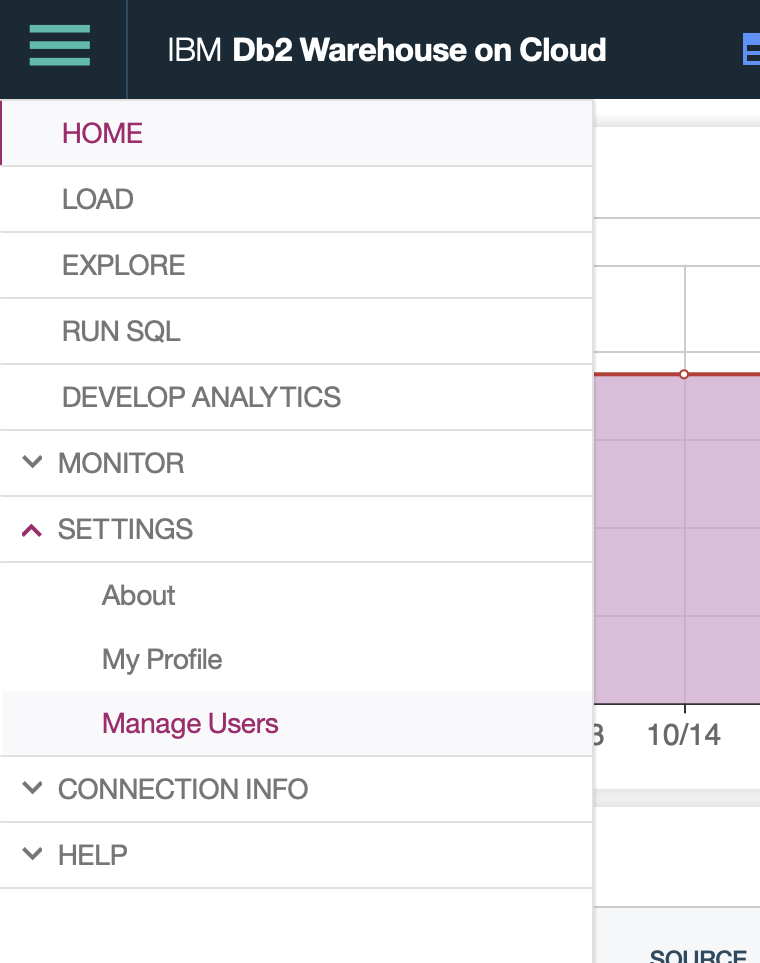
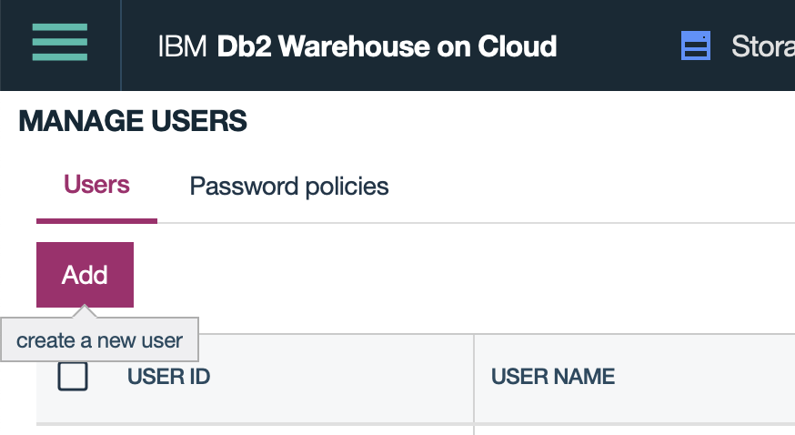
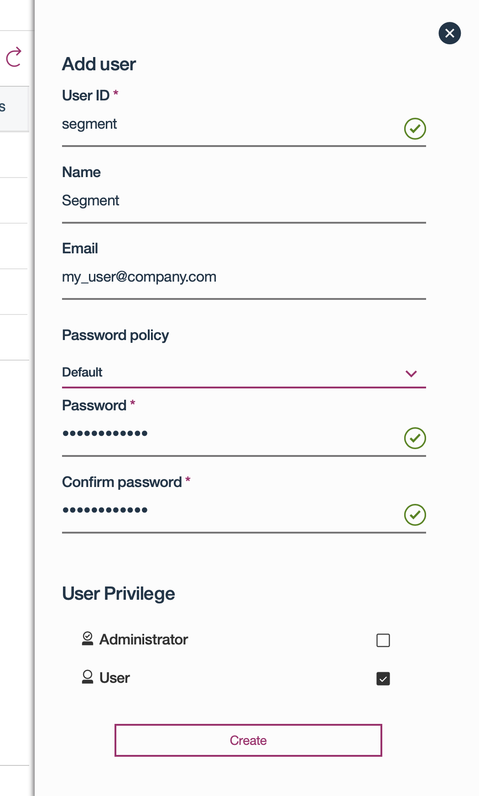
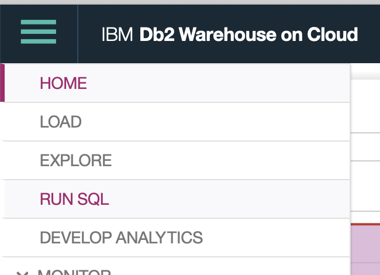
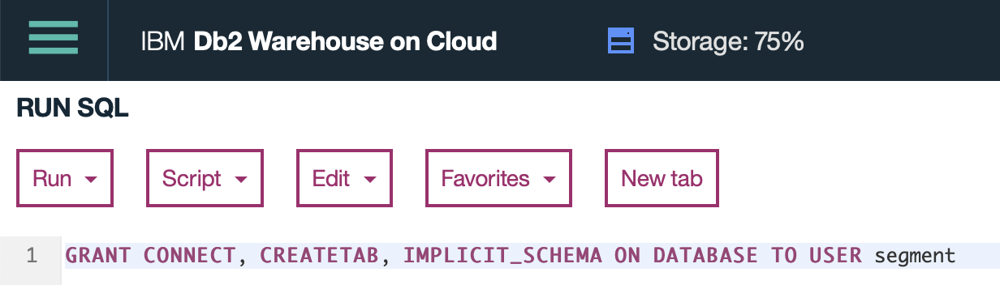
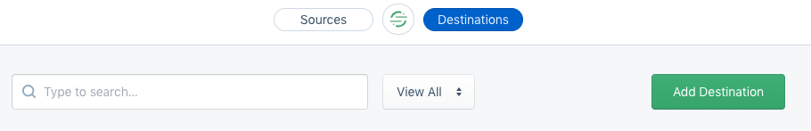
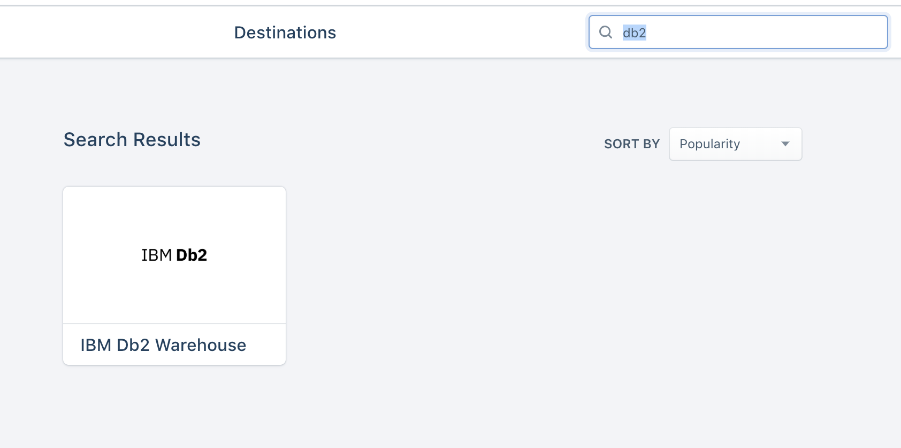
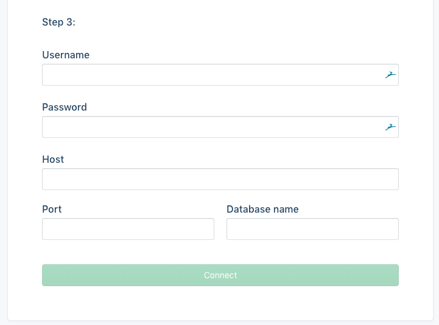

Use [IBM Db2](https://www.ibm.com/analytics/us/en/db2/) with Segment to get
all of your event and Cloud Source data in a warehouse built by IBM. This
guide will walk through what you need to know to get up and running with Db2
Warehouse and Segment in a flash.

Note: This document refers specifically to [IBM Db2 Warehouse on
Cloud](https://www.ibm.com/cloud/db2-warehouse-on-cloud), [IBM Db2 Warehouse](https://www.ibm.com/analytics/db2), and the [IBM Integrated
Analytics System](https://www.ibm.com/products/integrated-analytics-system). For questions related to any of these products,
 see the [IBM Cloud Docs](https://cloud.ibm.com/docs).

If you notice any gaps, outdated information or simply want to leave some
feedback to help us improve our documentation, [let us
know](https://segment.com/help/contact)!

## Getting Started

To get started, you'll need to create a Db2 user for Segment, give that user
sufficient permissions, and then create the Segment Db2 Destination.

### Create a User for Segment

To create the user account that Segment will use to load data, open the
top-left menu and navigate to Settings → Manage Users:

Then click on "Add":

Fill in your desired Segment user settings and make sure that their Privilege
is "User". You will enter these settings in to Segment later:

### Give the Segment User Permissions

In order to load data, your new Segment Db2 user will need permissions to
load that data. Open the top-left menu and navigate to Run SQL:

In the SQL input, type "GRANT CONNECT, CREATETAB, IMPLICIT_SCHEMA ON DATABASE TO
USER segment":, replacing "segment" with the user ID that you chose above:

Select Run → Run All to execute the `GRANT` command.

### Create Segment Db2 Destination

In the Segment App, select Add Destination:

Search for and select "Db2":

Add your credentials as follows:

- User (This is the "User ID" that you created above)
- Password
- Host (Found in Settings → Connection Info → Connection Information)
- Port (50000 by default)
- Database name

Click connect to test the connection. If the connection is valid, your Db2
Destination will be enabled! Segment will begin syncing data to your Db2
database shortly.

## Security

### Whitelisting IPs

If your Db2 Warehouse is in a private network, be sure to [whitelist
Segment's IP
address](https://segment.com/docs/connections/storage/warehouses/faq/#which-ips-should-i-whitelist).
Otherwise, we will not be able to load your data.

### Unique User

We strongly recommend creating a unique User for the Segment Db2 Warehouse
connection to your Db2 Warehouse instance so that you can manage permissions
separately.
