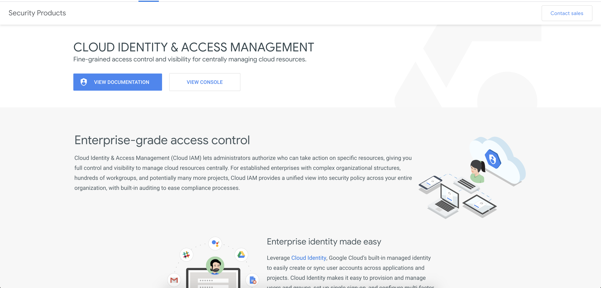
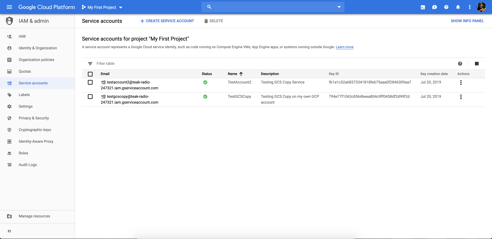
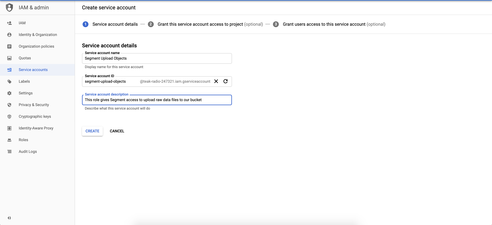
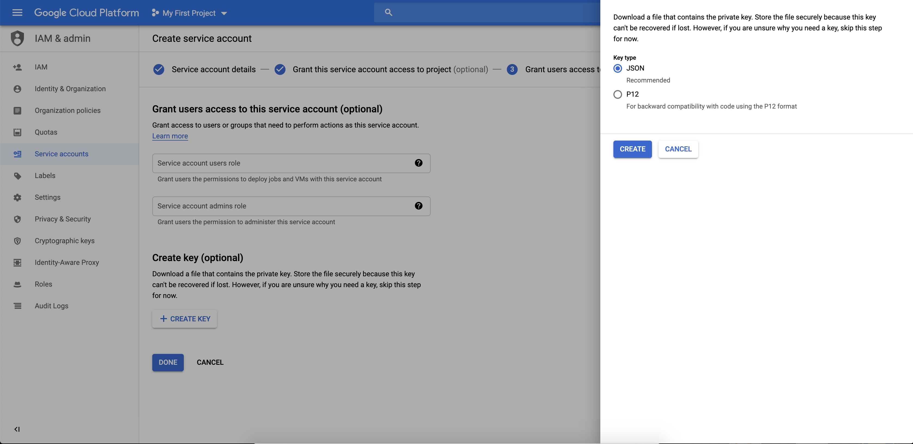
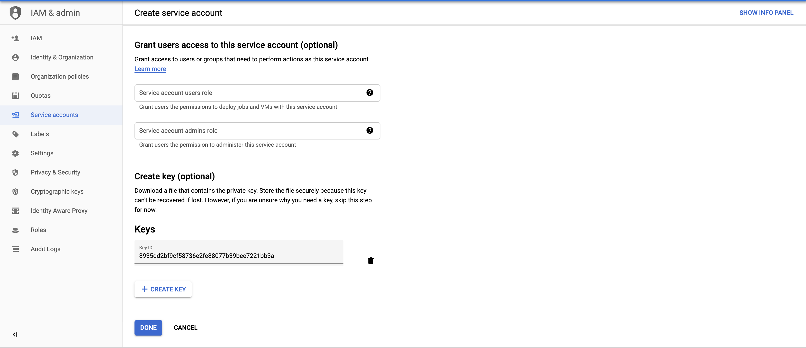
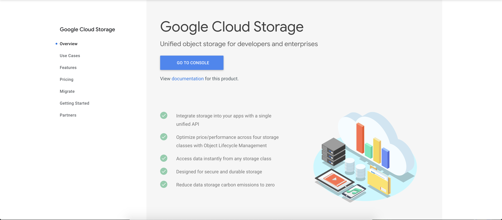
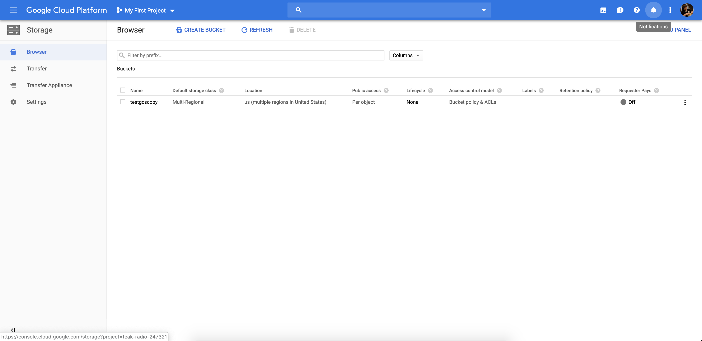
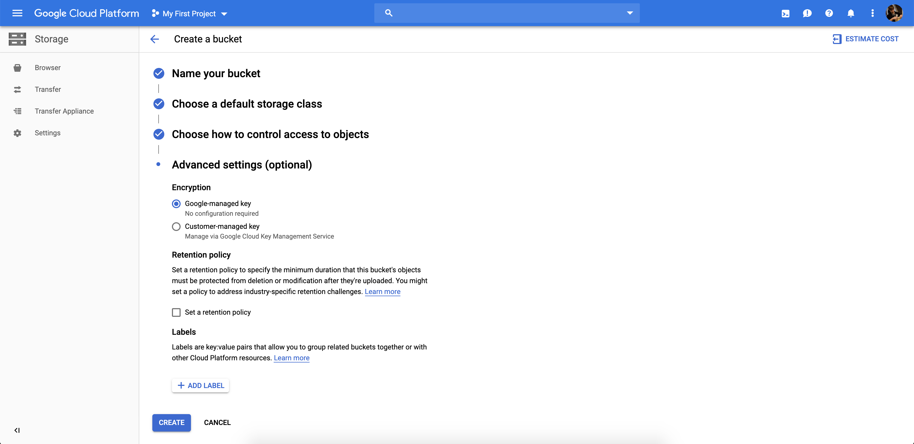
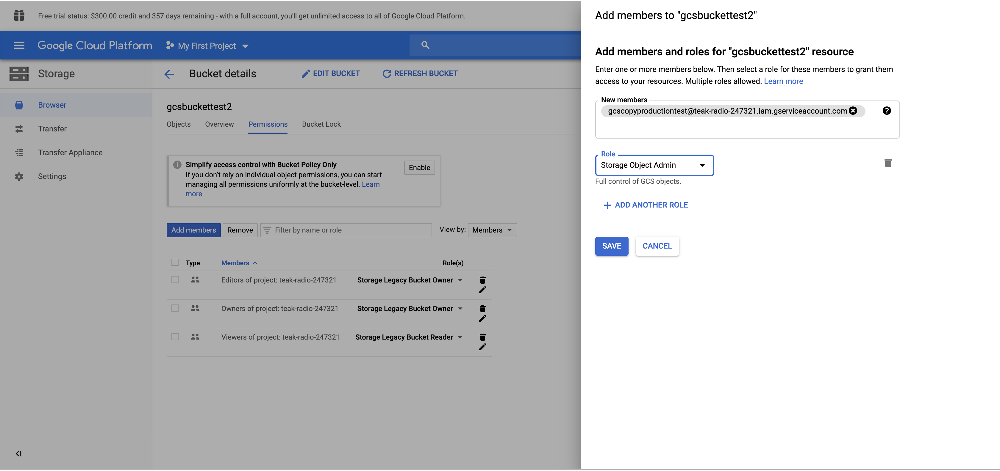



The Google Cloud Storage (GCS) destination puts the raw logs of the data Segment receives into your GCS bucket. The data is copied into your bucket at least every hour. You might see multiple files over a period of time depending on how much data is copied.

> warning ""
> The Google Cloud Storage destination works differently than other destinations in Segment. Segment sends **all** data from a Personas source to GCS during the sync process, not only the connected audiences and traits. Using a destinations selector like the [integrations object](/docs/connections/spec/common/#integrations) doesn't affect the events events sent to GCS.

**Note**: The GCS destination is currently in public beta, and doesn't support product features such as deletions, replays, or surfacing errors in the UI.

## Getting Started

1. Create a Service Account to allow Segment to copy files into the bucket
2. Create a bucket in your preferred region.

## Set up Service Account to give Segment access to upload to your Bucket

1. Go to http://cloud.google.com/iam
2. Click **VIEW CONSOLE**.

   

3. Select a project to which you would like to send Segment data
4. In the sidebar, click **Service Accounts**
5. Click **CREATE SERVICE ACCOUNT**.

   

6. In the **Name** field, give your service account a name, for example, `Segment Upload Objects`.
7. In the **Description** field, enter a description that will remind you the purpose of the role. For example, `This role gives Segment access to upload raw data files to our bucket`.
8. Click **CREATE**.

   

10. Click **CONTINUE** to skip adding Service Account Permissions. We will add permissions directly to the bucket instead.

11. Click **CREATE KEY**.
12. Select Key Type `JSON`
13. Click **CREATE** to create the key.

    A key downloads to your computer. You'll use this key when creating the Segment Google Cloud Storage Destination. Keep it in a safe place.

    

14. Click on **DONE** to finish creating your Service Account

    

## Set up a Google Cloud Bucket for Segment to Copy Objects

To receive raw data files from Segment, you must first provide a Google Cloud Storage bucket that can store the raw data files:

1. Go to https://cloud.google.com/storage
2. Click **GO TO CONSOLE**.

   

3. Select a project.
4. Click **CREATE BUCKET**.

   

5. In the **Name** field, enter a name for your bucket.
   Any name will work here, but we recommend that include the word "segment", for example: `my-segment-data`.
6. In the **Storage Class** field, we recommend `Multi-Regional`
7. In the **Access Control** field, choose `Set object-level and bucket-level permissions`
8. No **Advanced Options** are necessary. Click **Create** to finish creating the bucket.

   

9. Click the tab **PERMISSIONS** to show bucket permissions
10. Click **ADD MEMBERS**
11. In the **NEW MEMBERS** text input, enter the email address associated with the Service Account we created.
12. Click **SELECT A ROLE**.
    Select the **STORAGE OBJECT ADMIN** role. This gives the Service Account read/write access to objects in this bucket _only_. We require `Object Admin` access in order to overwrite existing files. Overwriting is required when running replays or in cases of failure handling.
13. Click **SAVE**.

   

Congratulations! You now have a bucket ready to accept Segment data.

## Configure Google Cloud Storage Destination

Once the Google Cloud Storage Bucket and Service Account are created, a destination that will send data files to the bucket must be configured:

1. In the Segment **Destinations** section, click **Add Destination**.
   You will be redirected to our `Catalog`.
2. Search for "Google Cloud Storage", and click the destination in the catalog.
3. Click **Configure Google Cloud Storage**.
4. Select the source you want to send to this destination.
5. Enter the values for the settings below:
   - **Bucket**: The name of the bucket you created on the Google Cloud Storage Console.
   - **GCS Credentials**: Copy and paste the contents of the credentials (Private Key) file that downloaded to your computer when you created the Google Cloud Service Account. This grants access so Segment can upload raw data files to your bucket
6. Click on the toggle to enable your Destination.

Congratulations! You've set up a GCS destination. You'll receive files in your Bucket in 60 minutes, assuming the Segment Source is regularly producing events.

## Troubleshooting

**Why is data not syncing to the GCS destination?**
Common errors which can cause sync failures are:
- **Bucket not configured**: A bucket for the GCS destination was not provided. Check the GCS destination settings to confirm that a valid bucket is entered.
- **GCS credentials not configured**: Credentials for the GCS destination cannot be found. Confirm that you've inputted GCS credentials into the destination settings.
- **Invalid GCS credentials**: Credentials for the GCS destination are found, but they are not correctly formatted credentials. Re-enter a valid credential as a setting for the destination to work.
- **Unable to upload files**: We are unable to upload files to GCS due to incorrect credentials (e.g., non-existent bucket), insufficient permissions, or a GCS error. Confirm that credentials and permissions are set correctly.
- **Destination not found**: There is no GCS destination connected to the source, and can be connected within the workspace overview page.
- **Destination disabled**: The GCS destination for the source is disabled, and can be enabled in the destination settings page.
