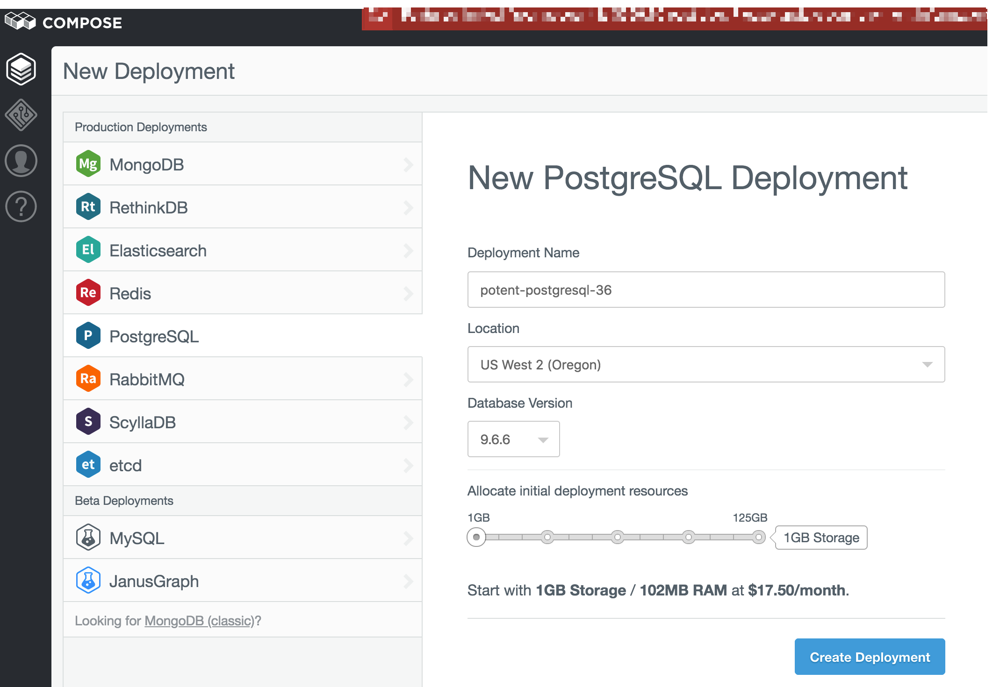
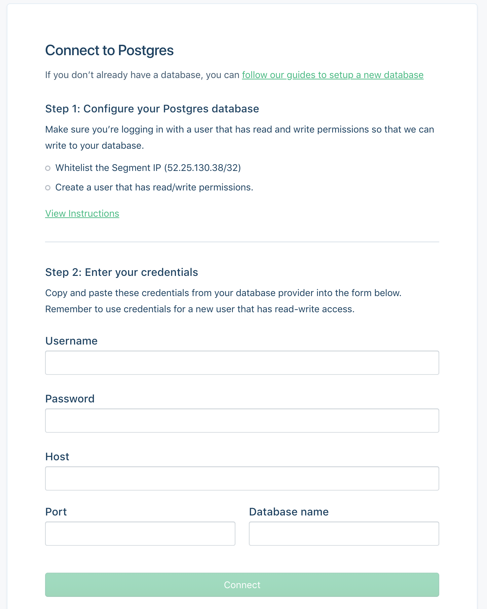

PostgreSQL, or Postgres, is an object-relational database management system (ORDBMS) with an emphasis on extensibility and standards compliance. As a database server, its primary functions are to store data securely and return that data in response to requests from other software applications.

PostgreSQL is ACID-compliant and transactional. PostgreSQL has updatable views and materialized views, triggers, foreign keys; supports functions and stored procedures, and other expandability. Developed by the PostgreSQL Global Development Group, free and open-source.

> note "Segment sources required"
> In order to add a Postgres destination to Segment, you must first add a source. To learn more about sources in Segment, check out the [Sources Overview](/docs/connections/sources) documentation.

## Getting started
Segment supports the following Postgres database providers:
- [Heroku](#heroku-postgres)
- [RDS](#rds-postgres)
- [Compose](#compose-postgres)*

> note "Deprecation of Compose"
> On March 1, 2023, [Compose will be deprecated](https://help.compose.com/docs/compose-deprecation){:target="_blank"}. After this date, all databases on Compose will be disabled and deprovisioned. If you need help selecting another Segment-supported Postgres database provider, [contact Segment Support](https://segment.com/help/contact){:target="_blank"}.

> warning ""
> Segment only supports these Postgres databases. Postgres databases from other providers aren't guaranteed to work. For questions or concerns about Segment-supported Postgres providers, [contact Segment Support](https://segment.com/help/contact){:target="_blank"}.

## Heroku Postgres

This guide explains how to set up a Postgres database with Heroku. Heroku is a cloud-based platform-as-a-service which simplifies the process of setting up and administering a Postgres database.

> info "First sync duration"
> The initial sync between Segment and Heroku Postgres can take up to 24 hours to complete. 

1. [Sign up](https://signup.heroku.com/identity){:target="_blank"} for a Heroku account, or [log in](https://id.heroku.com/login){:target="_blank"} to an existing account.

2. On the Heroku landing page, select **New** and click **Create new app**.

3. Enter a name for your app and select the region where you want to host it. If you want to add your app to a Heroku pipeline, do so here. When you've finished updating your app's settings, click **Create app**.   

4. On the Deploy page, select the Resources tab.

5. On the Resources page, enter "Heroku Postgres" in the search bar. Select the billing plan that you want to use for this app and click **Submit Order Form**. Segment recommends that customers start with a Standard 4 plan. _Learn more about plan pricing on the [Heroku Postgres pricing page](https://www.heroku.com/pricing#data-services){:target="_blank"}._

6. Select the Heroku Postgres add-on you created in the previous step and open the Settings tab. Click the **View Credentials...** button and copy the host, database, user, and password values. You will need this information to connect your database to Segment in a later step.

7. Open the Segment app. On the Overview page, click **Add Destination**.

8. Search for and select the Postgres destination.  

9. Choose the source(s) you'd like to connect to Postgres, and click **Next**.

10. Enter the host, database, user, and password values you copied from Heroku in an earlier step, and click **Connect**. If Segment connected to your destination, you'll see the Next Steps screen. If you receive an "Invalid database" error, check that your host, database, user, and password fields match the credentials found in the Settings tab of your Heroku Postgres instance.

## RDS Postgres

You can set up a Postgres database with Amazon Relational Database Service (RDS). RDS simplifies the process of setting up and administering a Postgres database.

Follow the steps in Amazon's documentation [Creating a PostgreSQL DB instance and connecting to a database on a PostgreSQL DB instance](http://docs.aws.amazon.com/AmazonRDS/latest/UserGuide/CHAP_GettingStarted.CreatingConnecting.PostgreSQL.html){:target="_blank"} to create a new PostgreSQL database in RDS. For best performance, create your database in the `US West` region. 

> warning "Ensure your database is publicly accessible"
> When you create your database, ensure that the **Public access** setting is set to **Yes**. Segment requires your database to be publicly accessible in order to connect to your database. 

When you create your database, Segment recommends that you enter a **Database name** value in the **Additional options** section. This setting creates the Postgres database at instance startup.

#### Network Permissions for Segment to RDS

Once you've created a database, you must create an inbound rule allowing Segment to connect to your instance.

To create a new inbound rule:

1. Open the [RDS Console](https://console.aws.amazon.com/rds/){:target="_blank"}.

2. Open the Databases tab.

3. Select your database and open the Connectivity & security tab. Open the **Security group rules** section. 

4. Click on the existing inbound security group and select the Inbound rules tab.

5. Click **Edit inbound rules** to add a new rule, and click **Add rule**.

6. Add a new rule with the following parameters:
    - Select **PostgreSQL** as the type. 
    - For **Source**, change the custom IP to `52.25.130.38/32`. This allows Segment to connect to the instance.
    
    When you're finished, click **Save**.

## Compose Postgres

> warning "Deprecation of Compose"
> [Compose will be deprecated](https://help.compose.com/docs/compose-deprecation){:target="_blank"} on March 1, 2023. After this date, all databases on Compose will be disabled and deprovisioned. To continue sending your Segment data to a Postgres destination, consider using either [Heroku Postgres](#heroku-postgres) or [Amazon's Relational Database Service](#rds-postgres).

Compose is the first DBaaS (Database as a Service) of its kind, geared at helping developers spend more time building their applications rather than wrestling with database provisioning and maintenance. Compose provides easy to deploy and scale data stores and services in many flavors: PostgreSQL, MongoDB, RethinkDB, Elasticsearch, Redis, etcd, and RabbitMQ.

Using Compose, companies can deploy databases instantly with backups, monitoring, performance tuning, and a full-suite of management tools. Compose Enterprise brings all this to the corporate VPC (virtual private cloud).

Compose uses Segment for hooking together web analytics, email, and social tracking and manages its Segment warehouse on PostgreSQL. Compose is pleased to be able to harness the power of Postgres to query Segment data and be able create custom reports.

1. set up PostgreSQL

    If you don't yet have an account with Compose, [sign-up](https://www.compose.com/signup){:target="_blank"} and select the PostgreSQL database to get started.

    For those of you already on Compose, if don't yet have a PostgreSQL instance, you can add one from the Deployments page in the management console by clicking "Create Deployment" then selecting PostgreSQL or just [add a PostgreSQL deployment](https://help.compose.com/docs/postgresql-on-compose){:target="_blank"} to your account.

    

    Once your PostgreSQL deployment is spun up, you may want to [create a user](https://www.compose.io/articles/compose-postgresql-making-users-and-more/){:target="_blank"} to be the owner of the database you'll use for Segment. There is already an admin user role that is generated on initialization of your deployment, but this user has full privileges for your deployment so you may want to create additional users with more specific privileges. You may also want to manually scale up your deployment for the initial load of Segment data since it loads the past two months of data by default. You can then scale it back down according to your data needs after the initial load. The easy-to-use management console lets you perform these tasks, monitor your deployments, configure security settings, manage backups, and more.

    Now, all you need to do is create a database where your Segment data will live. You can create a database directly from the Data Browser interface in the Compose management console, by using a tool such as the [pgAdmin GUI](http://www.pgadmin.org/download/){:target="_blank"} or programmatically using code you've written. For simplicity, this database is simply named "segment" and associated it to the "compose" user as the owner. Here is the SQL statement to create the database for Segment data, using the default PostgreSQL arguments (set yours appropriately to your requirements):

    ```sql
    CREATE DATABASE segment
    WITH OWNER = compose
    ENCODING = 'SQL_ASCII'
    TABLESPACE = pg_default
    LC_COLLATE = 'C'
    LC_CTYPE = 'C'
    CONNECTION LIMIT = -1;
    ```

    And that's it! You don't even need to create any tables - Segment will handle that for you.

2. Browse & Query

    And now the fun part - browsing and querying the data!

    You'll notice in your PostgreSQL database that a new schema has been created for each source that was synced. Under the production source schema a whole bunch of tables were created. You can see the tables in the Compose data browser "Tables" view:

    

    When the Segment data is loaded to the PostgreSQL database, several tables are created by default: `aliases`, `groups`, `identifies`, `pages`, `screens` and `tracks`. You might also have `accounts` and `users` tables if you use unique calls for groups and for identifies. To learn more about these default tables and their fields, see the [Segment schema documentation](/docs/connections/storage/warehouses/schema/).

    All of the other tables will be event-specific, according to the event names and properties you use in your `track` calls. The number of tables will depend on the number of unique events you're tracking. For example, at Compose, there is a track call for when customers view their deployments such as:

    ```js
    analytics.track('deployments_show', {
    deployment_name: 'heroic-rabbitmq-62',
    deployment_type: 'RabbitMQ'
    });
    ```

    In the Postgres Segment database, there will then be a table named "deployments_show" which can be queried for that deployment to see how many times it was viewed:

    ```sql
    SELECT COUNT(id)
    -- Don't forget the schema: FROM <source>.<table>
    FROM production.deployments_show
    WHERE deployment_name = 'heroic-rabbitmq-62';
    ```

    The result is 18 times in the past two months by a particular database user. To verify, just join to the identifies table, which contains user data, through the `user_id` foreign key:

    ```sql
    SELECT DISTINCT i.name
    FROM production.identifies i
    JOIN production.deployments_show ds ON ds.user_id = i.user_id
    WHERE ds.deployment_name = 'heroic-rabbitmq-62';
    ```

    A more interesting query for this, however, might be to see how many deployments were created in November using the "deployments_new" event:

    ```sql
    SELECT COUNT(DISTINCT id)
    FROM production.deployments_new
    WHERE original_timestamp &gt;= '2015-11-01'
    AND original_timestamp &lt; '2015-12-01';
    ```

    This way, you can create custom reports for analysis on the tracking data, using SQL as simple or as complex as needed, to gain insights which Segment-integrated tracking tools may not be able to easily find.


### Database set up - Service user and permissions

Once you have your Postgres database running, you should do a few more things before connecting the database to Segment.

Your database probably has an `admin` username and password. While you _could_ give these credentials directly to Segment, for security purposes you should instead create a separate "service" user. Do this for any other third-parties who connect with your database. This helps isolate access, and makes it easier to audit which accounts have done what.

To use the SQL commands here, [connect to your database using a command line tool](https://docs.aws.amazon.com/AmazonRDS/latest/UserGuide/UsingWithRDS.IAMDBAuth.Connecting.AWSCLI.PostgreSQL.html){:target="_blank"} such AWSCLI or psql Client.

```sql
-- this command creates a user named "segment" that Segment will use when connecting to your Redshift cluster.
CREATE USER segment WITH PASSWORD '<enter password here>';

-- allows the "segment" user to create new schemas and temporary tables on the specified database.
GRANT CREATE, TEMPORARY ON DATABASE <enter database name here> TO segment;
```

### Connect with Segment

1. Open up Segment in another browser window or tab

    Visit the [Segment Workspaces screen](http://segment.com/workspaces){:target="_blank"}. Click the workspace you'd like the database to be associated with.


2. Click **Add Destination**.

    In the Workspace, you can find the button beside the Destinations.


3. Either select "Warehouses" categories from the left-hand sidebar, or use the search field and look for "Postgres".


4. Configure the Database Connection.

    Select Postgres database.  Then, copy the relevant settings into the text fields on this page and clicking **Connect**.

    

5. Verify that the database connected successfully.

    You should see a message indicating that the connection was successful. If not, check that you entered the settings correctly. If it still isn't working, feel free to [contact Segment support](https://segment.com/help/contact/){:target="_blank"}.

### Sync schedule




## Security
To make sure your Postgres database is secure:
- Log in with a user that has read and write permissions so that Segment can write to your database.
- Allowlist the Segment IP (`52.25.130.38/32`). Otherwise, Segment can't load your data.
- Create a service user that has `read/write` permissions.
- Always require SSL/TLS and make sure your data warehouse can only accept secure connections. Segment only connects to your data warehouse using SSL/TLS.

## Best Practices

Once you've got your data in Postgres, you can do even more with it. You might develop an app that performs various functions based on different events being loaded to the database, potentially using [RabbitMQ](https://www.compose.io/articles/going-from-postgresql-rows-to-rabbitmq-messages/){:target="_blank"} as your asynchronous message broker. For example, you might want a banner to appear once your 1000th customer has signed up. The data is at your fingertips; you just need to decide how to use it.

### Query Speed

The speed of your queries depends on the capabilities of the hardware you have chosen as well as the size of the dataset. The amount of data utilization in the cluster will also impact query speed. Check with your hosting provider or Postgres docs for performance best practices.

### Single and Double Quotes in PostgreSQL
If you use double quotes on the name of a table, column, index, or other object when you create it, and if there is even one capital letter in that identifier, you will need to use double quotes every single time you query it.

Single quotes and double quotes in PostgreSQL have completely different jobs, and return completely different data types.  Single quotes return text strings.  Double quotes return identifiers, but with the case preserved.

If you create a table using double quotes:

```sql
CREATE TABLE "Example" (
 ...
);
```

Segment has now created a table in which the table name has not been forced to lowercase, but which has preserved the capital E.  This means that the following query will now fail:

```sql
select * from example;
ERROR: relation "example" does not exist
```

For more information on single vs double follow [this link](http://blog.lerner.co.il/quoting-postgresql/){:target="_blank"}.

## FAQs

### Can I add an index to my tables?

Yes! You can add indexes to your tables without blocking Segment syncs. However, Segment recommends limiting the number of indexes you have. Postgres's native behavior requires that indexes update as more data is loaded, and this can slow down your Segment syncs.

## Troubleshooting

### Permission denied for database
The syncs are failing due to a permissions issue. The user you configured does not have permission to connect to the appropriate database. To resolve these errors: connect to your warehouse using the owner account, or grant permissions to the account you use to connect to Segment.  You can correct these permissions by running the following SQL statement, replacing `<user>` with the account you use to connect to Segment:

`GRANT CONNECT ON DATABASE <database_name> TO <user>`


### Permission denied for schema
The syncs for the source, `<source_name>`, are failing because of a permissions issue. In most cases, the user connected to Segment does not have permission to view the necessary schemas in the warehouse.

To resolve these errors, connect your warehouse using the owner account, or grant permissions to the user you use to connect to Segment. You can correct these permissions by running the following SQL statement - Replace `user` with the user you use to connect to Segment, and run this statement for each schema in the warehouse.

`GRANT ALL PRIVILEGES ON ALL TABLES IN SCHEMA <schema_name> TO <user>`

### Dial TCP: no such host
Segment is unable to connect to the warehouse host, which is causing the syncs to fail. This error is usually due to an invalid host address, a warehouse hosted on a private IP, or a credentials issue.

In order to resolve the error, check the following settings:

- The host address listed in your Segment warehouse settings is correct
- The host is configured with a _publicly_ accessible IP address
- The username and password you use to connect to your Segment workspace matches the username and password on the Warehouse directly

### Dial TCP: i/o timeout
The warehouse syncs are failing due to a connection issue:

`dial tcp XX.XXX.XXX.XXX:XXXX: i/o timeout`

This error can be caused for a few reasons:

- Your warehouse went offline.
- There's a setting needed for Segment to connect which hasn't been correctly configured. Refer to the [Warehouse documentation](/docs/connections/storage/warehouses/) to ensure all steps outlined there have been followed.

### Schema <schema_name> does not exist
The syncs are failing due to a permissions issue. It looks like the user connected does not have permission to create schemas in your warehouse.

To resolve these errors Segment recommends connecting to your warehouse using the owner account, or granting permissions to the current account you use to connect to Segment. You can correct these permissions by running the following SQL statement - Replace `user` with the account you use to connect to Segment, and run this statement for each schema in the warehouse.

`GRANT CREATE ON DATABASE <database_name> TO <user>`