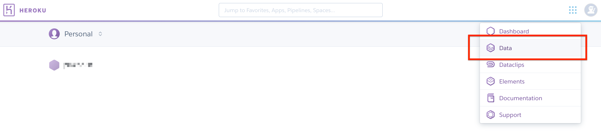
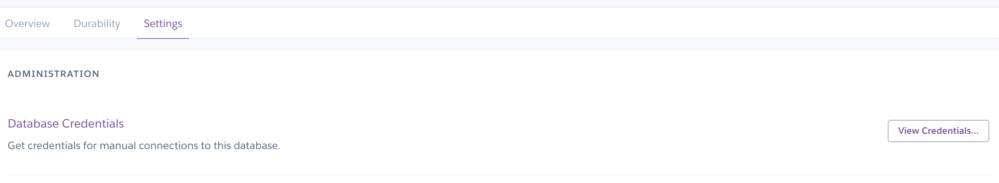
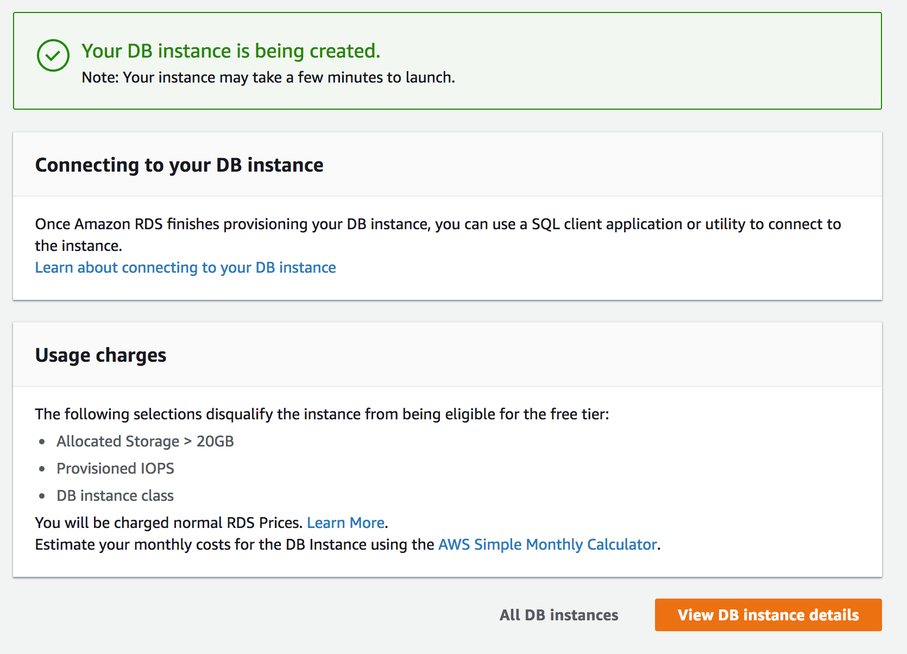
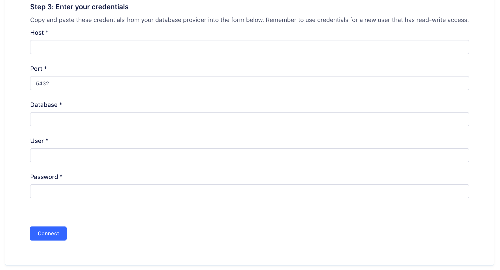

PostgreSQL, or Postgres, is an object-relational database management system (ORDBMS) with an emphasis on extensibility and standards compliance. As a database server, its primary functions are to store data securely and return that data in response to requests from other software applications.

PostgreSQL is ACID-compliant and transactional. PostgreSQL has updatable views and materialized views, triggers, foreign keys; supports functions and stored procedures, and other expandability. Developed by the PostgreSQL Global Development Group, free and open-source.

## Getting started
Segment supports the following Postgres database providers:
- [Heroku](#heroku-postgres)
- [RDS](#rds-postgres)
- [Compose](#compose-postgres)

> warning ""
> Segment supports only these Postgres databases. Postgres databases from other providers are not guaranteed to work. For questions or concerns, contact [Segment Support](https://segment.com/help/contact){:target="_blank"}

### Heroku Postgres

This guide explains how to set up a Postgres database with Heroku. Heroku is a cloud-based platform-as-a-service which simplifies the process of setting up and administering a Postgres database.

1. Signup for a Heroku account.

    The first step to setting up Postgres on Heroku is to get a Heroku account. You can sign up for a free account [here](https://signup.heroku.com/identity).

2. Log in to your Heroku account.

    You can log in to Heroku [here](https://id.heroku.com/login).

3. Create a new app and go to the Data page.

    To get to the Data page, in the Dashboard menu dropdown, select Data.

    

4. Create a Database.

    From the **Data** page, find the Heroku Postgres heading and click **Create one**.

    

5. Choose your plan.

    When you click **Create Database**, a modal appears with your plan choices. Depending on your needs, some plans may be more suitable than others - for example, more expensive plans generally have better performance and more storage. Segment recommends that new customers start with the "Standard 4" plan.

    For the fastest sync times, choose the US East region.

    After you configure these settings, click "Login to Install" and/or "Visit Heroku Dashboard to create your first app".

    

6. From your new app, go to the **Resources** tab and add the "Heroku Postgres" Add-on.

    

7. Click **Provision** and wait for the database provisioning to complete

    Click the "Heroku Postgres :: Database". The database should shift into the Available state.

    

8. View the database overview and settings.

    Click the tabs to see the database overview and settings. Click **Settings > View credentials** and save these settings for the next steps of the connection process.

    

### RDS Postgres

This guide explains how to set up a Postgres database with Amazon Relational Database Service (RDS). RDS simplifies the process of setting up and administering a Postgres database.

As a supplement to this guide, Amazon has created an official guide to [setting up a Postgres database](http://docs.aws.amazon.com/AmazonRDS/latest/UserGuide/CHAP_GettingStarted.CreatingConnecting.PostgreSQL.html).

1. Log in to your AWS account.

    If you don't have an AWS account, you can sign up for an account by visiting the [AWS homepage](http://aws.amazon.com/) and clicking 'Create an AWS Account' in the top right-hand corner.

2. Open the RDS Console.

    Log in to AWS and navigate to the [RDS console](https://console.aws.amazon.com/rds/).

3. Select the region you'd like to place the database in.

    In the top right-hand corner of the console, you should see a drop-down with the available AWS regions. For best performance, put the database in the `US West` region.

    

4. Launch a DB Instance.

    Go to the **Instances** tab on the left sidebar, and click **Launch DB Instance**.

    

5. Select the PostgreSQL Engine.

    Click on the PostgreSQL icon and then click **Next**.

    

6. Select whether or not you'd like to use the database for production purposes.

    There are two differences between the production and non-production options on this screen.

    - **Multi-AZ Deployment** means that Amazon will maintain an additional database machine in a separate Availability Zone (AZ). An availability zone is a datacenter that is independent of other availability zones in the same geographic region. In the case of the failure of one of the database machines or availability zone loss, Amazon prevents downtime by automatically transitioning to the other database machine.

    **Provisioned IOPS** helps to guarantee the disk I/O performance of a database. Due to the fact that databases often cannot keep all of their data in RAM, they must store some data on disk. When running queries, the database may have to read data from the disk. With Provisioned IOPS, Amazon guarantees that disk will be able to perform a certain number of reads and writes a second.

    If you anticipate high utilization on your Postgres database, or if downtime is unacceptable, choose **Production**. If you don't plan to have high-utilization of your database or periods of downtime are acceptable and you know how to recover from them, choose **Dev/Test**.

    After choosing, click **Next**.

    

7. Specify the DB Details.

    Enter details about the database in the next screen. If you're not sure about an option, there are some details in this document below, and some tips provided in the sidebar when you edit an option.
    The instance options are:

    **License Model:** only has one option, so choose the default.

    **DB Engine Version:** specifies the version of Postgres to use. If you aren't sure which version you'd like to use, the default is fine.

    **DB Instance Class:** selects the machine your database will run on. If you're not sure what DB instance class is suitable for your database, check the [DB Instance Classes chart ](http://docs.aws.amazon.com/AmazonRDS/latest/UserGuide/Concepts.DBInstanceClass.html)and the [Pricing Page](http://aws.amazon.com/rds/pricing/).

    **Multi-AZ Deployment:** whether or not you want a backup machine on standby. The pricing is equivalent to running two instances.

    **Storage Type:** specifies the type of disk you'd like to use for the instance. From the sidebar information:

      - General Purpose (SSD)storage is suitable for a broad range of database workloads. Provides baseline of 3 IOPS/GB and ability to burst to 3,000 IOPS.
      - Provisioned IOPS (SSD)storage is suitable for I/O-intensive database workloads. Provides flexibility to provision I/O ranging from 1,000 to 30,000 IOPS.
      - Magnetic storage may be used for small database workloads where data is accessed less frequently.

    Provisioned IOPS allows you to specify what performance guarantees you'd like on disk I/O.

    

    The database settings are:

    **DB Instance Identifier** is a unique identifier for the database. The ID must be unique for your account in a single region.

    **Master Username** is the username you will use to log in to the instance.

    **Master Password** is a password that is 8 to 128 ASCII characters long that doesn't contain the characters /, ", or @.

    When you're done entering your settings, click **Next Step**.
    

8. Configure the advanced settings

    The options for Network & Security are:

      - **VPC** specifies the Virtual Private Cloud you want the servers to reside in. If you have previously set up a VPC that you want the database in, select it here. If you aren't sure or don't have a VPC set up, select Create New VPC
      - **Subnet Group** specifies the subnets that the DB instances can use in the VPC. If you're not sure, select Create new DB Subnet Group
      - **Publicly Accessible** specifies whether your DB instances are internet-addressable. This option must be set to Yes.
      - **Availability Zone** specifies which availability zone you want the instances to reside in. If you have a preference, you can set it here, else leave it on the No Preference default.
      - **VPC Security Groups** specify traffic rules concerning what traffic can leave the instances and what traffic can arrive at the instance. Unless you've previously made a security group specifically for DB instances, it's best to create a new one.

    The options for Database Options are:

      - Database Name is an optional value for a Postgres database to be created at instance startup. We highly recommend filling this out to avoid manual creation of the database unless you have a good reason to create a database manually. This value must be 8 characters or less. If you fill this out, keep a note of what the value is.
      - Database Port specifies what port the DB listens on. The default of 5432 is fine.
      - DB Parameter Group specifies the configuration applied to the database. If you haven't created a custom parameter group that you want to use, choosing the default is fine.
      - Option Group specifies additional options of the database. At the time of writing, option groups are not available for Postgres.
      - Copy Tags To Snapshots specifies whether you want the tags metadata on DB instances copied to corresponding instance snapshots.  It's fine to leave it on the default, but you can [learn more about it here.](http://docs.aws.amazon.com/AmazonRDS/latest/UserGuide/USER_Tagging.html)
      - Enable Encryption allows you to specify whether you want the database and snapshots to be encrypted. If you choose to enable encryption, your data will be encrypted with AES-256, both in the instances themselves and in data at rest. There are some limitations though, which you can [read about here](http://docs.aws.amazon.com/AmazonRDS/latest/UserGuide/Overview.Encryption.html). You will also have to specify a key in the AWS Key Management Service. If you select Yes, another option will appear to allow you to select what key you'd like to use.

    The options for Backup are:

      - Backup Retention Period specifies how long you want to retain automatic point-in-time recovery backups. Specifying a longer period of time will increase cost.
      - Backup Window allows you to select the time of day you'd like backups to occur. If you have no preference, select No Preference.

    The options for Maintenance are:

      - Auto Minor Version Upgrade allows you to choose whether or not the database automatically receives minor version upgrade.
      - Maintenance Window allows you to select a period of time that you prefer updates and other maintenance to be applied. If you select No Preference, a random time period will be picked. We recommend choosing a time window where usage is historically low.

    When you're finished choosing settings, press `Launch DB Instance`.

    
    

9. Wait for DB Instance to be Created

    In the Instances tab, you should be able to observe the DB instance being created. After a while, the status should change to Available.

    

#### Network Permissions for Segment to RDS

This guide will help you change permissions on your Amazon Relational Database Service (RDS) instance to allow Segment to connect.

1. Open the RDS Console

    To get to the RDS console when you are logged in to AWS, visit [this page](https://console.aws.amazon.com/rds/).

2. Go to the Instances tab.

    On the left-hand sidebar, click **Instances**.

3. Go to the Connect and Details sections of the DB Instance.

    You can do this by clicking in the instance and scrolling down to the relevant sections.

    

4. Click on the security group.

    This should bring you to a page to configure the active security group.

    

5. Click on the Inbound tab.

    This should bring you to a screen that looks like this

    

6. Click **Edit** to add a new rule.

    Select PostgreSQL as the type. For **Source**, change the custom IP to `52.25.130.38/32`. This will allow Segment to connect to the instance. Press Save when done.
    

Segment should be able to connect to your database now!

### Compose Postgres

Compose is the first DBaaS (Database as a Service) of its kind, geared at helping developers spend more time building their applications rather than wrestling with database provisioning and maintenance. Compose provides easy to deploy and scale data stores and services in many flavors: PostgreSQL, MongoDB, RethinkDB, Elasticsearch, Redis, etcd, and RabbitMQ.

Using Compose, companies can deploy databases instantly with backups, monitoring, performance tuning, and a full-suite of management tools. Compose Enterpise brings all this to the corporate VPC (virtual private cloud).

Compose uses Segment for hooking together web analytics, email, and social tracking and manages its Segment warehouse on PostgreSQL. Compose is pleased to be able to harness [the power of Postgres to query Segment data and be able create custom reports.

1. set up PostgreSQL

    If you don't yet have an account with Compose, [sign-up](https://www.compose.com/signup) and select the PostgreSQL database to get started.

    For those of you already on Compose, if don't yet have a PostgreSQL instance, you can add one from the Deployments page in the management console by clicking "Create Deployment" then selecting PostgreSQL or just [add a PostgreSQL deployment](https://help.compose.com/docs/postgresql-on-compose) to your account.

    

    Once your PostgreSQL deployment is spun up, you may want to [create a user](https://www.compose.io/articles/compose-postgresql-making-users-and-more/) to be the owner of the database you'll use for Segment. There is already an admin user role that is generated on initialization of your deployment, but this user has full privileges for your deployment so you may want to create additional users with more specific privileges. You may also want to manually scale up your deployment for the initial load of Segment data since it loads the past 2 months of data by default. You can then scale it back down according to your data needs after the initial load. The easy-to-use management console lets you perform these tasks, monitor your deployments, configure security settings, manage backups, and more.

    Now, all you need to do is create a database where your Segment data will live. You can create a database directly from the Data Browser interface in the Compose management console, by using a tool such as the [pgAdmin GUI](http://www.pgadmin.org/download/) or programmatically using code you've written. For simplicity, this database is simply named "segment" and associated it to the "compose" user as the owner. Here is the SQL statement to create the database for Segment data, using the default PostgreSQL arguments (set yours appropriately to your requirements):

    ```sql
    CREATE DATABASE segment
    WITH OWNER = compose
    ENCODING = 'SQL_ASCII'
    TABLESPACE = pg_default
    LC_COLLATE = 'C'
    LC_CTYPE = 'C'
    CONNECTION LIMIT = -1;
    ```

    And that's it! You don't even need to create any tables - Segment will handle that for you.

2. Browse & Query

    And now the fun part - browsing and querying the data!

    You'll notice in your PostgreSQL database that a new schema has been created for each source that was synced. Under the production source schema a whole bunch of tables were created. You can see the tables in the Compose data browser "Tables" view:

    

    When the Segment data is loaded to the PostgreSQL database, several tables are created by default: `aliases`, `groups`, `identifies`, `pages`, `screens` and `tracks`. You might also have `accounts` and `users` tables if you use unique calls for groups and for identifies. To learn more about these default tables and their fields, see the [Segment schema documentation](https://segment.com/docs/connections/storage/warehouses/schema/).

    All of the other tables will be event-specific, according to the event names and properties you use in your `track` calls. The number of tables will depend on the number of unique events you're tracking. For example, at Compose, there is a track call for when customers view their deployments such as:

    ```js
    analytics.track('deployments_show', {
    deployment_name: 'heroic-rabbitmq-62',
    deployment_type: 'RabbitMQ'
    });
    ```

    In the Postgres Segment database, there will then be a table named "deployments_show" which can be queried for that deployment to see how many times it was viewed:

    ```sql
    SELECT COUNT(id)
    -- Don't forget the schema: FROM <source>.<table>
    FROM production.deployments_show
    WHERE deployment_name = 'heroic-rabbitmq-62';
    ```

    The result is 18 times in the past 2 months by a particular database user. To verify, just join to the identifies table, which contains user data, through the `user_id` foreign key:

    ```sql
    SELECT DISTINCT i.name
    FROM production.identifies i
    JOIN production.deployments_show ds ON ds.user_id = i.user_id
    WHERE ds.deployment_name = 'heroic-rabbitmq-62';
    ```

    A more interesting query for this, however, might be to see how many deployments were created in November using the "deployments_new" event:

    ```sql
    SELECT COUNT(DISTINCT id)
    FROM production.deployments_new
    WHERE original_timestamp &gt;= '2015-11-01'
    AND original_timestamp &lt; '2015-12-01';
    ```

    This way, you can create custom reports for analysis on the tracking data, using SQL as simple or as complex as needed, to gain insights which Segment-integrated tracking tools may not be able to easily find.


### Database set up - Service user and permissions

Once you have your Postgres database running, you should do a few more things before connecting the database to Segment.

Your database probably has an `admin` username and password. While you _could_ give these credentials directly to Segment, for security purposes you should instead create a separate "service" user. Do this for any other third-parties who connect with your database. This helps isolate access, and makes it easier to audit which accounts have done what.

To use the SQL commands here, [connect to your database using a command line tool](https://docs.aws.amazon.com/AmazonRDS/latest/UserGuide/UsingWithRDS.IAMDBAuth.Connecting.AWSCLI.PostgreSQL.html) such AWSCLI or psql Client.

```sql
-- this command creates a user named "segment" that Segment will use when connecting to your Redshift cluster.
CREATE USER segment WITH PASSWORD '<enter password here>';

-- allows the "segment" user to create new schemas and temporary tables on the specified database.
GRANT CREATE, TEMPORARY ON DATABASE <enter database name here> TO segment;
```

### Connect with Segment

1. Open up Segment in another browser window or tab

    Visit the [Segment Workspaces screen](http://segment.com/workspaces). Click the workspace you'd like the database to be associated with.


2. Click **Add Destination**.

    In the Workspace, you can find the button beside the Destinations.


3. Either select "Warehouses" categories from the left-hand sidebar, or use the search field and look for "Postgres".


4. Configure the Database Connection.

    Select Postgres database.  Then, copy the relevant settings into the text fields on this page and clicking **Connect**.

    

5. Verify that the database connected successfully.

    You should see a message indicating that the connection was successful. If not, check that you entered the settings correctly. If it still isn't working, feel free to [contact us](https://segment.com/help/contact/)!

### Sync schedule




## Security
To make sure your Postgres database is secure:
- Log in with a user that has read and write permissions so that Segment can write to your database.
- Whitelist the Segment IP (`52.25.130.38/32`). Otherwise, Segment can't load your data.
- Create a service user that has `read/write` permissions.
- Always require SSL/TLS and make sure your data warehouse can only accept secure connections. Segment only connects to your data warehouse using SSL/TLS.

## Best Practices

Once you've got your data in Postgres, you can do even more with it. You might develop an app that performs various functions based on different events being loaded to the database, potentially using [RabbitMQ](https://www.compose.io/articles/going-from-postgresql-rows-to-rabbitmq-messages/) as your asynchronous message broker. For example, you might want a banner to appear once your 1000th customer has signed up. The data is at your fingertips; you just need to decide how to use it.

### Query Speed

The speed of your queries depends on the capabilities of the hardware you have chosen as well as the size of the dataset. The amount of data utilization in the cluster will also impact query speed. Check with your hosting provider or Postgres docs for performance best practices.

### Single and Double Quotes in PostgreSQL
If you use double quotes on the name of a table, column, index, or other object when you create it, and if there is even one capital letter in that identifier, you will need to use double quotes every single time you query it.

Single quotes and double quotes in PostgreSQL have completely different jobs, and return completely different data types.  Single quotes return text strings.  Double quotes return identifiers, but with the case preserved.

If you create a table using double quotes:

```sql
CREATE TABLE "Example" (
 ...
);
```

We have now created a table in which the table name has not been forced to lowercase, but which has preserved the capital E.  This means that the following query will now fail:

```sql
select * from example;
ERROR: relation "example" does not exist
```

For more information on single vs double follow [this link](http://blog.lerner.co.il/quoting-postgresql/).

## FAQs

### Can I add an index to my tables?

Yes! You can add indexes to your tables without blocking Segment syncs. However, we recommend limiting the number of indexes you have. Postgres's native behavior requires that indexes update as more data is loaded, and this can slow down your Segment syncs.

## Troubleshooting

<table>
    <tr>
        <td>Permission denied for database</td>
        <td>The syncs are failing due to a permissions issue. The user you configured does not have permission to connect to the appropriate database. To resolve these errors: connect to your warehouse using the owner account, or grant permissions to the account you use to connect to Segment.  You can correct these permissions by running the following SQL statement, replacing `<user>` with the account you use to connect to Segment:

`GRANT CONNECT ON DATABASE <database_name> TO <user>`</td>
    </tr>
    <tr>
        <td>Permission denied for schema</td>
        <td>The syncs for the source, `<source_name>`, are failing because of a permissions issue. In most cases, the user connected to Segment does not have permission to view the necessary schemas in the warehouse.

To resolve these errors, connect your warehouse using the owner account, or grant permissions to the user you use to connect to Segment. You can correct these permissions by running the following SQL statement - Replace `user` with the user you use to connect to Segment, and run this statement for each schema in the warehouse.

`GRANT ALL PRIVILEGES ON ALL TABLES IN SCHEMA <schema_name> TO <user>`</td>
    </tr>
    <tr>
        <td>Dial TCP: no such host</td>
        <td>We are unable to connect to the warehouse host, which is causing the syncs to fail. This error is usually due to an invalid host address, a warehouse hosted on a private IP, or a credentials issue.

In order to resolve the error, check the following settings:

- The host address listed in your Segment warehouse settings is correct
- The host is configured with a _publicly_ accessible IP address
- The username and password you use to connect to your Segment workspace matches the username and password on the Warehouse directly</td>
    </tr>
    <tr>
        <td>Dial TCP: i/o timeout</td>
        <td>The warehouse syncs are failing due to a connection issue:

`dial tcp XX.XXX.XXX.XXX:XXXX: i/o timeout`

This error can be caused for a few reasons:

- Your Warehouse went offline.
- There's a setting needed for Segment to connect which hasn't been correctly configured. Refer to our Warehouse docs to ensure all steps outlined there have been followed.</td>
    </tr>
    <tr>
        <td>Schema <schema_name> does not exist</td>
        <td>The syncs are failing due to a permissions issue. It looks like the user connected does not have permission to create schemas in your warehouse.

To resolve these errors we recommend connecting to your warehouse using the owner account, or granting permissions to the current account you use to connect to Segment. You can correct these permissions by running the following SQL statement - Replace `user` with the account you use to connect to Segment, and run this statement for each schema in the warehouse.

`GRANT CREATE ON DATABASE <database_name> TO <user>`</td>
    </tr>
</table>
