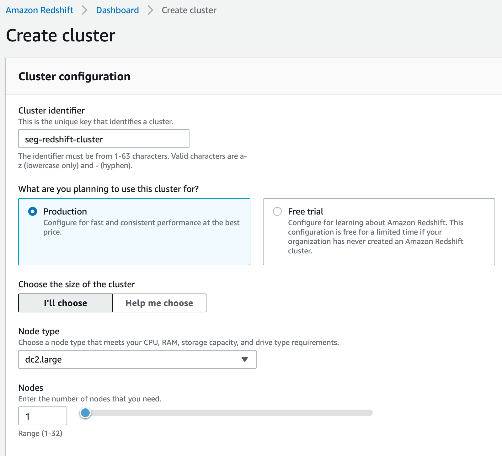
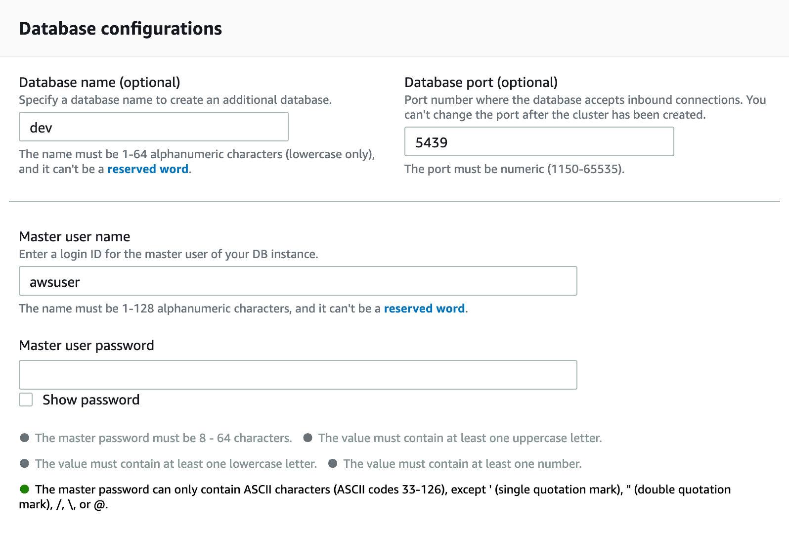
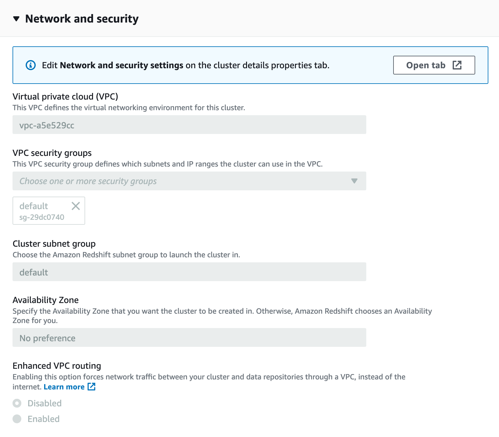
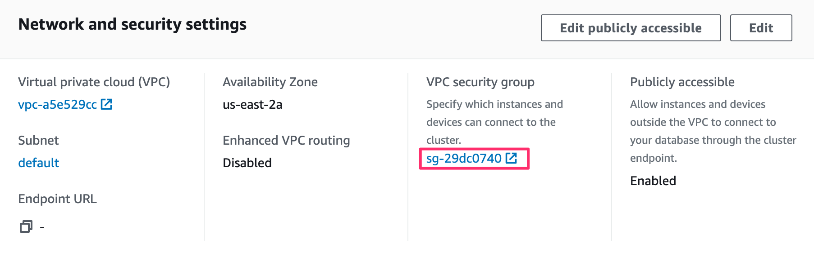
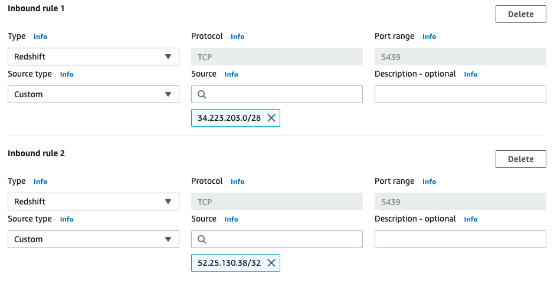
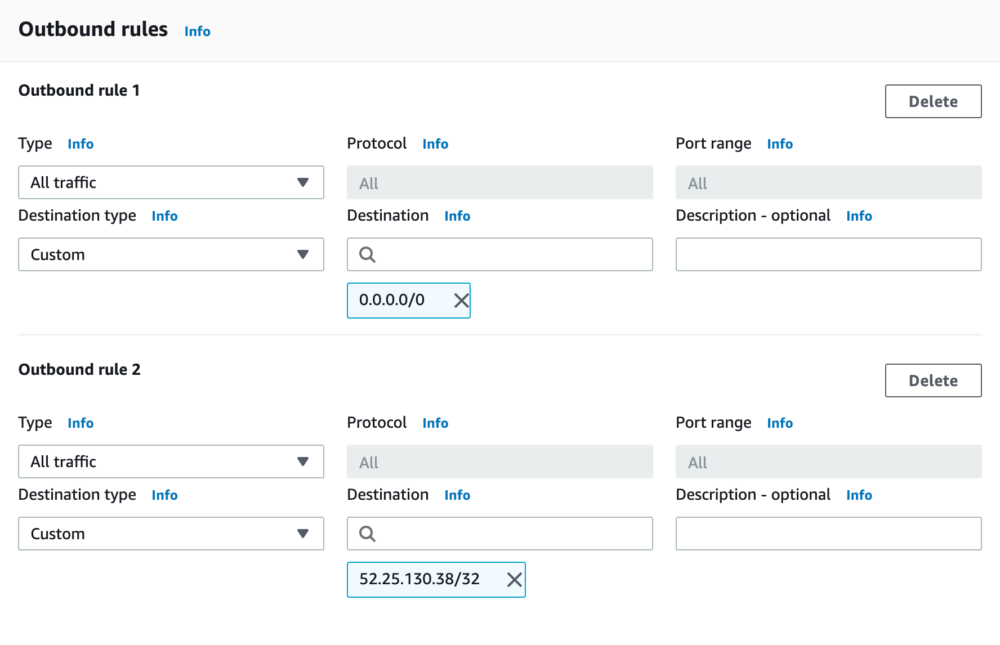
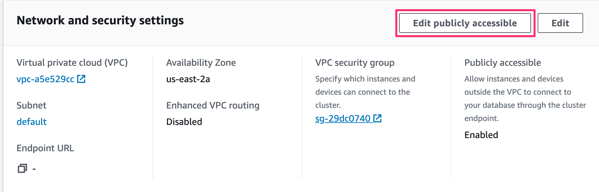

This guide explains the process to provision a Redshift cluster and allow the Segment warehouse connector to write to it.

## Getting Started

Complete the following steps to provision your Redshift cluster, and connect Segment to it:

1. [Choose the best instance for your needs](#choose-the-best-instance-for-your-needs)
2. [Provision a new Redshift Cluster](#provision-a-new-redshift-cluster)
3. [Create a database user](#create-a-database-user)
4. [Connect Redshift to Segment](#connect-redshift-to-segment)

## Choose the best instance for your needs

While the number of events (database records) are important, the storage capacity usage of your cluster depends primarily on the number of unique tables and columns created in the cluster. Keep in mind that each unique `.track()` event creates a new table, and each property sent creates a new column in that table. To avoid storing unnecessary data, start with a detailed [tracking plan](/docs/protocols/tracking-plan/create/) before you install Segment libraries to ensure that only the necessary events are passed to Segment.

Redshift gives the option of three cluster types:

- **Dense Compute**: These clusters are designed to maximize query speed and performance at the expense of storage capacity. This is done by using fast CPUs, large amounts of RAM and solid-state storage. While there are no hard and fast rules for sizing a cluster, customers with fewer than 20 million monthly events should start with a single DC1 node cluster and add nodes as needed. A single node cluster includes 200GB, with a max size of 2.56TB.
- **Dense Storage** These clusters are designed to maximize the amount of storage capacity for customers who have 100s of millions of events and prefer to save money on Redshift hosting costs. This is done by using slower CPUs, less RAM, and disk-based storage. A single DS2 node cluster includes 2TB of space, with a max size of 16TB.
- **RA3**: These clusters provide managed storage to help optimize your data warehouse splitting the cost of compute and storage.


## Provision a new Redshift Cluster

Follow the steps below to create a new Redshift cluster. If you have a cluster already provisioned, skip this step.

1. From the Redshift dashboard, click **Create Cluster**.

2. Name your new cluster, and select the type and size of the nodes within the cluster. 

3. Configure the database connection details and admin user for the cluster. 

Now that you've provisioned your Redshift cluster, you'll need to configure your Redshift cluster to allow Segment to access it.

## Create a Database User

The username and password you've already created for your cluster is your admin password, which you should keep for your own use. For Segment, and any other 3rd-parties, it is best to create distinct users. This allows you to isolate queries from one another using [WLM](http://docs.aws.amazon.com/redshift/latest/dg/c_workload_mngmt_classification.html) and perform audits easier.

To create a [new user](http://docs.aws.amazon.com/redshift/latest/dg/r_Users.html), log into the Redshift cluster directly (using the credentials you defined in Step 3 above) and run the following SQL commands:

```sql
-- create a user named "segment" that Segment will use when connecting to your Redshift cluster.
CREATE USER segment PASSWORD '<enter password here>';

-- allows the "segment" user to create new schemas on the specified database. (this is the name you chose when provisioning your cluster)
GRANT CREATE ON DATABASE "<enter database name here>" TO "segment";
```

When you configure your warehouse in Segment, use the username/password you've created here instead of your admin account.

## Connect Redshift to Segment

After creating a Redshift warehouse, the next step is to connect Segment:

1. In the Segment App, navigate to the Connections tab and click **Add Destination**
2. Search for and select `Redshift`
3. Add the necessary connection details, add your Redshift credentials
4. Select which sources and collections/properties will sync to this Warehouse

## Security

### VPC
VPCs keep servers inaccessible to traffic from the internet. With VPC, you're able to designate specific web servers access to your servers.  In this case, you will be whitelisting the [Segment IPs](/docs/connections/storage/warehouses/faq#which-ips-should-i-whitelist) to write to your data warehouse.

### SSL/TLS
Always require SSL/TLS and make sure your data warehouse can only accept secure connections. Segment only connects to your data warehouse using SSL/TLS.

## Best practices

### Networking

Redshift clusters are created in a VPC subnet. To configure:

1. Navigate to the Redshift cluster you created previously. Click **Edit**.

2. Expand the **Network and security** section and click *Open tab* to access the Network and security settings. 

3. Click the VPC security group to access its settings. The Security group opens in a new tab. 

4. Click the Security group in the list to access its settings.

5. On the Inbound tab, add or edit a rule to enable Segment to write to your Redshift port from `52.25.130.38/32`. 

6. On the Outbound tab, ensure Redshift can make outbound requests to the Segment S3 bucket. The default behavior is to allow all outbound traffic, but security groups can limit outbound behavior. 

6. Navigate back to the cluster's settings, and click **Edit publicly accessible** to allow access to the cluster from outside of the VPC. 

### Electing to encrypt  data 

You can encrypt  data in the Redshift console. Encryption does not affect Segment's ability to read or write.


### Distribution Key

The `id` column is the common distribution key used across all tables. When you execute a query, the Redshift query optimizer redistributes the rows to the compute nodes as needed to perform any joins and aggregations. The goal in selecting a table distribution style is to minimize the impact of the redistribution step by locating the data where it needs to be before the query is executed.

### Reserved Words

Redshift limits the use of [reserved words](http://docs.aws.amazon.com/redshift/latest/dg/r_pg_keywords.html) in schema, table, and column names. Additionally, avoid naming traits or properties that conflict with top level Segment fields (for example, `userId`, `receivedAt`, or `messageId`). These traits and properties that conflict with Redshift or Segment fields are `_`-prefixed when Segment creates columns for them in your schema.

Redshift limits the use of integers at the start of a schema or table name. Segment prepends an underscore `_` to any schema, table or column name that starts with an integer. A source named `3doctors` is loaded into a Redshift schema named `_3doctors`.

### CPU

In a usual workload Redshift around 20-40% of CPU. Segment takes advantage of the COPY command to make full use of your cluster to load your data as efficiently as possible.

## Troubleshooting

### How do I improve Query Speed?

The speed of your queries depends on the capabilities of the hardware you have chosen as well as the size of the dataset. The amount of data use in the cluster will also impact query speed. For Redshift clusters, if you're above 75% capacity, you will likely experience degradation in query speed. [Here's a guide on how to improve your query speeds.](/docs/connections/storage/warehouses/redshift-tuning/)

## FAQ

### How do I sync data in and out between Redshift and Segment?

It's often the case that customers want to combine 1st-party transactional and operational data with Segment data to generate a full view of the customer. The challenge is that those data sets are often stored in separate data warehouses.

If you're interested in importing data into a Redshift cluster, it's important that you follow these [guidelines](/docs/connections/storage/warehouses/faq/).

Additionally, there a number of tools which provide syncing services between databases (mySQL, SQL Server, Oracle, PostgreSQL). Here is a list of some we've seen used by customers.

- [SymmetricDS (Open Source)](http://www.symmetricds.org/?__hstc=222691652.f2c5ed50a3a9703ac3be5283918044ad.1436399176206.1437192161002.1437244552315.24&__hssc=222691652.12.1437244552315&__hsfp=2203243415)
- [FlyData](https://www.flydata.com/products/?__hstc=222691652.f2c5ed50a3a9703ac3be5283918044ad.1436399176206.1437192161002.1437244552315.24&__hssc=222691652.12.1437244552315&__hsfp=2203243415)
- [Attunity](http://www.attunity.com/solutions/cloud/amazon-redshift?__hstc=222691652.f2c5ed50a3a9703ac3be5283918044ad.1436399176206.1437192161002.1437244552315.24&__hssc=222691652.12.1437244552315&__hsfp=2203243415)
- [Informatica](http://www.informaticacloud.com/infrastructure/synchronize-web-data-amazon-redshift?__hstc=222691652.f2c5ed50a3a9703ac3be5283918044ad.1436399176206.1437192161002.1437244552315.24&__hssc=222691652.12.1437244552315&__hsfp=2203243415)

You can also unload data to a s3 bucket and then load the data into another Redshift instance manually.

- [Unload data from Redshift to S3](http://docs.aws.amazon.com/redshift/latest/dg/t_Unloading_tables.html?__hstc=222691652.f2c5ed50a3a9703ac3be5283918044ad.1436399176206.1437192161002.1437244552315.24&__hssc=222691652.12.1437244552315&__hsfp=2203243415)
- [Load data from S3 to Redshift](http://docs.aws.amazon.com/redshift/latest/dg/tutorial-loading-data.html?__hstc=222691652.f2c5ed50a3a9703ac3be5283918044ad.1436399176206.1437192161002.1437244552315.24&__hssc=222691652.12.1437244552315&__hsfp=2203243415)

### Can I customize my sync schedule?




### Can I use an SSH tunnel to connect to my Redshift instance?

Segment does not currently support SSH tunneling to Redshift. You can usually allow Segment's ETL to write to Redshift without leaving the cluster available to other connections by using IP level restrictions.
