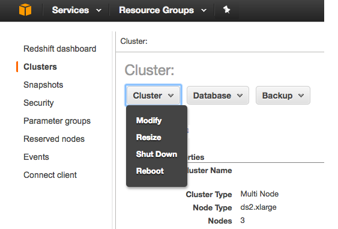

This guide will explain how to provision a Redshift cluster and allow the Segment warehouse connector to write to it.

This document was last updated on 23rd April, 2018. If you notice any gaps, out-dated information or simply want to leave some feedback to help us improve our documentation, [let us know](https://segment.com/help/contact)!

## Getting Started

There are four steps to get started using Redshift with Segment:

1. Pick the best instance for your needs
2. Provision a new Redshift Cluster
3. Create a database user
4. Connect Redshift to Segment

### Pick the best instance for your needs

While the number of events (database records) are important, the storage capacity utilization of your cluster depends primarily on the number of unique tables and columns created in the cluster. Keep in mind that each unique `.track()` event creates a new table, and each property sent creates a new column in that table. For reason, we highly recommend starting with a detailed [tracking plan](/docs/protocols/tracking-plan/create/) before implementing Segment libraries to ensure that only necessary events are being passed to Segment in a consistent way.

There are two kinds of Redshift clusters: **Dense Compute** and **Dense Storage**

**Dense Compute** clusters are designed to maximize query speed and performance at the expense of storage capacity. This is done by using fast CPUs, large amounts of RAM and solid-state storage. While there are no hard and fast rules for sizing a cluster, we recommend that customers with fewer than 20 million monthly events start with a single DC1 node cluster and add nodes as needed. A single node cluster includes 200GB, with a max size of 2.56TB.

**Dense Storage** clusters are designed to maximize the amount of storage capacity for customers who have 100s of millions of events and prefer to save money on Redshift hosting costs. This is done by using slower CPUs, less RAM, and disk-based storage. A single DS2 node cluster includes 2TB of space, with a max size of 16TB.

### Provision a new Redshift Cluster

You can skip this step if you already have a Redshift cluster:
1. Open the Redshift Console
   

2. Click on "Launch Cluster"
   

3. Fill out the cluster details (make sure to select a secure password!)
   

4. Choose your cluster size:
   

5. set up your cluster Security Group or VPC and proceed to review (see below for instructions on settings up a VPC group)


Now that you've provisioned your Redshift cluster, you'll need to configure your Redshift cluster to allow Segment to access it.

### Create a Database User

The username and password you've already created for your cluster is your admin password, which you should keep for your own usage. For Segment, and any other 3rd-parties, it is best to create distinct users. This will allow you to isolate queries from one another using [WLM](http://docs.aws.amazon.com/redshift/latest/dg/c_workload_mngmt_classification.html) and perform audits easier.

To create a [new user](http://docs.aws.amazon.com/redshift/latest/dg/r_Users.html), you'll need to log into the Redshift database directly and run the following SQL commands:

```sql
-- create a user named "segment" that Segment will use when connecting to your Redshift cluster.
CREATE USER segment PASSWORD '<enter password here>';

-- allows the "segment" user to create new schemas on the specified database. (this is the name you chose when provisioning your cluster)
GRANT CREATE ON DATABASE "<enter database name here>" TO "segment";
```

When setting up your warehouse in Segment, use the username/password you've created here instead of your admin account.

### Connect Redshift to Segment

After creating a Redshift warehouse, the next step is to connect Segment:

1. In the Segment App, select 'Add Destination'
2. Search for and select 'Redshift'
3. Select which sources and collections/properties will sync to this Warehouse
3. Enter your Redshift credentials

## Security
VPCs keep servers inaccessible to traffic from the internet. With VPC, you're able to designate specific web servers access to your servers.  In this case, you will be whitelisting the [Segment IPs](/docs/connections/storage/warehouses/faq#which-ips-should-i-whitelist) to write to your data warehouse.

## Best Practice

### Networking

Redshift clusters can either be in a **EC2 Classic subnet** or **VPC subnet**.

If your cluster has a field called `Cluster Security Groups`, proceed to [EC2 Classic](//docs/connections/storage/catalog/redshift/#ec2-classic)


Or if your cluster has a field called `VPC Security Groups`, proceed to [EC2 VPC](/docs/connections/storage/catalog/redshift/#ec2-vpc)


#### EC2-Classic

1. Navigate to your Redshift Cluster settings: `Redshift Dashboard > Clusters > Select Your Cluster`

2. Click on the Cluster Security Groups

   

3. Open the Cluster Security Group

   

4. Click on "Add Connection Type"

   

5. Choose Connection Type CIDR/IP and authorize Segment to write into your Redshift Port using `52.25.130.38/32`

   

#### EC2-VPC

1. Navigate to your `Redshift Dashboard > Clusters > Select Your Cluster`

2. Click on the VPC Security Groups

   

3. Select the "Inbound" tab and then "Edit"

   

4. Allow Segment to write into your Redshift Port using `52.25.130.38/32`

   

  You can find more information on that [here](http://docs.aws.amazon.com/redshift/latest/mgmt/managing-clusters-vpc.html). 

5. Navigate back to your Redshift Cluster Settings: `Redshift Dashboard > Clusters > Select Your Cluster`

6. Select the "Cluster" button and then "Modify"
   

7. Make sure the "Publicly Accessible" option is set to "Yes"
   

8. Check your "Outbound" tab to make sure your Redshift instance is set up to make outbound requests to the Segment S3 bucket. The default behavior is to allow all outbound traffic, but security groups can be put in place to limit outbound behavior.

  

9. If your outbound traffic is not configured to allow all traffic, you can switch to default settings or specifically whitelist the Segment S3 buckets

   

### Electing to encrypt your data 

You can elect to encrypt your data in your Redshift console and it will not affect Segment's ability to read or write.


### Distribution Key

The `id` column is the common distribution key used across all tables. When you execute a query, the Redshift query optimizer redistributes the rows to the compute nodes as needed to perform any joins and aggregations. The goal in selecting a table distribution style is to minimize the impact of the redistribution step by locating the data where it needs to be before the query is executed.

### Reserved Words

Redshift limits the use of [reserved words](http://docs.aws.amazon.com/redshift/latest/dg/r_pg_keywords.html) in schema, table, and column names. Additionally, you should avoid naming traits or properties that conflict with top level Segment fields (e.g. userId, receivedAt, messageId, etc.). These traits and properties that conflict with Redshift or Segment fields will be `_`-prefixed when we create columns for them in your schema, but keeping track of which is which (Segment-reserved vs. custom property columns) can be tricky!

Redshift limits the use of integers at the start of a schema or table name. We will automatically prepend a `_` to any schema, table or column name that starts with an integer. So a source named '3doctors' will be loaded into a Redshift schema named `_3doctors`.


### CPU

In an usual workload we have seen Redshift using around 20-40% of CPU, we take advantage of the COPY command to ensure to make full use of your cluster to load your data as fast as we can.

## Troubleshooting

### How do I improve Query Speed?

The speed of your queries depends on the capabilities of the hardware you have chosen as well as the size of the dataset. The amount of data utilization in the cluster will also impact query speed. For Redshift clusters if you're above 75% utilization, you will likely experience degradation in query speed. [Here's a guide on how to improve your query speeds.](/docs/connections/storage/warehouses/redshift-tuning/)

## FAQ

### How do I sync data in and out between Redshift and Segment?

It's often the case that our customers want to combine 1st party transactional and operational data their Segment data to generate a 360 degree view of the customer. The challenge is that those data sets are often stored in separate data warehouses.

If you're interested in importing data into a Redshift cluster, it's important that you follow these [guidelines](/docs/connections/storage/warehouses/faq/).

Additionally, there a number of tools which provide syncing services between databases (mySQL, SQL Server, Oracle, PostgreSQL). Here is a list of some we've seen used by customers.

- [SymmetricDS (Open Source)](http://www.symmetricds.org/?__hstc=222691652.f2c5ed50a3a9703ac3be5283918044ad.1436399176206.1437192161002.1437244552315.24&__hssc=222691652.12.1437244552315&__hsfp=2203243415)
- [FlyData](https://www.flydata.com/products/?__hstc=222691652.f2c5ed50a3a9703ac3be5283918044ad.1436399176206.1437192161002.1437244552315.24&__hssc=222691652.12.1437244552315&__hsfp=2203243415)
- [Attunity](http://www.attunity.com/solutions/cloud/amazon-redshift?__hstc=222691652.f2c5ed50a3a9703ac3be5283918044ad.1436399176206.1437192161002.1437244552315.24&__hssc=222691652.12.1437244552315&__hsfp=2203243415)
- [Informatica](http://www.informaticacloud.com/infrastructure/synchronize-web-data-amazon-redshift?__hstc=222691652.f2c5ed50a3a9703ac3be5283918044ad.1436399176206.1437192161002.1437244552315.24&__hssc=222691652.12.1437244552315&__hsfp=2203243415)

You can also unload data to a s3 bucket and then load the data into another Redshift instance manually.

- [Unload data from Redshift to S3](http://docs.aws.amazon.com/redshift/latest/dg/t_Unloading_tables.html?__hstc=222691652.f2c5ed50a3a9703ac3be5283918044ad.1436399176206.1437192161002.1437244552315.24&__hssc=222691652.12.1437244552315&__hsfp=2203243415)
- [Load data from S3 to Redshift](http://docs.aws.amazon.com/redshift/latest/dg/tutorial-loading-data.html?__hstc=222691652.f2c5ed50a3a9703ac3be5283918044ad.1436399176206.1437192161002.1437244552315.24&__hssc=222691652.12.1437244552315&__hsfp=2203243415)

### Can I customize my sync schedule?




### Can I use an SSH tunnel to connect to my Redshift instance?

Segment does not currently support SSH tunneling to Redshift. You can usually allow Segment's ETL to write to Redshift without leaving the cluster available to other connections by using IP level restrictions.
