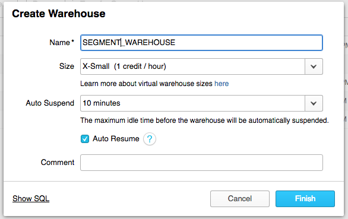
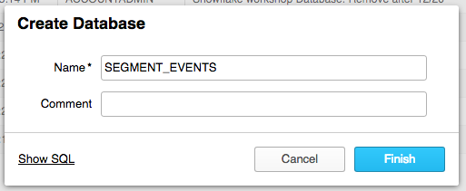
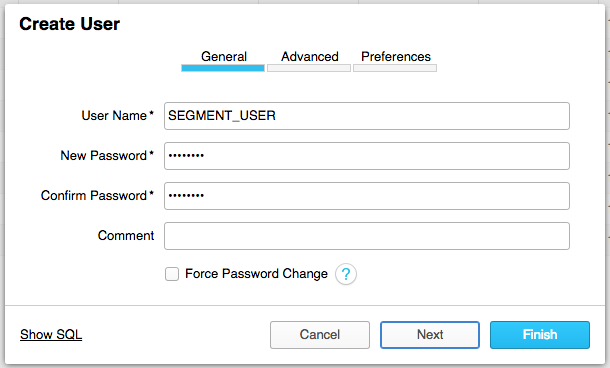
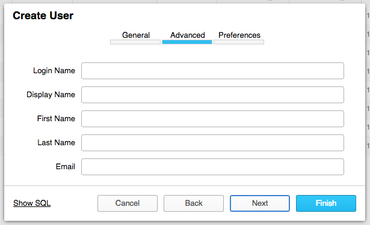
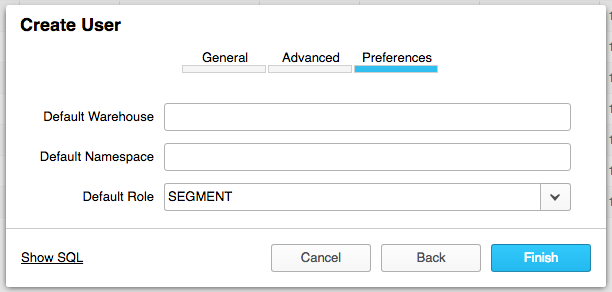
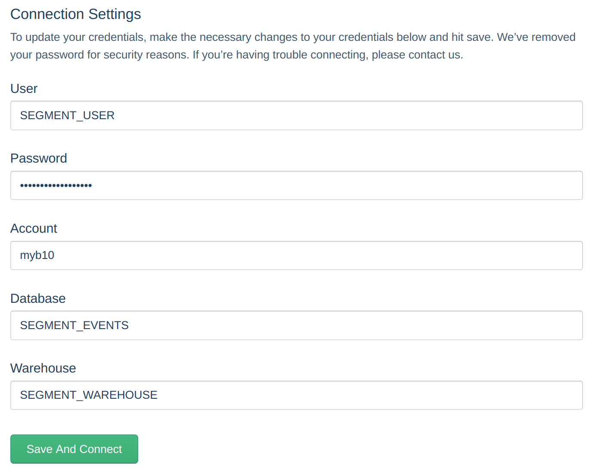
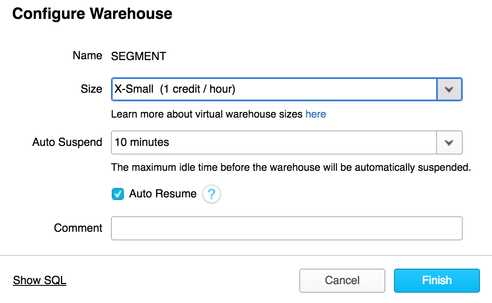

[Snowflake](https://docs.snowflake.net/manuals/index.html) is a data warehouse built for the cloud. Snowflake delivers performance, simplicity, concurrency and affordability.

## Getting Started

There are six steps to get started using Snowflake with Segment. Make sure that you are running the commands in each step while logged in as an `ACCOUNTADMIN`, or an account that has `MANAGE GRANTS`. While we are using predefined user (`SEGMENT_USER`), role (`SEGMENT`), warehouse (`SEGMENT_WAREHOUSE`) and database (`SEGMENT_EVENTS`) names, you can use any names you like.

1. Create Virtual Warehouse
2. Create Database
3. Create Role for Segment
4. Create User for Segment
5. Test the User and Credentials
6. Connect Snowflake to Segment

### Create Virtual Warehouse

The Segment Snowflake destination requires a Snowflake [virtual warehouse](https://docs.snowflake.net/manuals/user-guide/warehouses.html) to load data in to. To avoid conflicts with other regular operations in your cluster, we recommend creating a new warehouse just for Segment loads, but this is not mandatory. An X-Small warehouse works for most customers when starting.



```sql
CREATE WAREHOUSE "SEGMENT_WAREHOUSE"
  WITH WAREHOUSE_SIZE = 'XSMALL'
    WAREHOUSE_TYPE = 'STANDARD'
    AUTO_SUSPEND = 600
    AUTO_RESUME = TRUE;
```

Make sure `AUTO_SUSPEND` is set to ~10 minutes in the UI (or 600 if using SQL) and `AUTO_RESUME` is enabled, to avoid extra costs.

### Create Database

The Segment Snowflake destination creates its own schemas and tables, so it's recommended to create a new database for this purpose to avoid name conflicts with existing data.



```sql
CREATE DATABASE "SEGMENT_EVENTS";
```

### Create Role for Segment

You need to run these commands rather than creating a role with the "Create Role" dialog in the UI.

This role will be attached to Segment's user and it gives just enough permissions for loading data in your database. We recommend not reusing this role for other operations.

1. Click on to Worksheets;
2. Select SEGMENT_EVENTS under database objects
3. Change role to ACCOUNTADMIN

4. Create a new role using the following command:
```sql
CREATE ROLE "SEGMENT";
```

5. Grant access to the virtual warehouse:
```sql
GRANT USAGE ON WAREHOUSE "SEGMENT_WAREHOUSE" TO ROLE "SEGMENT";
```

6. Grant access to the database:
```sql
GRANT USAGE ON DATABASE "SEGMENT_EVENTS" TO ROLE "SEGMENT";
GRANT CREATE SCHEMA ON DATABASE "SEGMENT_EVENTS" TO ROLE "SEGMENT";
```

### Create User for Segment

Finally, you need to create the user that will be connected to Segment. Be sure to use a strong, unique password.







```sql
CREATE USER "SEGMENT_USER"
  MUST_CHANGE_PASSWORD = FALSE
  DEFAULT_ROLE = "SEGMENT"
  PASSWORD = "my_strong_password"; -- Do not use this password
GRANT ROLE "SEGMENT" TO USER "SEGMENT_USER";
```

### Test the User and Credentials

Before you continue, test and validate the new user and credentials. When you can run the following commands successfully, you can connect Snowflake to Segment.

We use [snowsql](https://docs.snowflake.net/manuals/user-guide/snowsql.html) to run these verification steps.
To install and verify your accounts:

1. Download [snowsql](https://docs.snowflake.net/manuals/user-guide/snowsql.html);

2. Open the Installer and follow instructions;
3. Once the installation is complete, run the following command, replacing "account" and "user" with your Snowflake Account and username:

```
snowsql -a <account>  -u <user>
```

For accounts outside the US, the account ID includes the region. You can also find part of your account name by running the following query on your worksheet in Snowflake:

```
SELECT CURRENT_ACCOUNT();
```
4. Enter password when prompted.

5. Run the following:

```
~$ snowsql --accountname myb10 --username SEGMENT_USER
Password:
* SnowSQL * v1.1.46
Type SQL statements or !help
SEGMENT_USER#(no warehouse)@(no database).(no schema)>SELECT 1;
+---+
| 1 |
|---|
| 1 |
+---+
1 Row(s) produced. Time Elapsed: 0.093s
SEGMENT_USER#(no warehouse)@(no database).(no schema)>USE WAREHOUSE "SEGMENT_WAREHOUSE";
+----------------------------------+
| status                           |
|----------------------------------|
| Statement executed successfully. |
+----------------------------------+
1 Row(s) produced. Time Elapsed: 0.118s
SEGMENT_USER#SEGMENT_WAREHOUSE@(no database).(no schema)>USE DATABASE "SEGMENT_EVENTS";
+----------------------------------+
| status                           |
|----------------------------------|
| Statement executed successfully. |
+----------------------------------+
1 Row(s) produced. Time Elapsed: 0.130s
SEGMENT_USER#SEGMENT_WAREHOUSE@SEGMENT_EVENTS.(no schema)>!exit
```

If you would like to use the web interface, switch to the new role for the Segment user, create a new Worksheet and execute:

```sql
SELECT 1;
USE WAREHOUSE "SEGMENT_WAREHOUSE";
USE DATABASE "SEGMENT_EVENTS";
```

### Connect Snowflake to Segment

After creating a Snowflake warehouse, the next step is to connect Segment.

1. In the Segment App, select Add Destination.
2. Search for and select "Snowflake".
3. Add your credentials as follows:
- User - The user name (as created above).
- Password - The password for the user.
- Account - The account id of your cluster, not the url (e.g. url: `my-business.snowflakecomputing.com`, account-id: `my-business`. **Note:** If you are using Snowflake on AWS, the account id includes the region, for example your url might look like: `my-business.us-east-1.snowflakecomputing.com/` and your  accound-id would be: `my-business.us-east-1`)
- Database - The database name (as created above).
- Warehouse - The warehouse name (as created above).



## Security

### Whitelisting IPs

If you create a network policy with Snowflake, add the following IP address to the "Allowed IP Addresses" list: `52.25.130.38/32`

### Multi-Factor Authentication (MFA) & SSO

At this time, the Segment Snowflake destination is not compatible with Snowflake's MFA or SSO settings. If your connected user has MFA or SSO enabled, you will need to disable it for syncs to run correctly.

## Best Practices

### Auto Suspend

Set `AUTO_SUSPEND` to ~10 minutes in the UI (or 600 if using SQL) to avoid credit consumption by the Segment syncing process.



### Auto Resume

If you enable the `AUTO_SUSPEND` feature, we recommend that you also enable `AUTO-RESUME`. This will ensure that your Snowflake warehouse automatically resumes when Segment loads data. Otherwise, Segment will not be able to load data unless you [manually resume your Snowflake warehouse](https://docs.snowflake.net/manuals/user-guide/warehouses-considerations.html#automating-warehouse-resumption).

### Unique Warehouse, Database, and Role

We strongly recommend creating a unique Warehouse, Database and Role for the Segment Snowflake connection to your Snowflake instance.

## Troubleshooting

### I get "Object does not exist" when running "USE DATABASE" or "USE WAREHOUSE", even if the warehouse or the database are created.

Make sure you have created the role and assigned the proper permissions with the account `SYSADMIN` or `ACCOUNTADMIN`. Other non-system accounts don't assign the right permissions.

### I've consumed all the credits after the initial sync.

If you have used all your credits, you will need to contact Snowflake to purchase more.

Also make sure `AUTO_SUSPEND` is enabled and set to 5 or 10 minutes in the warehouse used by Segment. This setting will help avoid unintended use of credits by the Segment Snowflake destination.

### My syncs are going slower than I expect.

This complaint is most often due to _not_ using a separate Warehouse specifically for Segment.

If you're already doing so, see [this section of the Snowflake docs](https://docs.snowflake.net/manuals/user-guide/warehouses-load-monitoring.html#slow-query-performance) for more details on how to handle slow running processes.

## FAQ

### What size should I start with when creating a new Snowflake instance?

Most customers have the best luck starting with a X-Small instance.

### Why do I see so many 'Rollback' statements?

A `rollback` is issued at the end of each session to make sure there's no "in-flight" processes hanging out that could block other processes later.

### Does Segment use transactions for loading data?
We don't open transactions explicitly because that would lock resources. However, if autocommit is enabled, each statement functions as it's own transaction, and a silent commit is issued after each.

### What privileges do I need to grant?
You shouldn't need to grant any additional privileges. However, you may need to confirm that the USAGE privilege on those schemas is granted to the same role granted to the user connecting to Snowflake through data bricks.

Run these statements in Snowflake UI or CLI, and check the output to verify the permissions.

1. `SHOW GRANTS ON SCHEMA <schema_name>;`
   Look in the output to see if USAGE privilege is granted to the role you're using.
2. `SHOW GRANTS TO USER <username>;`
   Replace "username" with the login ID, and verify the correct role is assigned to that login.

Also, if the user has more than one role, make sure the role you use when doing the data pull has `USAGE` for the schema - and not just the default role. If your organization uses role inheritance (for example, `role apples` is granted to `role gravensteins`), then make sure that the role is being assigned and inherited correctly.

### Indexes
Queuing - you can use a different Warehouse for Segment, or use the recommendations from the Snowflake docs.

### Can I customize my sync schedule?




