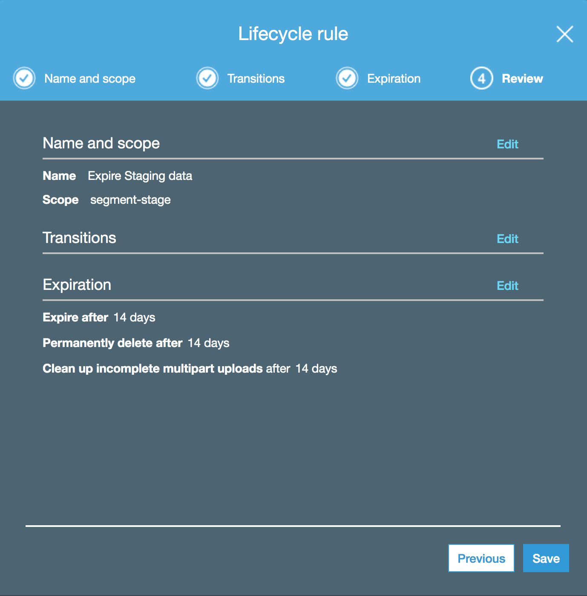
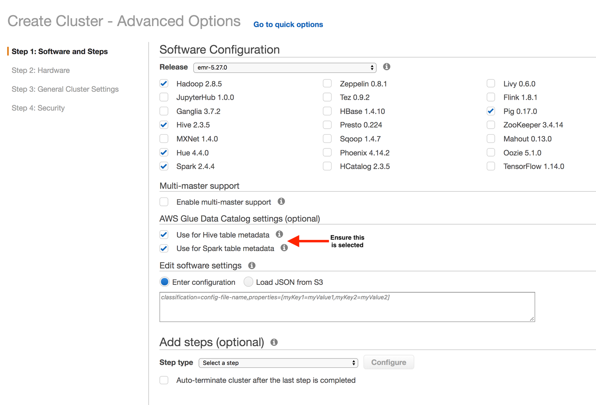
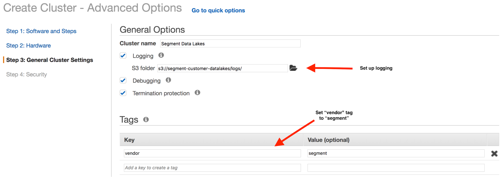
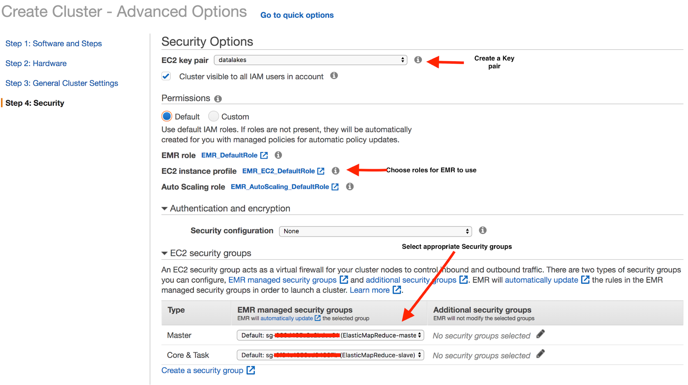
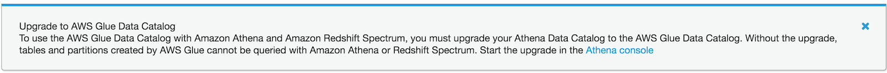




The instructions below will guide you through the process required to configure the environment required to begin loading data into your Segment Data Lake. For a more automated process, see [Set Up Segment Data Lakes](/src/connections/storage/catalog/data-lakes/index.md).


## Step 1 - Create an S3 Bucket

In this step, you'll create the S3 bucket that will store both the intermediate and final data. For instructions on creating an S3 bucket, please see Amazon's documentation, [Create your first S3 bucket](https://docs.aws.amazon.com/AmazonS3/latest/userguide/creating-bucket.html).

> info ""
> Take note of the S3 bucket name you set in this step, as the rest of the set up flow requires it. 
<!--- In these instructions, the name is `segment-data-lake`. --->

After you create your S3 bucket, create a lifecycle rule for the bucket and set it to expire staging data after **14 days**. For help on setting lifecycle configurations, see Amazon's documentation, [Setting lifecycle configuration on a bucket](https://docs.aws.amazon.com/AmazonS3/latest/userguide/how-to-set-lifecycle-configuration-intro.html).

The following lifecycle settings should be selected:
* **Expire after:** 14 days
* **Permanently delete after:** 14 days
* **Clean up incomplete mulitpart uploads:** after 14 days

<!---  --->

## Step 2 - Configure an EMR cluster

Segment requires access to an EMR cluster to perform necessary data processing. We recommend starting with a small cluster, with the option to add more compute resources as required.

### Configure the hardware and networking configuration

1. Select EMR from the AWS console by navigating to Services > Analytics > EMR.
2. Click **Create Cluster**, and select **Go to advanced options**.
3. In Advanced Options, on Step 1: Software and Steps, select the `emr-5.33.0` release and the following applications:
    - Hadoop 2.10.1
    - Hive 2.3.7
    - Hue 4.9.0
    - Spark 2.4.7
    - Pig 0.17.0
 4. Under the AWS Glue Data Catalog settings, select the following options:
    - Use for Hive table metadata
    - Use for Spark table metadata
    <!---  --->
5. Select **Next** to move to Step 2: Hardware.
6. Under the Networking section, select a Network and EC2 Subnet for your EMR instance. EMR instances can be created in either a public or private subnet. Creating the cluster in a private subnet is more secure, but requires additional configuration, while creating a cluster in a public subnet leaves it accessible from the Internet. You can configure strict security groups for EMR clusters on public subnets to prevent inbound access. See Amazon's document, [Amazon VPC Options - Amazon EMR](https://docs.aws.amazon.com/emr/latest/ManagementGuide/emr-clusters-in-a-vpc.html) for more information. As a best practice, Segment recommends that you consult with your network and security teams before you configure your EMR cluster.

7. In the Hardware Configuration section, create a cluster that includes the following on-demand nodes:
   - **1** master node
   - **2** core nodes
   - **2** task nodes 
   <!--- .

8. Select **Next** to proceed to Step 3: General Cluster Settings.

### Configure logging

9. On Step 3: General Cluster Settings, configure logging to use the same S3 bucket you configured as the destination for the final data. Once configured, logs are assigned a new prefix and separated from the final processed data.
<!--- (`segment-data-lakes` in this case) --->

10. Add a new key-value pair to the Tags section, a **vendor** key with a value of **segment**. The IAM policy uses this to provide Segment access to submit jobs in the EMR cluster.

11. Select **Next** to proceed to Step 4: Security.

<!--- --->

### Secure the cluster
12. Create or select an **EC2 key pair**.
13. Choose the appropriate roles in the **EC2 instance profile**.
14. Expand the EC2 security group section and select the appropriate security groups for the Master and Core & Task types.
15. Update any additional security options, then select **Create cluster**.

 <!--- 

The image uses the default settings. You can make these settings more restrictive, if required. --->

> note ""
> **NOTE:** If you are updating the EMR cluster for your Data Lakes instance, note the EMR cluster ID. 

## Step 3 - Create an Access Management role and policy

The following steps provide examples of the IAM Role and IAM Policy.

### IAM Role

Create a `segment-data-lake-role` role for Segment to assume. Attach the following trust relationship document to the role:

```json
{
  "Version": "2012-10-17",
  "Statement": [
    {
      "Sid": "",
      "Effect": "Allow",
      "Principal": {
        "AWS": [
          "arn:aws:iam::294048959147:role/customer-datalakes-prod-admin",
          "arn:aws:iam::294048959147:role/datalakes-aws-worker",
          "arn:aws:iam::294048959147:role/datalakes-customer-service"
        ]
      },
      "Action": "sts:AssumeRole",
      "Condition": {
        "StringEquals": {
          "sts:ExternalId": [
            "WORKSPACE_ID"
          ]
        }
      }
    }
  ]
}
```

> note ""
> **NOTE:** Replace the `ExternalID` list with the Segment `WorkspaceID` that contains the sources to sync to the Data Lake.

### IAM Policy

Add a policy to the role created above to give Segment access to the relevant Glue databases and tables, EMR cluster, and S3.

```json
{
    "Version": "2012-10-17",
    "Statement": [
        {
            "Action": [
                "elasticmapreduce:TerminateJobFlows",
                "elasticmapreduce:RunJobFlow",
                "elasticmapreduce:DescribeStep",
                "elasticmapreduce:DescribeCluster",
                "elasticmapreduce:CancelSteps",
                "elasticmapreduce:AddJobFlowSteps"
            ],
            "Effect": "Allow",
            "Resource": "*",
            "Condition": {
                "StringEquals": {
                    "elasticmapreduce:ResourceTag/vendor": "segment"
                }
            }
        },
                {
            "Sid": "",
            "Effect": "Allow",
            "Action": [
                "glue:UpdateTable",
                "glue:UpdatePartition",
                "glue:GetTables",
                "glue:GetTableVersions",
                "glue:GetTableVersion",
                "glue:GetTable",
                "glue:GetPartitions",
                "glue:GetPartition",
                "glue:DeleteTableVersion",
                "glue:DeleteTable",
                "glue:DeletePartition",
                "glue:CreateTable",
                "glue:CreatePartition",
                "glue:CreateDatabase",
                "glue:BatchGetPartition",
                "glue:BatchDeleteTableVersion",
                "glue:BatchDeleteTable",
                "glue:BatchDeletePartition",
                "glue:BatchCreatePartition"
            ],
            "Resource": [
                "arn:aws:glue:$REGION:$YOUR_ACCOUNT:table/*",
                "arn:aws:glue:$REGION:$YOUR_ACCOUNT:database/default",
                "arn:aws:glue:$REGION:$YOUR_ACCOUNT:database/*",
                "arn:aws:glue:$REGION:$YOUR_ACCOUNT:catalog"
            ]
        },
        {
            "Effect": "Allow",
            "Action": "*",
            "Resource": [
                "arn:aws:s3:::$BUCKET_NAME/*",
                "arn:aws:s3:::$BUCKET_NAME"
            ]
        },
        {
            "Effect": "Allow",
            "Action": [
                "athena:*"
            ],
            "Resource": [
                "*"
            ]
        },
        {
            "Sid": "",
            "Effect": "Allow",
            "Action": "iam:PassRole",
            "Resource": [
                "arn:aws:iam::$ACCOUNT_ID:role/EMR_DefaultRole",
                "arn:aws:iam::$ACCOUNT_ID:role/EMR_AutoScaling_DefaultRole",
                "arn:aws:iam::$ACCOUNT_ID:role/EMR_EC2_DefaultRole"
            ]
        }
    ]
}
```

> note ""
> **NOTE:** The policy above grants full access to Athena, but the individual Glue and S3 policies decide which table is queryable. Segment queries for debugging purposes, and will notify you be for running any queries.

## Debugging

Segment requires access to the data and schema for debugging data quality issues. The modes available for debugging are:
- Access the individual objects stored in S3 and the associated schema to understand data discrepancies
- Run an Athena query on the underlying data stored in S3
  - Ensure Athena uses Glue as the data catalog. Older accounts may not have this configuration, and may require some additional steps to complete the upgrade. The Glue console typically displays a warning and provides a link to instructions on how to complete the upgrade.

  - An easier alternative is to create a new account that has Athena backed by Glue as the default.
