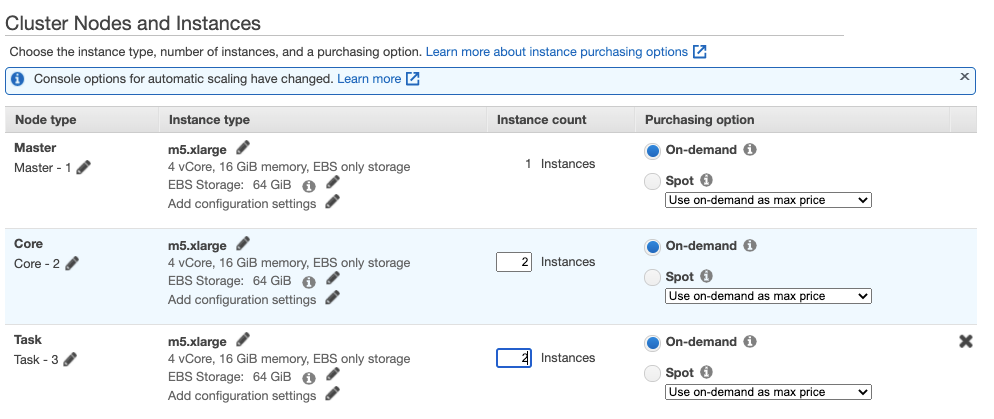




The instructions below will guide you through the process required to configure the environment required to begin loading data into your Segment Data Lake. For a more automated process, see [Step 1 - Configure AWS Resources](#step-1---configure-aws-resources) above.


## Step 1 - Create an S3 Bucket

In this step, you'll create the S3 bucket that will store both the intermediate and final data.

> info ""
> Take note of the S3 bucket name you set in this step, as the rest of the set up flow requires it. In these instructions, the name is `segment-data-lake`.

During the set up process, create a Lifecycle rule and set it to expire staging data after **14 days**. For more information, see Amazon's documentation, [How do I create a lifecycle?](https://docs.aws.amazon.com/AmazonS3/latest/user-guide/create-lifecycle.html).


## Step 2 - Configure an EMR cluster

Segment requires access to an EMR cluster to perform necessary data processing. We recommend starting with a small cluster, with the option to add more compute as required.

### Configure the hardware and networking configuration

1. Locate and select EMR from the AWS console.
2. Click **Create Cluster**, and open the **Advanced Options**.
3. In the Advanced Options, on Step 1: Software and Steps, ensure you select the following options, along with the defaults:
   - `Use for Hive table metadata`
   - `Use for Spark table metadata` 
4. In the Networking setup section, select to create the cluster in either a public or private subnet. Creating the cluster in a private subnet is more secure, but requires additional configuration. Creating a cluster in a public subnet is accessible from the internet. You can configure strict security groups to prevent inbound access to the cluster. See Amazon's document, [Amazon VPC Options - Amazon EMR](https://docs.aws.amazon.com/emr/latest/ManagementGuide/emr-clusters-in-a-vpc.html) for more information. As a best practice, Segment recommends that you consult with your network and security before you configure your EMR cluster.
5. In the Hardware Configuration section, create a cluster with the nodes listed below. This configuration uses the default **On demand** purchasing option for the instances.
   - **1** master node
   - **2** core nodes
   - **2** task nodes 

For more information about configuring the cluster hardware and networking, see Amazon's document, [Configure Cluster Hardware and Networking](https://docs.aws.amazon.com/emr/latest/ManagementGuide/emr-plan-instances.html).


### Configure logging

On the General Options step, configure logging to use the same S3 bucket you configured as the destination for the final data (`segment-data-lakes` in this case). Once configured, logs are to a new prefix, and separated from the final processed data.

Set value of the **vendor** tag to `segment`. The IAM policy uses this to provide Segment access to submit jobs in the EMR cluster.


### Secure the cluster

On the Security step, be sure to complete the following steps:
1. Create or select an **EC2 key pair**.
2. Choose the appropriate roles in the **EC2 instance profile**.
3. Select the appropriate security groups for the Master and Core & Task types.


The image uses the default settings. You can make these settings more restrictive, if required.


## Step 3 - Create an Access Management role and policy

The following steps provide examples of the IAM Role and IAM Policy.

### IAM Role

Create a `segment-data-lake-role` role for Segment to assume. Attach the following trust relationship document to the role:

```json
{
  "Version": "2012-10-17",
  "Statement": [
    {
      "Sid": "",
      "Effect": "Allow",
      "Principal": {
        "AWS": [
          "arn:aws:iam::294048959147:role/customer-datalakes-prod-admin",
          "arn:aws:iam::294048959147:role/datalakes-aws-worker",
          "arn:aws:iam::294048959147:role/datalakes-customer-service"
        ]
      },
      "Action": "sts:AssumeRole",
      "Condition": {
        "StringEquals": {
          "sts:ExternalId": [
            "WORKSPACE_ID"
          ]
        }
      }
    }
  ]
}
```

> note ""
> **NOTE:** Replace the `ExternalID` list with the Segment `WorkspaceID` that contains the sources to sync to the Data Lake.

### IAM Policy

Add a policy to the role created above to give Segment access to the relevant Glue databases and tables, EMR cluster, and S3.

```json
{
    "Version": "2012-10-17",
    "Statement": [
        {
            "Action": [
                "elasticmapreduce:TerminateJobFlows",
                "elasticmapreduce:RunJobFlow",
                "elasticmapreduce:DescribeStep",
                "elasticmapreduce:DescribeCluster",
                "elasticmapreduce:CancelSteps",
                "elasticmapreduce:AddJobFlowSteps"
            ],
            "Effect": "Allow",
            "Resource": "*",
            "Condition": {
                "StringEquals": {
                    "elasticmapreduce:ResourceTag/vendor": "segment"
                }
            }
        },
                {
            "Sid": "",
            "Effect": "Allow",
            "Action": [
                "glue:UpdateTable",
                "glue:UpdatePartition",
                "glue:GetTables",
                "glue:GetTableVersions",
                "glue:GetTableVersion",
                "glue:GetTable",
                "glue:GetPartitions",
                "glue:GetPartition",
                "glue:DeleteTableVersion",
                "glue:DeleteTable",
                "glue:DeletePartition",
                "glue:CreateTable",
                "glue:CreatePartition",
                "glue:CreateDatabase",
                "glue:BatchGetPartition",
                "glue:BatchDeleteTableVersion",
                "glue:BatchDeleteTable",
                "glue:BatchDeletePartition",
                "glue:BatchCreatePartition"
            ],
            "Resource": [
                "arn:aws:glue:$REGION:$YOUR_ACCOUNT:table/*",
                "arn:aws:glue:$REGION:$YOUR_ACCOUNT:database/default",
                "arn:aws:glue:$REGION:$YOUR_ACCOUNT:database/*",
                "arn:aws:glue:$REGION:$YOUR_ACCOUNT:catalog"
            ]
        },
        {
            "Effect": "Allow",
            "Action": "*",
            "Resource": [
                "arn:aws:s3:::$BUCKET_NAME/*",
                "arn:aws:s3:::$BUCKET_NAME"
            ]
        },
        {
            "Effect": "Allow",
            "Action": [
                "athena:*"
            ],
            "Resource": [
                "*"
            ]
        },
        {
            "Sid": "",
            "Effect": "Allow",
            "Action": "iam:PassRole",
            "Resource": [
                "arn:aws:iam::$ACCOUNT_ID:role/EMR_DefaultRole",
                "arn:aws:iam::$ACCOUNT_ID:role/EMR_AutoScaling_DefaultRole",
                "arn:aws:iam::$ACCOUNT_ID:role/EMR_EC2_DefaultRole"
            ]
        }
    ]
}
```

> note ""
> **NOTE:** The policy above grants full access to Athena, but the individual Glue and S3 policies decide which table is queryable. Segment queries for debugging purposes, and will notify you be for running any queries.

## Debugging

Segment requires access to the data and schema for debugging data quality issues. The modes available for debugging are:
- Access the individual objects stored in S3 and the associated schema to understand data discrepancies
- Run an Athena query on the underlying data stored in S3
  - Ensure Athena uses Glue as the data catalog. Older accounts may not have this configuration, and may require some additional steps to complete the upgrade. The Glue console typically displays a warning and provides a link to instructions on how to complete the upgrade.

  - An easier alternative is to create a new account that has Athena backed by Glue as the default.
