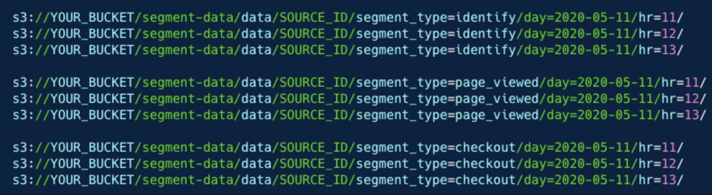

Segment Data Lakes sends Segment data to a cloud data store (for example AWS S3) in a format optimized to reduce processing for data analytics and data science workloads. Segment data is great for building machine learning models for personalization and recommendations, and for other large scale advanced analytics. Data Lakes can reduce the amount of processing required to get real value out of your data.

> info ""
> Segment Data Lakes is available to Business tier customers only.

To learn more, check out our [blog post](https://segment.com/blog/introducing-segment-data-lakes/).

## How Segment Data Lakes work

Data Lakes store Segment data in S3 in a read-optimized encoding format (Parquet) which makes the data more accessible and actionable. To help you zero-in on the right data, Data Lakes also creates logical data partitions and event tables, and integrates metadata with existing schema management tools, such as the AWS Glue Data Catalog. The resulting data set is optimized for use with systems like Spark, Athena, EMR, or Machine Learning vendors like DataBricks or DataRobot.

Segment sends data to S3 by orchestrating the processing in an EMR (Elastic MapReduce) cluster within your AWS account using an assumed role. Customers using Data Lakes own and pay AWS directly for these AWS services.

### Using a Data Lake with a Data Warehouse

The Data Lakes and Warehouses products are compatible using a mapping, but do not maintain exact parity with each other. This mapping helps you to identify and manage the differences between the two storage solutions, so you can easily understand how the data in each is related. You can [read more about the differences between Data Lakes and Warehouses](/docs/connections/storage/data-lakes/comparison/).

When you use Data Lakes, you can either use Data Lakes as your _only_ source of data and query all of your data directly from S3, or you can use Data Lakes in addition to a data warehouse.

## Set up Segment Data Lakes

For detailed instructions on how to configure Segment Data Lakes, see the [Data Lakes catalog page](/docs/connections/storage/catalog/data-lakes/). Be sure to consider the EMR and AWS IAM components listed below."

### EMR

Data Lakes uses an EMR cluster to run jobs that load events from all sources into Data Lakes. The [AWS resources portion of the set up instructions](/docs/connections/storage/catalog/data-lakes#step-1---set-up-aws-resources) sets up an EMR cluster using the `m5.xlarge` node type. Data Lakes keeps the cluster  always running, however the cluster auto-scales to ensure it's not always running at full capacity. Check the Terraform module documentation for the [EMR specifications](https://github.com/segmentio/terraform-aws-data-lake/tree/master/modules/emr).

### AWS IAM Role

Data Lakes uses an IAM role to grant Segment secure access to your AWS account. The required inputs are:
- **external_ids**: External IDs are the part of the IAM role which Segment uses to assume the role providing access to your AWS account. You will define the external ID in the IAM role as the Segment source ID which you want to connect to  Data Lakes. The Segment source ID can be retrieved from the [Segment app](https://app.segment.com/goto-my-workspace/overview)] when navigating to the Source > Settings > API Keys > Source ID.
- **s3_bucket**: Name of the S3 bucket used by the Data Lake.

## Data Lakes schema

Segment Data Lakes applies a standard schema to make the raw data easier and faster to query. Partitions are applied to the S3 data for granular access to subsets of the data, schema components such as data types are inferred, and a map of the underlying data structure is stored in a Glue Database.
<!--
TODO:
add schema overview (tables/columns generated)
-->

### S3 partition structure

Segment partitions the data in S3 by the Segment source, event type, then the day and hour an event was received by Segment, to ensure that the data is actionable and accessible.

The file path looks like:
`s3://<top-level-Segment-bucket>/data/<source-id>/segment_type=<event type>/day=<YYYY-MM-DD>/hr=<HH>`

Here are a few examples of what events look like:

By default, the date partition structure is `day=<YYYY-MM-DD>/hr=<HH>` to give you granular access to the S3 data. You can change the partition structure during the [set up process](/docs/connections/storage/catalog/data-lakes/), where you can choose from the following options:
- Day/Hour [YYYY-MM-DD/HH] (Default)
- Year/Month/Day/Hour [YYYY/MM/DD/HH]
- Year/Month/Day [YYYY/MM/DD]
- Day [YYYY-MM-DD]

### AWS Glue data catalog

Data Lakes stores the inferred schema and associated metadata of the S3 data in AWS Glue Data Catalog. This metadata includes the location of the S3 file, data converted into Parquet format, column names inferred from the Segment event, nested properties and traits which are now flattened, and the inferred data type.

<!--
TODO:
add annotated glue image calling out different parts of inferred schema)
-->

New columns are appended to the end of the table in the Glue Data Catalog as they are detected.

#### Glue database

The schema inferred by Segment is stored in a Glue database within Glue Data Catalog. Segment stores the schema for each source in its own Glue database to organize the data so it is easier to query. To make it easier to find, Segment writes the schema to a Glue database named using the source slug by default. The database name can be modified from the Data Lakes settings.

> info ""
> The recommended IAM role permissions grant Segment access to create the Glue databases on your behalf. If you do not grant Segment these permissions, you must manually create the Glue databases for Segment to write to.

### Data types

Data Lakes infers the data type for an event it receives. Groups of events are poled every hour to infer the data type for that each event.

The data types supported in Glue are:
- bigint
- boolean
- decimal(38,6)
- string
- timestamp

#### Schema evolution

Once Data Lakes sets a data type for a column, all subsequent data will attempt to be cast into that data type. If incoming data does not match the data type, Data Lakes tries to cast the column to the target data type.

**Size mismatch**

If the data type in Glue is wider than the data type for a column in an on-going sync (for example, a decimal vs integer, or string vs integer), then the column is cast to the wider type in the Glue table. If the column is narrower (for example, integer in the table versus decimal in the data), the data might be dropped if it cannot be cast at all, or in the case of numbers, some data might lose precision. The original data in Segment remains in its original format, so you can fix the types and [replay](/docs/guides/what-is-replay/) to ensure no data is lost. Learn more about type casting [here](https://www.w3schools.com/java/java_type_casting.asp).

**Data mismatch**

If Data Lakes sees a bad data type, for example text in place of a number or an incorrectly formatted date, it attempts a best effort conversion to cast the field to the target data type. Fields that cannot be cast may be dropped. You can also correct the data type in the schema to the desired type and Replay to ensure no data is lost. [Contact Segment Support](https://segment.com/help/contact/) if you find a data type needs to be corrected.

## FAQ


Data Lakes offers 12 syncs in a 24 hour period. Data Lakes does not offer a custom sync schedule, or allow you use Selective Sync to manage what data is sent.


Segment's overall guarantee for duplicate data also applies to data in Data Lakes: 99% guarantee of no duplicates for data within a [24 hour look-back window](https://segment.com/docs/guides/duplicate-data/).

If you have advanced requirements for de-duplication, you can add de-duplication steps downstream to reduce duplicates outside this look back window.


Data Lakes supports data from all event sources, including website libraries, mobile, server and event cloud sources.

Data Lakes does not support loading [object cloud source data](https://segment.com/docs/connections/sources/#object-cloud-sources), as well as the users and accounts tables from event cloud sources.


User deletions are not supported in Data Lakes, however [user suppression](https://segment.com/docs/privacy/user-deletion-and-suppression/#suppressed-users) is supported.


As the data schema evolves and new columns are added, Segment Data Lakes will detect any new columns. New columns will be appended to the end of the table in the Glue Data Catalog.


Data Lakes does not have a direct integration with [Protocols](https://segment.com/docs/protocols/).

Any changes to events at the source level made with Protocols also change the data for all downstream destinations, including Data Lakes.

- **Mutated events** - If Protocols mutates an event due to a rule set in the Tracking Plan, then that mutation appears in Segment's internal archives and is reflected in your data lake. For example, if you used Protocols to mutate the event `product_id` to be `productID`, then the event appears in both Data Lakes and Warehouses as `productID`.

- **Blocked events** - If a Protocols Tracking Plan blocks an event, the event is not forwarded to any downstream Segment destinations, including Data Lakes. However events which are only marked with a violation _are_ passed to Data Lakes.

Data types and labels available in Protocols are not supported by Data Lakes.

- **Data Types** - Data Lakes infers the data type for each event using its own schema inference systems, instead of using a data type set for an event in Protocols. This might lead to the data type set in a data lake being different from the data type in the tracking plan. For example, if you set `product_id` to be an integer in the Protocols Tracking Plan, but the event is sent into Segment as a string, then Data Lakes may infer this data type as a string in the Glue Data Catalog.
- **Labels** - Labels set in Protocols are not sent to Data Lakes.


You can find details on Amazon's [pricing for Glue page](https://aws.amazon.com/glue/pricing/). For reference, Data Lakes creates 1 table per event type in your source, and adds 1 partition per hour to the event table.


AWS Glue has limits across various factors, such as number of databases per account, tables per account, and so on. See the [full list of Glue limits](https://docs.aws.amazon.com/general/latest/gr/glue.html#limits_glue) for more information.

The most common limits to keep in mind are:
- Databases per account: 10,000
- Tables per database: 200,000
- Characters in a column name: 250

Segment stops creating new tables for the events after you exceed this limit. However you can contact your AWS account representative to increase these limits.

You should also read the [additional considerations](https://docs.aws.amazon.com/emr/latest/ReleaseGuide/emr-hive-metastore-glue.html) when using AWS Glue Data Catalog.


