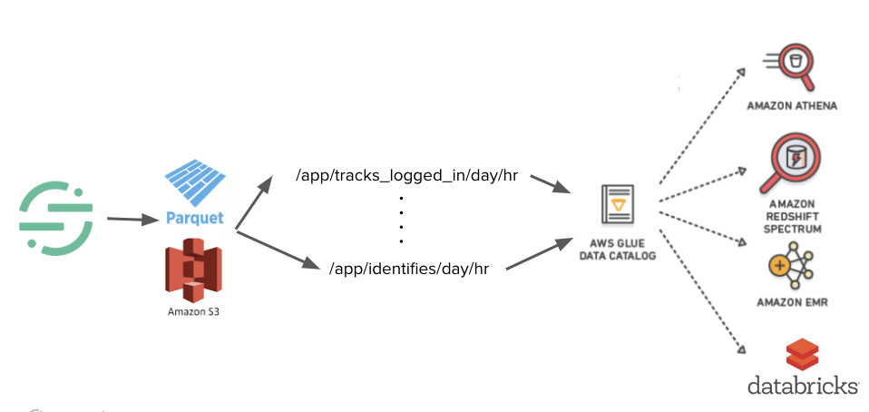
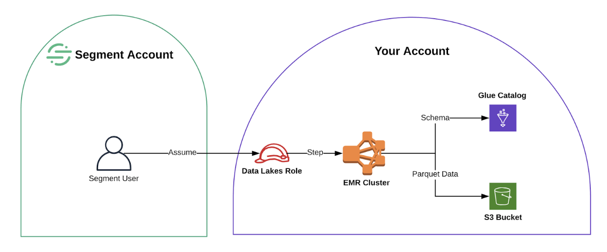

<!-- Mallika TODO: Remove anything that's in the catalog page, make this just the overview/how it works/conceptual stuff. :) -->

Segment Data Lakes let you send Segment data to cloud data stores (for example AWS S3) in a format optimized to reduce processing for data analytics and data science workloads. Segment data is great for building machine learning models for personalization and recommendations, and for other large scale advanced analytics. However, without Data Lakes, you might need to do a lot of processing to get real value out of your data.

Data Lakes blends the experience of using our existing S3 destination and data warehouse destination. It makes data in S3 more actionable and accessible for customers by building in logical data partitions, storing it in a read-optimized encoding format (Parquet initially), and integrating deeply with existing schema management tools, such as the AWS Glue Data Catalog. These formats are optimized for use with systems like Spark, Athena, or Machine Learning vendors like DataBricks or DataRobot.

With Segment Data Lakes, Data Engineering, Analysts, and Data Science teams can keep hot and cold data in different places, reduce costs, remove resource contention to optimize performance, and have a flexible model to consume data across Parquet to build materialized views and aggregations.

To learn more, read our blog post on [Cultivating your Data Lake](https://segment.com/blog/cultivating-your-data-lake).

## How Segment Data Lakes Work

Segment builds a Data Lake on top of what’s already in Segment today - event collection, Parquet transformations, and a logical table structure, to provide a clean Data Lake to query and gain insights from.

The data lakes:

- **Are fast and efficient**: All data is sent to S3 in [Parquet format](https://parquet.apache.org/) for easy read access.
- **Organize data in logical structures**: All data is partitioned by source, event type, date and hour to allow you to query a narrower scope of data, and provides the same 'events' tables that you are familiar with from Segment's warehouse product.
- **Accessible data structure**: The data structure is ingested by [Glue Data Catalog](https://docs.aws.amazon.com/glue/latest/dg/populate-data-catalog.html) so all of your tools can access specific pieces of data, giving you flexibility to build on top of the raw data set.

From here you can connect many tools to analyze the data - Athena, Spectrum, Databricks, EMR.

Today, Segment sends Segment event data to S3 for you by doing the processing in an EMR (Elastic MapReduce) cluster within your AWS account. You can use data lakes to process the data in your own VPC to provide privacy and data ownership gains for you short term.

### Using a Data Lake with a Data Warehouse

Data Lakes provides a flexible blob storage solution to Data teams as they scale.

When you use Data Lakes, you can either use Data Lakes _only_ as your source of data and query all of your data directly, or you can use Data Lakes in addition to one or more data warehouses.

The Data Lakes and Warehouses products are compatible using a mapping, but do not maintain exact parity with each other. This mapping helps you to identify and manage the differences between the two storage solutions, so you can easily understand how the data in each is related. You can [read more about the differences between Data Lakes and Warehouses](comparison/).

Additionally, Data Lakes allow you to configure different components to increase compatibility with Warehouses. This configuration includes the number of Glue Databases you use, setting a table prefix, and selecting between two schemas. Read more about [setting up Data Lakes to increase Warehouse compatibility here](/docs/connections/storage/catalog/data-lakes/).

## Data Lakes Schema

### S3 Partition Structure

To ensure the data is actionable and accessible, Segment partitions the data in S3 by the source, event type, then the day and hour an event was received by Segment.

Here’s an example of what this file path looks like:
`s3://<top-level-Segment-bucket>/data/<source-id>/segment_type=<event type>/day=<day>/hr=<hour>`

An example path for Track events called "Checkout":
`s3://data-lake/segment-data-lake/data/xxxxxxxxxx/segment_type=track_checkout/day=2019-10-01/hr=12`

An example path for Identify calls:
`s3://data-lake/segment-data-lake/data/xxxxxxxxxx/segment_type=identify/day=2019-10-02/hr=22`

### Glue Database options

When you connect Data Lakes to a source, you set the Glue Database name in the **Settings** tab. The name of the Glue Database is where Segment writes your schema.

How you set the Glue Database name determines whether all sources are stored in [one Glue Database](#one-glue-database-for-all-sources), or a [different database for each source](#one-glue-database-per-source). If you want to query data across Data Lakes and a data Warehouse at the same time, use a different option for each source.

> info ""
> Segment can create the Glue databases for you if you grant it the correct IAM role permissions. If you do not grant Segment these permissions, you must manually create the Glue databases for Segment to write to.

> warning ""
> If you change a database name or table prefix, new tables will be created which will require a replay of historical data.

#### One Glue Database for all sources

If you choose to have data from all sources stored in one database, you must also define a table prefix in the **Data Lakes > Source** settings.

This table prefix separates event tables for each source, to prevent different event types across sources from colliding, and make it be possible to tell whether a `tracks` table is for Source A or Source B. We recommend setting the table prefix to the source slug.

Here's an example of what the table name looks like with and without a prefix:

**With Prefix**:
- Source A: `db.iOS_prod_tracks_page_views`
- Source B: `db.android_prod_tracks_page_views`

**Without Prefix**:
- Source A: `db.tracks_page_views`
- Source B: `db.tracks_page_views `

In the second example the table names for the two sources are identical, even though they contain track events for different sources. By adding a prefix, you can specify which source each table is referring to.

#### One Glue Database per source

Separating each source in its own Glue Database creates better organization and makes it easier to query the data. It's also consistent with the table structure used in Segment warehouses, so we recommend using this configuration if you’re looking to use Data Lakes with your data warehouse.

You do not need a table prefix in this configuration. We recommend keeping the default setting `(null)`.

Here’s what the table names will look like:

**With Prefix**:
`$dbname.$tableprefix_$eventtype`
Examples: `ios_prod.ios_track_page_view`, `ios_dev.identify`

**Without Prefix**:
`$dbname.$eventtype`
Examples: `ios_prod.track_page_view`, `ios_dev.identify`

**Warehouse**:
`$source_slug.$event_type`
Examples: `ios_prod.page_view`, `ios_dev.identify`

### Data Types

Data Lakes infers the data type for the event it receives. Data Lakes looks at the group of events received every hour to infer the data type for that event.

If a bad data type is seen, such as text in place of a number or an incorrectly formatted date, Data Lakes attempts a best effort conversion to cast the field to the target data type. Fields that cannot be casted may be dropped. There is always the option to correct the data type in the schema to the desired type and perform a replay to ensure no data is lost. [Contact us](https://segment.com/help/contact/) if a data type needs to be corrected.

## FAQs

##### How often is data synced to Data Lakes?

Data Lakes currently offers 12 syncs in a 24 hour period. Data Lakes does not _currently_ offer a custom sync schedule, or allow you use Selective Sync to manage what data is sent.

##### What should I expect in terms of duplicates in Data Lakes?

Segment's overall guarantee for duplicate data also applies to data in Data Lakes: 99% guarantee of no duplicates for data within a [24 hour look-back window](https://segment.com/docs/guides/duplicate-data/).

If you have advanced requirements for duplicates, you can add de-duplication steps downstream to reduce duplicates outside this look back window.

##### Can I send all of my Segment data into Data Lakes?

Data Lakes currently supports data from all event sources, including website libraries, mobile, server and event cloud sources.

Data Lakes does not currently support loading [object cloud source data](https://segment.com/docs/connections/sources/#object-cloud-sources), as well as the users and accounts tables from event cloud sources.

##### Are user deletions and suppression supported?

User deletions are currently not supported in Data Lakes, however user suppression is supported.

##### How does Data Lakes work with Protocols?

Data Lakes does not currently have a direct integration with [Protocols](https://segment.com/docs/protocols/).

Today, any changes to events at the source level (made with Protocols) also change the data for all downstream destinations, including Data Lakes.

- *Mutated events* - If Protocols mutates an event due to a rule set in the Tracking Plan, then that mutation appears in Segment's internal archives and is reflected in Data Lakes. For example, if you used Protocols to mutate the event `product_id` to be `productID`, then the event appears in both Data Lakes and Warehouses as `productID`.

- *Blocked events* - If a Protocols Tracking Plan blocks an event, then the event is not forwarded to any downstream Segment destinations including Data Lakes. However events which are only marked with a violation _are_ passed to Data Lakes.

Data types and labels available in Protocols are not currently supported by Data Lakes.

- *Data Types* - Data Lakes infers the data type for each event using its own schema inference systems, instead of using a data type set for an event in Protocols. This might lead to the data type set in a data lake being different from the data type in the tracking plan. For example, if you set `product_id` to be an integer in the Protocols Tracking Plan, but the event is sent into Segment as a string, then Data Lakes may infer this data type as a string in the Glue Data Catalog.
- *Labels* - Labels set in Protocols are not sent to Data Lakes.
