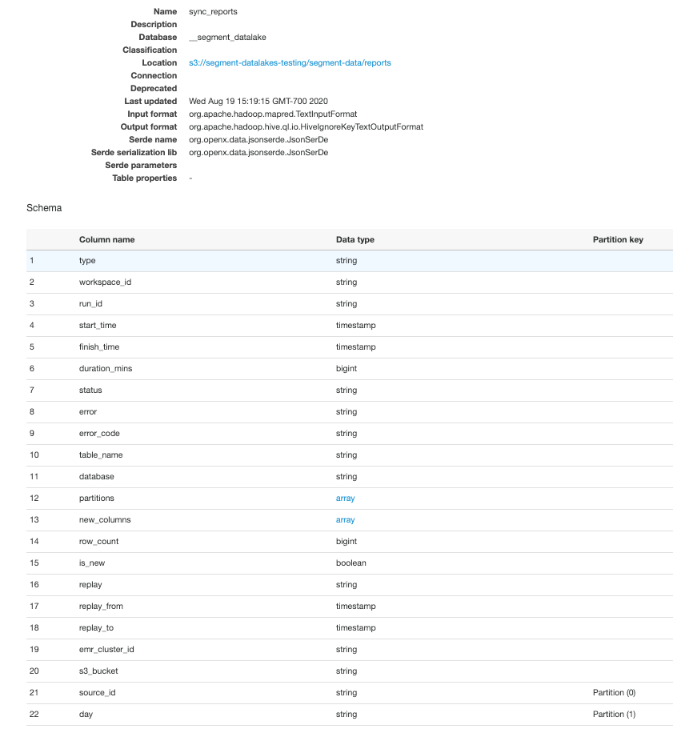

# Sync Reports

In order to provide you with visibility into sync performance, Segment Data Lakes generates reports with operational metrics about each Segment sync to your data lake. These sync reports are stored in your S3 bucket and Glue Data Catalog so you have access to the raw data. With this access, you can now run queries to answer custom questions and hook up alerting and/or monitoring tools.

## Sync Report Schema

Your sync_report table is where all of your sync data is stored. Query it to answer common questions about data synced to your data lake. The schema for this table has the following columns:

| **Sync Metric** | **Description**                                                                                                                                                                                           |
| --------------- | --------------------------------------------------------------------------------------------------------------------------------------------------------------------------------------------------------- |
| workspace_id    | Distinct ID assigned to each Segment workspace. This ID can be found in Workspace Settings > General Settings > ID.                                                                                       |
| source_id       | Distinct ID assigned to each Segment source. This ID can be found in the Source Settings > API Keys > Source ID.                                                                                          |
| database        | Name of the Glue Database used to store sync report tables. This database is automatically created by Segment during the Data Lakes set up process.                                                       |
| emr_cluster_id  | ID of the EMR cluster which Data Lakes uses. This is set in the Data Lakes Settings page in the Segment app.                                                                                              |
| s3_bucket       | Name of the S3 bucket which Data Lakes uses. This is set in the Data Lakes Settings page in the Segment app.                                                                                              |
| run_id          | ID dynamically generated and assigned to each Data Lakes run.                                                                                                                                             |
| start_time      | Time when the sync run started. Time is in UTC.                                                                                                                                                           |
| finish_time     | Time when the sync run finished. Time is in UTC.                                                                                                                                                          |
| sync_duration   | The length of the sync which is calculated by the difference between the start and finish time. The value is in minutes.                                                                                  |
| status          | Status of the sync. Values can either be finished for a successful sync or failed for a failed sync.                                                                                                      |
| error_code      | The type of error, which can include: insufficient permissions, invalid settings, or a Segment internal error.                                                                                            |
| error           | If the sync failed, the error describes the issue causing the failed sync, such as “External ID is invalid”.                                                                                              |
| table_name      | Name of the Segment event synced to S3                                                                                                                                                                    |
| row_count       | Count of rows synced to S3 for a particular run                                                                                                                                                           |
| partitions      | Partitions added to the event tables during the sync                                                                                                                                                      |
| new_column      | New columns inferred and added to event table during the sync                                                                                                                                             |
| day             | Day which the sync occurred                                                                                                                                                                               |
| type            | Defines whether the run metrics are at the source or event level. type = source aggregates data for syncs across all events within the source, whereas type = event shows detailed sync metrics per event |


The Glue Database named `__segment_datalake` will store the schema of the sync_reports table. The schema looks like:



The sync_reports table will be available in S3 and Glue once a sync is fully completed. As a result, you will find data for all completed syncs, but not for in-progress syncs.

## Data Location

Data Lakes sync reports will be stored in Glue as well as in S3.

During the Data Lakes set up process, Segment automatically creates a Glue Database and table to store all sync report tables. The Glue Database is named `__segment_datalake`, and the table is named `sync_reports`.

The S3 structure is:
`s3://my-bucket/segment-data/reports/day=YYYY-MM-DD/source=$SOURCE_ID/run_id=$RUN_ID/report.json`

## Data Format

The data in the sync reports will be stored in JSON format to ensure that it is human-readable and can be processed by other systems.

You will find each table and event stored as a separate JSON object which contains the details of the overall report status.

For example, the raw JSON object for a successful sync report looks like:
```{
    "type": "source",
    "workspace_id": "P3IMS7SBDH",
    "source_id": "9IP56Shn6",
    "run_id": "1597581273464733073",
    "start_time": "2020-08-19 22:15:59.044084423",
    "finish_time": "2020-08-19 22:18:12.891",
    "duration_mins": 2,
    "status": "finished",
    "table_name": "",
    "database": "ios_prod",
    "row_count": 81020,
    "emr_cluster_id": "j-3SXSUSDNPIS",
    "s3_bucket": "segment-datalakes-bucket"
  }
  {
    "type": "event",
    "workspace_id": "P3IMS7SBDH",
    "source_id": "9IP56Shn6",
    "run_id": "1597581273464733073",
    "start_time": "2020-08-19 22:15:59.044084423",
    "finish_time": "2020-08-19 22:18:12.891",
    "duration_mins": 2,
    "status": "finished",
    "table_name": "track_order_completed",
    "database": "ios_prod",
    "partitions": [
      {
        "day": "2020-08-16",
        "hr": "10"
      },
      {
        "day": "2020-08-16",
        "hr": "11"
      }
    ],
   "new_columns": [
      {
        "name": "properties_billing_address",
        "type": "string"
      }
    ],
    "row_count": 20020,
    "emr_cluster_id": "j-3SXSUSDNPIS",
    "s3_bucket": "segment-datalakes-bucket"
  }
  {
    "type": "event",
    "workspace_id": "P3IMS7SBDH",
    "source_id": "9IP56Shn6",
    "run_id": "1597581273464733073",
    "start_time": "2020-08-19 22:15:59.044084423",
    "finish_time": "2020-08-19 22:18:12.891",
    "duration_mins": 2,
    "status": "finished",
    "table_name": "track_product_added",
    "database": "ios_prod",
    "partitions": [
      {
        "day": "2020-08-16",
        "hr": "10"
      }
    ],
    "row_count": 20260,
    "emr_cluster_id": "j-3SXSUSDNPIS",
    "s3_bucket": "segment-datalakes-bucket"
}```


Alternatively, the ****JSON object for a failed sync looks like:
```{
    "type": "source",
    "workspace_id": "P3IMS7SBDH",
    "source_id": "9IP56Shn6",
    "run_id": "1597867438900010296",
    "start_time": "2020-08-19 20:04:58.368616813",
    "finish_time": "2020-08-19 20:49:48.308318686",
    "duration_mins": 44,
    "status": "failed",
    "error": "Data Lakes Destination has invalid configuration for \"AWS Role ARN\": field is required.",
    "error_code": "Segment.Internal",
    "table_name": "",
    "database": "ios_prod",
    "emr_cluster_id": "j-3SXSUSDNPIS",
    "s3_bucket": "segment-datalakes-demo-stage"
}```


## Querying the Sync Reports Table

Your Sync Reports table is where you can do all sorts of querying about operational sync metrics.

A few commonly used queries are:

**Row counts per day for a specific event**
SELECT day,sum(row_count)
FROM "__segment_datalake"."sync_reports"
WHERE source_id=’9IP56Shn6’ and table_name='checkout_started'
GROUP BY day
ORDER BY day

**Row counts per day for all events in the source**
SELECT day, table_name,sum(row_count)
FROM "__segment_datalake"."sync_reports"
WHERE source_id=’9IP56Shn6’ AND type=’event’
GROUP BY day, table_name
ORDER BY day

**Last successful sync**
SELECT max(finish_time)
FROM "__segment_datalake"."sync_reports"
WHERE source_id=’9IP56Shn6’ AND status='finished' AND date(day) = CURRENT_DATE
LIMIT 1

**Find all failures in the last N days**
SELECT run_id, status, error, error_code
FROM "__segment_datalake"."sync_reports"
WHERE source_id=’9IP56Shn6’ AND status='failed' AND date(day) >= (CURRENT_DATE - interval '2' day)


# Sync Errors

The types of errors which can cause your data lake syncs to fail are:
- **Insufficient Permissions** - Segment lacks the permissions necessary to perform a critical operation, and you need to grant Segment additional permissions.
- **Invalid Settings** - The settings are invalid, which could be caused by a required field missing or failing a validation check. The invalid setting needs to be corrected for the sync to succeed.
- **Internal Error** - An error occurred within Segment’s internal systems. This should resolve on its own, otherwise you can [contact the Segment Support team](https://segment.com/help/contact/) if the sync failure persists.

**Insufficient Permissions**
Data Lakes may not have the appropriate permissions to access S3, Glue, and/or EMR, which is causing syncs to fail.

Examples of error messages related to insufficient permissions you may see are:

- Segment was unable to upload staging data to your S3 Bucket due to a lack of sufficient permissions.
- Segment does not have permissions to:
    - Download, upload or delete object from S3 Bucket
    - fetch schema information from Glue catalog
    - delete table from Glue Catalog
    - submit an EMR job to the cluster
    - check the status of EMR Job on EMR Cluster

Make sure that you’ve set up the right permissions by double checking the required configuration for S3, Glue and EMR, as shown [here](https://docs.google.com/document/d/1GlWzS5KO4QaiVZx9pwfpgF-N-Xy2e_QQcdYSX-nLMDU/edit?usp=sharing).

**Invalid Settings**
One or more settings in-app may be incorrectly configured, leading to your Data Lakes syncs to fail.

Examples of error messages related to invalid settings you may see are:

- Data Lakes Destination has invalid configuration.
- The Table Partitions configuration for this Data Lake is invalid. The field name does not appear to map to the data being processed, which likely means it is misconfigured.
- External ID is invalid. Please ensure the external ID in the IAM role used to connect to your Data Lake matches the source ID.
- External ID is not set. Please ensure that the IAM role used to connect to your Data Lake has the source ID in the list of external IDs.

The most common set up error is caused by not having all Source IDs listed in the External ID within the IAM role. Source IDs are located in the Segment workspace, and need to be added to the list of [External IDs](https://github.com/segmentio/terraform-aws-data-lake/tree/master/modules/iam#external_ids) in the IAM policy. You can either update this from the AWS Console, or re-run the [Terraform job](https://github.com/segmentio/terraform-aws-data-lake).

**Internal Error**
Internal errors are errors occurring within Segment’s internal systems. They should resolve on their own, however if sync failures persist, please [contact the Segment Support team](https://segment.com/help/contact/).

# Common Questions

##### How do Data Lakes sync reports differ from the sync data I see for Segment Warehouses?
Both Warehouses and Data Lakes provide similar types of insights about syncs, including the start and finish time of a sync, rows synced, and errors. Warehouse sync information is aggregated to display in the Segment app on the Sync History page and Warehouse Health pages. Alternatively, the raw sync information for Data Lakes is sent directly to your data lake for you to query the raw data. This allows you to answer custom questions about syncs and plug the data into alerting and monitoring tools.

##### Are replays shown in sync reports?
Replays are currently not supported in sync reports, but will be in the near future.

##### Can syncs only be successful or failed, or can they be partially successful?
Partial failures are not supported today, so syncs are either a success or failure.
