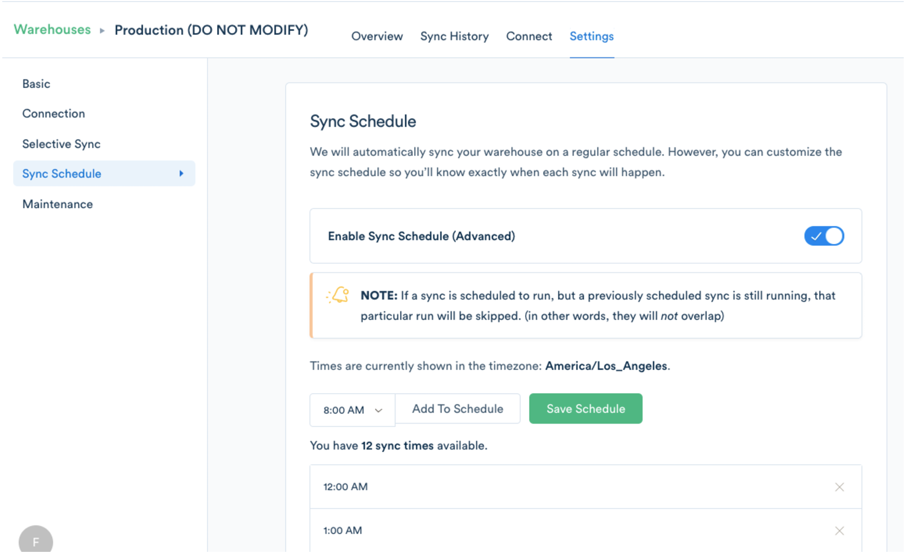

Waiting minutes and minutes, maybe even an hour, for your queries to compute is an unfortunate reality for many growing companies. Whether your data has grown faster than your cluster, or you're running too many jobs in parallel, there are lots of reasons your queries might be slowing down.

To help you improve your query performance, this guide takes you through common issues and how to mitigate them.

## Common Causes for Slow Queries

### 1\. Not enough space

As your data volume grows and your team writes more queries, you might be running out of space in your cluster.

To check if you're getting close to your max, run this query. It will tell you the percentage of storage used in your cluster. We recommend never exceeding 75-80% of your storage capacity. If you're nearing capacity, consider adding some more nodes.

[Learn how to resize your cluster here.](http://docs.aws.amazon.com/redshift/latest/mgmt/rs-resize-tutorial.html)

### 2\. Inefficient queries

Another thing you'll want to check is if your queries are efficient. For example, if you're scanning an entire dataset with a query, you're probably not making the best use of your compute resources.

A few tips for writing performant queries:

*   Consider using `INNER joins` as they are are more efficient that `LEFT joins`.

*   Stay away from `UNION` whenever possible.

*   Specify multiple levels of conditionals when you can.

*   Use [`EXPLAIN`](https://www.periscopedata.com/blog/explain-and-other-tools-for-query-optimization.html) to show the query execution plan and cost.

To learn more about writing beautiful SQL, check out these resources:

*   [Periscope on Query Performance](https://www.periscopedata.com/amazon-redshift-guide/helpful-admin-queries#query-performance)

*   [Mode on Performance Tuning SQL Queries](https://community.modeanalytics.com/sql/tutorial/sql-performance-tuning/)

*   [Chartio on Improving Query Performance](https://support.chartio.com/knowledgebase/improving-query-performance)

### 3\. Multiple ETL processes and queries running

Some databases like Redshift have limited computing resources. Running multiple queries or ETL processes that insert data into your warehouse at the same time will compete for compute power.

If you have multiple ETL processes loading into your warehouse at the same time, especially when analysts are also trying to run queries, everything will slow down. Try to schedule them at different times and when your cluster is least active.

If you're a Segment Business Tier customer, you can schedule your sync times under Warehouses Settings.

In addition, you might want to take advantage of Redshift's [Workload Management](http://docs.aws.amazon.com/redshift/latest/dg/c_workload_mngmt_classification.html) that helps ensure fast-running queries won't get stuck behind long ones.

### 4\. Default WLM Queue Configuration

As mentioned before, Redshift schedules and prioritizes queries using [Workload Management](http://docs.aws.amazon.com/redshift/latest/dg/c_workload_mngmt_classification.html). Each queue is configured to distribute resources in ways that can optimize for your use-case.

The default configuration is a single queue with only 5 queries running concurrently, but we've discovered that the default only works well for very low-volume warehouses. More often than not, adjusting this configuration can significantly improve your sync times.

Before our SQL statements, we use `set query_group to "segment";` to group all of our queries together. This allows you to easily create a queue just for Segment that can be isolated from your own queries. The maximum concurrency that Redshift supports is 50 across _all_ query groups, and resources like memory are distributed evenly across all those queries.

Our initial recommendation is for 2 WLM queues:

1.  a queue for the `segment` query group with a concurrency of `10`

2.  leave the default queue with a concurrency of `5`

Generally, we are responsible for most writes in the databases we connect to, so having a higher concurrency allows us to write as quickly as possible. However, if you are also using the same database for your own ETL process, you may want to use the same concurrency for both groups. In addition, you may even require additional queues if you have other applications writing to the database.

Each cluster may have different needs, so feel free to stray from this recommendation if another configuration works better for your use-case. AWS provides some [guidelines](http://docs.aws.amazon.com/redshift/latest/dg/tutorial-configuring-workload-management.html), and of course you can always [contact us](https://segment.com/help/contact/) as we're more than happy to share what we have learned while working with Redshift.

## Pro-tips for Segment Warehouses

In addition to following performance best practices, here are a few more optimizations to consider if you're using Segment Warehouses.

### Factors that affect load times

When Segment is actively loading data into your data warehouse, we're competing for cluster space and storage with any other jobs you might be running. Here are the parameters that influence your load time for Segment Warehouses.

*   **Volume of data.** Our pipeline needs to load and deduplicate data for each sync, so simply having more volume means these operations will take longer.
*   **Number of sources.** When we start a sync of your data into your warehouse, we kick off a new job for every source you have in Segment. So the more sources you have, the longer your load time could take. This is where the WLM queue and the concurrency setting can make a big difference.
*   **Number and size of columns.** Column sizes and the number of columns also affect load time. If you have very long property values or lots of properties per event, the load may take longer as well.

### Performance optimizations

To make sure you have enough headroom for quick queries while using Segment Warehouses, here are some tips!

*   **Size up your cluster.** If you find your queries are getting slow at key times during the day, add more nodes to give enough room for us to load data and for your team to run their queries.
*   **Disable unused sources.** If you're not actively analyzing data from a source, consider disabling the source for your Warehouse (available for business tier). If you don't use a source anymore—perhaps you were just playing around with it for testing, you might even want to remove it completely. This will kick off fewer jobs in our ETL process.
*   **Schedule syncs during off times.** If you're concerned about query times and you don't mind data that's a little stale, you can schedule your syncs to run when most of your team isn't actively using the database. (Available for business tier customers.)
*   **Schedule regular vacuums.** Make sure to schedule regular vacuums for your cluster, so old deleted data isn't taking up space.

We hope these steps will speed up your workflow! If you need any other help, feel free to [contact us](https://segment.com/help/contact/).
