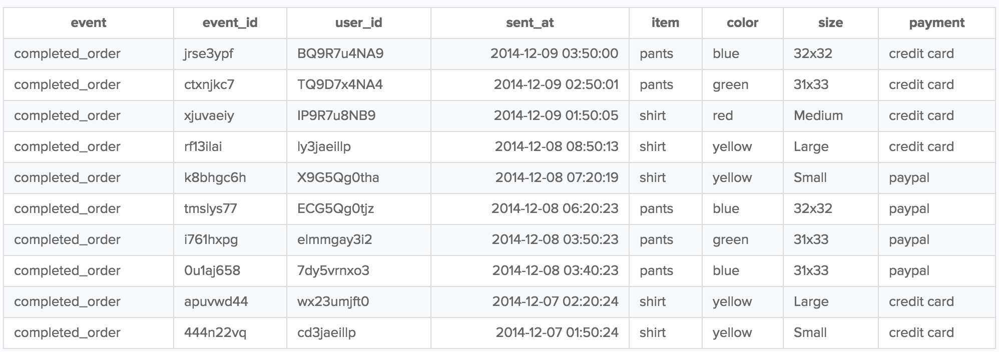

Below you'll find a library of some of the most useful SQL queries customers use in their Redshift warehouses. You can run these in your Redshift instance with little to no modification.

> success "Ways to improve query speed"
> If you're looking to improve the speed of your queries, check out Segment's [Speeding Up Redshift Queries](/docs/connections/storage/warehouses/redshift-tuning/) page.

You can use SQL queries for the following tasks:
- [Tracking events](#tracking-events)
  - [Grouping events by day](#grouping-events-by-day)
- [Define sessions](#define-sessions)
  - [How to define user sessions using SQL](#how-to-define-user-sessions-using-sql)
- [Identify users](#identify-users)
  - [Historical traits](#historical-traits)
  - [Convert the identifies table into a users table](#convert-the-identifies-table-into-a-users-table)
  - [Counts of user traits](#counts-of-user-traits)
- [Groups to accounts](#groups-to-accounts)
  - [Historical Traits](#historical-traits-1)
  - [Converting the Groups Table into an Organizations Table](#converting-the-groups-table-into-an-organizations-table)

> note " "
> If you're looking for SQL queries for warehouses other than Redshift, check out some of Segment's [Analyzing with SQL guides](/docs/connections/storage/warehouses#analyzing-with-sql).

## Tracking events

The Track call allows you to record any actions your users perform. A Track call takes three parameters: the userId, the event, and any optional properties.

Here's a basic Track call:

```javascript
analytics.track('Completed Order',
  item: 'pants',
  color: 'blue'
  size: '32x32'
  payment: 'credit card'
});
```

A completed order Track call might look like this:

```javascript
analytics.track('Completed Order', {
 item: 'shirt',
 color: 'green'
 size: 'Large'
 payment: 'paypal'
});
```

Each Track call is stored as a distinct row in a single Redshift table called `tracks`. To get a table of your completed orders, you can run the following query: 

```sql
select *
from initech.tracks
where event = 'completed_order'
```

That SQL query returns a table that looks like this:



But why are there columns in the table that weren't a part of the Track call, like `event_id`? 
This is because the Track method (for client-side libraries) includes additional properties of the event, like `event_id`, `sent_at`, and `user_id`!

### Grouping events by day
If you want to know how many orders were completed over a span of time, you can use the `date()` and `count` function with the `sent_at` timestamp:

```sql
select date(sent_at) as date, count(event)
from initech.tracks
where event = 'completed_order'
group by date
```
That query returns a table like this:

| date       | count |
| ---------- | ----- |
| 2021-12-09 | 5     |
| 2021-12-08 | 3     |
| 2021-12-07 | 2     |

To see the number of pants and shirts that were sold on each of those dates, you can query that using case statements:

```sql 
select date(sent_at) as date,
sum(case when item = 'shirt' then 1 else 0 end) as shirts,
sum(case when item = 'pants' then 1 else 0 end) as pants
from initech.tracks
where event = 'completed_order'
group by date
```

That query returns a table like this: 

| date       | shirts | pants |
| ---------- | ------ | ----- |
| 2021-12-09 | 3      | 2     |
| 2021-12-08 | 1      | 2     |
| 2021-12-07 | 2      | 0     |


## Define sessions
Segment's API does not impose any restrictions on your data with regard to user sessions.

Sessions aren't fundamental facts about the user experience. They're stories Segment builds around the data to understand how customers actually use the product in their day-to-day lives. And since Segment's API is about collecting raw, factual data, there's no API for collecting sessions. Segment leaves session interpretation to SQL partners, which let you design how you measure sessions based on how customers use your product.

For more on why Segment doesn't collect session data at the API level, [check out a blog post here](https://segment.com/blog/facts-vs-stories-why-segment-has-no-sessions-api/){:target="_blank"}.

### How to define user sessions using SQL
Each of Segment's SQL partners allow you to define sessions based on your specific business needs. With [Looker](https://looker.com){:target="_blank"}, for example, you can take advantage of their persistent derived tables and LookML modeling language to layer sessionization on top of your Segment SQL data. Segment recommends [checking out Looker's approach here](https://segment.com/blog/using-sql-to-define-measure-and-analyze-user-sessions/).

To define sessions with raw SQL, a great query and explanation comes from [Mode Analytics](https://mode.com).

Here's the query to make it happen, but read Mode Analytics' [blog post](https://blog.modeanalytics.com/finding-user-sessions-sql/) for more information. Mode walks you through the reasoning behind the query, what each portion accomplishes, how you can tweak it to suit your needs, and the kinds of further analysis you can add on top of it.

```sql
-- Finding the start of every session
SELECT *
  FROM (
       SELECT *
              LAG(sent_at,1) OVER (PARTITION BY user_id ORDER BY sent_at) AS last_event
        FROM "your_source".tracks
      ) last
WHERE EXTRACT('EPOCH' FROM sent_at) - EXTRACT('EPOCH' FROM last_event) >= (60 * 10)
   OR last_event IS NULL

-- Mapping every event to its session
SELECT *,
       SUM(is_new_session) OVER (ORDER BY user_id, sent_at ROWS BETWEEN UNBOUNDED PRECEDING AND CURRENT ROW) AS global_session_id,
       SUM(is_new_session) OVER (PARTITION BY user_id ORDER BY sent_at ROWS BETWEEN UNBOUNDED PRECEDING AND CURRENT ROW) AS user_session_id
  FROM (
       SELECT *,
              CASE WHEN EXTRACT('EPOCH' FROM sent_at) - EXTRACT('EPOCH' FROM last_event) >= (60 * 10) 
                     OR last_event IS NULL 
                   THEN 1 ELSE 0 END AS is_new_session
         FROM (
              SELECT *,
                     LAG(sent_at,1) OVER (PARTITION BY user_id ORDER BY sent_at) AS last_event
                FROM "your_source".tracks
              ) last
       ) final
```

## Identify users

### Historical traits

The Identify method ties user attributes to a `userId`. 

```javascript
analytics.identify('bob123',{
  email: 'bob@initech.com',
  plan: 'Free'
});
```
As these user traits change over time, you can continue calling the Identify method to update their changes. With this query, you can update Bob's account plan to “Premium”.

```javascript
analytics.identify('bob123', {
  email: 'bob@initech.com',
  plan: 'Premium'
});
```

Each Identify call is stored in a single Redshift table called `identifies`. To see how a user's plan changes over time, you can run the following query: 

```sql
select email, plan, sent_at
from initech.identifies
where email = 'bob@initech.com'
```

This SQL query returns a table of Bob's account information, with each entry representing the state of his account at different time periods:

| user_id | email          | plan    | sent_at             |
| ------- | -------------- | ------- | ------------------- |
| bob123  | bob@intech.com | Premium | 2021-12-20 19:44:03 |
| bob123  | bob@intech.com | Basic   | 2021-12-18 17:48:10 |

If you want to see what your users looked like at a previous point in time, you can find that data in the `identifies` table. To get this table for your users, replace 'initech' in the SQL query with your source slug.

If you only want the current state of the users, convert the `identifies` table into a [distinct users table](#convert-the-identifies-table-into-a-users-table) by returning the most recent Identify call for each account.

### Convert the identifies table into a users table

The following query returns the `identifies` table: 

```sql
select *
from initech.identifies
```
That query returns a table like this:

| user_id  | email           | plan    | sent_at             |
| -------  | --------------  | ------- | ------------------- |
| bob123   | bob@intech.com  | Premium | 2021-12-20 19:44:03 |
| bob123   | bob@intech.com  | Basic   | 2021-12-18 17:48:10 |
| jeff123  | jeff@intech.com | Premium | 2021-12-20 19:44:03 |
| jeff123  | jeff@intech.com | Basic   | 2021-12-18 17:48:10 |

If all you want is a table of distinct user with their current traits and without duplicates, you can do so with the following query:

```sql
with identifies as (
  select user_id,
         email,
         plan,
         sent_at,
         row_number() over (partition by user_id order by sent_at desc) as rn
  from initech.identifies
),
users as (
  select user_id, 
         email,
         plan
  from identifies
  where rn = 1
)

select *
from users
```

### Counts of user traits
Let's say you have an `identifies` table that looks like this:

| user_id  | email           | plan    | sent_at             |
| -------  | --------------  | ------- | ------------------- |
| bob123   | bob@intech.com  | Premium | 2021-12-20 19:44:03 |
| bob123   | bob@intech.com  | Basic   | 2021-12-18 17:48:10 |
| jeff123  | jeff@intech.com | Premium | 2021-12-20 19:44:03 |
| jeff123  | jeff@intech.com | Basic   | 2021-12-18 17:48:10 |

If you want to query the traits of these users, you first need to [convert the identifies table into a users table](#converting-the-identifies-table-into-a-users-table). From there, run a query like this to get a count of users with each type of plan:

```sql
with identifies as (
  select user_id,
         email,
         plan,
         sent_at,
         row_number() over (partition by user_id order by sent_at desc) as rn
  from initech.identifies
),
users as (
  select plan
  from identifies
  where rn = 1
)

select sum(case when plan = 'Premium' then 1 else 0 end) as premium,
       sum(case when plan = 'Free' then 1 else 0 end) as free
from users
```

And there you go: a count of users with each type of plan!

| premium | free |
| ------- | ---- |
| 2       | 0    |

## Groups to accounts

### Historical Traits

The `group` method ties a user to a group. It also lets you record custom traits about the group, like the industry or number of employees.

Here's what a basic `group` call looks like:

```javascript
analytics.group('0e8c78ea9d97a7b8185e8632', {
  name: 'Initech',
  industry: 'Technology',
  employees: 329,
  plan: 'Premium'
});
```
As these group traits change over time, you can continue calling the group method to update their changes.

```javascript
analytics.group('0e8c78ea9d97a7b8185e8632', {
  name: 'Initech',
  industry: 'Technology',
  employees: 600,
  plan: 'Enterprise'
});
```

Each group call is stored as a distinct row in a single Redshift table called `groups`. To see how a group changes over time, you can run the following query: 

```sql
select name, industry, plan, employees, sent_at
from initech.groups
where name = 'Initech'
```

The previous query will return a table of Initech's group information, with each entry representing the state of the account at different times.

| name    | industry   | employees | plan    | sent_at             |
| ------- | ---------- | --------- | ------- | ------------------- |
| Initech | Technology | 600       | Premium | 2021-12-20 19:44:03 |
| Initech | Technology | 349       | Free    | 2021-12-18 17:18:15 |

If you want to see a group's traits at a previous point in time, this query is useful (To get this table for your groups, replace 'initech' with your source slug).

If you only want to see the most recent state of the group, you can convert the groups table into a distinct groups table by viewing the most recent groups call for each account.

### Converting the Groups Table into an Organizations Table

The following query will return your groups table:

```sql
select *
from initech.groups
```

The previous query returns the following table:

| name      | industry      | employees | plan    | sent_at             |
| --------- | ------------- | --------- | ------- | ------------------- |
| Initech   | Technology    | 600       | Premium | 2021-12-20 19:44:03 |
| Initech   | Technology    | 349       | Free    | 2021-12-18 17:18:15 |
| Acme Corp | Entertainment | 15        | Premium | 2021-12-20 19:44:03 |
| Acme Corp | Entertainment | 10        | Free    | 2021-12-18 17:18:15 |

However, if all you want is a table of distinct groups and current traits, you can do so with the following query:

```sql
with groups as (
  select name,
         industry,
         employees,
         plan,
         sent_at,
         row_number() over (partition by name order by sent_at desc) as rn
  from initech.groups
),
organizations as (
  select name,
         industry,
         employees,
         plan
  from groups
  where rn = 1
)

select *
from organizations
```
This query will return a table with your distinct groups, without duplicates.

| name      | industry      | employees | plan    | sent_at             |
| --------- | ------------- | --------- | ------- | ------------------- |
| Initech   | Technology    | 600       | Premium | 2021-12-20 19:44:03 |
| Acme Corp | Entertainment | 15        | Premium | 2021-12-20 19:44:03 |