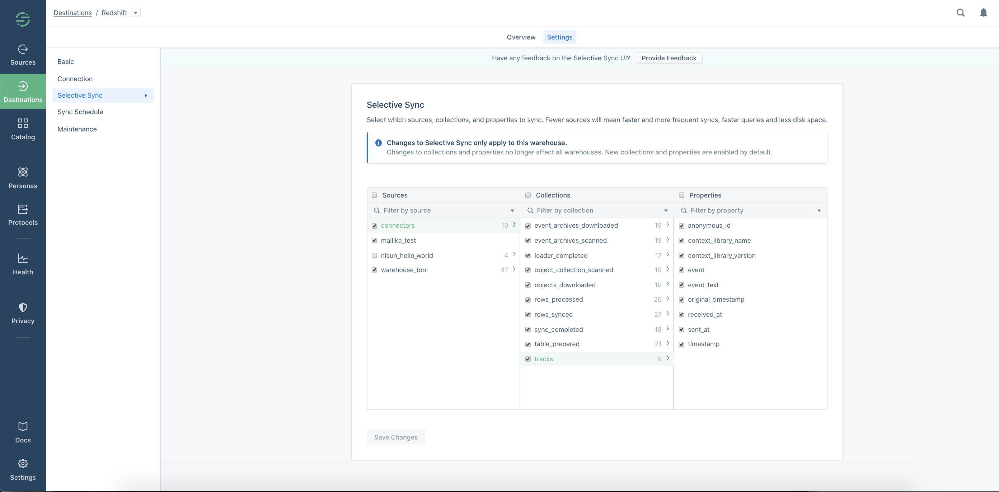
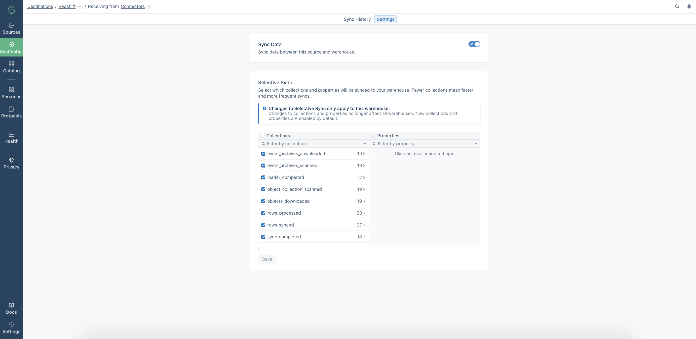

[Warehouse Selective Sync](/docs/connections/warehouses/faq/#can-i-control-what-data-is-sent-to-my-warehouse/) allows you to manage the data that you send to your warehouses. You can use this feature to stop syncing specific events (also known as collections) or properties that aren’t relevant, and could be slowing down your warehouse syncs.

> info ""
> This feature is available to Business Tier customers only.

With Selective Sync, you can customize which collections and properties from a source are sent to each warehouse. Previously, changes made using this feature were applied to all warehouses within a workspace. Now, instead of all changes affecting every warehouse in a workspace, you can use Selective Sync to decide which data should go to each individual warehouse. This allows you to send different data to each warehouse.

This feature affects [warehouses](/docs/connections/storage/warehouses/), and does not prevent data from going to any other [destinations](/docs/connections/destinations/).

> warning ""
> Note: For each warehouse only the first 5,000 collections per source and 5,000 properties per collection are visible in the Selective Sync user interface. Learn more about the limits [here](#selective-sync-user-interface-limits).

## When to use Selective Sync

By default, all sources and their collections and properties are sent, and no data is prevented from reaching warehouses.

When you disable sources, collections or properties using Selective Sync, Segment stops sending new data for these sources/collections/properties to your warehouse, however it doesn’t delete any existing data in the warehouse. If you later re-enable a source to begin syncing again, Segment loads all data that arrived since the last sync into the warehouse, but doesn’t backfill data that was omitted while these were disabled. Note: When a collection or property is re-enabled, data will only sync going forward, it will not be loaded from the last sync.

## Enabling Selective Sync

To use Selective Sync, go to the **Overview** page in the Segment App and select the warehouse you want to manage from the list of Destinations.

From here, you can access the Selective Sync feature from two places within the app - from the warehouse level (which makes it quicker to manage multiple sources at once), or from the warehouse-to-source connection page, which is quicker if you only want to manage data from one source.

### Change sync settings to a single warehouse from multiple sources

Click **Settings**, and click **Selective Sync** in the left menu. This may be valuable if you’re looking to make changes in bulk, such as when setting up a new warehouse.

### Change sync settings on a specific Warehouse to Source connection

To manage data from one specific source to an individual warehouse, go to the Warehouse Overview page. Click the Schema (source) you want to manage, and click **Settings**. This can be valuable when are making smaller changes (for example, disabling all properties from one unnecessary collection).

All changes made through Selective Sync only impact an individual warehouse - they do **not** propagate to multiple warehouses at once. To make changes to multiple warehouses, you need to enable/disable data for each individual warehouse.

### Selective Sync User Interface Limits

Regardless of schema size, for each warehouse only the first 5,000 collections per source and 5,000 properties per collection can be managed using the Selective Sync user interface. After you hit any of these limits, all future data is still tracked and sent to your warehouse. New collections created after hitting this limit is not displayed in the Selective Sync table.

You will see a warning in the Selective Sync user interface when the warehouse schema has reached 80% of the limit for collections and/or properties. An error message will appear when you've reached the limit.

Contact [Support](https://app.segment.com/help/contact/) to edit Selective Sync settings for any collections and/or properties which exceed the limit.

> warning ""
> Note: Only Workspace Owners can change Selective Sync settings.
