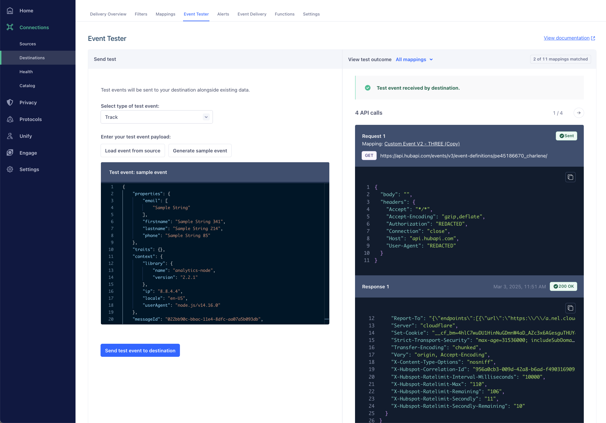
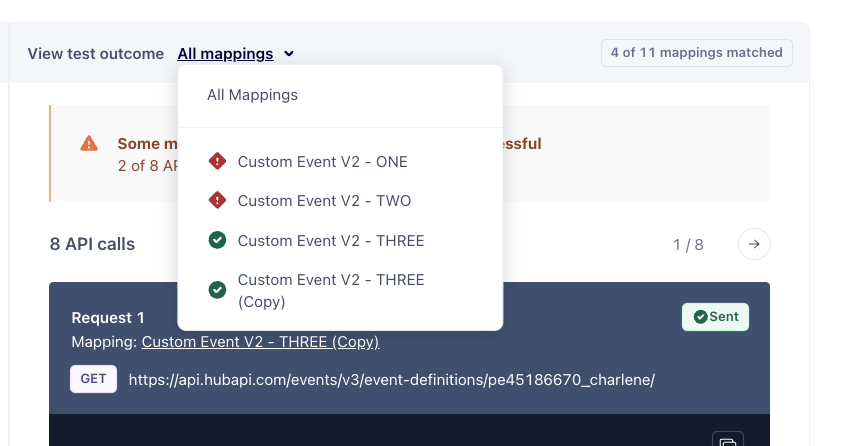

Segment provides two tools for validating the connection between Segment and a destination:
* [Event Tester](#event-tester): Test all enabled mappings within a destination. 
* [Mappings Tester](#mappings-tester): Test a single mapping configuration for your destination. 

Both testing tools share the same underlying testing infrastructure, which ensures consistent results across your testing workflows. The results from both testers display API requests, responses, and success/failure status to help you diagnose any issues.

You can use the Event and Mappings Tester for these products: 
* [Connections](/docs/connections/)
* [Linked Audiences](/docs/engage/audiences/linked-audiences/)
* [Linked Events](/docs/unify/data-graph/linked-events/#testing-with-linked-events-enrichments)
* [Reverse ETL](/docs/connections/reverse-etl/)
* [Journeys](/docs/engage/journeys/)

## Event Tester

> info ""
> The Event Tester is only available for server-side, [cloud-mode](/docs/connections/destinations/#connection-modes) integrations. It doesn't work for client-side, [device-mode](/docs/connections/destinations/#connection-modes) integrations. 
>  You must have write access in your Segment workspace to use the Event Tester. 

The Event Tester enables you to test your connections between Segment and your destination. You can inspect both the request sent from Segment and the response you receive back from the destination. The tester provides a comprehensive view of how your event data flows through multiple mappings. You can use the Event Tester to ensure: 

*   An event successfully arrives to a specific destination
*   Your new destination is configured correctly

The Event Tester sends a real event that appears in your end tool alongside your existing data. 

### Using the Event Tester

> info ""
> The event tester only tests the enabled mappings for the destination. 

To use the Event Tester: 
1. Navigate to **Connections > Destinations** and select your destination.
2. Click the **Event Tester** tab. 
3. Select the type of test event. You can choose from: Track, Identify, Page, Screen, and Group. 
4. Enter your test event payload. You can type in your own event or choose from **Load event from source** or **Generate sample event**.
   * **Load event from source**: Segment loads an event based on your source. 
   * **Generate sample event**: Segment generates a sample event for you. 
5. Click **Send test event to destination**. 
  

If your test event successfully sends to the destination, you can see in the **View test outcome** section:
* The request, response, and status for each API call 
* How many of your mappings matched
* The total number of API calls that were made as one test event can result in multiple API calls
* Which mappings were successful and which ones failed
* The destination's API endpoint used to make the request

You can navigate between the different API calls and can use the filter to navigate to specific mappings. 

## Mappings Tester
When you add a destination and create a mapping in Connections, Reverse ETL, Linked Audience, and Journeys, you can test the specific mapping using the Mappings Tester. The Mappings Tester only tests a single mapping at a time and you can edit field values before initiating a test. This helps you verify that your configured mapping works as expected.

Use the Mappings Tester when you need to:
* Verify a single mapping configuration
* Edit field values before testing a mapping
* Troubleshoot a specific mapping that isn't working as expected

### Using the Mappings Tester
To use the Mapppings Tester:
1. Navigate to the product (Connections, Reverse ETL, Linked Audience, or Journeys) you want to test the mapping for. 
2. Select the destination that has the mapping you want to test.
3. Select **Edit mapping**. 
4. Edit any values in the **Send test record** section.
5. Click **Send test event**. 

## FAQs

#### The Event Tester experienced an error when sending my event. Why did this happen?

If you experience an error, [contact Segment support](mailto:friends@segment.com) and we'll help you troubleshoot the issue.

#### Is this feature available for Data Lakes?

The Event Tester is not available for Data Lakes.

#### Why are my destination filters being ignored?

Events passed into the Event Tester bypass destination filters. Destination filters are applied to events as they are sent to specific destinations. However, the Event Tester is designed to help you troubleshoot your Sources, their configuration, and their downstream destinations by showing a sample of the data available. It allows you to check that data is being sent, and that it's in the correct format without the filters being applied. This means that when you use the Event Tester, you're seeing the data before any destination filters or other processing rules are applied, providing a clear view of the raw event data as it comes from the source.
