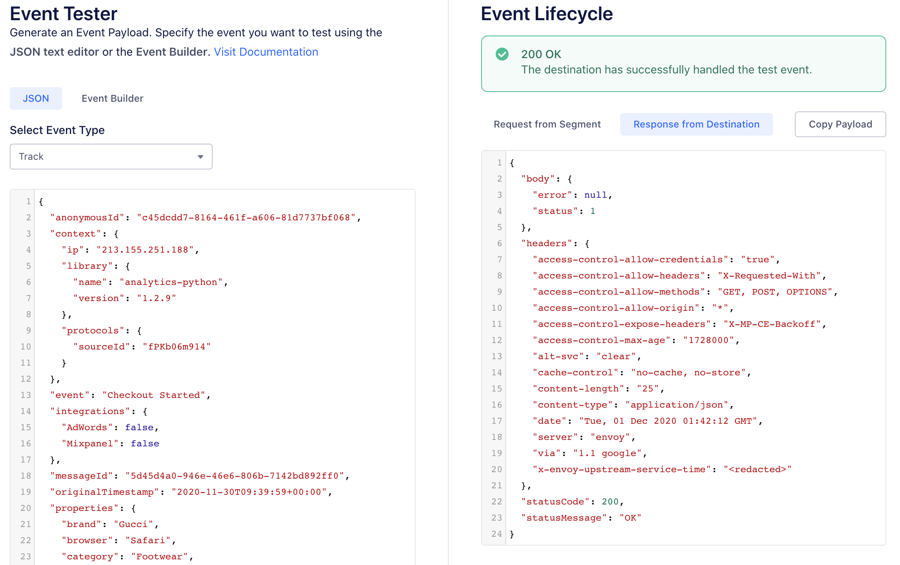

Segment's Event Tester enables you to test your connections between Segment and your destination. You can inspect both the request sent from Segment and the response you receive back from the destination. You can use the Event Tester to: 

*   ensure an event successfully arrives to a specific destination
*   ensure your new destination is configured correctly

> info ""
> This feature is only available for server-side, [cloud-mode](/docs/connections/destinations/#connection-modes) integrations. You can't use this for client-side, [device-mode](/docs/connections/destinations/#connection-modes) integrations. 

## How it works

> warning ""
> Make sure you have mappings enabled for your destination. The event tester only tests the enabled mappings for the destination. 

To use the Event Tester: 
1. Navigate to **Connections > Destinations** and select your destination.
2. Click the **Event Tester** tab. 
3. Select the type of test event. You can choose from: Track, Identify, Page, Screen, Group. 
4. Enter your test event payload. You can type in your own event or choose from **Load event from source** or **Generate sample event**.
   * **Load event from source**: Segment loads an event based on your source. 
   * **Generate sample event**: Segment generates a sample event for you. 
5. Click **Send test event to destination**. 
  
If your test event successfully sends to the destination, you can see in the **View test outcome section:
* The request and the response
* How many of your mappings matched
* The total number of API calls that were made
* Which mappings were successful and which ones failed

This is a real event that will appear in your end tool alongside your existing data. If you're not comfortable with this, then select "Cancel" and do not send the event. 

**5. View the Partner API response**

On the right hand side of the Event Tester you will see the response from the partner API. At the top, Segment provide of summary of the response. Below is the raw response payload Segment received that you can use for further debugging if necessary. 

If you are receiving an error and are unsure how to fix the issue, visit the partner docs (for example [https://developers.google.com/analytics/devguides/reporting/core/v3/errors](https://developers.google.com/analytics/devguides/reporting/core/v3/errors){:target="_blank”}) or contact the partner support team. 

## FAQ

#### Why can't I see the Event Tester when I log into my workspace?

The Event Tester is only accessible to users with write access in their Segment workspace (read-only users will not see the Event Tester in their workspace). 

#### The Event Tester experienced an error when sending my event. Why did this happen?

If you experience an error, [let Segment know](mailto:friends@segment.com) and the Segment team will help you troubleshoot the issue.

#### Is this feature available for Data Lakes?

The Event Tester is not available for Data Lakes.

#### Why are my destination filters being ignored?

Events passed into the Event Tester bypass destination filters. Destination filters are applied to events as they are sent to specific destinations. However, the Event Tester is designed to help you troubleshoot your Sources, their configuration, and their downstream destinations by showing a sample of the data available. It allows you to check that data is being sent, and that it's in the correct format without the filters being applied. This means that when you use the Event Tester, you're seeing the data before any destination filters or other processing rules are applied, providing a clear view of the raw event data as it comes from the source.
