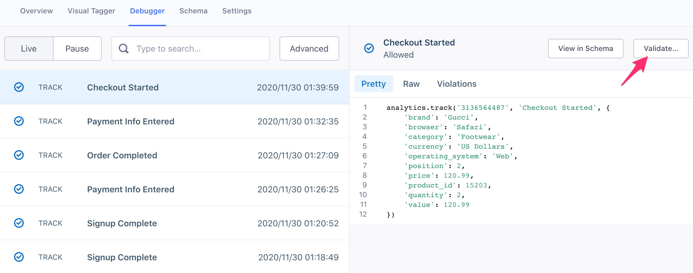

Segment has an Event Tester that enables you to test your connections between Segment and your destination. You can access the Event Tester from your Source Debugger, or from your destination settings.   

## Use Cases

There are two scenarios where you might want to use the Event Tester:

*   ensuring an event is successfully making it to a specific destination
*   ensuring your new destination is configured correctly

## Ensuring an event is successfully making it to a specific destination

**1. Choose an event from the Source Debugger that you want to debug and select "Validate"**

Go to your Source Debugger, select an event and in the top right hand side of the debugger view, select "Validate".

**2. Choose the destination you want to test with**

Select the destination that you want to test this event with. At this time, you can only use the Event Tester for cloud-mode (server side) destinations.

**3. Send event to destination**

The event payload from your debugger that you just selected will automatically load in the JSON view. You have the option to edit the payload if you want. Assuming it looks good, select "Send Event" at the bottom right of the screen. 

**4. Ensure you're happy to send the test event to the destination**

This is a real event that will appear in your end tool alongside your existing data. If you're not comfortable with this, then select "Cancel" and do not send the event. 

**5. View the Partner API response**

On the right hand side of the Event Tester you will see the response from the partner API. At the top, we provide of summary of the response. Below is the raw response payload we received that you can use for further debugging if necessary. 

If you are receiving an error and are unsure how to fix the issue, visit the partner docs (e.g. [https://developers.google.com/analytics/devguides/reporting/core/v3/errors](https://developers.google.com/analytics/devguides/reporting/core/v3/errors)) or contact the partner support team. 

# FAQ

**Why can't I see the Event Tester when I log into my workspace?**

The Event Tester is only accessible to users with write access in their Segment workspace (read-only users will not see the Event Tester in their workspace). 

**The Event Tester experienced an error when sending my event. Why did this happen?**

If you experience an error, [let us know](https://segment.com/help/contact/) and we'll help you troubleshoot the issue.
