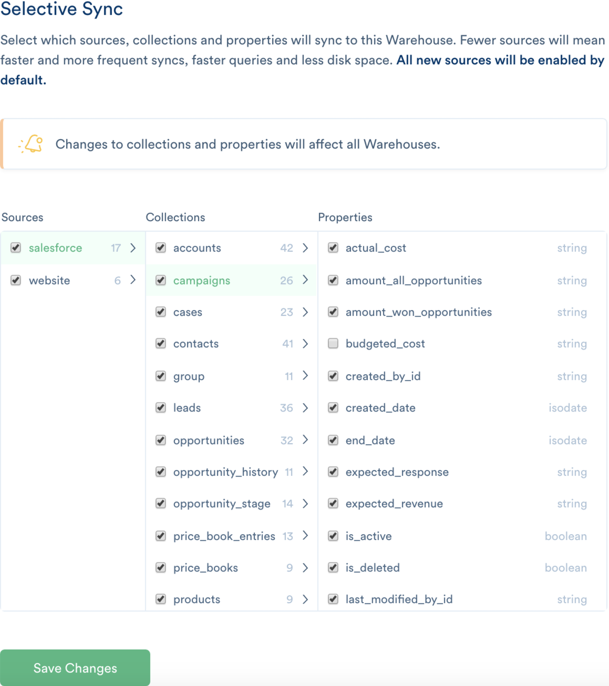

## Can I control what data is sent to my warehouse?

Yes! For those of you who are on our [business-tier](/pricing), you can choose which data sources, collections, and properties write into your data warehouse. Once a source or property is disabled, we no longer sync data from that source. We will not, however, delete any data from your warehouse.

When a source is re-enabled, we will sync all events since the last sync.  You can adjust your schema in the Selective Sync menu in your Warehouse Settings. 

For self-serve and free customers, we do not currently support the ability to select which events — or properties of events — get synced into your warehouse.

## Can we add, tweak, or delete some of the tables?

You have full admin access to your Segment Warehouse. However, please don’t tweak or delete tables Segment generated tables, as this may cause problems for our systems that upload new data.

If you want to join across additional datasets, feel free to create and upload additional tables.

## Can we transform or clean up old data to new formats or specs?

This is a common question if the data you’re collecting has evolved over time. For example, if you used to track the event `Signup` but now track `Signed Up`, you’d probably like to merge those two tables to make querying simple and understandable.

We don’t currently have a good way to let you define versions or transformations of the data as your data collection spec changes. Some customers have used [Redshift Views](http://docs.aws.amazon.com/redshift/latest/dg/r_CREATE_VIEW.html) to combine different events. In the meantime, we’re looking into ways we can let you do this simply within our interface – [open to suggestions](/contact) as to how you’d prefer we do it!

## How do I find my source slug?

Your source slug can be found in the URL when you’re looking at the source destinations page or live debugger. The URL structure will look like this:

`https://segment.com/[my-workspace]/sources/[my-source-slug]/overview`

## How fresh is the data in Segment Warehouses?

Your data will be available in Warehouses within 24-48 hours. The underlying Redshift datastore has a subtle tradeoff between data freshness, robustness, and query speed. For the best experience we need to balance all three of these.

Real-time loading of the data into Segment Warehouses would cause significant performance degradation at query time because of the way Redshift uses large batches to optimize and compress columns. To optimize for your query speed, reliability, and robustness, our guarantee is that your data will be available in Redshift within 24 hours.

As we improve and update our ETL processes and optimize for SQL query performance downstream, the actual load time will vary, but we’ll ensure it’s always within 24 hours.

## What if I want to add custom data to my warehouse?

You can freely load data into your Segment Warehouse to join against your source data tables.

The only restriction when loading your own data into your connected warehouse is that you should not add or remove tables within schemas generated by Segment for your sources. Those tables have a naming scheme of `<source-slug>.<table>` and should only be modified by Segment. Arbitrarily deleting columns from these tables may result in mismatches upon load.

If you want to insert custom data into your warehouse, create new schemas that are not associated with an existing source, since these may be deleted upon a reload of the Segment data in the cluster.

We highly recommend scripting any sort of additions of data you might have to warehouse, so that you aren’t doing one-off tasks that can be hard to recover from in the future in the case of hardware failure.

## Which IPs should I whitelist?

You can whitelist our custom IP 52.25.130.38/32 while authorizing Segment to write in to your Redshift or Postgres port.

BigQuery does not require whitelisting an IP address. To learn how to setup BigQuery, check out our [setup guide](https://segment.com/docs/destinations/bigquery/#getting-started)

## Will Segment sync my historical data?

We will automatically load up to 2 months of your historical data when you connect a warehouse.

For full historical backfills you'll need to be a Segment Business plan customer. If you’d like to learn more about our Business plan and all the features that come with it, [check out our pricing page](https://segment.com/pricing).

## What do you recommend for Postgres: Amazon or Heroku?

Heroku’s simple set up and administration process make it a great option to get up and running quickly.

Amazon’s service has some more powerful features and will be more cost-effective for most cases. However, first time users of Amazon Web Services (AWS) will likely need to spend some time with the documentation to get set up properly.
