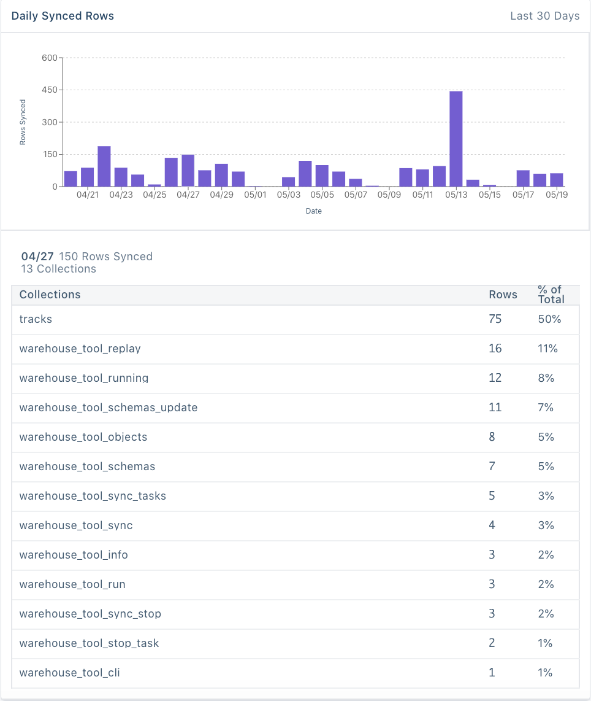

The Warehouse Health feature allows you to understand trends in volume of data (specifically, rows) synced to your data warehouse over time.

You can use this feature to answer questions such as:

- How has the volume of data synced to the warehouse grown over time?
- How much data is being synced on a daily basis?
- Which sources are contributing the most (or least) amount of data?
- How much data is each source syncing to the warehouse? Which collections make up the majority of data within a source?

This information can be used in a variety of ways, including:

- **Anomaly detection** - Identify spikes or dips in the volume of rows synced to understand anomalous behavior such as sudden changes in event volume, sync failures, etc.
- **Storage utilization** - Use the growth patterns as a way to inform how the volume of data synced to the warehouse compares to the storage capacity available in the warehouse.
- **Composition of data** - Understand how much data each source contributes to your warehouse to better manage the volume of data stored.

> note ""
> **Note**: Warehouse Health is available for all Warehouse customers.

## Accessing the Warehouse Health feature

The Warehouse Health feature is available at both the warehouse level, as well as the warehouse-source connection level.

- **Warehouse level** - This will show aggregate trends from all sources syncing to that warehouse
- **Warehouse-Source level** - This will show trends for each source syncing to a warehouse, and aggregations of the collections within that source.

To use the Warehouse level Health feature, go to the **Overview** page in the Segment App and select the warehouse you want to access from the list of Destinations.

### Warehouse
Click the **Health** feature, which can be found between the Overview and Settings tabs at the top of the page.

### Warehouse-Source
Click the **Overview** tab for that warehouse, and select the Source (schema) you want to see data for. From here, click the **Health** tab, which can be found between the Overview and Settings tabs at the top of the page.

## FAQs

##### Can I use this data for QA purposes?
The purpose of these dashboards are to help understand high level trends in data synced to the warehouse, but not QA data. With this, you’ll see rounded numbers provided in multiple places instead of exact numbers.

These dashboards will help you understand trends in the data, and use signals to do deeper investigation and QA, as needed.

##### How often is the data refreshed?**
Data is refreshed on a real time basis.

##### What timeframe is the data available for?**
The data available shows the last 30 days.

##### How is this similar (or different) than the information available in the Sync History and Overview tabs?**
The Overview, Sync History and Health tabs will help provide you with different levels of granularity into warehouse syncs.

- **Overview** - Shows which sources (also referred to as schemas) are connected to a warehouse, and information about the most recent sync and upcoming sync for each source. This information includes when did the last sync take place, what is the status of that sync, how many events were synced, and when is the next sync scheduled to happen.
- **Sync History** - Shows detailed information about most recent syncs for a specific source syncing to a warehouse (warehouse-source level). In this tab you can find information for each sync including sync status, start time, duration, synced rows, and notices about errors and/or warnings.
- **Health** - The Health tab will provides an aggregate view of syncs to a warehouse over time. You can either look at this at a warehouse level, or warehouse-source level. This shows information about the volume of rows synced over the last 30 days.

##### What timezone are the dates in?**
All dates and times found within Warehouse Health, Sync History and Warehouse overview pages are in the user’s local time.
