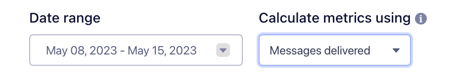

Twilio Engage provides you with analytics that give you insight into the performance of your [email, SMS, and WhatsApp campaigns](/docs/engage/campaigns/).

On this page, you'll learn how Engage calculates campaign analytics and which messaging metrics you can view.

## Access a campaign's analytics

You'll find a campaign's analytics within its parent Journey, using the following instructions:

1. Within your Space, select the **Journeys** tab.
2. From the Journeys table, select the Journey you want to view.
3. From the Journey overview, select the email, SMS, or WhatsApp campaign you want to view.
4. A side panel appears that displays your campaign's analytics.

## How Engage measures campaign analytics

Understanding when and how Engage measures campaign analytics will help you as you review your analytics reports.

Engage begins tracking campaign performance after you send a campaign. As a result, a campaign's analytics only reflect conversions that occurred after campaign publication. For example, suppose you send an email campaign promoting a sale in your online store. If a customer purchases a qualifying product **before** receiving your campaign, their purchase would not count as a conversion.

### Changing a campaign's base metrics 

Clicking on a campaign in a Journey opens a side panel that shows your campaign’s analytics. You can change both the date range and the base percentage type for any campaign.

The date range picker initially inherits the date range set in the campaign’s parent Journey, but you can use the campaign date range picker to define a range for the specific campaign you’re viewing. Changing a campaign’s date range won’t impact the parent Journey’s date range.

By default, Engage bases a campaign’s metrics on the number of sent messages. The **Calculate metrics using** dropdown lets you change this denominator value so that Engage bases analytics on the number of delivered messages. Changing the denominator won't impact the **Converted** metric, though, since conversions are already based on delivered messages.

## Email metrics

The following table lists the email campaign metrics that Engage tracks:

| Metric             | Description                                                                                        |
| ------------------ | -------------------------------------------------------------------------------------------------- |
| Sent               | The number of emails campaigns that you sent.                                                      |
| Delivered          | The number of emails campaigns that were accepted by the receiving inbox server.                   |
| Opened             | The number of times that your email campaigns were opened.                                         |
| Clicked            | The number of times that recipients clicked within your email campaigns.                           |
| Converted          | The number of conversions that took place after campaign publication; based on delivered messages. |
| Click-to-Open Rate | The number of clicks compared to the number of opens for a campaign.                               |
| Bounced            | The number of email campaigns that bounced instead of being delivered.                             |
| Unsubscribed       | The number of campaign recipients who chose to unsubscribe from within the email campaigns.        |
| Spam Reported      | The number of recipients who marked your email as spam.                                            |

SendGrid powers Engage's email campaign event analytics. For more details on email metrics, view SendGrid's [Marketing Campaigns Statistics Overview](https://docs.sendgrid.com/ui/analytics-and-reporting/marketing-campaigns-stats-overview){:target="_blank"}.

## SMS metrics

The following table lists the SMS campaign metrics that Engage tracks:

| Metric      | Description                                                           |
| ----------- | --------------------------------------------------------------------- |
| Queued      | The number of SMS campaigns queued for delivery, but not yet sent.    |
| Sent        | The number of SMS campaigns that you sent.                            |
| Delivered   | The number of SMS campaigns that were accepted by the user's carrier. |
| Undelivered | The number of undelivered SMS campaigns.                              |
| Failed      | The number of SMS campaigns that didn't send.                         |

## WhatsApp metrics

The following table lists the WhatsApp campaign metrics that Engage tracks:

| Metric      | Description                                                                               |
| ----------- | ----------------------------------------------------------------------------------------- |
| Queued      | The number of WhatsApp campaigns queued for delivery, but not yet sent.                   |
| Sent        | The number of WhatsApp campaigns that you sent.                                           |
| Delivered   | The number of WhatsApp campaigns delivered to the user's device.                          |
| Opened      | The number of opened WhatsApp campaigns, based on users who have turned on read receipts. |
| Undelivered | The number of undelivered WhatsApp campaigns.                                             |
| Failed      | The number of WhatsApp campaigns that didn't send.                                        |
