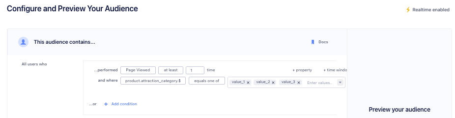

Audiences let you group users or accounts based on event behavior and traits that Segment tracks.

You can build Audiences from core **tracking events**, **traits**, and **computed traits**. You can then sync Audiences to hundreds of [Destinations](/docs/connections/destinations/) or access them with the [Profile API](/docs/unify/profile-api).

## Building an audience

You can build an audience from existing events, traits, computed traits, or other Audiences. Editing an audience before the initial backfill is complete can create technical errors.

When building your audience, the **Include Anonymous Users** checkbox determines which external IDs need to exist on a profile for Segment to include the user in the audience. For example:
- **Include Anonymous Users** _not_ selected: `user_id`, `email`, `android.idfa`, or `ios.idfa` would need to exist on a profile
- **Include Anonymous Users** selected: `user_id`, `email`, `android.idfa`, `ios.idfa`, or `anonymous_id` would need to exist on a profile

> warning "Audience Keys"
> Avoid using the same Audience Key twice, even if you've deleted the original audience.

<!-- PW: 9/23/24, commenting this screenshot out until we can get a more accurate one  -->


### Events

You can build an audience from any events connected to Engage, including [Track](/docs/connections/spec/track), [Page](/docs/connections/spec/page), and [Screen](/docs/connections/spec/screen) calls. In the Audience builder, Page calls appear as `Page Viewed` and Screen calls appear as `Screen Viewed`.

To refine the audience based on event properties, use the `+property` button:
- The `name` property for Page and Screen calls appears in the Audience builder as `page_name` and `screen_name`, respectively. 
- The Audience builder doesn't return every property value in the Constant value or Traits drop-downs. Segment shows a subset of values from the incoming data stream. If you don't see the value you're looking for, you can manually enter it.

Select `and not who` to indicate users that have not performed an event. For example, you might want to look at all users that have viewed a product above a certain price point but not completed the order.


You can also specify two different types of time-windows, `within` and `in between`. The `within` property lets you specify an event that occurred in the last `x` number of days, while `in between` lets you specify events that occurred over a rolling time window in the past. A common use case is to look at all customers that were active 30 to 90 days ago, but have not completed an action in the last 30 days.

### Building audiences with traits

You can also build audiences using Custom Traits, Computed Traits, SQL Traits, and audience memberships.

#### Custom Traits 

[Custom traits](/docs/unify/traits/custom-traits/) are user or account-specific attributes. You can collect these traits from your apps when a user completes a form or signs up using an [Identify call](/docs/connections/spec/identify). You can view these traits in the Profile explorer. Custom Traits are mutable and update to the latest value seen by the user's Identify events. 

> info ""
> When you delete an audience that previously generated Identify events, the data for the audience key stays attached to profiles that entered the audience. This data then becomes visible in Segment as a custom trait.

#### Computed Traits

You can also use computed traits in an audience definition. For example, you can create a `total_revenue` computed trait and use it to generate an audience of `big_spender` customers that exceed a certain threshold. A computed trait must be configured to "Send Identify" calls in order to be available for selection in the audience definition.


> info ""
> Engage supports nested traits, but the Audience builder doesn’t support accessing objects nested in arrays. When you send arrays of objects, they are flattened into strings. As a result, the same conditions that work on strings will work on the array. Within the builder, you can only use string operations like `contains` and `does not contain` to look for individual characters or a set of characters in the flattened array.

#### SQL Traits

With SQL Traits, you can use data in your warehouse to build an audience. By running SQL queries on this warehouse data, you can import specific traits back into Segment to enhance both Segment Audiences and the data you send to downstream destinations.

#### Audience memberships

When you build an audience based on audience membership, you use existing audiences as criteria for creating new audiences. You can include or exclude profiles based on their membership in other audiences, allowing you to generate more specific audience segments.

To see which audiences reference a particular audience in their definitions, select the **Consumers** tab when viewing a classic or linked audience. This tab lists all dependent audiences, to help you understand and manage relationships between your audience segments.

### Trait operators

| Operator                   | Description                           |
|--------------------------- |---------------------------------------|
| equals                     | Matches exact value. |
| not equals                 | Does not match exact value. |
| less than                  | Value is less than specified. |
| greater than               | Value is greater than specified. |
| less than or equal to      | Value is less than or equal to specified. |
| greater than or equal to    | Value is greater than or equal to specified. |
| equals any of              | Matches any of specified values. |
| contains any of            | Includes any of specified values. |
| contains                   | Includes specified substring or value. |
| does not contain           | Excludes specified substring or value. |
| starts with                | Begins with specified substring. |
| ends with                  | Ends with specified substring. |
| exists                     | Value is present (not null). |
| not exists                 | Value is absent (null). |
| before date                | Dates before specified date. |
| after date                 | Dates after specified date. |
| within last                | Dates between X days ago and today. |
| within next                | Dates between today and X days from now. |
| before last                | All dates older than X days from today. |
| after next                 | All dates beyond X days from today. |

Only ISO timestamps can be used with time comparison operators. If the timestamp is not a valid ISO timestamp (for example, a trailing `Z` is missing), Segment won't process the audience in real-time. Learn more about [real-time compute compared to batch](/docs/engage/audiences/#real-time-compute-compared-to-batch). 

**Note**: Timezones seen in the UI are based on your local timezone, but are converted to UTC on the backend.

### Funnel audiences

Funnel audiences allow you to specify strict ordering between two events. This might be the case if you want an event to happen or not happen within a specific time window, as in the following example:


### Dynamic property references

Dynamic Property references give you more flexibility over funnel audiences. Instead of specifying a constant value in both events, like `product_id = 123` for both Product Viewed and Order Completed events, you can specify that a child event references an event property of a parent event. You can also compare an event property to a trait variable.


### Audience previews
After configuring your audience definition, click the **Preview** button to review your audience setup. It shows the total number of profiles that match your criteria and a sample list of those profiles, helping you confirm the audience is correct before launching campaigns. Previews are only available if your audience uses historical data, displaying the current size based on past data. Learn more about the [Include Historical Data option](/docs/engage/audiences/#how-does-the-historical-data-flag-work). The audience grows as new profiles meet your criteria. Click any profile in the sample list to view a detailed side sheet with their attributes, making it easy to verify membership. This feature simplifies campaign planning and ensures your audience targets the right profiles.

> info ""
> The audience preview membership is calculated using data that may be slightly delayed from real-time processing, which can lead to temporary discrepancies between the preview results and the profile information shown in the profile side sheet or the Profile API.

#### Identifier breakdown
To check how profiles in your audience are identified, you can view them in the identifier breakdown. Click **Preview** to view your audience configuration. In the Preview results, navigate to the **Insights** tab to see a breakdown of the percentage of profiles associated with each external_id in the audience. These are the default IDs that Segment includes in the Identity resolution configuration. Segment displays the percentage of the audience with each identifier, which you can use to verify the audience size and profiles are correct. The identifier breakdowns on profiles doesn't update in real time. 

> info ""
> The identifier breakdown doesn't show custom IDs included in the Identity resolution configuration unless those IDs are explicitly selected through [ID sync](/docs/engage/trait-activation/id-sync/). By default, Segment only displays external IDs in the breakdown.

#### Audience overlap
To check how your audience intersects with others in your Segment space, click **Preview** to view your audience configuration. In the Preview results, navigate to the **Insights** tab where you can select an existing audience from the dropdown menu and click **Compute overlap** to see the number of shared profiles. This feature optimizes campaign targeting by identifying redundant audiences and refining segmentation.

### Account-level audiences

If you have a B2B business, you might want to build an Audience of accounts. You can use both account-level traits that you've sent through the [Group](/docs/connections/spec/group) call, or user-level traits and events. For example, you might want to re-engage a list of at-risk accounts defined as companies which are on a business tier plan and where none of the users in that account have logged in recently. When incorporating user-level events or traits, you can specify `None of the users`, `Any users`, or `All users`.

See [Account-level Audiences](/docs/engage/audiences/account-audiences) for more information.


## Send audiences to destinations

You can send audiences and computed traits to third-party services in Segment's [Destinations catalog](/docs/connections/destinations/).

Segment's Connections pipeline first collects and sends events from your Source to your destination. Built on top of Connections, Engage then uses the same source events to let you create Audiences and computed traits within Segment. You can then send the audience or computed trait you've built to your destinations.

See how you can [use Linked Audiences with Braze](/docs/engage/audiences/linked-audiences-braze/) and [Iterable](/docs/engage/audiences/linked-audiences-iterable/) to better understand how you can use Linked Audiences for your destinations.

> info ""
> Because Engage only sends audiences and computed traits to destinations, it doesn't replace a standard event pipeline. Connect a source directly to a destination if you want the destination to receive all events that Segment gathers.

### Connect your audience to a destination

> warning "Audience Keys"
> Avoid using the same audience key twice, even if you've deleted the original audience.

Once you've previewed your audience, you can choose to connect it to a destination or keep the audience in Segment and export it as a CSV file download.

If you already have destinations set up in Segment, you can import the configuration from one of your existing sources to Engage. You can only connect one destination configuration per destination type.

When you create an audience, Segment starts syncing your audience to the destinations you selected. Audiences are either sent to destinations as a boolean user-property or a user-list, depending on what the destination supports. Read more about [supported destinations](/docs/engage/using-engage-data/#compatible-engage-destinations) in the Engage documentation.

For account-level audiences, you can send either a [Group](/docs/connections/spec/group) call and/or [Identify](/docs/connections/spec/identify) call. Group calls send one event per account, whereas Identify calls send an Identify call for each user in the account. This means that even if a user hasn't performed an event, Segment still sets the account-level computed trait on that user.

Because most marketing tools are still based at the user level, it is often important to map this account-level trait onto each user within an account. See [Account-level Audiences](/docs/engage/audiences/account-audiences) for more information.

For step-by-step instructions on how to connect an audience to a destination, see [Send Audience Data to Destinations](/docs/engage/audiences/send-audience-data/).

> info "Historical data behavior for new destinations"
> When you connect a new destination to an existing audience, Engage backfills historical data if the **Include Historical Data** option is enabled in the audience settings. If this setting is disabled, only new data gets sent. To sync all historical data manually, [contact Support](mailto:friends@segment.com) to request a resync.

### Disconnect or remove a destination 

When managing your audience-destination connections you have two options:

1. **Connect to destination** - Toggles the connection on and off. When disconnected, the setup and configuration remain saved, but no data flows from the audience to the destination until you re-enable the connection. Use this option to pause sending data without losing your work.
2. **Remove destination from audience** - Deletes the connection completely, so no events are sent to the destination. To use the destination again, you'll need to set it up as new from the beginning.


## Understanding compute times

Because a number of factors (like system load, backfills, or user bases) determine the complexity of an audience, some compute times take longer than others.

As a result, **Segment recommends waiting at least 24 hours for an audience to finish computing** before you resume working with the audience. Editing an audience before the initial backfill is complete can create technical errors.

From the Overview page, you can view audience details including the current compute status and a progress bar for real-time and batch audiences. Engage updates the progress bar and status for real-time computations approximately every 10 minutes. When you create a real-time audience, you'll see a progress bar, computed percentage, and status updates. For existing Audiences that you edit, Engage displays the compute status but not the progress bar or percentage.

> warning ""
> Engage syncs the Overview page for an individual audience more frequently than the Engage Audiences page (**Engage > Audiences**). As a result, you might see temporary discrepancies in Audience details, such as user counts, between these two pages.

### Refresh real-time Audiences and Traits

For real-time computations, you can click **Refresh Audience** or **Refresh Trait** to update user counts, status, and compute progress.

### Compute statuses

Engage displays the following compute statuses for Audiences and Traits.

#### Real-time computations

| Computation status        | Description                           |
|---------------------------|---------------------------------------|
| Preparing                 | Engage is preparing the computation.  |
| Computing                 | Engage is computing the Audience or Trait.           |
| Live                      | The Audience or Trait is live. Users will enter in real-time as they meet entry criteria.        |
| Disabled                  | The Audience or Trait is disabled.                   |
| Failed                    | The computation was cancelled or failed to compute. Please contact [Segment support](https://segment.com/help/contact/){:target="_blank"}.            |


#### Batch computations

> warning "Disabled batch computations don't automatically backfill data when re-enabled"
> If you disable and re-enable a batch computation, Segment does not automatically create a backfill. Any data Segment receives during the disabled period is not sent to your Destination after you re-enable your batch computation. If you want to backfill your data, you must reach out to [Segment Support](mailto:friends@segment.com) to request a resync.


| Computation status        | Description                           |
|---------------------------|---------------------------------------|
| Preparing                 | Engage is preparing the computation.  |
| Computing                 | Engage is computing the audience or trait.  |
| Live                      | The Audience or Trait is up-to-date, based on the most recent sync cadence. When you edit a batch Audience or Trait, Engage displays the compute status as `Live` and incorporates your edits in the next scheduled sync.                 |
| Not Computing             | Engage displays this status when there are no destinations connected or `Compute without connected destinations` isn't selected.         |
| Disabled                  | The audience or trait is disabled.    |
| Failed                    | The computation was cancelled or failed to compute. Please contact [Segment support](https://segment.com/help/contact/){:target="_blank"}.    |


## Real-time compute compared to batch

Real-time Compute allows you to update traits and audiences as Segment receives new events. Real-time Compute unlocks these use cases:

- **Intra-Session App Personalization:** change your app experience with personalized onboarding, product recommendations, and faster funnels based on a user entering and exiting an audience.
- **Instant Messaging:** Trigger messages in email, live chat, and push notifications instantly, to deliver immediate experiences across channels.
- **Operational Workflows:** Supercharge your sales and support teams by responding to customer needs faster, based on the latest understanding of a user.

> warning ""
> By default, Segment creates all audiences as real-time computations. There are however, a few exceptions which can only be supported as batch computations, one example is [Funnel Audiences](#funnel-audiences). The audience builder will determine and indicate whether the audience is a real-time or batch computation. 

To create a new audience or trait:

1. Go to your **Computed Traits** or **Audiences** tab in Engage and select **Create**.

2. Configure and preview your Audience or Trait.
- A lightning bolt next to `Realtime Enabled` indicates that the computation updates in real-time.
- Configure the **Include Historical Event Data** option to limit how far back event data is processed by setting a lookback window (for example, the “last 90 days”). When the **Include Historical Event Data** option is unchecked, Segment only uses event data received after audience creation. However, trait data is always included as part of the filtering criteria whenever it is defined in the audience as lookback windows don't apply to trait data since it represents a snapshot of profile attributes at a given time.

3. Select destinations to connect, then review and create your audience or trait.

While Engage is computing, use the Audience Explorer to see users or accounts that enter your Audience. Engage displays the audience as computing in the Explorer until at least one user or account enters.

> warning ""
> [Facebook Custom Audiences](/docs/connections/destinations/catalog/personas-facebook-custom-audiences/), [Marketo Lists](/docs/connections/destinations/catalog/marketo-static-lists/), and [Adwords Remarking Lists](/docs/connections/destinations/catalog/adwords-remarketing-lists) impose rate limits on how quickly Segment can update an audience. Segment syncs at the highest frequency allowed by the tool, which is between one and six hours.

> info "Real-time and batch computation"
> By default, Segment creates all audiences as real-time computations. However, some conditions require batch computation. For example, [funnel audiences](#funnel-audiences) can only be computed in batch mode. The Audience builder determines whether an audience is real-time or batch based on the conditions applied.

### Editing realtime audiences and traits

Engage supports the editing of realtime Audiences and Traits, which allows you to make nuanced changes to existing Traits and Audiences in situations where cloning or building from scratch may not suit your use case.

To edit a realtime trait or audience:

1. In your Engage Space, select the **Computed Traits** or **Audiences** tab.
2. Select the realtime audience or trait you want to edit.
3. Select the **Builder** tab and make your edits.
4. Preview the results, then select **Save audience** to confirm your edits.

Engage then processes your realtime audience or trait edits. While the edit task runs, the audience remains locked and you can't make further changes. Once Engage incorporates your changes, you'll be able to access your updated audience or trait.

It's not possible to edit an audience to convert it from real-time to batch, or vice-versa. If the computation type needs to be changed, you will need to recreate the audience with the appropriate conditions. You can't edit an audience to include anonymous users. If you need to include anonymous profiles, recreate the audience with the appropriate conditions. 

> warning ""
> If your audience includes historical event data (you enabled the **Include Historical Event Data** option), editing an audience creates a new backfill task. The backfill task and the edit task take longer to process if the audience is connected to a destination with rate limits. Rate-limited destinations dictate how fast Engage can backfill. View a list of [rate-limited destinations](/docs/engage/using-engage-data/#rate-limits-on-engage-event-destinations).

## Monitor the health of your audience syncs

Use Segment's [Delivery Overview](#delivery-overview) and [Alerting](#alerting) features to monitor the health of your audience syncs and get notifications when event volume spikes or drops. 

### Delivery Overview

Delivery Overview is a visual observability tool designed to help Segment users diagnose event delivery issues for any event-streaming destination receiving events from Engage Audiences.

Delivery Overview has three core features:
- [Pipeline view](/docs/connections/delivery-overview/#pipeline-view): A visual overview of each step your data takes during the delivery process - from when your audiences outputs events to when events are successfully delivered to your connected destination. 
- [Breakdown table](/docs/connections/delivery-overview/#breakdown-table): If you select a step in the pipeline view, you can see more details about the events that were processed at each pipeline step.
- [Discard table](/docs/connections/delivery-overview/#discard-table): If you select an event in a breakdown table, you can see more details about the events that failed or were filtered out of your process. You can also inspect samples of the discarded events.

For more information about the breakdown and discard tables, see the [Delivery Overview](/docs/connections/delivery-overview/) documentation.

To view Delivery Overview for an audience:
1. From your Segment workspace's home page, navigate to **Engage > Audiences**.
2. Find an audience, click the **(...)** menu, and select **Delivery Overview**. 
3. On the Delivery Overview page, select the Audience dropdown to filter by a specific Audience, select the Date range dropdown to filter by a specific time period, or use the Show metrics toggle to view your metrics as percentages.

#### Steps in the pipeline view

By default, Segment displays Delivery Overview information for all audiences connected to your destination. You can filter your Delivery Overview pipeline view by an individual audience for more granular data. 

You can further refine the data displayed on the pipeline view using the time picker and the metric toggle, located under the destination header. With the time picker, you can specify a time period (last 10 minutes, 1 hour, 24 hours, 7 days, 2 weeks, or a custom date range over the last two weeks) for which you’d like to see data. With the metric toggle, you can switch between seeing metrics represented as percentages (for example, _85% of events_ or _a 133% increase in events_) or as counts (_13 events_ or _an increase of 145 events_.) Delivery Overview shows percentages by default.

> info "Linked Audiences have additional filtering functionality"
> Linked Audiences users can filter the Delivery Overview event pipeline by [Linked Audience events](/docs/engage/audiences/linked-audiences/#step-2c-define-how-and-when-to-trigger-an-event-to-your-destination). For more information, see the [Linked Audiences](/docs/engage/audiences/linked-audiences/#delivery-overview-for-linked-audiences) documentation.

Audiences have the following steps in the pipeline view: 
- **Events that Segment created for your activation**<sup>*</sup>: The number of events for each compute depends on the changes detected in your audience membership.
- **Filtered at source**: Events discarded by Protocols: either by the [schema settings](/docs/protocols/enforce/schema-configuration/) or [Tracking Plans](/docs/protocols/tracking-plan/create/). 
- **Filtered at destination**: If any events aren’t eligible to be sent (for example, due to destination filters, insert function logic, and so on), Segment displays them at this step.
- **Events pending retry**: A step that reveals the number of events that are awaiting retry. Unlike the other steps, you cannot click into this step to view the breakdown table. 
- **Failed delivery**: Events that Segment _attempted_ to deliver to your destination, but that ultimately _failed_ to be delivered. Failed delivery might indicate an issue with the destination, like invalid credentials, rate limits, or other error statuses received during delivery.
- **Successful delivery**: Events that Segment successfully delivered to your destination. You’ll see these events in your downstream integrations.

<sup>*</sup>_The "Events from audience" step is currently only available for Linked Audiences._

### Alerting

Create alerts related to the performance and throughput of audience syncs and receive in-app, email, and Slack notifications when event volume fluctuations occur.

> info "Generate a Slack webhook to receive Slack notifications"
> To receive an alert in a Slack channel, you must first create a Slack webhook. For more information about Slack webhooks, see Slack's [Sending messages using incoming webhooks](https://api.slack.com/messaging/webhooks){:target="_blank”} documentation.

To access audience alerting, navigate to **Engage > Audiences**, select an audience, and click the **Alerts** tab.

On the **Alerts** tab, you can create new alerts and view all active alerts for this audience. You can only edit or delete the alerts that you create, unless you have the [Workspace Owner role](/docs/segment-app/iam/roles/).

#### Activation event health spikes or drops

You can create an Activation event health spikes or drops alert that notifies you when events sent from your audience to a downstream destination have failures to a destination above a certain threshold. For example, if you set a change percentage of 4% and your destination received 100 events from your audience over the first 24 hours, Segment would notify you the following day if your destination ingested fewer than 96 or more than 104 events.

To create an Activation event health spikes or drops alert: 
1. From your Segment workspace's home page, navigate to **Engage > Audiences**. 
2. Select the Audience you want to create an alert for, select the Alerts tab, and click **Create alert**. 
3. On the Create alert sidesheet, select the **Activation event health spikes or drops** alert and pick a destination for which you'd like to monitor event health. 
4. Enter a percentage threshold to trigger activation event health notifications. 
5. Select one or more of the following alert channels:
  - **Email**: Select this to receive notifications at the provided email address. 
  - **Slack**: Select this to send alerts to one or more channels in your workspace. You can post messages to your channel with either a [webhook](https://api.slack.com/messaging/webhooks){:target="_blank”} or a [workflow](https://slack.com/help/articles/360041352714-Build-a-workflow--Create-a-workflow-that-starts-outside-of-Slack){:target="_blank”}. 
  - **In-app**: Select this to receive notifications in the Segment app. To view your notifications, select the bell next to your user icon in the Segment app. 
6. Click **Save**.

To make changes to an Activation event health spikes or drops alert, select the icon in the Actions column for the alert and click **Edit**. 

To delete a Activation event health spikes or drops alert, select the icon in the Actions column for the alert and click **Delete**.

#### Audience size change

You can create an Audience size change alert that notifies you when your audience increases or decreases by a certain threshold. For example, if you set a change percentage of 4% and your destination had 100 members over the first 24 hours, Segment would notify you the following day if your audience had fewer than 96 or more than 104 members.

> info "Audience size change alerts currently only support Linked Audiences"
> Audience size change alerts are in public beta, and Segment is actively working on this feature. During the public beta, Audience size change alerts only support Linked Audiences. Some functionality may change before it becomes generally available.  

To create an Audience size change alert:
1. From your Segment workspace's home page, navigate to **Engage > Audiences**. 
2. Select the Linked Audience you want to create an alert for, select the Alerts tab, and click **Create alert**. 
3. On the Create alert sidesheet, select the **Audience size change alert** and pick a destination for which you'd like to monitor event health. 
4. Enter a percentage threshold to trigger audience size change notifications. 
5. Select one or more of the following alert channels:
  - **Email**: Select this to receive notifications at the provided email address. 
  - **Slack**: Select this to send alerts to one or more channels in your workspace. You can post messages to your channel with either a [webhook](https://api.slack.com/messaging/webhooks){:target="_blank”} or a [workflow](https://slack.com/help/articles/360041352714-Build-a-workflow--Create-a-workflow-that-starts-outside-of-Slack){:target="_blank”}. 
  - **In-app**: Select this to receive notifications in the Segment app. To view your notifications, select the bell next to your user icon in the Segment app. 
6. Click **Save**.

To make changes to an Audience size change alert, select the icon in the Actions column for the alert and click **Edit**. 

To delete a Audience size change alert, select the icon in the Actions column for the alert and click **Delete**.

## Access your Audiences using the Profiles API

You can access your Audiences using the Profile API by querying the `/traits` endpoint. For example, you can query for `high_value_user` property with the following `GET` request:

```
https://profiles.segment.com/v1/spaces/<workspace_id>/collections/users/profiles/email:alex@segment.com/traits?limit=100&include=high_value_user
```

The query would return the following payload:

```json
    {
        "traits": {
            "high_value_user": true
        },
        "cursor": {
            "url": "",
            "has_more": false,
            "next": "",
            "limit": 100
        }
    }
```
You can read the [full Profile API docs](/docs/unify/profile-api/) to learn more.

## Download your Audience as a CSV file

You can download a copy of your Audience by visiting the Audiences overview page. 

1. Navigate to **Engage > Audiences**.
2. Select the Audience you'd like to download as a CSV, then click **Download CSV**.
3. Select the data fields that you'd like to include in your CSV as columns.
- Your CSV contains all users in this audience with the selected fields. You can filter by `External ID`, `SQL trait`, `Computed Trait`, and `Custom Trait`.
4. Click **Next**.
5. Before you can download the CSV, you'll need to generate it. There are two different options for formatting:
- **Formatted:** Displays external IDs and traits as distinct columns.  
- **Unformatted:** Contains the following columns: a user/account key, a JSON object containing the external IDs (optional, if selected), and a JSON object containing the traits (optional, if selected).
6. Click **Generate CSV**.

Once Segment generates the CSV, you can download the file directly. You'll receive an email notification of the CSV completion, with a URL to the Audience overview page. Generating a CSV can take a substantial amount of time for large audiences. After you generate the CSV file, leave the modal window open while Segment creates the file. If the audience recalculates between when you click Generate and when you download the file, you might want to regenerate the file. The CSV is a snapshot from when you clicked Generate, and could be outdated.

Note the following limits for the CSV downloader:
- You can't download more than one CSV for the same audience at the same time.
- You can only generate one CSV every five minutes.
- Each CSV represents a snapshot at a given point in time that references the data from the audience's most recent computational run. This applies to both real time and batch audiences, as the CSV is not updated in real time. To locate the snapshot's given point of time, click on the Download CSV button, and the popup modal will contain an information icon ℹ️, which when hovered over will reveal the snapshot's details.
  - 

> warning ""
> You can't add account traits and identifiers using the CSV downloader with account-level audiences. This is because every row listed in the CSV file is a user, and since account traits and identifiers only exist on accounts, they wouldn't exist as a user's custom trait and appear on the CSV.

## FAQ

### Why do I get a different user count when I use `$` on a field?**
Segment recommends using the `$` operator when you deal with array properties. However, the `$` causes logical conditions to apply independently to each array entry independently. As a result, you'll get more accurate results by using the `equals one of` condition:



<!---### How do I populate multiple items off a list for an `equals one of` condition? **
The audience builder accepts CSV and TSV lists. (whaat does this mean?) --->

### Why am I receiving the error "The audience would create a cycle by referencing another audience"?

This error occurs when creating audiences that reference each other, meaning audience X refers to audience Y in its trigger condition, and later you attempt to modify audience Y's trigger condition to refer back to audience X. To avoid this error, ensure that the audiences do not reference each other in their conditions.

### Can I build an audience based on `context.traits` in a Track event?
No. Traits located in the `context.traits` object of a Track event aren’t available in the Event Properties section of the Audience Builder. You can only use top-level event properties to define event-based audience conditions.

### How does the historical data flag work?
The **Include Historical Event Data** option lets you take past event data into account and control how much of it is considered when creating real-time audiences. You can set a lookback window (for example, the “last 90 days”) to limit the processed event data, or disable it entirely to use only data arriving after creation. For batch audiences, Segment includes historical data by default.

### Can non-Latin characters be used when creating Audiences or Computed Traits?
The Audience and Computed Trait builders only accept Latin characters.
