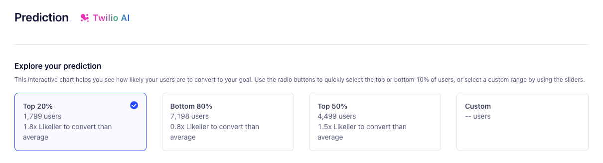
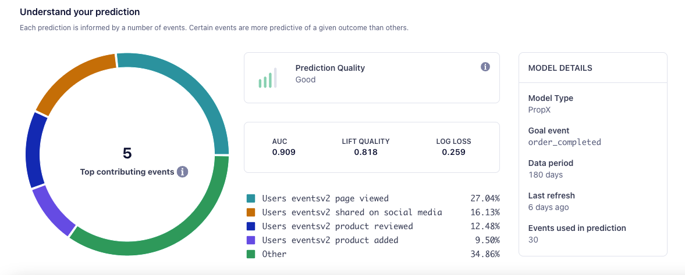

> info ""
> Predictive Traits is in public beta.

Powered by Twilio AI, Predictive Traits let you predict the likelihood that users will perform custom events you track in Segment, like LTV, churn, purchase, and more.

On this page, you'll learn how to build a Predictive Trait, view its prediction data, and apply Predictive Traits to common business scenarios. 

## Build a Predictive Trait

Follow these steps to create a Predictive Trait:

1. Navigate to **Engage > Audiences > Computed Traits**. Select **Create computed trait**.
2. In the Trait Builder, select **Predictive Traits**, choose the Trait you want to create, then click **Next**.
3. Add a condition and event to predict (for custom Traits), then select **Calculate**. If you're satisfied with the available data, select **Next**.
4. (Optional) Connect a Destination, then select **Next**.
5. Add a name and description for the Trait, then select **Create Trait**.

### Prediction tab

Once Segment has generated your prediction, you can access it in your Trait's **Prediction** tab. The Prediction tab gives you actionable insight into your Predictive Trait. 

In the Prediction tab, you'll find the Cohort Builder, an interactive chart that indicates the likelihood of users to convert to your goal. You can choose the top 20%, bottom 80%, or create a custom range.

You can then create an Audience from the group you've selected, letting you send efficient, targeted marketing campaigns within Journeys.

#### Model statistics

The Predictions tab's **Understand your prediction** section provides insights into the performance of the predictive model, using the following metrics:

- **AUC**, or Area under [the ROC curve](https://en.wikipedia.org/wiki/Receiver_operating_characteristic){:target="_blank"}; AUC lands between 0 and 1, where 1 is a perfect future prediction, and 0 represents the opposite. Higher AUC indicates better predictions. 
- **Lift Quality**, which measures the effectiveness of a predictive model. Segment calculates lift quality as the ratio between the results obtained with and without the predictive model. Higher lift quality indicates better predictions.
- **Log Loss**; the more a predicted probability diverges from the actual value, the higher the log-loss value will be. Lower log loss indicates better predictions.
- **Feature weights**; this graph describes the events and associated weights used to create the prediction.

## How Segment builds Predictive Traits

The following four components contribute to the Predictive Trait that Segment generates:

- **Training Audience**; you select an Audience or parameters that Segment uses to train your Audience. This crucial step heavily influences the prediction, as Segment uses your training Audience's characteristics to train the model that generates your prediction.
- **Target Event**; you select an event that Segment tracks. Choosing events with more data generates better predictions.   
- **Time Window**; Segment makes predictions of the likelihood of an event occuring in the next 30 days (except for LTV, which predicts spend over the next year).
- **Data Requirements**; data heavily impacts predictions. While you can create models with limited data, your prediction may not work as expected.

## Working with Predictive Traits in Segment

Segment creates Predictive Traits as Computed Traits, with scores saved to user profiles as a percentage cohort. For example, `0.8` on a user's profile indicates that the user is in the the cohort's 80th percentile, or the top 20%. 

Once you've selected a cohort, you can use Predictive Traits in concert with other Segment features:

- [Audiences](/docs/engage/audiences/), which you can create with Predictive Traits as a base
- [Journeys](/docs/engage/journeys/); use Predictive Traits in Journeys to trigger [Engage marketing campaigns](/docs/engage/campaigns/) when users enter a high-percentage cohort, or send promotional material if a customer shows interest and has a high propensity to buy.
- [Destinations](/docs/connections/destinations/); send your Predictive Traits downstream to [Warehouses](/docs/connections/storage/warehouses/), support systems, and ad platforms.

## Use cases

Predictions offer more value in some situations than others. This sections covers common scenarios where Predictive Traits have high impact, as well as others where alternative approaches may be more appropriate.

### When to use a prediction

Predictions are most effective in the following situations: 

- **When your desired outcome is difficult to measure and not clearly defined**, like activation, retention, engagement, or long-term value Journeys.
- **When your product has more than 100,000 average monthly users**; smaller sample sizes lead to less accurate statistical conclusions.
- **When you need to save time building cohorts**; a new employee at your company could use Segment's Predictive Traits out of the box on their first day.

### When other approaches work better

Predictions may not be as beneficial in the following situations:

- **When you sell limited but highly-priced items**, like enterprise software, complex medical machines, and so on; this also applies if you're in the B2B sector.
- **When you don't yet have enough data**; your model could produce errors if, for example, your target is too new and lacks sufficient data. Waiting a month could allow Segment to gather more predictive data.