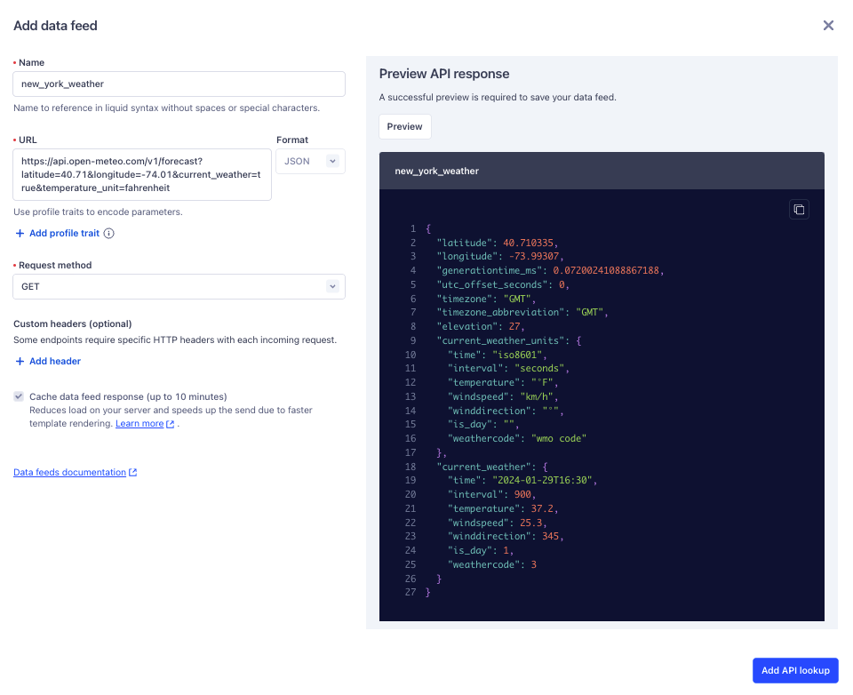

Data feeds let you pull information from an API and add it to your Engage email campaigns. 

This guide explains how data feeds work and uses a real-world example to show you how to set up a data feed in your Engage space.

## How data feeds work

Data feeds let you personalize your Engage email campaigns by automatically adding dynamic information from APIs. 

To use a data feed with an Engage campaign, you'll first integrate the API into an email campaign. Segment then begins to fetch content updates from the API. When Segment sends your campaign, it populates the email with the most current information it has from the API.  

### Data feed components and basic setup

Here's what you'll need to add a data feed:

- A name for your data feed 
- A URL that corresponds to an API endpoint
- An API method 
- Request headers (optional)

### Data feed setup

Follow these steps to add a data feed to an Engage email template:

1. From the **Add personalization data** side pane of [email template setup](/docs/engage/content/email/template/), click **+Add data feed**.
2. Give the data feed a name.
3. Add the URL for the API endpoint you want to connect.
4. Add profile traits to personalize your data feed response.
5. Select a request method.
6. Add any required custom headers.
7. Click **Preview** to verify your API response.
8. Finish by clicking **Add API lookup**.
9. From the data feeds list, click the more options icon, then click **Copy ref**. Segment copies a liquid output to your clipboard.
10. Paste the output into your email campaign where you'd like to import the data feed data.


## Use case: weather-informed fitness class email

Suppose you're a marketer for a fitness company that holds ongoing outdoor classes in New York. New members who sign up for your outdoor classes get added to a `new_outdoor_signups` audience in your Segment workspace. You want to send your new signups an email campaign that tells them the weather forecast for your regularly scheduled class so that they can dress appropriately.

Here's a high-level overview of how you could set that up within Segment:

1. You [create a new journey](/docs/engage/journeys/build-journey/) in your Engage workspace. 
- The journey's entry condition is `Part of an Audience`, with the audience being `new__outdoor_signups`. 
2. In the journey, you add [an email template](/docs/engage/content/email/template/) with a data feed that integrates weather information from a public weather API, like [Open-Meteo](https://open-meteo.com/){:target="_blank"}.
3. When new users join the `new_outdoor_signups` audience, Segment sends them an email with the latest weather information.

The next section explains in detail how you'd set up such a campaign.

### Step 1: Email template setup

Follow these steps to set up your email template:

1. In your Segment workspace, navigate to **Engage > Content**.
2. Click **Create > Template**.
3. In the **Create template** builder, select **Email**, and click **Configure**.
4. Configure the email template, then click **Select Editor**.
5. Select the design method to build your email template:
  - [**Drag and Drop Editor**](/docs/engage/content/email/editor/) is a drag and drop WYSIWYG tool with customizable content blocks.
  - [**HTML Editor**](/docs/engage/content/email/html-editor/) contains both a code and visual editor from a single view. This editor provides complete HTML editing access with error flagging.
6. On the **Create template** page, click the chevron. The **Add personalization data** side pane appears.

### Step 2: Add the data feed

Here are the data feed components you'd need to connect the Open-Meteo API and pull in weather for New York:

- Data feed name: `new_york_weather`
- The endpoint to pull the forecast: `https://api.open-meteo.com/v1/forecast`
- Latitude/longitude and unit parameters for New York that you'd add to the URL:

```curl
https://api.open-meteo.com/v1/forecast?latitude=40.71&longitude=-74.01&current_weather=true&temperature_unit=fahrenheit
```
- The `GET` request method

> info "API credentials"
> The Open-Meteo API doesn't require registration or authentication. The API you choose for your real data feed could require both.

Next, follow these steps to add the Open-Meteo weather feed:

1. From the **Add personalization data** side pane, click **+Add data feed**.
2. Name the feed `new_york_weather`.
3. Add the Open-Meteo forecast endpoint in the URL field. 
4. Add profile traits to personalize your data feed response.
5. Select the `GET` request method.
7. Click **Preview** to verify the API response.
8. Finish by clicking **Add API lookup**.



### Step 3: Add the data feed to your email

You can use [liquid templating](https://liquidjs.com/tags/overview.html){:target="blank"} to access information in your API call's JSON response and incorporate it into your email template's content. 

For example, here's a JSON response that you could get from the Open-Meteo forecast endpoint that you added to your data feed:

```json
{
  "latitude": 40.710335,
  "longitude": -73.99307,
  "generationtime_ms": 0.0959634780883789,
  "utc_offset_seconds": 0,
  "timezone": "GMT",
  "timezone_abbreviation": "GMT",
  "elevation": 27,
  "current_weather_units": {
    "time": "iso8601",
    "interval": "seconds",
    "temperature": "°F",
    "windspeed": "km/h",
    "winddirection": "°",
    "is_day": "",
    "weathercode": "wmo code"
  },
  "current_weather": {
    "time": "2024-01-29T17:15",
    "interval": 900,
    "temperature": 37.3,
    "windspeed": 24,
    "winddirection": 343,
    "is_day": 1,
    "weathercode": 3
  }
}
```

If you wanted only the temperature, you could use this syntax, which targets the `temperature` value nested within the `current_weather` object:


```liquid
{{lookups.new_york_weather.current_weather.temperature}}
```


With that syntax, you could create a message like this:


```liquid
Hey, {{profile.traits.first_name}}, we're holding our fitness class outside today! 
It's {{lookups.new_york_weather.current_weather.temperature}} degrees outside, so dress appropriately!
```


When your email sends, your user would see this:

```
Hey, Sally, we're holding our fitness class outside today! 
It's 37.3 degrees outside, so dress appropriately!
```

