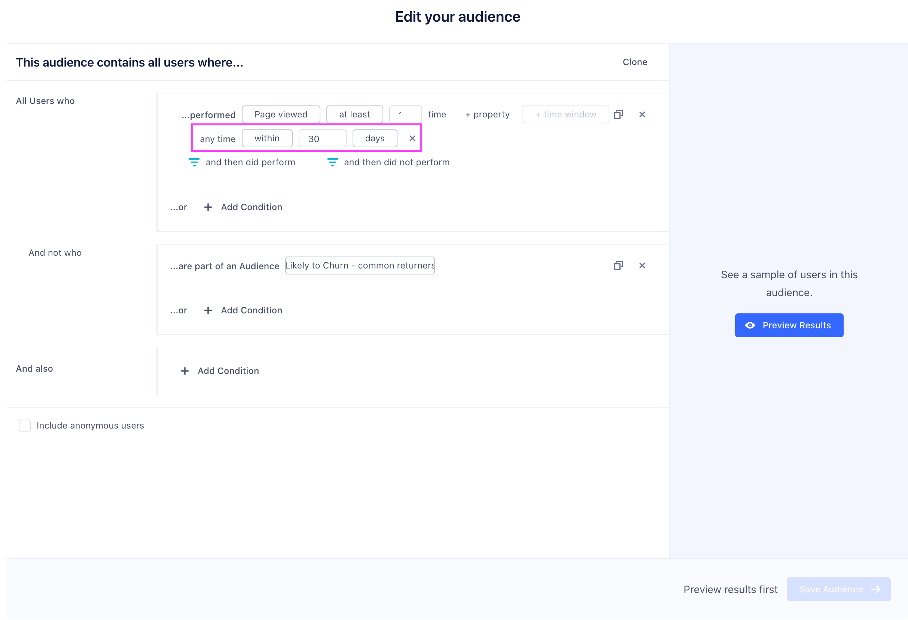
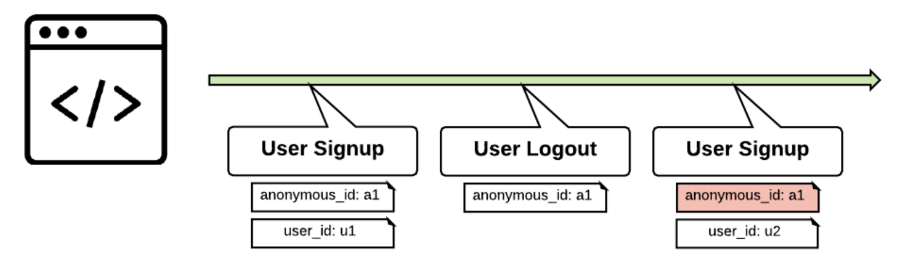

## Do you have an Audiences API?

You can add, remove, and modify audiences only by using the Engage in-app audience builder.

However, you can programmatically query the Profile API to determine if a user belongs to a particular audience because Engage creates a trait with the same name as your audience. For example, to determine if the user with an email address of `bob@example.com` is a member of your `high_value_users` audience, you could query the following profile API URL:

`https://profiles.segment.com/v1/namespaces/<namespace_id>/collections/users/profiles/email:bob@segment.com/traits?include=high_value_users`

The following response indicates that Bob is indeed a high-value user:

```json
{
  "traits": {
    "high_value_users": true,
  },
  "cursor": {
    "has_more": false,
  }
}
```

For more information on profile queries, visit the [Profile API documentation](/docs/unify/profile-api).

## Can I modify audience keys?

You can't change the audience key after it's created. To change the key, you need to re-create the audience.
 

## Can I reuse audience keys?

Avoid using the same audience key twice, even if you've deleted the key's original audience. Downstream tools and Destinations might have trouble distinguishing between different audiences that at any point shared the same key.

## How do historical lookback windows work?

Engage allows you to compute new traits and audiences of your users based on their entire customer journey, and all historical data you've tracked with Segment.

When you create a new computed trait or audience, you include a lookback window that determines how far back into the past the trait or audiences will be computed.




Some important things to keep in mind when setting a lookback window:

Historical lookback windows are based on the event `timestamp` field.

Lookback windows are precise down to the hour, so a 90-day lookback window will include any events with a `timestamp` timestamp within the last 2,160 hours (24 hr/day * 90 days).

The trait and audience will automatically update going forward as historical events exceed the lookback window.

## What are Funnel Audiences?
Funnel Audiences allow you to use **strict, relative ordering** for your audience conditions. Common use cases for these audiences are Cart Abandonment (users that triggered the Product Added event but did not trigger the Order Completed event after the Product Added event occurred) and onboarding steps (users that Added Credit Card but did not Subscribe afterward).

To get started with Funnel Audiences, go to:

**Audiences > New > Select Funnel Condition** ("and then did not"/"and then did")

The funnel condition will now be relative to the parent condition.

The audience in the image below includes all users that have Product Added in the last week, but not Order Completed within a day of doing so.


> info ""
> Funnel Audiences compute based on all instances of the parent event within the lookback period. This means that if you have a user that Product Added ⟶ Order Completed ⟶ Product Added, this user would be entered into the Abandoned Cart state despite having previously completed an order.

## What is Engage Merge Protection?
Engage's merge protection algorithm protects your identity graph from unnecessary merges by finding and removing untrusted external IDs. Here's an example:



In this example, `anonymous_id: a1` is not reset during a `User Logout`. Without merge protection rules, Segment would merge `user_id u1` and `user_id u2`. Instead, the identity resolution algorithm detects that such a merge would break `user_id` uniqueness and prevents the merge.

This is especially helpful for preventing "blob users" that are merged together by non-unique anonymous IDs or by common group emails like `team@company.com`.

## Which destinations support syncing the identity graph?
Most destinations on the Segment Platform are built up around a user model. They assume that a user will have a single userId. Further, most Destinations are not built to handle anonymous traffic.

By default, Segment doesn't sync the output of the Identity Graph to Destinations. However, Segment computed traits and audiences are based on the entire user profile, including anonymous and merged data. Segment syncs the value of these computations (for example, `blog_posts_ready_30_days: 10`) using all `userIds` on the profile.

For Destinations that support an `alias` call (for example, Mixpanel), you can emit an `alias` call on merge.

## What Sources can I sync to Engage?

The following list shows just some data sources you can sync to Engage:

- Website ([Analytics.js](/docs/connections/sources/catalog/libraries/website/javascript/))
- Mobile SDKs ([iOS](/docs/connections/sources/catalog/libraries/mobile/ios), [Android](/docs/connections/sources/catalog/libraries/mobile/android), [AMP](/docs/connections/sources/catalog/libraries/mobile/amp))
- Server-side libraries ([Go](/docs/connections/sources/catalog/libraries/server/go), [Node](/docs/connections/sources/catalog/libraries/server/node/), [Java](/docs/connections/sources/catalog/libraries/server/java), [PHP](/docs/connections/sources/catalog/libraries/server/php/), [Python](/docs/connections/sources/catalog/libraries/server/python), [Ruby](/docs/connections/sources/catalog/libraries/server/ruby), [.NET](/docs/connections/sources/catalog/libraries/server/net))
- [Facebook Lead Ads](/docs/connections/sources/catalog/cloud-apps/facebook-lead-ads/)
- [ActiveCampaign](/docs/connections/sources/catalog/cloud-apps/activecampaign/)
- [Customer.io](/docs/connections/sources/catalog/cloud-apps/customer.io/)
- [Drip](/docs/connections/sources/catalog/cloud-apps/drip/)
- [Iterable](/docs/connections/sources/catalog/cloud-apps/iterable/)
- [Klaviyo](/docs/connections/sources/catalog/cloud-apps/klaviyo/)
- [Mailjet](/docs/connections/sources/catalog/cloud-apps/mailjet/)
- [Nudgespot](/docs/connections/sources/catalog/cloud-apps/nudgespot/)
- [Vero](/docs/connections/sources/catalog/cloud-apps/vero/)
- [Blueshift](/docs/connections/sources/catalog/cloud-apps/blueshift/)
- [Delighted](/docs/connections/sources/catalog/cloud-apps/delighted/)
- [Braze](/docs/connections/sources/catalog/cloud-apps/braze/)
- [Looker](/docs/connections/sources/catalog/cloud-apps/looker/)
- [Radar](/docs/connections/sources/catalog/cloud-apps/radar/)
- [Autopilot](/docs/connections/sources/catalog/cloud-apps/autopilothq/)
- [Friendbuy](/docs/connections/sources/catalog/cloud-apps/friendbuy/)


## Can I send audiences to multiple destination accounts?

Yes, Engage supports the ability to send an audience or computed trait to two or more accounts of the same partner. The most common use case is multiple Facebook, or Adwords ad accounts.


### Why am I getting alerts about an audience/computed trait sync failure, but when I look at the specific audience/computed trait it shows a successful sync?

An audience/computed trait Run or a Sync may fail on its first attempt, but Engage will retry up to 5 times before considering it a hard failure and display on that audience/compute trait's Overview page. As long as the runs/syncs within the specific Audience's Overview page say they are successful, then these can be safely ignored.  The Audit Trail logic, however, is configured in the way that it simply notifies about every task failure, even if it then later succeeds.

If your team would like to avoid receiving the notifications for transient failures, please **[reach out to support](https://segment.com/help/contact/)**, who upon request can disable transient failure notifications.
