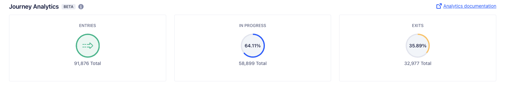

With Journey Level Analytics, you can gain insight into the overall performance of an individual Journey.

## About Journey Level Analytics

> info ""
> This feature is available in beta.

Journeys Level Analytics is a collection of statistics that can help you assess how a Journey is performing.

Where individual messaging analytics give you focused insight into specific Journey events, Journey Level Analytics shows you a high-level overview of a Journey's effectiveness.

### Access a Journey's Analytics

Follow these steps to view the Analytics for a specific Journey:

1. In your Segment workspace, navigate to **Engage > Journeys**.
2. Select a Journey from the Journeys list.
3. The Analytics tiles display as part of the Journey's overview.

## Available Journeys Analytics statistics

The following table shows the three statistics available for a Journey:

| Statistic   | Description                                                                   |
| ----------- | ----------------------------------------------------------------------------- |
| Entries     | The total number of users who entered your Journey                            |
| In progress | The total number of users who have entered the Journey without yet exiting it |
| Exits       | The total number of users who have exited the Journey                         |

Using the date picker, you can view a Journey's analytics over a specific period of time.

The following table shows descriptions of the time frames you can select:

| Time frame         | Description (based on UTC)                                 |
| ----------------- | ---------------------------------------------------------- |
| Today             | Today, beginning at midnight                               |
| Yesterday         | The day before today                                       |
| Last 7 days       | The past seven days, not including today                   |
| Last 30 days      | The past 30 days, not including today                      |
| Last 90 days      | The past 90 days, not including today                      |
| Last 180 days     | The past 180 days, not including today                     |
| Custom date range | The period between two dates, including the selected dates |
