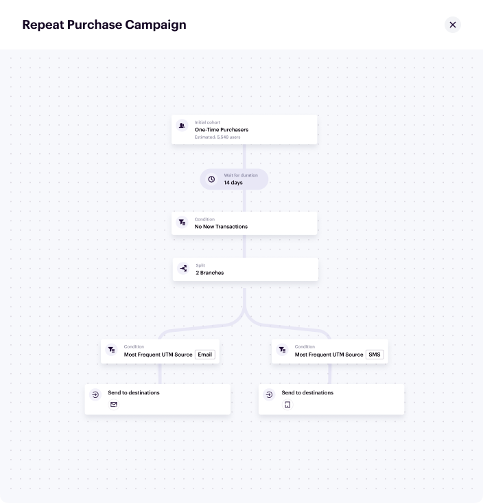
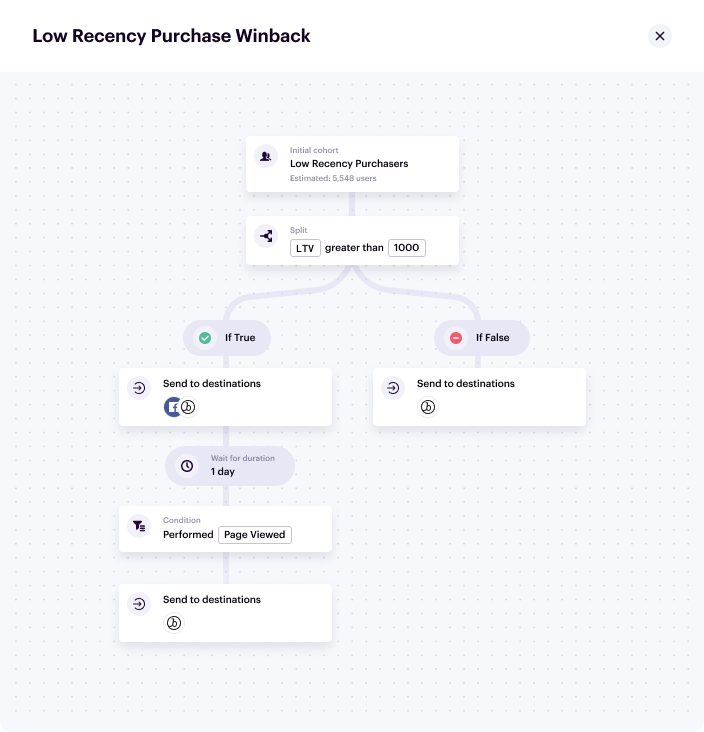
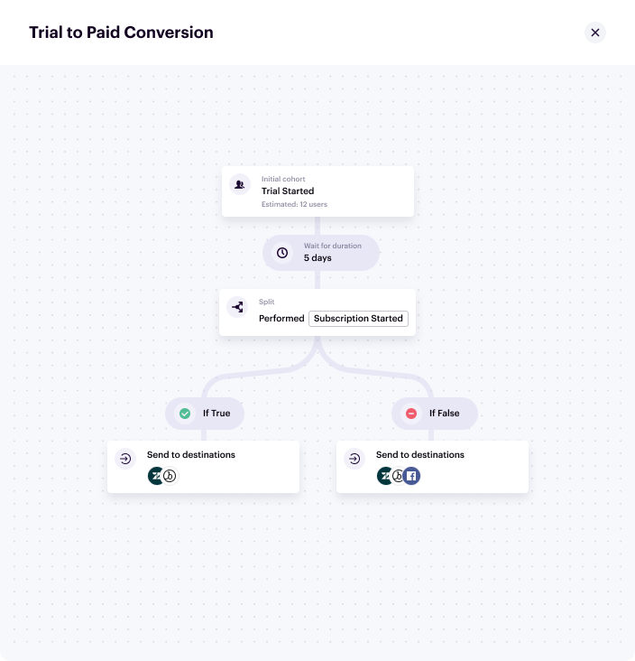
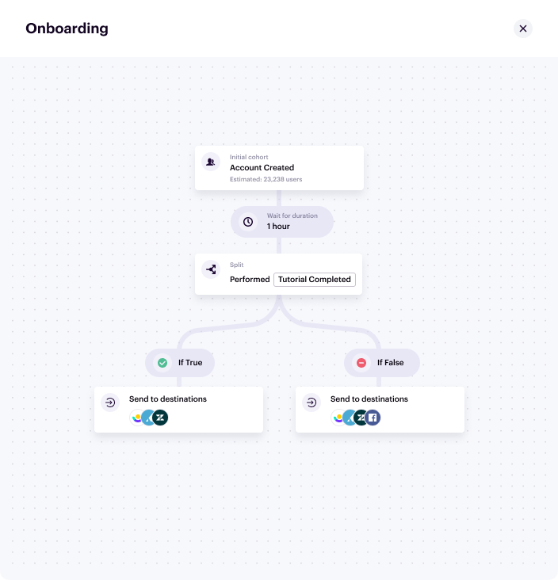
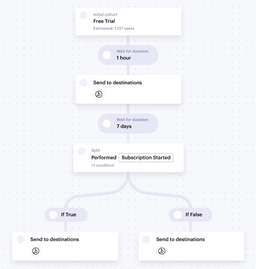
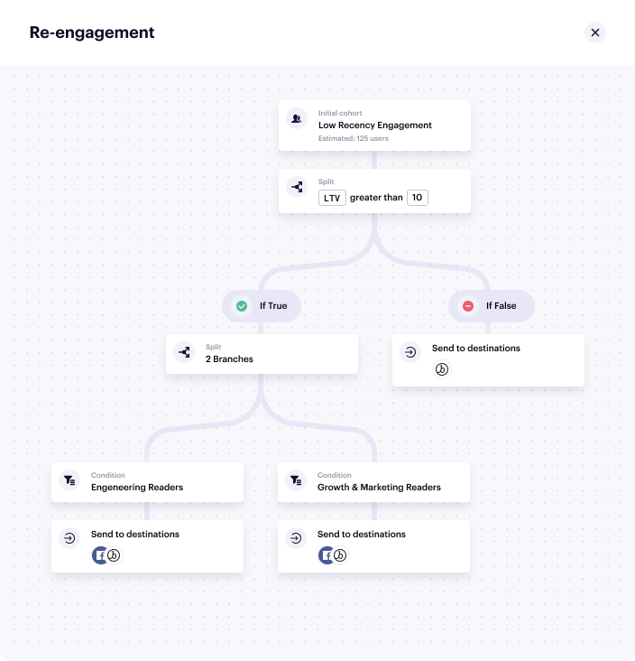

To help you get underway, you can reference these sample Journeys.

## E-commerce use cases

### Repeat purchase campaign

This journey focuses on converting one-time buyers into repeat purchasers by delivering communications in their preferred channels.

1. Create the entry condition with the step name `One-Time Purchasers`.
   - All users who performed `Order Completed` **exactly 1 time**
2. Add a wait duration of **14 days**
3. Add a condition called `No New Transactions`
   - All users who performed `Order Completed` **exactly 1 time**
4. Add a multi-branch split
   - Branch 1: Customers who have the trait `Most Frequent UTM Source` equals `Email`
     - Send to destination: **Email**
   - Branch 2: Customers who have the trait `Most Frequent UTM Source` equals `SMS`
     - Send to destination: **SMS**

### Low recency purchase winback

This journey represents a campaign designed to drive returning purchases based on intent and lifetime value goals.

1. Create the entry condition with the step name `Low recency purchasers`.
   1. All users who have performed the **Order Completed** event zero times within the last **180 days**.
2. Add a True/false split.
   1. Split the audience around a computed trait of **Customer Lifetime Value > 100**.
   2. For the True branch, send the list of users to Email and Advertising destinations.
   3. For the False branch, send the list of users to an Email destination.
3. Add a wait duration of **1 day** to the True branch from step 2.
4. Add a Wait for condition step to wait for a **Page Viewed** event at least 1 time and where **utm_source** is equal to the ad or email campaign, within 1 day.
5. Send this list of users to an email destination, as they are more likely to accept a discount and complete the purchase.

## B2B use cases

### Trial to paid conversion
This journey creates an acquisition campaign designed to convert trial accounts to paid accounts with a unified owned and paid media strategy.

1. Create the entry condition with the step name `Trial started`.
   1. All users who performed **Trial Started** at least once and who performed **Subscription Started** exactly 0 times.
2. Add a wait duration of **5 days**.
3. Add a True/false split.
   1. Split the audience around users who have performed **Subscription Started**
   2. For the True branch, send the list of users to Email and Support destinations.
   3. For the False branch, send the list of users to an Email destination, Support, and Advertising destinations.

### Onboarding flow

This journey creates an onboarding flow designed to maintain new user engagement through the onboarding experience.

1. Create the entry condition with the step name `Account created`. Set the condition to all users who performed **Account Created** at least 1 time.
2. Add a wait duration of **1 hour**.
3. Add a True/false split.
   1. Split the audience based on those who have performed **Tutorial Completed**.
   2. For the True branch, send the list of users to Email, Support, and In-App destinations.
   3. For the False branch, send the list of users to Email, Support, In-App, and Advertising destinations.

## Media use cases

### Paid subscription acquisition

This journey creates an acquisition campaign designed to convert trial subscriptions to paid subscriptions with a unified owned and paid media strategy.

1. Create the entry condition with the step name `Free trial`. Set the condition to all users who performed **Subscription Started** at least 1 time, and where **Subscription Plan Type** is **Free**.
2. Add a wait duration of **1 hour**.
3. Send the list of users to an Email destination.
4. Add a wait duration of **7 days**.
5. Add a True/false split.
   1. Split the audience based on those who have performed **Subscription Started** where **Subscription Plan Type** is **paid**.
   2. For the True branch, send to an email destination.
   3. For the False branch, send to both email and advertising destinations.

### Re-engagement Campaign

This journey aims to bring back users with personalized messaging while conserving ad spend based on user preferences.

1. Create the entry condition with the step name `Low Recency Engagement`. Set the condition to all users who performed `Page Viewed` **exactly 0 times within 60 days**.
2. Add a True/false split.
   1. Split the audience based on those who have performed `Subscription Started` where `Subscription Plan Type` is **paid**
   2. For the **True** branch, add a multi-branch split
      - For users who have the Computed Trait `user_favorite_article-category` = `Engineering`
        - Send to email and ads destinations
      - For users who have the Computed Trait `user_favorite_article-category` = `Marketing`
        - Send to email and ads destinations
   3. For the **False** branch, send to an email destination only.