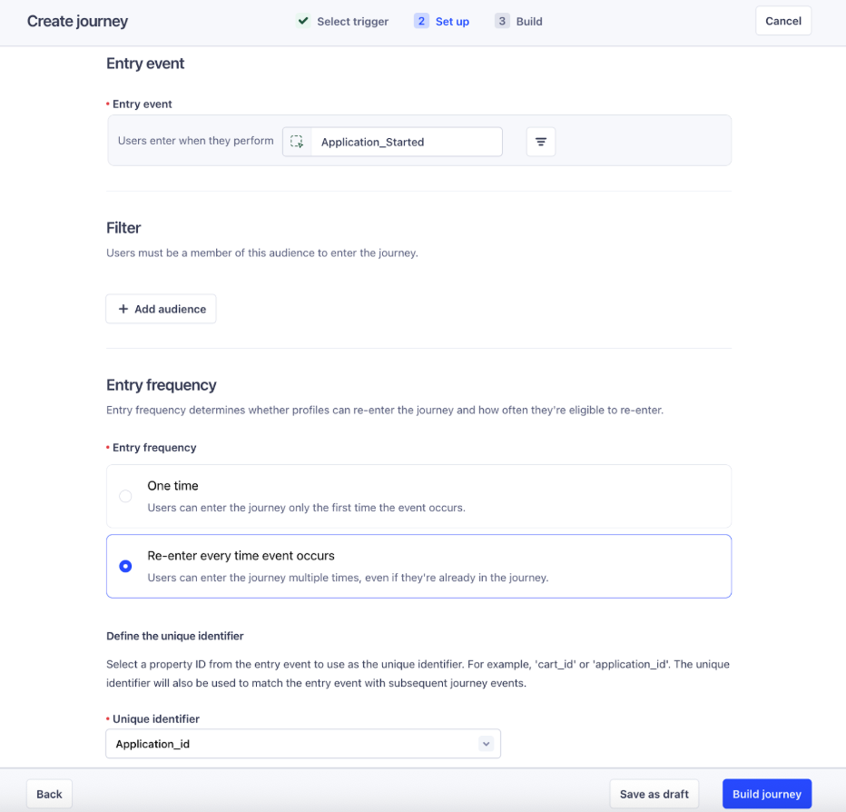
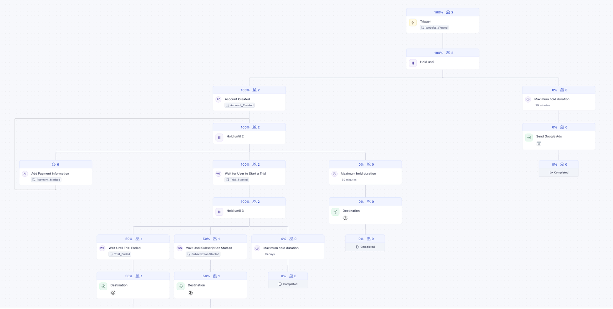

Event-Triggered Journeys give you the tools to create real-time, personalized flows that react to user behavior as it happens. This page explains sample use cases to help you get started with common patterns like confirmations, abandonment campaigns, and re-engagement flows.

Each example includes a short explanation, key steps to configure, and optional sample event payloads.

## Real-time event forwarding

Send a confirmation message immediately after a user takes a key action, like placing an order or submitting a form. This type of journey helps reinforce trust and provides instant feedback by delivering personalized messages based on event details.

This use case is ideal for transactional events that should trigger follow-up communication without delay.

### How to build this journey

1. Set the journey entry condition to `Users perform an event`.
2. Choose the event that represents the user action (for example, `Order_Confirmation`).
3. **(Optional)**: Add event property filters if you only want to trigger the journey under specific conditions.
4. Click **Build**, then add a **Send to Destination** step to forward the event.
5. Configure destination:
   - Select the destination you want to send the payload to.
   - Enrich the payload with profile traits or journey context as needed.
6. Click **Save** to publish the journey.

The following example shows a `Order_Confirmation` event payload that could trigger this journey. You can customize the event name and properties based on your use case.

```json
{
  "userId": "99",
  "context": {},
  "integrations": {},
  "event": "Order_Confirmation",
  "properties": {
    "productId": "001",
    "productName": "T-Shirt",
    "productColor": "green",
    "productSize": "Large",
    "productPrice": "$55.34",
    "event_location": "A",
    "cart_ID": "123456",
    "scenario": "01 Ordered Product"
  }
}
```

## Application abandonment campaign

Send a personalized nudge when a user starts an action (like filling out an application) but doesn’t complete it within a certain time window. This type of journey helps recover drop-offs by checking for a completion event and following up only if it's missing.

This use case is ideal for flows like job applications, signups, demo requests, or onboarding forms.

### How to build this journey

1. Set the journey entry condition to `Users perform an event`.
2. Choose the event that indicates the user started the flow (for example, `Application_Started`).
3. (Optional): Add event property filters if you only want to trigger the journey under specific conditions.
4. Click **Build**, then add a **Hold Until** step.
5. In the Hold Until step:
   - Specify the completion event (for example, `Application_Completed`) as the condition.
   - Set a maximum hold duration.
6. Add a **Send to Destination** step on the "timeout" branch to send a follow-up message.
7. Configure the destination:
   - Select the destination you want to send the payload to.
   - Enrich the payload with profile traits or journey context as needed.
8. Preview the payload that Segment will send to your destination.
9. Publish the journey.




### Sample entry and evaluation events

The following example shows both the entry event that starts the journey and the evaluation event that cancels the nudge if the user completes the application.



```json
{
  "userId": "88",
  "context": {},
  "integrations": {},
  "event": "Application_Started",
  "properties": {
    "Category": "A",
    "Tier": "Premium",
    "VIP": true,
    "Application_id": "1234",
    "scenario": "Trigger campaign with Application Started"
  }
}
```



```json
{
  "userId": "88",
  "context": {},
  "integrations": {},
  "event": "Application_Completed",
  "properties": {
    "Category": "A",
    "Tier": "Premium",
    "VIP": true,
    "Application_id": "1234",
    "scenario": "Complete campaign without a nudge b/c Application was Completed"
  }
}
```



## Cart abandonment (cart viewed flow)

Send a personalized follow-up when a user views their cart but doesn’t complete the checkout. This journey tracks whether a checkout event occurs within a short window after the cart is viewed. If it doesn’t, you can send a reminder to bring them back.

This use case works well for e-commerce sites that want to reduce cart abandonment and recover potential sales.

### How to build this journey

1. Set the journey entry condition to `Users perform an event`.
2. Choose the entry event that indicates cart activity (for example, `Cart_Viewed`).
3. (Optional): Add event property filters to narrow the scope of who enters.
4. Click **Build**, then add a **Hold Until** step.
5. In the Hold Until step:
   - Specify `Checkout_Completed` as the evaluation event.
   - Set a maximum hold duration based on how long you want to wait before nudging (for example, 1 hour).
6. Add a **Send to Destination** step on the timeout branch to send the cart reminder.
7. Configure the destination:
   - Select the destination you want to send the payload to.
   - Enrich the payload with profile traits or journey context as needed.
8. Preview the payload that Segment will send to your destination.
9. Publish the journey.

### Example event data

The following examples show the entry and evaluation events for this journey pattern.



```json
{
  "userId": "88",
  "context": {},
  "integrations": {},
  "event": "Cart_Viewed",
  "properties": {
    "cart_ID": "123",
    "scenario": "01 Simple Cart Abandonment",
    "checkout_cart": [
      {
        "productId": "001",
        "productName": "T-Shirt",
        "productColor": "green",
        "productSize": "Large",
        "productPrice": "$55.34"
      },
      {
        "productId": "002",
        "productName": "Jeans",
        "productColor": "blue",
        "productSize": "Medium",
        "productPrice": "$99.56"
      }
    ]
  }
}
```



```json
{
  "userId": "88",
  "context": {},
  "integrations": {},
  "event": "Checkout_Completed",
  "properties": {
    "cart_ID": "123",
    "scenario": "01 Simple Cart Abandonment",
    "checkout_cart": [
      {
        "productId": "001",
        "productName": "T-Shirt",
        "productColor": "green",
        "productSize": "Large",
        "productPrice": "$55.34"
      },
      {
        "productId": "002",
        "productName": "Jeans",
        "productColor": "blue",
        "productSize": "Medium",
        "productPrice": "$99.56"
      }
    ]
  }
}
```



## Cart abandonment (complex `cart_modified` flow)

Send a personalized reminder when a user adds items to their cart but doesn’t complete checkout, even if they modify their cart along the way. This journey resets the wait timer each time the cart is updated, ensuring that follow-up messages reflect the most recent cart contents.

This use case is ideal for e-commerce journeys where users frequently change items before deciding to purchase.

### How to build this journey

1. Set the journey entry condition to `Users perform an event`.
2. Choose the entry event that indicates the cart is started (for example, `Product_Added`).
3. (Optional): Add event property filters if needed.
4. Click **Build**, then add a **Hold Until** step.
5. In the Hold Until step:
   - Specify `Cart_Modified` as an update event that resets the timer and updates the journey context.
   - Specify `Order_Confirmation` as the evaluation event that exits the user from the journey.
   - Set the maximum hold duration (for example, 2 hours).
6. Add a **Send to Destination** step on the timeout branch to send a cart reminder.
7. Configure the destination:
   - Select the destination you want to send the payload to.
   - Enrich the payload with profile traits or journey context as needed.
8. Preview the payload that Segment will send to your destination.
9. Publish the journey.


### Example event data

The following example shows the entry event that starts the journey, the update event that modifies the cart, and the evaluation event that would cancel the reminder.



```json
{
  "userId": "23",
  "context": {},
  "integrations": {},
  "event": "Product_Added",
  "properties": {
    "productId": "001",
    "productName": "T-Shirt",
    "productColor": "green",
    "productSize": "Large",
    "productPrice": "$55.34",
    "cart_ID": "12345",
    "scenario": "01 Simple Loopback Abandonment"
  }
}
```



```json
{
  "userId": "23",
  "context": {},
  "integrations": {},
  "event": "Cart_Modified",
  "properties": {
    "productId": "002",
    "productName": "Jeans",
    "productColor": "Blue",
    "productSize": "medium",
    "productPrice": "$88.43",
    "productCategory": "A",
    "cart_ID": "12345",
    "scenario": "01 Simple Loopback Abandonment",
    "checkout_cart": [
      {
        "productId": "001",
        "productName": "T-Shirt",
        "productPrice": "$55.34",
        "productColor": "green",
        "productSize": "Large"
      },
      {
        "productId": "002",
        "productName": "Jeans",
        "productColor": "blue",
        "productSize": "Medium",
        "productPrice": "$99.56"
      }
    ]
  }
}
```



```json
{
  "userId": "23",
  "context": {},
  "integrations": {},
  "event": "Order_Confirmation",
  "properties": {
    "productPrice": "$170.78",
    "cart_ID": "12345",
    "scenario": "01 Simple Loopback Abandonment",
    "checkout_cart": [
      {
        "productId": "001",
        "productName": "T-Shirt",
        "productPrice": "$55.34",
        "productColor": "green",
        "productSize": "Large"
      },
      {
        "productId": "002",
        "productName": "Jeans",
        "productColor": "blue",
        "productSize": "Medium",
        "productPrice": "$99.56"
      },
      {
        "productId": "003",
        "productName": "Sweatshirt",
        "productColor": "Black",
        "productSize": "Medium",
        "productPrice": "$99.08"
      }
    ]
  }
}
```




## Browse abandonment (multi-step flow)

Send a series of personalized reminders to users who browse multiple products but don’t take action, like adding an item to their cart. This journey tracks a sequence of `Viewed_Product` events and only exits when the user adds a product or reaches the end of the flow.

This use case is helpful for nurturing intent-based activity over time, especially for higher-consideration purchases.

### How to build this journey

1. Set the journey entry condition to `Users perform an event`.
2. Choose the entry event that represents product views (for example, `Viewed_Product`).
3. (Optional): Add property filters to target only certain products or categories.
4. Click **Build**, then add a **Hold Until** step.
5. In the Hold Until step:
   - Specify `Product_Added` as the evaluation event.
   - Set a maximum hold duration (for example, 1 hour).
6. Add a second **Hold Until** step to repeat the pattern:
   - Again, check for `Product_Added`.
   - Adjust the hold duration as needed.
7. Add a **Send to Destination** step at the end of the second hold duration.
   - Enrich the payload with recent event data or profile traits.
8. Preview the payload that Segment will send to your destination.
9. Publish the journey.

### Example event data

The following examples show the entry and evaluation events for this flow.



```json
{
  "userId": "26",
  "context": {},
  "integrations": {},
  "event": "Viewed_Product",
  "properties": {
    "productId": "001",
    "productName": "T-Shirt",
    "productColor": "green",
    "productSize": "Large",
    "productPrice": "$55.34",
    "productCategory": "A",
    "session_ID": "12345",
    "scenario": "01 Browse Abandonment"
  }
}
```



```json
{
  "userId": "26",
  "context": {},
  "integrations": {},
  "event": "Viewed_Product",
  "properties": {
    "productId": "002",
    "productName": "Jeans",
    "productColor": "Blue",
    "productSize": "Medium",
    "productPrice": "$88.77",
    "productCategory": "A",
    "session_ID": "12345",
    "scenario": "01 Browse Abandonment"
  }
}
```



```json
{
  "userId": "26",
  "context": {},
  "integrations": {},
  "event": "Viewed_Product",
  "properties": {
    "productId": "004",
    "productName": "Socks",
    "productColor": "White",
    "productSize": "Regular",
    "productPrice": "$03.44",
    "productCategory": "A",
    "session_ID": "12345",
    "scenario": "01 Browse Abandonment"
  }
}
```



## Event-based re-engagement campaign

Send a series of follow-up messages when a user starts a flow—like a trial—but doesn’t complete a key milestone within a set timeframe. This journey uses multiple Hold Until steps to send nudges at scheduled intervals until the user takes the expected action.

This use case is ideal for trial reminders, onboarding flows, or progressive engagement campaigns.

### How to build this journey

1. Set the journey entry condition to `Users perform an event`.
2. Choose the entry event that starts the campaign (for example, `Trial_Started`).
3. (Optional): Add property filters to narrow who enters the journey.
4. Click **Build**, then add a **Hold Until** step.
5. In the Hold Until step:
   - Specify `Trial_Ended` as the evaluation event.
   - Set a hold duration (for example, 3 days).
6. Add a **Send to Destination** step on the timeout branch to send the first reminder.
7. Add another **Hold Until** step and repeat the same logic.
8. Add a second **Send to Destination** step at the end of that branch.
9. Preview the payloads that Segment will send to each destination.
10. Publish the journey.

### Example event data

The following events show a user starting and (eventually) ending a trial. The re-engagement messages are only sent if the `Trial_Ended` event doesn't occur before the hold expires.



```json
{
  "userId": "747",
  "context": {},
  "integrations": {},
  "event": "Trial_Started",
  "properties": {
    "productId": "001",
    "productName": "Basic Plan",
    "productCategory": "Enterprise",
    "productPrice": "$55.34",
    "Account_ID": "12345",
    "scenario": "01 Siemens"
  }
}
```



```json
{
  "userId": "747",
  "context": {},
  "integrations": {},
  "event": "Trial_Ended",
  "properties": {
    "productId": "001",
    "productName": "Basic Plan",
    "productCategory": "Enterprise",
    "productPrice": "$55.34",
    "Account_ID": "12345",
    "scenario": "01 Siemens"
  }
}
```



## Complex multi-step with loopback abandonment campaign

Re-engage users with a personalized sequence of nudges as they move through multiple funnel stages—such as visiting the site, creating an account, starting a trial, and subscribing. This journey listens for key events at each stage, and if no progress is made within a set time, it triggers follow-ups to bring users back.

This use case is useful for SaaS products, gated onboarding flows, or any multi-step process where users drop off between key actions.

### How to build this journey

1. Set the journey entry condition to `Users perform an event`.
2. Choose the initial entry event (for example, `Website_Viewed`).
3. (Optional): Add property filters to limit entry to specific sessions or pages.
4. Click **Build**, then add a series of **Hold Until** steps for each major conversion point.
5. In each Hold Until step:
   - Specify the expected event (for example, `Account_Created`, `Trial_Started`, or `Subscription_Started`).
   - Configure a fallback path using the maximum hold duration.
6. On the timeout branch of each Hold Until step, add a **Send to Destination** step to send a reminder.
7. After each message, optionally add another Hold Until step to check for the next milestone.
8. Preview the payloads that Segment will send to your destinations.
9. Publish the journey.




### Example event data

These examples show key moments in the journey, from entry to conversion milestones. Each Hold Until step corresponds to one of these events.



```json
{
  "userId": "999",
  "context": {},
  "integrations": {},
  "event": "Website_Viewed",
  "properties": {
    "pageViewed": "Home",
    "path": "site/home",
    "sessionID": "12345",
    "scenario": "01 Complex Multi-step"
  }
}
```



```json
{
  "userId": "999",
  "context": {},
  "integrations": {},
  "event": "Account_Created",
  "properties": {
    "name": "Tom",
    "email": "tom@twilio.com",
    "accountID": "09876",
    "sessionID": "12345",
    "scenario": "01 Complex Multi-step"
  }
}
```



```json
{
  "userId": "999",
  "context": {},
  "integrations": {},
  "event": "Payment_Method",
  "properties": {
    "paymentMerchant": "Visa",
    "paymentType": "Credit Card",
    "accountID": "09876",
    "sessionID": "12345",
    "scenario": "01 Complex Multi-step"
  }
}
```



```json
{
  "userId": "999",
  "context": {},
  "integrations": {},
  "event": "Trial_Started",
  "properties": {
    "productId": "001",
    "productName": "Basic Plan",
    "productCategory": "Enterprise",
    "productPrice": "$55.34",
    "sessionID": "12345",
    "accountID": "09876",
    "scenario": "01 Complex Multi-step"
  }
}
```




```json
{
  "userId": "999",
  "context": {},
  "integrations": {},
  "event": "Trial_Ended",
  "properties": {
    "productId": "001",
    "productName": "Basic Plan",
    "productCategory": "Enterprise",
    "productPrice": "$55.34",
    "sessionID": "12345",
    "accountID": "09876",
    "scenario": "01 Complex Multi-step"
  }
}
```




```json
{
  "userId": "999",
  "context": {},
  "integrations": {},
  "event": "Subscription Started",
  "properties": {
    "productId": "001",
    "productName": "Basic Plan",
    "productCategory": "Enterprise",
    "productPrice": "$55.34",
    "sessionID": "12345",
    "accountID": "09876",
    "scenario": "01 Complex Multi-step"
  }
}
```




-->