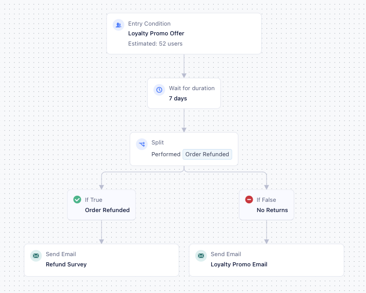
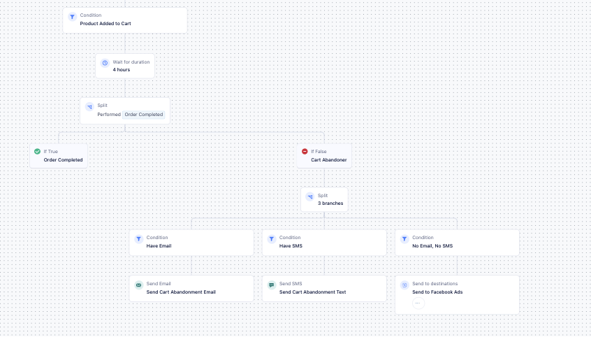
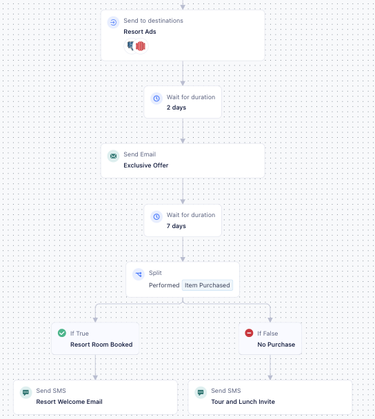
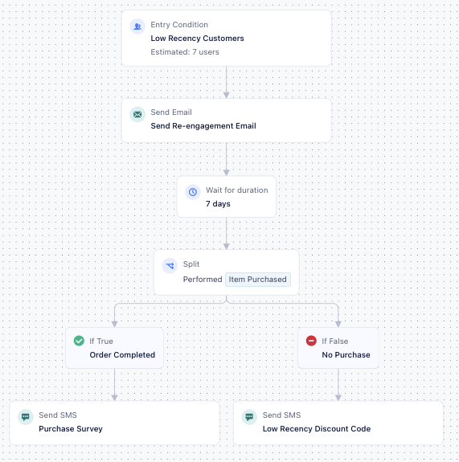
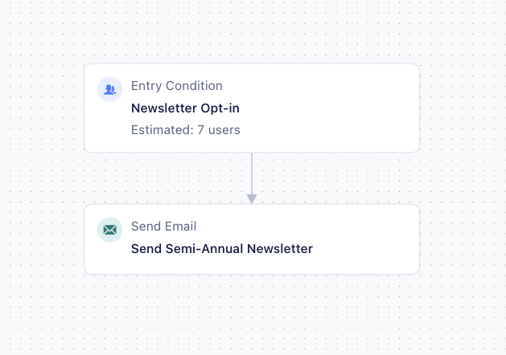

Use Twilio Engage to build personalized marketing campaigns and improve:
- Acquisition through lookalike audience targeting or promo campaigns.
- Conversion through seasonal or onboarding campaigns and lead nurture.
- Retention through customer loyalty and reactivation campaigns.

To help you get started with Engage, here are a few example campaigns.

## Customer loyalty email campaign

This journey sends an exclusive promo code to repeat customers to promote ongoing loyalty.

1. Create the entry condition with the step name `Loyalty Program`.
  - All users who performed the **Order Completed** event at least **3 times** and where the price is greater than **100**, any time within **30 days**.
2. Add a delay of **7 days**.
3. Add a True/False split. Split the users around a computed trait of **Order Refunded** at least **1 time**, any time within **30 days**.
  - For the True branch, send the list of users to an email step to receive a refund survey.
  - For the False branch, send the list of users to an email step for a personalized message with a "35OFF" promo code.
    - Add a Conversion Goal of **35OFF Promo Used** to track users who performed the **Order Completed** event at least **1 time** where the **promo_discount** used equals **35OFF**.

> success ""
> Build similar campaigns with SMS or use both email and SMS to contact subscribed users on their preferred channels.

## Cart abandonment
This journey sends purchase reminders to cart abandonment users based on the channels they've subscribed to.

1. Create the entry condition with the step name `Product Added to Cart`.
    - All users who performed the **Product Added** event at least **1 time** within the last **7 days** and who haven't performed **Order Completed** at least **1 time** in the last **7 days**.
2. Add a delay of **4 hours**.
3. Add a True/False split. Split the users around a computed trait of **Order Completed** at least **1 time** within **7 days**.
4. For the False branch, add a multi-branch split.
    1. For users who have the custom trait **email_opt_in** equals **true**:
      - Send to an email step to receive a purchase reminder.
    2. For users who have the custom trait **SMS_opt_in** equals **true**:
      - Send to an SMS step to receive a purchase reminder text.
    3. For users who have the custom trait **email_opt_in** equals **false** and who have the custom trait **SMS_opt_in** equals **false**:
      - Send to an ads destination.

## Onboarding
This journey sends exclusive offers and onboarding emails based on user action.

1. Create the entry condition with the step name `Visited Resort Site`.
    - All users who performed the **Page Viewed** event at least **1 time** within the last **7 days**.
2. Send to a destination to receive resort advertisements.
3. Add a delay of **2 days**.
4. Add a Send Email step called **Exclusive Offer**. Send an exclusive offer code "NORESORTFEE" to waive the resort fee.
    - Add a conversion goal of **Exclusive Offer Accepted** to track users who performed the **Order Completed** event at least **1 time** and where the **promo_discount** used equals **NORESORTFEE**.
5. Add a delay of **7 days**.
6. Add a True/False split. Split the user around a computed trait of **Order Completed** at least **1 time** in the last **7 days**.
    - For the True branch, send the list of users to an email step to receive resort details and a list of amenities.
    - For the False Branch, send the list of users to an SMS step to receive a tour invite.

## Low recency campaign
This campaign sends personalized re-engagement email and SMS promo offers to low recency customers.

1. Create the entry condition with the step name `Low Recency Customers`.
    - All users who performed the **Item Purchased** event **zero times** within the last **180 days**.
2. Add a Send Email step called **Send Re-engagement Email**.
    - Personalize the message with merge tags to invite users to view new products related to their **most common purchase category**.
    - Add a conversion goal to track users who performed the **Product Viewed** event at least **1 time** within **7 days** after message delivery.
3. Add a delay of **7 days**.
4. Add a True/False split. Split the audience around a computed trait of **Item Purchased** at least **1 time** within **7 days**.
    - For the True branch, send the list of users to an SMS step to receive a purchase survey.
    - For the False branch, send the list of users to an SMS step to receive a discount code.
      - Add merge tags and test the SMS before you send it.
      - Define a conversion goal of **Item Purchased** at least **1 time** within **7 days** after message delivery to track the campaign performance.

## Single send marketing
Use Engage to include single send messages as part of a marketing campaign.
  - Keep customers informed through newsletters.
  - Update customers on changes to your terms of service or privacy policies.
  - Share company updates or essential widespread communication.

This campaign sends a semi-annual newsletter to subscribed users.

1. Create the entry condition with the step name `Newsletter Opt-in`.
    - Include all users who are in the audience **Newsletter Opt-in**.
2. Send users to an email step to receive a semi-annual newsletter.
