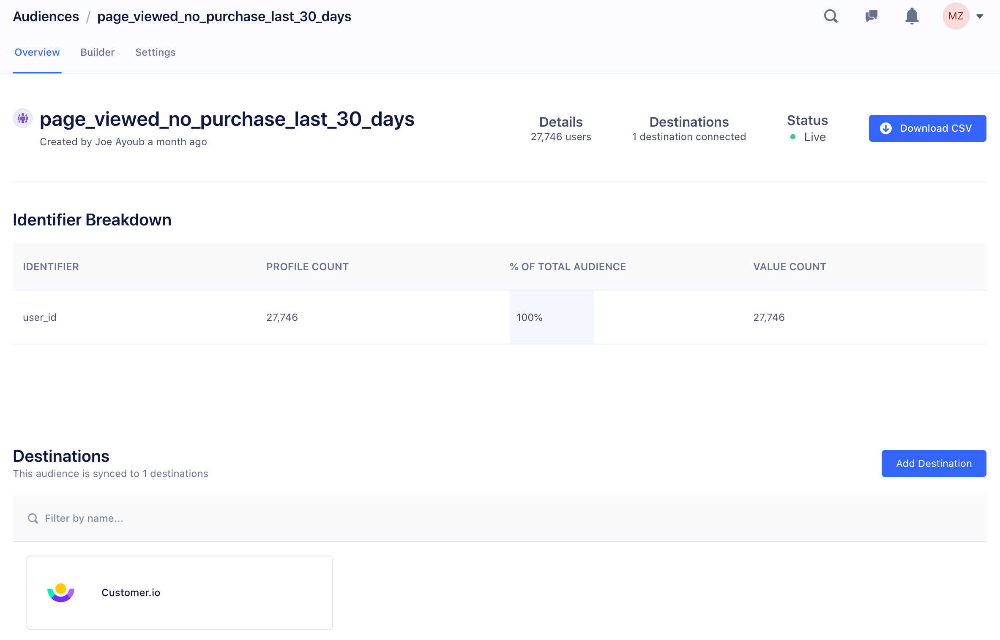

This guide walks you through the set up process for a simple Engage space, which you can use if your Segment implementation is simple. If your implementation is complex, you can use this to demonstrate and test Engage before working on a more complex configuration.

> success ""
> The first four steps in this guide also apply to Unify set up. To learn more, visit the [Unify Onboarding Guide](/docs/unify/quickstart).

> info "Regional Segment"
> Engage Foundations is available on Segment's regional infrastructure. For more information, see the article [Regional Segment](/docs/guides/regional-segment/).

## Engage configuration requirements
> info ""
> Engage requires both [Connections](/docs/connections/) and [Unify](/docs/unify/).

To configure and use Engage, you need the following:

1. **A Segment account and Workspace.**
2. **Events flowing into Connections** from your digital properties where most of your valuable user behavior occurs.
3. **Identity Admin access.** You must have edit access to identity resolution rules.
4. **Engage Administrator access.** You must be either be a workspace admin, or a workspace user with Engage admin access to set up audiences and computed traits. You can check your permissions by navigating to [Access Management](https://app.segment.com/goto-my-workspace/settings/access-management){:target="_blank"} in your workspace settings. See the [Segment Access Management documentation](/docs/segment-app/iam/) for more details.

## Step 1: Create a new Developer space

When you first start working with Engage, you should start by creating a "Developer" Engage space. This is your experimental and test environment while you learn more about how Engage works.

<!-- TODO: I can't see this in any of the spaces I'm an admin in
To create a Engage space:
1. In your Segment workspace, click **Engage** from the left-navigation.
2.  -->

## Step 2: Invite teammates to your Engage space

Invite teammates to your Engage dev space and grant them access to the space. Navigate to [Access Management](https://app.segment.com/goto-my-workspace/settings/access-management){:target="_blank"} in your workspace settings to add them.

<!-- TODO: actually add steps here -->

## Step 3: Connect production sources

1. From your Engage space, navigate to **Unify settings** and click **Profile sources**.
2. On the screen that appears, choose one or two production sources from your Connections workspace.

   _Segment recommends connecting your production website or App source as a great starting point._

3. The **Replay data** flag is enabled by default, **Replay data : Enable this option to replay last month of data into Profiles for every selected source below.** When left enabled, 30 days of historical data will be replayed from the source. You can disable this option by toggling it - this prevents the replaying historical data from the source. If you need more historical data available from this source, fill out the form below for each replay and contact Segment Support at friends@segment.com or [create a ticket]([url](https://app.segment.com/goto-my-workspace/home?period=last-24-hours&v2=enabled&help=create-ticket)):
```
Segment Source Details:
- Name: source-name
- SourceId: XXXXX or Link to Source

Details for replay:
- Destination: Name of destination you want to replay to or link to Profiles space
- Start time: (Use the following UTC format) 2020-11-21T05:10:00Z UTC
- End time: (Use the following UTC format) 2023-01-21T10:10:00Z UTC
- All the events or only a subset of event names? Provide event names and/or method calls (page/identify/track/group) if only a subset of events is needed.
```
_How much data can I replay from my source into Engage?_ : Your workspace's "computations history" limit is defined in the contract and can be found in the [workspace settings]([url](https://app.segment.com/goto-my-workspace/settings/usage?metric=mtu&period=current)).

To learn more, visit [Connect production sources](/docs/unify/quickstart/#step-3-connect-production-sources).

## Step 4: Check your profile data

After the replay finishes, you can see the data replayed into Engage using the Profile Explorer. Visit the [Profiles Onboarding Guide](/docs/profiles/quickstart/#step-4-check-your-profile-data) for more info.

## Step 5: Create an Audience

You can build an audience using any source data that flows into your Engage space.

In this step, use the Audience Builder UI to create an Audience using properties you're familiar with. For example, you might know the number of new website user signups in the last seven days, if you've connected your production website source to Engage.

To build your own audience:
1. Navigate to your Engage space.
2. Select the **Audiences** tab, then click **Create**.
3. Click **Add Condition**, and choose among the options that appear:
   - Performed an Event
   - Part of an Audience
   - Have a Computed Trait
   - Have a SQL Trait
   - Have a Custom Trait
4. Configure the settings for your condition. These vary by type, so explore the different options.
5. Optionally, add more conditions until you're satisfied that the audience will only contain the users you want to target.

After you build your audience, click **Preview Results** to see the total number of users who meet the audience criteria, for example all users who signed up within the last seven days.

## Step 6:  Connect the Audience to a Destination

After you create your test audience, click **Select Destinations**. Engage guides you through configuration steps to set up a destination for your audience. If you don't already have destinations configured for the Engage space, the you are prompted to select one or more. Finally, enter a name for the audience.

The larger the audience you're creating, the longer it takes Engage to successfully compute the Audience. The Audience page shows a status that indicates if the audience is still being calculated. When the total number of users appears in the Audience overview, as in the example screenshot below, the audience has successfully finished computing, and Engage then sends the audience to the destination you selected.



## Step 7: Validate that your audience is appearing in your destination

Audiences are either sent to destinations as a boolean user-property (for example `New_Users_7days=true` or a user-list, depending on what the destination supports. Read more about [which destinations support which types of data](/docs/engage/using-engage-data/#engage-compatible-destinations-event-type).

The UIs for the destination tools you send the audience data to are different, so the process of validating the audience varies per tool. However, the guiding principle is the same. You should be able to identify the full group of users who are members of your audience in your destination.

## Step 8: Create your production space

After you validate that your full audience is arriving in your destination, you're ready to create a Production space. Segment recommends that you repeat the same steps outlined above, focusing on your production use cases and data sources.
