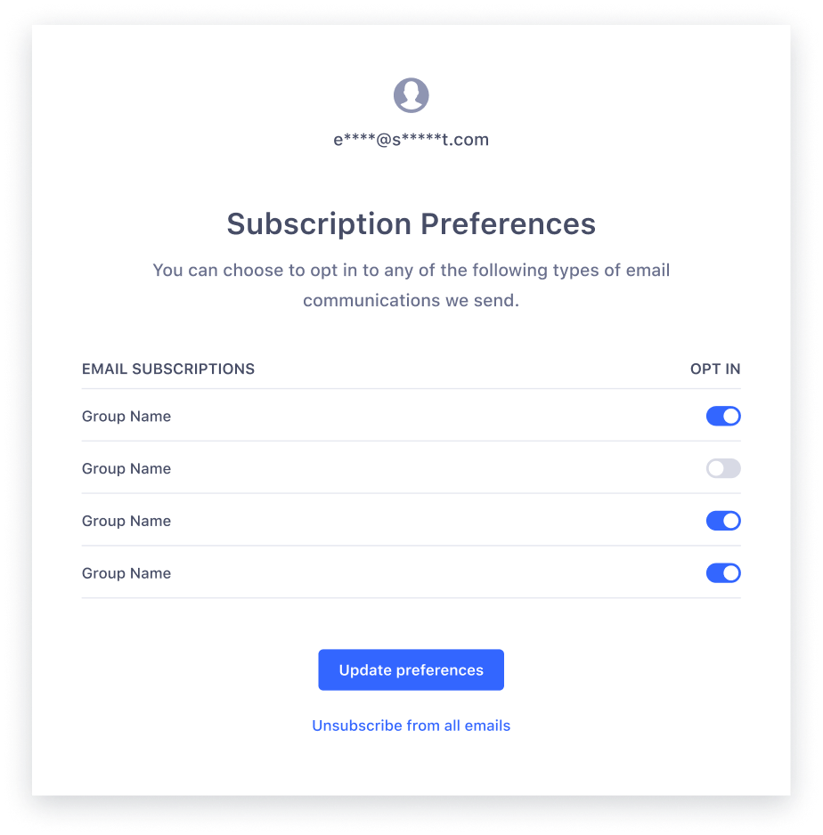

> info ""
> Subscription groups is in beta.

Subscription groups let your users choose the emails they want to recieve from you. This page introduces subscription groups and explains how you can use them with [Engage email campaigns](/docs/engage/campaigns/email-campaigns/).

## About subscription groups

A subscription group let you send emails campaigns to specific groups of users. Subscription groups also give your customers the ability to manage their email preferences, ensuring they only get emails they want to receive.

For example, you may want to create a subscription group that will receive only promotional email campaigns. Should a customer decide to opt out of your promotional campaigns, they'll still be able to receive email campaigns from other subscription groups you've created and to which they've subscribed.

### What your users experience

With subscription groups, your customers can opt in and out of groups on an individual basis instead of unsubscribing from all your campaigns.

Your customers will have the chance to opt in and out of subscription groups on both a subscription preferences page and on the landing page that launches when they unsubscribe. 

Customers can access these pages through the [unsubscribe and manage preference links](/docs/engage/content/email/editor/#add-unsubscribe-links) that you include in your [email templates](/docs/engage/content/email/template/).

## Using subscription groups

To use a subscription group, you'll need to first create the group, add subscribers, then create a new email template.

### Create a subscription group

Follow these steps to create a subscription group:

1. Navigate to **Engage > Engage settings > Subscriptions**. 
2. Click **+Create subscription group**.
3. Add a name and description for the group, then click **Next**.
4. (Optional:) Add subscribers to your group with a CSV file upload, then click **Next**.
5. Review your new subscription group, then click **Create Subscription Group**.

### Add group susbcribers

In addition to adding group subscribers when you first create a subscription group, you can also add subscribers to existing groups with a CSV file upload with these steps:

1. Navigate to **Engage > Engage settings > Subscriptions**. 
2. From the Subscription groups table, select the more options icon, then click **Add group subscribers**.
3. Download the template CSV file, then fill it out by entering email addresses and subscription groups. The subscription group should follow the format `[group_name]_subscription_status`.
4. Upload the CSV file, then click **Add Subscribers**.

### Create a new email template and send an email

> info ""
> To use subscription groups, you'll need to create a new email template with new unsubscribe and manage preference links.

Once you've created a subscription group and added subscribers to it, follow these steps to send to the group:

1. [Build a new email template](/docs/engage/content/email/template/#build-an-email-template). The template should include both unsubscribe and manage preferences links.
2. During email setup, select the subscription group you want to send to from the **Which subscription states should receive this message?** dropdown, then finish [setting up and publishing your campaign](/docs/engage/campaigns/email-campaigns/#create-test-and-publish-your-email-campaign).

## Frequently asked questions



Your Engage space includes up to 25 subscription groups.



No. Templates you've previously created aren't compatible with subscription groups. To use subscription groups, you'll need to create new templates that include new unsubscribe and manage preference links.



If you delete a subscription group, Engage will still maintain the preferences of the group's end users. 



If a user unsubscribes from all of your subscription groups, they'll need to re-subscribe by explicitly opting back in to each group.

