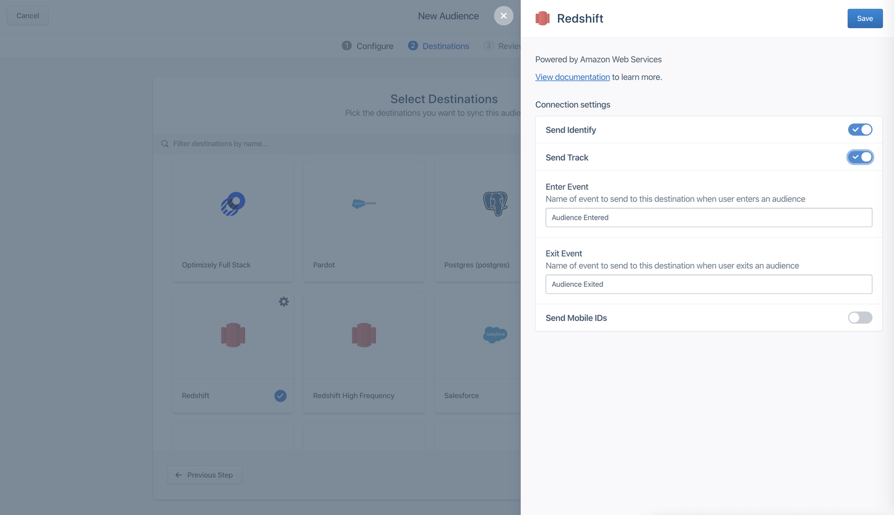
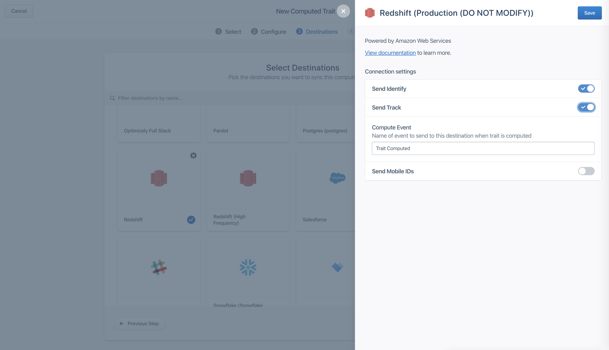

Engage provides a complete, up-to-date view of your customers through Audiences and Journeys, and one of the best ways to analyze this data is in your data warehouse using SQL.

Segment offers two ways to integrate Engage with your data warehouse:

1. **Storage Actions Destinations (Recommended)** - Write Linked Audiences and Event-Triggered Journeys data to your warehouse
2. **Classic Storage Destinations** - Send Computed Traits and Profile Audiences to your warehouse

## Which should you use?

- **Use Storage Actions Destinations** to write Linked Audiences and Event-Triggered Journeys data to Snowflake, Databricks, Redshift, and BigQuery warehouses
- **Use Classic Storage Destinations** for Computed Traits and warehouses not supported by Storage Actions Destinations

## Storage Actions Destinations (Recommended)

Segment supports Snowflake, Redshift, BigQuery, and Databricks as Storage Actions Destinations. This is the recommended destination type that enables you to write data from Engage back to your warehouse. With Storage Actions, you can sync:

- **Linked Audiences**: Write audience enter/exit events when users join or leave audiences
- **Event-Triggered Journeys**: Write journey step events as users progress through journeys
- **Profile Audiences**: Write profile audience membership data

### Set up a warehouse actions instance

Pre-requisite: Set up [Linked Audiences](/docs/engage/audiences/linked-audiences)

#### Connect to Engage

Your warehouse destination must be connected to the Engage space to add activation.

#### Step 1: Add the warehouse destination instance to the Engage space

To add the warehouse destination instance to the Engage space:

1. Navigate to the Engage Destination settings.
2. Select **Add another destination** from the catalog.
3. Select the warehouse destination in the **Storage** connection type.
4. (Optional) Choose the Engage space as the Data Source.
5. Select from either **Use existing warehouse** or **Set up new warehouse**

If you select **Use existing warehouse**:
- Select the warehouse instance you want to write data to from the connected destination list.
- Your warehouse instance is now connected to the Engage space

If you select **Set up new warehouse**:
- Follow the warehouse destination setup steps:
  - [Snowflake](/docs/connections/storage/catalog/snowflake)
  - [BigQuery](/docs/connections/storage/catalog/bigquery)
  - [Redshift](/docs/connections/storage/catalog/redshift)
  - [Databricks](/docs/connections/storage/catalog/databricks)
- Select **Test connection**
- Select **Set up activation**

Once the warehouse is connected to the Engage space, you can use this in **Engage Settings > Destinations** list.

#### Step 2: Add the activation with the destination

1. Select the warehouse destination instance you want to write data to from the connected destination.
2. Define the table name, event properties and field mappings.

The data write calls are scoped to `<Engage_Space_Name>.<User_Specified_Table_Name>`. Write calls are restricted to the same schema. A schema write is not supported.

Segment stores entity context objects in a single Stringified JSON column to avoid hitting the warehouse's column limits.

## Classic Storage Destinations

Classic Storage Destinations enable you to send Computed Traits and Profile Audiences to your warehouse as identify or track calls. This integration follows the standard Segment warehouse ETL process with scheduled syncs.

Use Classic Storage Destinations for:
- Computed Traits (event-based, SQL-based, or machine learning traits)
- Profile Audiences using identify/track calls
- Warehouses not supported by Storage Actions Destinations

### Set up

When you build an audience or computed trait, you can configure it to send an identify call or a track call to your data warehouse, and additionally include mobile ids.



### Identify calls for audiences

If you chose to send your Engage data as an identify call, Engage usually sends one call per user.

When you send _audiences_ as an identify call, Engage includes a boolean trait that matches the audience name. When a user enters an audience the boolean is set to `true`, and when they exit, the boolean is set to `false`.

In the example below, you can see that the `identify` payload includes a trait of the audience `first_time_shopper` with the value of `true.`

```js
{
  "type": "identify",
  "userId": u123,
  "traits": {
     "first_time_shopper": true // false when a user exits the audience
  }
}
```

### Identify calls for computed traits

When you send _computed traits_ as an identify call, Engage sends a similar call with the computed value for that trait. In the example below, the trait `total_revenue_180_days` includes the calculated value of `450.00`.

```js
{
  "type": "identify",
  "userId": u123,
  "traits": {
     "total_revenue_180_days": 450.00
  }
}
```

### Warehouse schema for Engage identify calls

Engage identify calls appear in your warehouse using a similar format as normal Connections identify calls. Identify calls appear in two tables per Engage space. These tables are named with a prefix of `engage_`, then the Engage space name, followed by `identifies` or `users`. The `identifies` table contains a record of every identify call, and the `users` table contains one record per `user_id` with the most recent value.

The `engage_` schema name is specific to the Engage space and cannot be modified. Additional audiences and computed traits appear as additional columns in these tables.

`engage_default.identifies`

| user_id | first_time_shopper | total_revenue_180_days |
| ------- | ------------------ | ---------------------- |
| u123    | true               |                        |
| u123    |                    | 450.0                  |

`engage_default.users`

| user_id | first_time_shopper | total_revenue_180_days |
| ------- | ------------------ | ---------------------- |
| u123    | true               | 450.00                 |

### Track calls for audiences

When you send _audiences_ using track calls, Engage sends an `Audience Entered` event when a user enters, and an `Audience Exited` event when the user exits, by default. These event names are configurable.

Engage also sends two event properties about the audience: the `audience_key`, which records the name of the audience that the event modifies, and the audience name and its value, as a separate key and value pair. The value of the audience key is populated with a boolean value.

In the example below, you can see that the `audience_key` is set to record a modification to the  `first_time_shopper` audience, and the `first_time_shopper` value is set to `true`.

```js
{
  "type": "track",
  "userId": u123,
  "event": "Audience Entered",
  "traits": {
     "audience_key": "first_time_shopper",
     "first_time_shopper": true
  }
}
```

### Track calls for computed traits

When you send _computed traits_, Engage sends a `Trait Computed` event that records which computed trait it updates, then records the updated key and value. You can also customize this event name.



In the example below, the Trait Computed event contains the `trait_key` which records which computed trait is being modified, and then includes the key `total_revenue_180_days` with the updated value of `450.00`.

```js
{
  "type": "track",
  "userId": u123,
  "event": "Trait Computed",
  "traits": {
     "trait_key": "total_revenue_180_days",
     "total_revenue_180_days": 450.00
  }
}
```

### Warehouse schema for Engage track calls

Similar to track calls in Connections, Engage track calls appear in your warehouse as one table per event name. For example, if you configure your events called `Audience Entered`, `Audience Exited`, and `Trait Computed`, Engage would create tables like the following examples in your warehouse:

`engage_default.audience_entered`

| user_id | audience_key       | first_time_shopper |
| ------- | ------------------ | ------------------ |
| u123    | first_time_shopper | true               |

`engage_default.audience_exited`

| user_id | audience_key       | first_time_shopper |
| ------- | ------------------ | ------------------ |
| u123    | first_time_shopper | false              |

`engage_default.trait_computed`

| user_id | total_revenue_180_days | trait_key              |
| ------- | ---------------------- | ---------------------- |
| u123    | 450.00                 | total_revenue_180_days |

### Users table

The users table is an aggregate view based on the `user_id` field. This means that anonymous profiles with just an `anonymous_id` identifier aren't included in this view. You can still view identify calls for anonymous audiences and computed traits in the `identifies` table. 

The users table is synced as soon as the warehouse is connected as a destination in Engage, if you've previously created Engage computations. As a result, the table might contain data from computations not directly connected to the warehouse.

### Sync frequency

Although Engage can compute audiences and traits in real-time, these calculations are subject to the sync schedule allowed by your warehouses plan, which is usually hourly. You can check the warehouse sync history to see details about past and upcoming syncs. When you look at the sync schedule, sources with the `engage_` prefix sync data from Engage.

## Common questions

### Which warehouse destination should I use?

Use Storage Actions Destinations (recommended) for Linked Audiences, Event-Triggered Journeys, and Profile Audiences with Snowflake, Databricks, Redshift, or BigQuery. Use Classic Storage Destinations for Computed Traits or warehouses not supported by Storage Actions Destinations.

### Can I use both Storage Actions and Classic Storage at the same time?

Yes, you can use both concurrently. For example, send Computed Traits via Classic Storage and Linked Audiences via Storage Actions.

### What's the main difference between Storage Actions and Classic Storage?

Storage Actions syncs data after each audience or journey run completes, while Classic Storage uses scheduled hourly syncs. Storage Actions also gives you more control over schema and table naming.

### How quickly does data appear in my warehouse with Storage Actions?

Segment starts a warehouse sync after each audience or journey run completes. Data typically appears within minutes, depending on warehouse performance.

### Can I customize the schema and table names for Storage Actions?

Yes, when you create an activation, you can choose the schema and define the table name. Data write calls are scoped to `<Engage_Space_Name>.<User_Specified_Table_Name>`.

### Can I send Computed Traits using Storage Actions?

No, Computed Traits currently only work with Classic Storage Destinations.

### Can I prevent a table, a computed trait, or audience from syncing to my warehouse?

Yes. You can use [Warehouses Selective Sync](/docs/connections/storage/warehouses/faq/#can-i-control-what-data-is-sent-to-my-warehouse) to manage which traits, audiences, and tables get synced from Engage.
